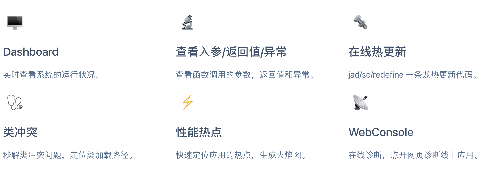
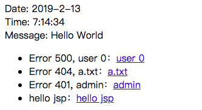
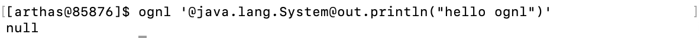
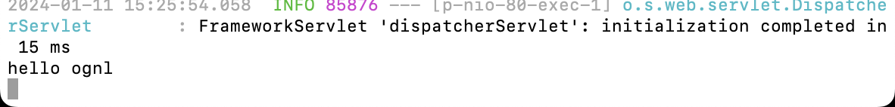
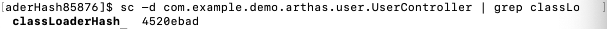
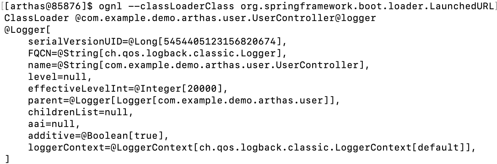
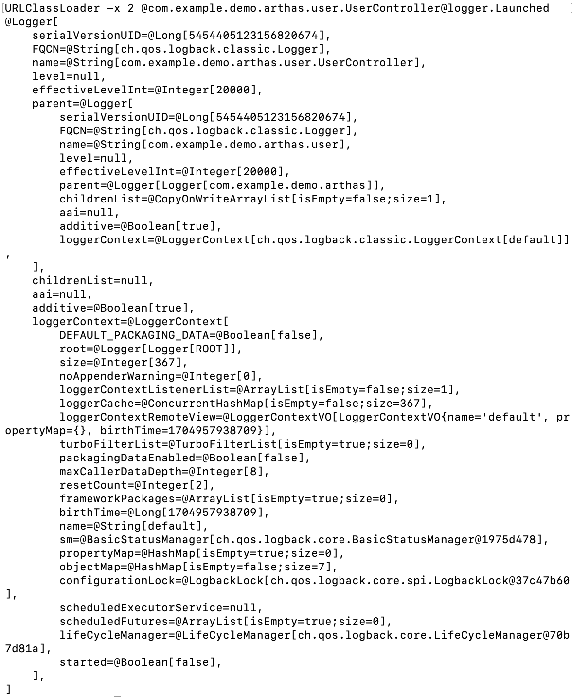
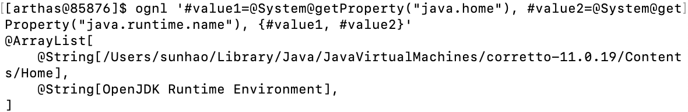

[toc]


# 使用Arthas

[Arthas高级教程](https://arthas.aliyun.com/doc/arthas-tutorials.html?language=cn&id=arthas-advanced)

下文中本人观点以引用形式标出



## 使用场景

当你遇到以下类似问题而束手无策时，Arthas 可以帮助你解决：

- 这个类从哪个 jar 包加载的？为什么会报各种类相关的 Exception？
- 我改的代码为什么没有执行到？难道是我没 commit？分支搞错了？
- 遇到问题无法在线上 debug，难道只能通过加日志再重新发布吗？
- 线上遇到某个用户的数据处理有问题，但线上同样无法 debug，线下无法重现！
- 是否有一个全局视角来查看系统的运行状况？
- 有什么办法可以监控到 JVM 的实时运行状态？
- 怎么快速定位应用的热点，生成火焰图？

为了更好使用 Arthas，下面先介绍 Arthas 里的一些使用技巧。


## 使用Arthas

### 启动 start-demo

> 本处使用官方教程的用例

下载`demo-arthas-spring-boot.jar` - [[源码\]](https://github.com/hengyunabc/spring-boot-inside/tree/master/demo-arthas-spring-boot)，再用`java -jar` 命令启动：

```
wget https://github.com/hengyunabc/spring-boot-inside/raw/master/demo-arthas-spring-boot/demo-arthas-spring-boot.jar; java -jar demo-arthas-spring-boot.jar
```

`demo-arthas-spring-boot` 是一个很简单的 spring boot 应用。

启动之后，可以访问 80 端口：[打开 80 端口](https://5977e396-215f-48c8-9889-0f955cdee9ad-10-244-5-73-80.papa.r.killercoda.com/)



### 启动arthas-boot

手动新建一个终端于 `Tab 2` ，在 `Tab 2` 里，下载`arthas-boot.jar` ，再用`java -jar` 命令启动：

```
wget https://arthas.aliyun.com/arthas-boot.jar; java -jar arthas-boot.jar --target-ip 0.0.0.0
```

`arthas-boot` 是`Arthas` 的启动程序，它启动后，会列出所有的 Java 进程，用户可以选择需要诊断的目标进程。

选择第一个进程，输入 `1` ，再`Enter/回车` 


Arthas-boot 支持的参数

`arthas-boot.jar` 支持很多参数，可以执行 `java -jar arthas-boot.jar -h` 来查看。

#### 允许外部访问

默认情况下，arthas server 侦听的是 `127.0.0.1` 这个 IP，如果希望远程可以访问，可以使用`--target-ip` 的参数。

```
java -jar arthas-boot.jar --target-ip
```

#### 列出所有的版本

```
java -jar arthas-boot.jar --versions
```

使用指定版本：

```
java -jar arthas-boot.jar --use-version 3.1.0
```

#### 只侦听 Telnet 端口，不侦听 HTTP 端口

```
java -jar arthas-boot.jar --telnet-port 9999 --http-port -1
```

#### 打印运行的详情

```
java -jar arthas-boot.jar -v
```


###Exit/Stop

#### reset

Arthas 在 watch/trace 等命令时，实际上是修改了应用的字节码，插入增强的代码。显式执行 `reset` 命令，可以清除掉这些增强代码。

#### 退出 Arthas

用 `exit` 或者 `quit` 命令可以退出 Arthas。

退出 Arthas 之后，还可以再次用 `java -jar arthas-boot.jar` 来连接。

#### 彻底退出 Arthas

`exit/quit` 命令只是退出当前 session，arthas server 还在目标进程中运行。

想完全退出 Arthas，可以执行 `stop` 命令。


## 使用Tips

### help

Arthas 里每一个命令都有详细的帮助信息。可以用`-h` 来查看。帮助信息里有`EXAMPLES` 和`WIKI` 链接。

比如：

```
sysprop -h
```

### 自动补全

Arthas 支持丰富的自动补全功能，在使用有疑惑时，可以输入`Tab` 来获取更多信息。

比如输入 `sysprop java.` 之后，再输入`Tab` ，会补全出对应的 key。

### readline 的快捷键支持

Arthas 支持常见的命令行快捷键，比如`Ctrl + A` 跳转行首，`Ctrl + E` 跳转行尾。

更多的快捷键可以用 `keymap` 命令查看。

### 历史命令的补全

如果想再执行之前的命令，可以在输入一半时，按`Up/↑` 或者 `Ddown/↓` ，来匹配到之前的命令。

比如之前执行过`sysprop java.version` ，那么在输入`sysprop ja` 之后，可以输入`Up/↑` ，就会自动补全为`sysprop java.version` 。

如果想查看所有的历史命令，也可以通过 `history` 命令查看到。

### pipeline

Arthas 支持在 pipeline 之后，执行一些简单的命令，比如：

```
sysprop | grep java
sysprop | wc -l
```


# Arthas语法

> 本部分介绍Arthas较为零散的语法，Options算是通用配置项，Ognl有基本的用法，也有Arthas的特殊用法。包括Arthas的特殊用法在内的实际项目使用到的语法则在具体项目中介绍。

## 命令列表

### jvm 相关

- [dashboard](https://arthas.aliyun.com/doc/dashboard.html) - 当前系统的实时数据面板
- [getstatic](https://arthas.aliyun.com/doc/getstatic.html) - 查看类的静态属性
- [heapdump](https://arthas.aliyun.com/doc/heapdump.html) - dump java heap, 类似 jmap 命令的 heap dump 功能
- [jvm](https://arthas.aliyun.com/doc/jvm.html) - 查看当前 JVM 的信息
- [logger](https://arthas.aliyun.com/doc/logger.html) - 查看和修改 logger
- [mbean](https://arthas.aliyun.com/doc/mbean.html) - 查看 Mbean 的信息
- [memory](https://arthas.aliyun.com/doc/memory.html) - 查看 JVM 的内存信息
- [ognl](https://arthas.aliyun.com/doc/ognl.html) - 执行 ognl 表达式
- [perfcounter](https://arthas.aliyun.com/doc/perfcounter.html) - 查看当前 JVM 的 Perf Counter 信息
- [sysenv](https://arthas.aliyun.com/doc/sysenv.html) - 查看 JVM 的环境变量
- [sysprop](https://arthas.aliyun.com/doc/sysprop.html) - 查看和修改 JVM 的系统属性
- [thread](https://arthas.aliyun.com/doc/thread.html) - 查看当前 JVM 的线程堆栈信息
- [vmoption](https://arthas.aliyun.com/doc/vmoption.html) - 查看和修改 JVM 里诊断相关的 option
- [vmtool](https://arthas.aliyun.com/doc/vmtool.html) - 从 jvm 里查询对象，执行 forceGc

### class/classloader 相关

- [classloader](https://arthas.aliyun.com/doc/classloader.html) - 查看 classloader 的继承树，urls，类加载信息，使用 classloader 去 getResource
- [dump](https://arthas.aliyun.com/doc/dump.html) - dump 已加载类的 byte code 到特定目录
- [jad](https://arthas.aliyun.com/doc/jad.html) - 反编译指定已加载类的源码
- [mc](https://arthas.aliyun.com/doc/mc.html) - 内存编译器，内存编译`.java`文件为`.class`文件
- [redefine](https://arthas.aliyun.com/doc/redefine.html) - 加载外部的`.class`文件，redefine 到 JVM 里
- [retransform](https://arthas.aliyun.com/doc/retransform.html) - 加载外部的`.class`文件，retransform 到 JVM 里
- [sc](https://arthas.aliyun.com/doc/sc.html) - 查看 JVM 已加载的类信息
- [sm](https://arthas.aliyun.com/doc/sm.html) - 查看已加载类的方法信息

### monitor/watch/trace 相关

注意

请注意，这些命令，都通过字节码增强技术来实现的，会在指定类的方法中插入一些切面来实现数据统计和观测，因此在线上、预发使用时，请尽量明确需要观测的类、方法以及条件，诊断结束要执行 `stop` 或将增强过的类执行 `reset` 命令。

- [monitor](https://arthas.aliyun.com/doc/monitor.html) - 方法执行监控
- [stack](https://arthas.aliyun.com/doc/stack.html) - 输出当前方法被调用的调用路径
- [trace](https://arthas.aliyun.com/doc/trace.html) - 方法内部调用路径，并输出方法路径上的每个节点上耗时
- [tt](https://arthas.aliyun.com/doc/tt.html) - 方法执行数据的时空隧道，记录下指定方法每次调用的入参和返回信息，并能对这些不同的时间下调用进行观测
- [watch](https://arthas.aliyun.com/doc/watch.html) - 方法执行数据观测

### profiler/火焰图

- [profiler](https://arthas.aliyun.com/doc/profiler.html) - 使用[async-profiler](https://github.com/jvm-profiling-tools/async-profiler)对应用采样，生成火焰图
- [jfr](https://arthas.aliyun.com/doc/jfr.html) - 动态开启关闭 JFR 记录

### 鉴权

- [auth](https://arthas.aliyun.com/doc/auth.html) - 鉴权

### options

- [options](https://arthas.aliyun.com/doc/options.html) - 查看或设置 Arthas 全局开关

### 管道

Arthas 支持使用管道对上述命令的结果进行进一步的处理，如`sm java.lang.String * | grep 'index'`

- [grep](https://arthas.aliyun.com/doc/grep.html) - 搜索满足条件的结果
- plaintext - 将命令的结果去除 ANSI 颜色
- wc - 按行统计输出结果

### 后台异步任务

当线上出现偶发的问题，比如需要 watch 某个条件，而这个条件一天可能才会出现一次时，异步后台任务就派上用场了，详情请参考[这里](https://arthas.aliyun.com/doc/async.html)

- 使用 `>` 将结果重写向到日志文件，使用 `&` 指定命令是后台运行，session 断开不影响任务执行（生命周期默认为 1 天）
- jobs - 列出所有 job
- kill - 强制终止任务
- fg - 将暂停的任务拉到前台执行
- bg - 将暂停的任务放到后台执行

### 基础命令

- [base64](https://arthas.aliyun.com/doc/base64.html) - base64 编码转换，和 linux 里的 base64 命令类似
- [cat](https://arthas.aliyun.com/doc/cat.html) - 打印文件内容，和 linux 里的 cat 命令类似
- [cls](https://arthas.aliyun.com/doc/cls.html) - 清空当前屏幕区域
- [echo](https://arthas.aliyun.com/doc/echo.html) - 打印参数，和 linux 里的 echo 命令类似
- [grep](https://arthas.aliyun.com/doc/grep.html) - 匹配查找，和 linux 里的 grep 命令类似
- [help](https://arthas.aliyun.com/doc/help.html) - 查看命令帮助信息
- [history](https://arthas.aliyun.com/doc/history.html) - 打印命令历史
- [keymap](https://arthas.aliyun.com/doc/keymap.html) - Arthas 快捷键列表及自定义快捷键
- [pwd](https://arthas.aliyun.com/doc/pwd.html) - 返回当前的工作目录，和 linux 命令类似
- [quit](https://arthas.aliyun.com/doc/quit.html) - 退出当前 Arthas 客户端，其他 Arthas 客户端不受影响
- [reset](https://arthas.aliyun.com/doc/reset.html) - 重置增强类，将被 Arthas 增强过的类全部还原，Arthas 服务端关闭时会重置所有增强过的类
- [session](https://arthas.aliyun.com/doc/session.html) - 查看当前会话的信息
- [stop](https://arthas.aliyun.com/doc/stop.html) - 关闭 Arthas 服务端，所有 Arthas 客户端全部退出
- [tee](https://arthas.aliyun.com/doc/tee.html) - 复制标准输入到标准输出和指定的文件，和 linux 里的 tee 命令类似
- [version](https://arthas.aliyun.com/doc/version.html) - 输出当前目标 Java 进程所加载的 Arthas 版本号


## Options

在 Arthas 里有一些开关，可以通过 `options` 命令来查看 - [options 命令文档](https://arthas.aliyun.com/doc/options.html)。

查看单个 option 的值，比如

```
options unsafe
```

### 允许增强 JDK 的类

默认情况下`unsafe` 为 false，即 watch/trace 等命令不会增强 JVM 的类，即`java.*` 下面的类。

如果想增强 JVM 里的类，可以执行 `options unsafe true` ，设置`unsafe` 为 true。

### 以 JSON 格式打印对象

`options json-format` 可以看到当前的 `json-format` 为 false
运行 `ognl '#value1=@System@getProperty("java.home"), #value2=@System@getProperty("java.runtime.name"), {#value1, #value2}'` 得到的结果并不是 JSON 格式

如果希望输出 JSON 格式，可以使用 `options json-format true` 开启，开启后再运行 `ognl '#value1=@System@getProperty("java.home"), #value2=@System@getProperty("java.runtime.name"), {#value1, #value2}'` 这是可以看到输出的格式已经转变为 JSON 格式。


## Ognl一般语法

### 索引

- 数组和列表的索引
  可以使用 `array["length"]` 或 `array["len" + "gth"]`

- JavaBeans 索引属性

  如一个 JavaBeans 有以下四个重载方法：

  ```java
  public PropertyType[] getPropertyName();
  public void setPropertyName(PropertyType[] anArray);
  public PropertyType getPropertyName(int index);
  public void setPropertyName(int index, PropertyType value);
  ```

  则

  ```
  someProperty[2]
  ```

  等价于 Java 代码的

  ```
  getPropertyName(2)
  ```

```
ognl "{1,2,3,4}[0]"
```

通过上面命令可以获取到列表的第一个元素

### 变量引用

使用 `#` 在 OGNL 中定义临时变量，他们全局可见，此外表达式计算的每一步结果都保存在变量 `this` 中：

```
ognl "{10,20,30}[0].(#this > 5 ? #this*2 : #this+10)"
```

上面命令通过获取列表的第一个元素进行判断如果大于 `5` 则乘以 `2` 反之则加 `10` 。

### 方法调用

```
method( ensureLoaded(), name )
```

注意：

- OGNL 是运行时调用，因此没有任何静态类型的信息可以参考，所以如果解析到有多个匹配的方法，则任选其中一个方法调用
- 常量 null 可以匹配所有的非原始类型的对象

```
ognl "{1,2,3,4}.size()"
```

通过上面命令可以调用 `ArrayList` 的 `size()` 方法获取到 ArrayList 的大小

### 复杂链式表达式

```
headline.parent.(ensureLoaded(), name)
```

等价于

```
headline.parent.ensureLoaded(), headline.parent.name
ognl "@java.lang.System@out.(print('Hello '), print('world\n'))"
```

运行上面这个命令后，你可以在 Tab1 的终端看到 `Hello world` 的输出。

### 集合操作

#### 新建列表

```
ognl "1 in {2, 3}"
```

上面这条命令判断 `1` 是否在列表 `[2, 3]` 中。

#### 新建原生数组

```
ognl "new int[] {1, 2, 3}"
```

指定长度

```
ognl "new int[9]"
```

#### 新建 Maps

新建普通 Map

```
ognl "#{ 'foo': 'foo value', 'bar': 'bar value' }"
```

新建特定类型 Map

```
ognl "#@java.util.HashMap@{ 'foo': 'foo value', 'bar': 'bar value' }"
```

#### 集合的投影

OGNL 把对针对集合上的每个元素调用同一个方法并返回新的集合的行为称之为“投影”。

```
ognl "{1, 2, 3}.{#this*2}"
```

#### 查找集合元素

- 查找所有匹配的元素
  `ognl "{1024, 'Hello world!', true, 2048}.{? #this instanceof Number}"`
- 查找第一个匹配的元素
  `ognl "{1024, 'Hello world!', true, 2048}.{^ #this instanceof Number}"`
- 查找最后一个匹配的元素
  `ognl "{1024, 'Hello world!', true, 2048}.{$ #this instanceof Number}"`

#### 集合的虚拟属性

OGNL 定义了一些特定的集合属性，含义与相应的 Java 集合方法完全等价。

- Collections
  - `size` 集合大小
  - `isEmpty` 集合为空时返回 `true`
- List
  - `iterator` 返回 List 的 iterator
- Map
  - `keys` 返回 Map 的所有 Key 值
  - `values` 返回 Map 的所有 Value 值
- Set
  - `iterator` 返回 Set 的 iterator

### 构造函数

非 `java.lang` 包下的所有类的构造函数都要用类的权限定名称。

```
ognl "new java.util.ArrayList()"
```

### 静态方法

```
ognl -x 3 '@java.lang.Math@sqrt(9.0D)'
```

### 静态属性

```
ognl -x 3 '@java.io.File@separator'
```

### 伪 lambda 表达式

```
ognl "#fact = :[#this<=1? 1 : #this*#fact(#this-1)], #fact(3)"
```

该命令实现了一个 lambda 递归实现了一个阶乘函数，并求 3 的阶乘。


## Arthas Ognl

在 Arthas 里，有一个单独的 [ognl 命令](https://arthas.aliyun.com/doc/ognl.html)，可以动态执行代码。

### 调用 static 函数

```
ognl '@java.lang.System@out.println("hello ognl")'
```

> 类似postman调用代码里的静态函数，代码日志里会打印hello ognl，调用处会返回null





### 查找 UserController 的 ClassLoader

```
sc -d com.example.demo.arthas.user.UserController | grep classLoaderHash
```

注意 hashcode 是变化的，需要先查看当前的 ClassLoader 信息，提取对应 ClassLoader 的 hashcode。

如果你使用`-c` ，你需要手动输入由上述命令获取到的 hashcode：`-c <hashcode>`
对于只有唯一实例的 ClassLoader 可以通过`--classLoaderClass` 指定 class name，使用起来更加方便：
`--classLoaderClass` 的值是 ClassLoader 的类名，只有匹配到唯一的 ClassLoader 实例时才能工作，目的是方便输入通用命令，而`-c <hashcode>` 是动态变化的。

### 获取静态类的静态字段

获取`UserController` 类里的`logger` 字段：

```
ognl --classLoaderClass org.springframework.boot.loader.LaunchedURLClassLoader @com.example.demo.arthas.user.UserController@logger
```



还可以通过`-x` 参数控制返回值的展开层数。比如：

```
ognl --classLoaderClass org.springframework.boot.loader.LaunchedURLClassLoader -x 2 @com.example.demo.arthas.user.UserController@logger
```



### 执行多行表达式，赋值给临时变量，返回一个 List

```
ognl '#value1=@System@getProperty("java.home"), #value2=@System@getProperty("java.runtime.name"), {#value1, #value2}'
```



### 更多

在 Arthas 里`ognl` 表达式是很重要的功能，在很多命令里都可以使用`ognl` 表达式。

一些更复杂的用法，可以参考：

- OGNL 特殊用法请参考：https://github.com/alibaba/arthas/issues/71
- OGNL 表达式官方指南：https://commons.apache.org/proper/commons-ognl/language-guide.html

官方指南目前无法打开


