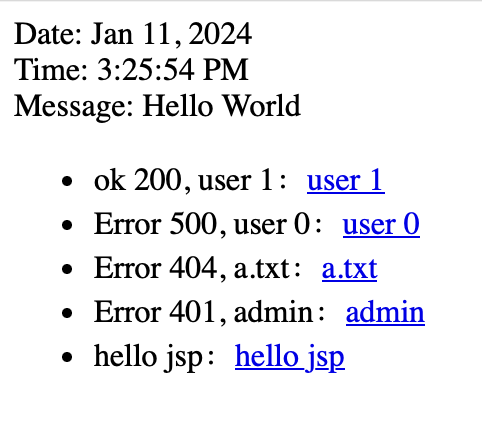
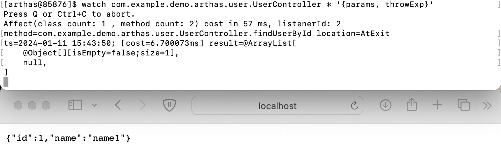
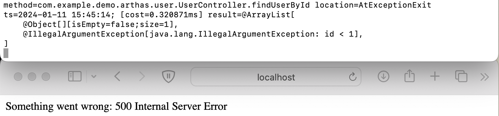
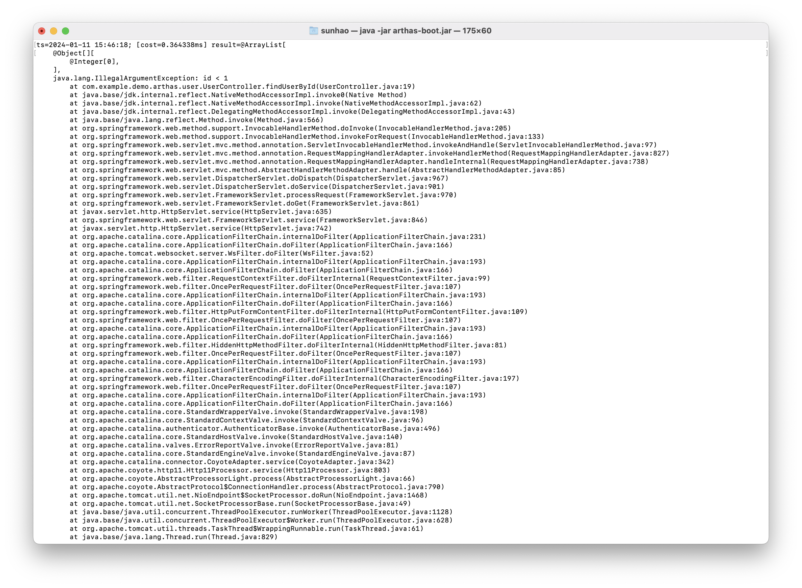

[toc]

# HTTP请求500/404/401



```arthas
•  http://localhost:8080/user/0 500 
watch com.example.demo.arthas.user.UserController * '{params, throwExp} –e

•  http://localhost:8080/a.txt 404 
trace javax.servlet.Servlet * > servlet.txt # 结果在 ~/logs/arthas-cache/

•  http://localhost:8080/admin 401 
trace javax.servlet.Filter *

•  动态修复代码/测试 
redefine –p UserController.class
```


## Http请求500 - Watch的使用

> 案例：排查函数调用异常，本部分介绍watch的使用，可以将对controller层的接口进行部分打印或选择性打印。
>

### 现象

目前，访问 [/user/0](https://8831fb6d-e374-415e-a213-c16e6e30a7fa-10-244-4-224-80.papa.r.killercoda.com/user/0) ，会返回 500 异常：

但请求的具体参数，异常栈是什么呢？

### 查看 UserController 的 参数/异常

在 Arthas 里执行：

```
watch com.example.demo.arthas.user.UserController * '{params, throwExp}'
```

1. 第一个参数是类名，支持通配
2. 第二个参数是函数名，支持通配

访问 [/user/0](https://8831fb6d-e374-415e-a213-c16e6e30a7fa-10-244-4-224-80.papa.r.killercoda.com/user/0) ,`watch` 命令会打印调用的参数和异常






可以看到实际抛出的异常是`IllegalArgumentException` 。

可以输入 `Q` 或者 `Ctrl+C` 退出 watch 命令。

如果想把获取到的结果展开，可以用`-x` 参数：

```
watch com.example.demo.arthas.user.UserController * '{params, throwExp}' -x 2
```



### 返回值表达式

在上面的例子里，第三个参数是`返回值表达式` ，它实际上是一个`ognl` 表达式，它支持一些内置对象：

- loader
- clazz
- method
- target
- params
- returnObj
- throwExp
- isBefore
- isThrow
- isReturn

你可以利用这些内置对象来组成不同的表达式。比如返回一个数组：

```
watch com.example.demo.arthas.user.UserController * '{params[0], target, returnObj}'
```

更多参考：https://arthas.aliyun.com/doc/advice-class.html

### 条件表达式

`watch` 命令支持在第 4 个参数里写条件表达式，比如：

```
watch com.example.demo.arthas.user.UserController * returnObj 'params[0] > 100'
```

当访问 [/user/1](https://8831fb6d-e374-415e-a213-c16e6e30a7fa-10-244-4-224-80.papa.r.killercoda.com/user/1) 时，`watch` 命令没有输出

当访问 [/user/101](https://8831fb6d-e374-415e-a213-c16e6e30a7fa-10-244-4-224-80.papa.r.killercoda.com/user/101) 时，`watch` 会打印出结果。

### 当异常时捕获

`watch` 命令支持`-e` 选项，表示只捕获抛出异常时的请求：

```
watch com.example.demo.arthas.user.UserController * "{params[0],throwExp}" -e
```

### 按照耗时进行过滤

watch 命令支持按请求耗时进行过滤，比如：

```
watch com.example.demo.arthas.user.UserController * '{params, returnObj}' '#cost>200'
```


## Http请求500 - Arthas 后台异步任务

> 将watch的结果异步写入后台日志

arthas 中的后台异步任务，使用了仿 linux 系统任务相关的命令。[linux 任务相关介绍](https://ehlxr.me/2017/01/18/Linux-中-fg、bg、jobs、-指令/)。

### 使用 & 在后台执行任务，任务输出重定向

可通过 `>` 或者 `>>` 将任务输出结果输出到指定的文件中，可以和 `&` 一起使用，实现 arthas 命令的后台异步任务。

当前我们需要排查一个问题，但是这个问题的出现时间不能确定，那我们就可以把检测命令挂在后台运行，并将保存到输出日志，如下命令：

```
watch com.example.demo.arthas.user.UserController * '{params, throwExp}' 'throwExp != null' >> a.log &
```

这时命令在后台执行，可以在 console 中继续执行其他命令。

之后我们去访问：[/user/0](https://8831fb6d-e374-415e-a213-c16e6e30a7fa-10-244-4-224-80.papa.r.killercoda.com/user/0)

然后使用 `cat a.log` 可以看到我们刚刚访问的 URL 抛出了一个异常

### 通过 jobs 查看任务

如果希望查看当前有哪些 arthas 任务在执行，可以执行 jobs 命令，执行结果如下

```
jobs
```

可以看到目前有一个后台任务在执行

job id 是 10, `*` 表示此 job 是当前 session 创建（生命周期默认为一天）

状态是 Stopped

`execution count` 是执行次数，从启动开始已经执行了 19 次

`timeout date` 是超时的时间，到这个时间，任务将会自动超时退出

### 停止命令、切换前后台

[异步执行的命令](https://arthas.fatpandac.com/doc/commands.html#后台异步任务)，如果希望停止，可执行 kill, 希望命令转到前台、后台继续执行 fg、bg 命令。

### 注意事项

- 最多同时支持 8 个命令使用重定向将结果写日志
- 请勿同时开启过多的后台异步命令，以免对目标 JVM 性能造成影响
- 如果不想停止 arthas，继续执行后台任务，可以执行 `quit` 退出 arthas 控制台（`stop` 会停止 arthas 服务）


## HTTP请求401/404 - trace/stack

> 404排查大致相同，个人感觉stack更好用？
>
> 此外注意arthas和监控都有时间限制，持续监控时需要调大（待调研）

案例：排查 HTTP 请求返回 401

在这个案例里，展示排查 HTTP 401 问题的技巧。

访问： [/admin](https://8831fb6d-e374-415e-a213-c16e6e30a7fa-10-244-4-224-80.papa.r.killercoda.com/admin)

结果是：

```yaml
Something went wrong: 401 Unauthorized
```

我们知道`401` 通常是被权限管理的`Filter` 拦截了，那么到底是哪个`Filter` 处理了这个请求，返回了 401？

### 跟踪所有的 Filter 函数

开始 trace：

```
trace javax.servlet.Filter *
```

访问： [/admin](https://8831fb6d-e374-415e-a213-c16e6e30a7fa-10-244-4-224-80.papa.r.killercoda.com/admin)

可以在调用树的最深层，找到`AdminFilterConfig$AdminFilter` 返回了`401` ：

```javascript
+---[3.806273ms] javax.servlet.FilterChain:doFilter()
|   `---[3.447472ms] com.example.demo.arthas.AdminFilterConfig$AdminFilter:doFilter()
|       `---[0.17259ms] javax.servlet.http.HttpServletResponse:sendError()
```

输入 `Q` 或者 `Ctrl+C` 退出 watch 命令。

> 也可将结果写入到文件中
>
> trace javax.servlet.Servlet * > servlet.txt # 结果在 ~/logs/arthas-cache/

### 通过 [stack](https://arthas.aliyun.com/doc/stack.html) 获取调用栈

上面是通过`trace` 命令来获取信息，从结果里，我们可以知道通过`stack` 跟踪`HttpServletResponse:sendError()` ，同样可以知道是哪个`Filter` 返回了`401`

执行：

```
stack javax.servlet.http.HttpServletResponse sendError 'params[0]==401'
```

访问： [/admin](https://8831fb6d-e374-415e-a213-c16e6e30a7fa-10-244-4-224-80.papa.r.killercoda.com/admin)

输入 `Q` 或者 `Ctrl+C` 退出 watch 命令。


# 热更新

## 热更新语法

下面介绍 Arthas 里查找已加载类的命令。

### [sc](https://arthas.aliyun.com/doc/sc.html)

sc 命令可以查找到所有 JVM 已经加载到的类。

如果搜索的是接口，还会搜索所有的实现类。比如查看所有的`Filter` 实现类：

```
sc javax.servlet.Filter
```

通过`-d` 参数，可以打印出类加载的具体信息，很方便查找类加载问题。

```
sc -d javax.servlet.Filter
```

`sc` 支持通配，比如搜索所有的`StringUtils` ：

```
sc *StringUtils
```

### [sm](https://arthas.aliyun.com/doc/sm.html)

sm 命令则是查找类的具体函数。比如：

```
sm java.math.RoundingMode
```

通过`-d` 参数可以打印函数的具体属性：

```
sm -d java.math.RoundingMode
```

也可以查找特定的函数，比如查找构造函数：

```
sm java.math.RoundingMode <init>
```


### [jad](https://arthas.aliyun.com/doc/jad.html) 

可以通过 [jad 命令](https://arthas.aliyun.com/doc/jad.html) 来反编译代码：

```
jad com.example.demo.arthas.user.UserController
```

通过`--source-only` 参数可以只打印出在反编译的源代码：

```
jad --source-only com.example.demo.arthas.user.UserController
```


## 案例：热更新代码

> 不过感觉没这么麻烦，代码都是自己的，直接修改好之后更新就好了没必要反编译

下面介绍通过`jad` /`mc` /`redefine` 命令实现动态更新代码的功能。

目前，访问 [/user/0](https://8831fb6d-e374-415e-a213-c16e6e30a7fa-10-244-4-224-80.papa.r.killercoda.com/user/0) ，会返回 500 异常：

下面通过热更新代码，修改这个逻辑。

### jad 反编译 UserController

```
jad --source-only com.example.demo.arthas.user.UserController > /tmp/UserController.java
```

jad 反编译的结果保存在 `/tmp/UserController.java` 文件里了。

再打开一个终端于 `Tab 3` ，然后在 `Tab3` 里用 `sed` 来编辑`/tmp/UserController.java` ：

```
sed -i 's/throw new IllegalArgumentException("id < 1")/return new User(id, "name" + id)/g' /tmp/UserController.java
```

使用 `cat` 命令查看修改后的内容：

```
cat /tmp/UserController.java
```

比如当 user id 小于 1 时，也正常返回，不抛出异常：

```java
    @GetMapping(value={"/user/{id}"})
    public User findUserById(@PathVariable Integer id) {
        logger.info("id: {}", (Object)id);
        if (id != null && id < 1) {
			return new User(id, "name" + id);
            // throw new IllegalArgumentException("id < 1");
        }
        return new User(id.intValue(), "name" + id);
    }
```

### [mc](https://arthas.aliyun.com/doc/mc.html)

(Memory Compiler) 命令来编译加载 UserController 可以通过 -c 指定 classLoaderHash 或者 --classLoaderClass 参数指定 ClassLoader，这里为了操作连贯性使用 classLoaderClass

### 查询 UserController 类加载器

#### sc 查找加载 UserController 的 ClassLoader

回到 `Tab 2` 里运行 `sc -d *UserController | grep classLoaderHash`

#### classloader 查询类加载器名称

```
classloader -l` 查询所有的类加载器列表，`UserController classLoaderHash` 值对应的类加载器为 `org.springframework.boot.loader.LaunchedURLClassLoader
```

### mc 编译加载 UserController

保存到 `/tmp/UserController.java` 之后可以使用 mc (Memory Compiler) 命令来编译

### mc 指定 classloader 编译 UserController

```
mc --classLoaderClass org.springframework.boot.loader.LaunchedURLClassLoader /tmp/UserController.java -d /tmp
```

### [redefine](https://arthas.aliyun.com/doc/redefine.html)

> java1.6后建议使用retransform

再使用`redefine` 命令重新加载新编译好的`UserController.class` ：

```
redefine /tmp/com/example/demo/arthas/user/UserController.class
$ redefine /tmp/com/example/demo/arthas/user/UserController.class
redefine success, size: 1
```

### 热修改代码结果

`redefine` 成功之后，再次访问 [/user/0](https://8831fb6d-e374-415e-a213-c16e6e30a7fa-10-244-4-224-80.papa.r.killercoda.com/user/0) ，结果是：

```json
{
  "id": 0,
  "name": "name0"
}
```


