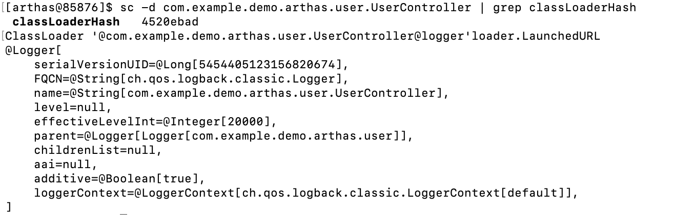
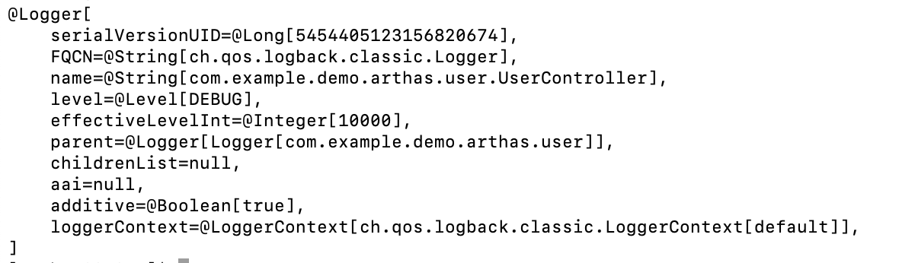

[toc]


# POINT

```
•  UserController的logger是什么实现？ 
ognl '@com.example.demo.arthas.user.UserController@logger'

•  动态修改logger级别 
ognl '@org.slf4j.LoggerFactory@getLogger("root")
.setLevel(@ch.qos.logback.classic.Level@DEBUG)'

•  获取logback的配置文件 
ognl '#map1=@org.slf4j.LoggerFactory@getLogger("root").loggerContext.objectMap, #map1.get("CONFIGURATION_WATCH_LIST")’

•  查找冲突的logback.xml/log4j.properties 
classloader -c 18b4aac2 -r logback.xml

•  tomcat的日志为什么打印不出来？
```


[toc]


# 案例：动态更新应用 Logger Level

在这个案例里，动态修改应用的 Logger Level。

## 使用 [sc](https://arthas.aliyun.com/doc/sc.html) 查找 UserController 的 ClassLoader

```
sc -d com.example.demo.arthas.user.UserController | grep classLoaderHash
```

注意 hashcode 是变化的，需要先查看当前的 ClassLoader 信息，提取对应 ClassLoader 的 hashcode。
如果你使用`-c` ，你需要手动输入 hashcode：`-c <hashcode>`
对于只有唯一实例的 ClassLoader 可以通过`--classLoaderClass` 指定 class name，使用起来更加方便：
`--classLoaderClass` 的值是 ClassLoader 的类名，只有匹配到唯一的 ClassLoader 实例时才能工作，目的是方便输入通用命令，而`-c <hashcode>` 是动态变化的。

## 使用 [ognl](https://arthas.aliyun.com/doc/ognl.html#ognl)

### 用 ognl 获取 logger

```
ognl --classLoaderClass org.springframework.boot.loader.LaunchedURLClassLoader '@com.example.demo.arthas.user.UserController@logger'
```

可以知道 `UserController@logger` 实际使用的是 logback。可以看到 `level=null` ，则说明实际最终的 level 是从 `root` logger 里来的。



### 单独设置 UserController 的 logger level

```
ognl --classLoaderClass org.springframework.boot.loader.LaunchedURLClassLoader '@com.example.demo.arthas.user.UserController@logger.setLevel(@ch.qos.logback.classic.Level@DEBUG)'
```

再次获取 `UserController@logger` ，可以发现已经是 `DEBUG` 了：

```
ognl --classLoaderClass org.springframework.boot.loader.LaunchedURLClassLoader '@com.example.demo.arthas.user.UserController@logger'
```




### 修改 logback 的全局 logger level

通过获取 `root` logger，可以修改全局的 logger level：

```
ognl --classLoaderClass org.springframework.boot.loader.LaunchedURLClassLoader '@org.slf4j.LoggerFactory@getLogger("root").setLevel(@ch.qos.logback.classic.Level@DEBUG)'
```

运行下面命令可以看到 `ROOT` 的 level 已经修改为了 `DEBUG`

```
ognl --classLoaderClass org.springframework.boot.loader.LaunchedURLClassLoader '@org.slf4j.LoggerFactory@getLogger("root")'
```

## 使用 [logger](https://arthas.aliyun.com/doc/logger.html)

使用 `logger` 命令可以相较于 `ognl` 更加便捷的实现 logger level 的动态设置。

### 使用 logger 命令获取对应 logger 信息

```
logger --name com.example.demo.arthas.user.UserController
```

### 单独设置 UserController 的 logger level

```
logger --name com.example.demo.arthas.user.UserController --classLoaderClass org.springframework.boot.loader.LaunchedURLClassLoader --level WARN
```

再次获取对应 logger 信息，可以发现已经是 `WARN` 了：

```
logger --name com.example.demo.arthas.user.UserController
```

### 修改 logback 的全局 logger level

```
logger --name ROOT --classLoaderClass org.springframework.boot.loader.LaunchedURLClassLoader --level WARN
```

运行下面命令可以看到 `ROOT` 的 level 已经修改为了 `WARN`

```
logger --name ROOT --classLoaderClass org.springframework.boot.loader.LaunchedURLClassLoader
```


# 案例：排查 logger 冲突问题

> 个人感觉目前应该不关注这个问题

在这个案例里，展示排查 logger 冲突的方法。

### 查找 UserController 的 ClassLoader

```
sc -d com.example.demo.arthas.user.UserController | grep classLoaderHash
```

注意 hashcode 是变化的，需要先查看当前的 ClassLoader 信息，提取对应 ClassLoader 的 hashcode。
如果你使用`-c` ，你需要手动输入 hashcode：`-c <hashcode>`
对于只有唯一实例的 ClassLoader 可以通过`--classLoaderClass` 指定 class name，使用起来更加方便：
`--classLoaderClass` 的值是 ClassLoader 的类名，只有匹配到唯一的 ClassLoader 实例时才能工作，目的是方便输入通用命令，而`-c <hashcode>` 是动态变化的。

### 确认应用使用的 logger 系统

以 `UserController` 为例，它使用的是 slf4j api，但实际使用到的 logger 系统是 logback。

```
ognl --classLoaderClass org.springframework.boot.loader.LaunchedURLClassLoader '@com.example.demo.arthas.user.UserController@logger'
```

### 获取 logback 实际加载的配置文件

```
ognl --classLoaderClass org.springframework.boot.loader.LaunchedURLClassLoader '#map1=@org.slf4j.LoggerFactory@getLogger("root").loggerContext.objectMap, #map1.get("CONFIGURATION_WATCH_LIST")'
```

### 使用 [classloader](https://arthas.aliyun.com/doc/classloader.html) 命令查找可能存在的 logger 配置文件

```
classloader --classLoaderClass org.springframework.boot.loader.LaunchedURLClassLoader -r logback-spring.xml
```

可以知道加载的配置的具体来源。

可以尝试加载容易冲突的文件：

```
classloader --classLoaderClass org.springframework.boot.loader.LaunchedURLClassLoader -r logback.xml
classloader --classLoaderClass org.springframework.boot.loader.LaunchedURLClassLoader -r log4j.properties
```


