[toc]

## General

### jvm 相关

- [dashboard](https://arthas.aliyun.com/doc/dashboard.html) - 当前系统的实时数据面板
- [getstatic](https://arthas.aliyun.com/doc/getstatic.html) - 查看类的静态属性
- [heapdump](https://arthas.aliyun.com/doc/heapdump.html) - dump java heap, 类似 jmap 命令的 heap dump 功能
- [jvm](https://arthas.aliyun.com/doc/jvm.html) - 查看当前 JVM 的信息
- [logger](https://arthas.aliyun.com/doc/logger.html) - 查看和修改 logger
- [mbean](https://arthas.aliyun.com/doc/mbean.html) - 查看 Mbean 的信息
- [memory](https://arthas.aliyun.com/doc/memory.html) - 查看 JVM 的内存信息
- [ognl](https://arthas.aliyun.com/doc/ognl.html) - 执行 ognl 表达式
- [perfcounter](https://arthas.aliyun.com/doc/perfcounter.html) - 查看当前 JVM 的 Perf Counter 信息
- [sysenv](https://arthas.aliyun.com/doc/sysenv.html) - 查看 JVM 的环境变量
- [sysprop](https://arthas.aliyun.com/doc/sysprop.html) - 查看和修改 JVM 的系统属性
- [thread](https://arthas.aliyun.com/doc/thread.html) - 查看当前 JVM 的线程堆栈信息
- [vmoption](https://arthas.aliyun.com/doc/vmoption.html) - 查看和修改 JVM 里诊断相关的 option
- [vmtool](https://arthas.aliyun.com/doc/vmtool.html) - 从 jvm 里查询对象，执行 forceGc

### profiler/火焰图

- [profiler](https://arthas.aliyun.com/doc/profiler.html) - 使用[async-profiler](https://github.com/jvm-profiling-tools/async-profiler)对应用采样，生成火焰图
- [jfr](https://arthas.aliyun.com/doc/jfr.html) - 动态开启关闭 JFR 记录


## Dashboard监控

### [sysprop](https://arthas.aliyun.com/doc/sysprop.html)

`sysprop` 可以打印所有的 System Properties 信息。

```shell
[arthas@85876]$ sysprop
 KEY              VALUE                                                            
-----------------------------------------------------------------------------------
 gopherProxySet   false                                                            
 awt.toolkit      sun.lwawt.macosx.LWCToolkit                                      
 socksProxyHost   127.0.0.1                                                        
 http.proxyHost   127.0.0.1                                                        
 java.specificat  11                                                               
 ion.version                                                                       
 sun.cpu.isalist                                                                   
 sun.jnu.encodin  UTF-8                                                            
 g                                                                                 
 java.class.path  demo-arthas-spring-boot.jar                                      
 https.proxyPort  1087                                                             
 java.vm.vendor   Amazon.com Inc.                                                  
 sun.arch.data.m  64                                                               
 odel                                                                              
 java.vendor.url  https://aws.amazon.com/corretto/                                 
 catalina.useNam  false                                                            
 ing                                                                               
 user.timezone    Asia/Shanghai                                                    
 org.jboss.loggi  slf4j                                                            
 ng.provider                                                                       
 os.name          Mac OS X                                                         
 java.vm.specifi  11                                                               
 cation.version                                                                    
 sun.java.launch  SUN_STANDARD                                                     
 er                                                                                
 user.country     US                                                               
 sun.boot.librar  /Users/sunhao/Library/Java/JavaVirtualMachines/corretto-11.0.19/ 
 y.path           Contents/Home/lib                                                
 sun.java.comman  demo-arthas-spring-boot.jar                                      
 d                                                                                 
 http.nonProxyHo  127.0.0.1|localhost|*.localhost                                  
 sts                                                                               
 jdk.debug        release                                                          
 sun.cpu.endian   little                                                           
 user.home        /Users/sunhao                                                    
 user.language    en                                                               
 java.specificat  Oracle Corporation                                               
 ion.vendor                                                                        
 java.version.da  2023-04-18                                                       
 te                                                                                
 java.home        /Users/sunhao/Library/Java/JavaVirtualMachines/corretto-11.0.19/ 
                  Contents/Home                                                    
 file.separator   /                                                                
 https.proxyHost  127.0.0.1                                                        
 java.vm.compres  Zero based                                                       
 sedOopsMode                                                                       
 line.separator                                                                    
 java.specificat  Java Platform API Specification                                  
 ion.name                                                                          
 java.vm.specifi  Oracle Corporation                                               
 cation.vendor                                                                     
 java.awt.graphi  sun.awt.CGraphicsEnvironment                                     
 csenv                                                                             
 java.awt.headle  true                                                             
 ss                                                                                
 java.protocol.h  org.springframework.boot.loader                                  
 andler.pkgs                                                                       
 sun.management.  HotSpot 64-Bit Tiered Compilers                                  
 compiler                                                                          
 ftp.nonProxyHos  127.0.0.1|localhost|*.localhost                                  
 ts                                                                                
 java.runtime.ve  11.0.19+7-LTS                                                    
 rsion                                                                             
 user.name        sunhao                                                           
 path.separator   :                                                                
 os.version       12.7                                                             
 java.runtime.na  OpenJDK Runtime Environment                                      
 me                                                                                
 file.encoding    UTF-8                                                            
 spring.beaninfo  true                                                             
 .ignore                                                                           
 java.vm.name     OpenJDK 64-Bit Server VM                                         
 java.vendor.ver  Corretto-11.0.19.7.1                                             
 sion                                                                              
 testKey          testValue1                                                       
 java.vendor.url  https://github.com/corretto/corretto-11/issues/                  
 .bug                                                                              
 java.io.tmpdir   /var/folders/pw/705tx2qj3nl10gp_tv2nzbqc0000gn/T/                
 catalina.home    /private/var/folders/pw/705tx2qj3nl10gp_tv2nzbqc0000gn/T/tomcat. 
                  3717950742338690153.80                                           
 java.version     11.0.19                                                          
 user.dir         /Users/sunhao/Downloads/spring-boot-inside-master/demo-arthas-sp 
                  ring-boot                                                        
 os.arch          x86_64                                                           
 socksProxyPort   1086                                                             
 java.vm.specifi  Java Virtual Machine Specification                               
 cation.name                                                                       
 PID              85876                                                            
 java.awt.printe  sun.lwawt.macosx.CPrinterJob                                     
 rjob                                                                              
 sun.os.patch.le  unknown                                                          
 vel                                                                               
 catalina.base    /private/var/folders/pw/705tx2qj3nl10gp_tv2nzbqc0000gn/T/tomcat. 
                  3717950742338690153.80                                           
 java.library.pa  /Users/sunhao/Library/Java/Extensions:/Library/Java/Extensions:/ 
 th               Network/Library/Java/Extensions:/System/Library/Java/Extensions: 
                  /usr/lib/java:.                                                  
 java.vm.info     mixed mode                                                       
 java.vendor      Amazon.com Inc.                                                  
 java.vm.version  11.0.19+7-LTS                                                    
 sun.io.unicode.  UnicodeBig                                                       
 encoding                                                                          
 java.class.vers  55.0                                                             
 ion                                                                               
 socksNonProxyHo  127.0.0.1|localhost|*.localhost                                  
 sts                                                                               
 http.proxyPort   1087                                                                        
```


也可以指定单个 key： `sysprop java.version`

也可以通过`grep` 来过滤： `sysprop | grep user`

可以设置新的 value： `sysprop testKey testValue

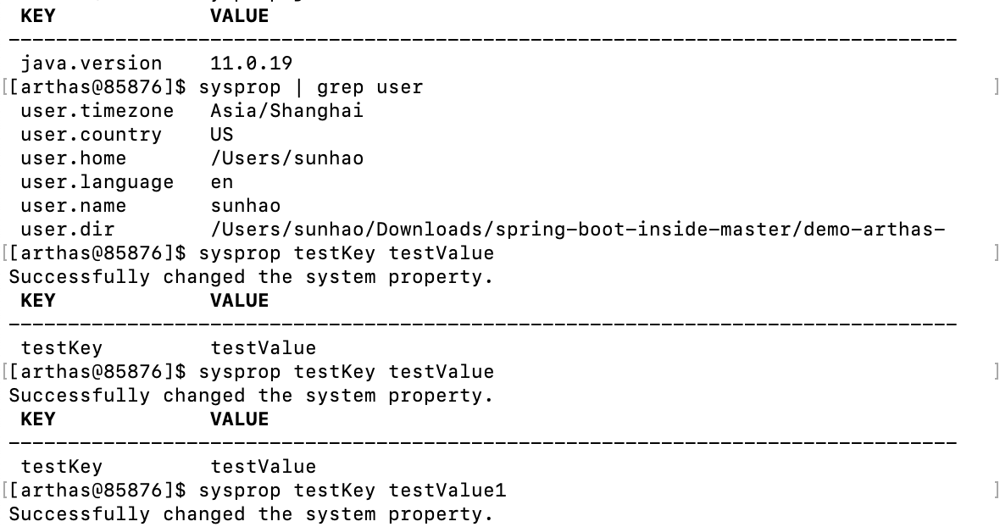

### [sysenv](https://arthas.aliyun.com/doc/sysenv.html)

`sysenv` 命令可以获取到环境变量。和`sysprop` 命令类似。

```shell
[arthas@85876]$ sysenv
 KEY              VALUE                                                            
-----------------------------------------------------------------------------------
 ANDROID_HOME     /Users/sunhao/Desktop/SpeedTest/sdk                              
 CONDA_DEFAULT_E  base                                                             
 NV                                                                                
 CONDA_EXE        /Users/sunhao/anaconda3/bin/conda                                
 CONDA_PREFIX     /Users/sunhao/anaconda3                                          
 CONDA_PROMPT_MO  (base)                                                           
 DIFIER                                                                            
 CONDA_PYTHON_EX  /Users/sunhao/anaconda3/bin/python                               
 E                                                                                 
 CONDA_SHLVL      1                                                                
 GOROOT           /Users/sunhao/go                                                 
 HOME             /Users/sunhao                                                    
 JAVA_MAIN_CLASS  org.springframework.boot.loader.JarLauncher                      
 _85876                                                                            
 LANG             en_US.UTF-8                                                      
 LOGNAME          sunhao                                                           
 LaunchInstanceI  605856BD-663B-43E9-8604-499AC582B6C2                             
 D                                                                                 
 OLDPWD           /Users/sunhao/Downloads/spring-boot-inside-master                
 PATH             /Users/sunhao/anaconda3/bin:/Users/sunhao/anaconda3/condabin:/us 
                  r/local/bin:/usr/bin:/bin:/usr/sbin:/sbin:/Library/TeX/texbin:/u 
                  sr/local/go/bin:/Library/Apple/usr/bin:/Users/sunhao/Desktop/Spe 
                  edTest/sdk/platform-tools:/usr/local/mysql/bin:/Users/sunhao/go/ 
                  bin:?usr/local/go/bin                                            
 PS1              [%T] (ﾉ>ω<)ﾉ \w $                                                
 PWD              /Users/sunhao/Downloads/spring-boot-inside-master/demo-arthas-sp 
                  ring-boot                                                        
 SECURITYSESSION  186a4                                                            
 ID                                                                                
 SHELL            /bin/zsh                                                         
 SHLVL            1                                                                
 SSH_AUTH_SOCK    /private/tmp/com.apple.launchd.Q5iBUuqdNs/Listeners              
 TERM             xterm-256color                                                   
 TERM_PROGRAM     Apple_Terminal                                                   
 TERM_PROGRAM_VE  445                                                              
 RSION                                                                             
 TERM_SESSION_ID  205304C4-04D9-403F-951A-796061B97B8F                             
 TMPDIR           /var/folders/pw/705tx2qj3nl10gp_tv2nzbqc0000gn/T/                
 USER             sunhao                                                           
 XPC_FLAGS        0x0                                                              
 XPC_SERVICE_NAM  0                                                                
 E                                                                                 
 _                /usr/bin/java                                                    
 _CE_CONDA                                                                         
 _CE_M                                                                             
 __CFBundleIdent  com.apple.Terminal                                               
 ifier                                                                             
 __CF_USER_TEXT_  0x1F5:0x0:0x0                                                    
 ENCODING                      
```


### [jvm](https://arthas.aliyun.com/doc/jvm.html)

`jvm` 命令会打印出`JVM` 的各种详细信息。

```shell
[arthas@85876]$ jvm
 RUNTIME                                                                           
-----------------------------------------------------------------------------------
 MACHINE-NAME            85876@SH-PowerBook-G4.local                               
 JVM-START-TIME          2024-01-11 15:25:38                                       
 MANAGEMENT-SPEC-VERSIO  2.0                                                       
 N                                                                                 
 SPEC-NAME               Java Virtual Machine Specification                        
 SPEC-VENDOR             Oracle Corporation                                        
 SPEC-VERSION            11                                                        
 VM-NAME                 OpenJDK 64-Bit Server VM                                  
 VM-VENDOR               Amazon.com Inc.                                           
 VM-VERSION              11.0.19+7-LTS                                             
 INPUT-ARGUMENTS         []                                                        
 CLASS-PATH              demo-arthas-spring-boot.jar                               
 BOOT-CLASS-PATH                                                                   
 LIBRARY-PATH            /Users/sunhao/Library/Java/Extensions:/Library/Java/Exten 
                         sions:/Network/Library/Java/Extensions:/System/Library/Ja 
                         va/Extensions:/usr/lib/java:.                             
                                                                                   
-----------------------------------------------------------------------------------
 CLASS-LOADING                                                                     
-----------------------------------------------------------------------------------
 LOADED-CLASS-COUNT      10132                                                     
 TOTAL-LOADED-CLASS-COU  10132                                                     
 NT                                                                                
 UNLOADED-CLASS-COUNT    0                                                         
 IS-VERBOSE              false                                                     
                                                                                   
-----------------------------------------------------------------------------------
 COMPILATION                                                                       
-----------------------------------------------------------------------------------
 NAME                    HotSpot 64-Bit Tiered Compilers                           
 TOTAL-COMPILE-TIME      26979                                                     
 [time (ms)]                                                                       
                                                                                   
-----------------------------------------------------------------------------------
 GARBAGE-COLLECTORS                                                                
-----------------------------------------------------------------------------------
 G1 Young Generation     name : G1 Young Generation                                
 [count/time (ms)]       collectionCount : 10                                      
                         collectionTime : 141                                      
 G1 Old Generation       name : G1 Old Generation                                  
 [count/time (ms)]       collectionCount : 0                                       
                         collectionTime : 0                                        
                                                                                   
-----------------------------------------------------------------------------------
 MEMORY-MANAGERS                                                                   
-----------------------------------------------------------------------------------
 CodeCacheManager        CodeHeap 'non-nmethods'                                   
                         CodeHeap 'profiled nmethods'                              
                         CodeHeap 'non-profiled nmethods'                          
 Metaspace Manager       Metaspace                                                 
                         Compressed Class Space                                    
 G1 Young Generation     G1 Eden Space                                             
                         G1 Survivor Space                                         
                         G1 Old Gen                                                
 G1 Old Generation       G1 Eden Space                                             
                         G1 Survivor Space                                         
                         G1 Old Gen                                                
                                                                                   
-----------------------------------------------------------------------------------
 MEMORY                                                                            
-----------------------------------------------------------------------------------
 HEAP-MEMORY-USAGE       init : 268435456(256.0 MiB)                               
 [memory in bytes]       used : 227215216(216.7 MiB)                               
                         committed : 322961408(308.0 MiB)                          
                         max : 4294967296(4.0 GiB)                                 
 NO-HEAP-MEMORY-USAGE    init : 7667712(7.3 MiB)                                   
 [memory in bytes]       used : 103307512(98.5 MiB)                                
                         committed : 106979328(102.0 MiB)                          
                         max : -1(-1 B)                                            
 PENDING-FINALIZE-COUNT  0                                                         
                                                                                   
-----------------------------------------------------------------------------------
 OPERATING-SYSTEM                                                                  
-----------------------------------------------------------------------------------
 OS                      Mac OS X                                                  
 ARCH                    x86_64                                                    
 PROCESSORS-COUNT        8                                                         
 LOAD-AVERAGE            1.88916015625                                             
 VERSION                 12.7                                                      
                                                                                   
-----------------------------------------------------------------------------------
 THREAD                                                                            
-----------------------------------------------------------------------------------
 COUNT                   32                                                        
 DAEMON-COUNT            30                                                        
 PEAK-COUNT              33                                                        
 STARTED-COUNT           39                                                        
 DEADLOCK-COUNT          0                                                         
                                                                                   
-----------------------------------------------------------------------------------
 FILE-DESCRIPTOR                                                                   
-----------------------------------------------------------------------------------
 MAX-FILE-DESCRIPTOR-CO  -1                                                        
 UNT                                                                               
 OPEN-FILE-DESCRIPTOR-C  -1                                                        
 OUNT                  
```

#### THREAD 相关

- COUNT: JVM 当前活跃的线程数
- DAEMON-COUNT: JVM 当前活跃的守护线程数
- PEAK-COUNT: 从 JVM 启动开始曾经活着的最大线程数
- STARTED-COUNT: 从 JVM 启动开始总共启动过的线程次数
- DEADLOCK-COUNT: JVM 当前死锁的线程数

#### 文件描述符相关

- MAX-FILE-DESCRIPTOR-COUNT：JVM 进程最大可以打开的文件描述符数
- OPEN-FILE-DESCRIPTOR-COUNT：JVM 当前打开的文件描述符数

### [dashboard](https://arthas.aliyun.com/doc/dashboard.html)

| 参数名称 | 参数说明                                 |
| -------: | :--------------------------------------- |
|     [i:] | 刷新实时数据的时间间隔 (ms)，默认 5000ms |
|     [n:] | 刷新实时数据的次数                       |

`dashboard` 命令可以查看当前系统的实时数据面板。

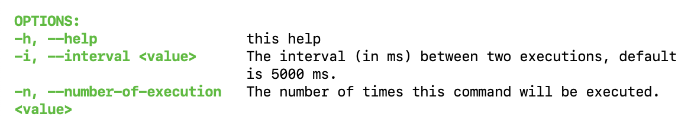

输入 `Q` 或者 `Ctrl+C` 可以退出 dashboard 命令。

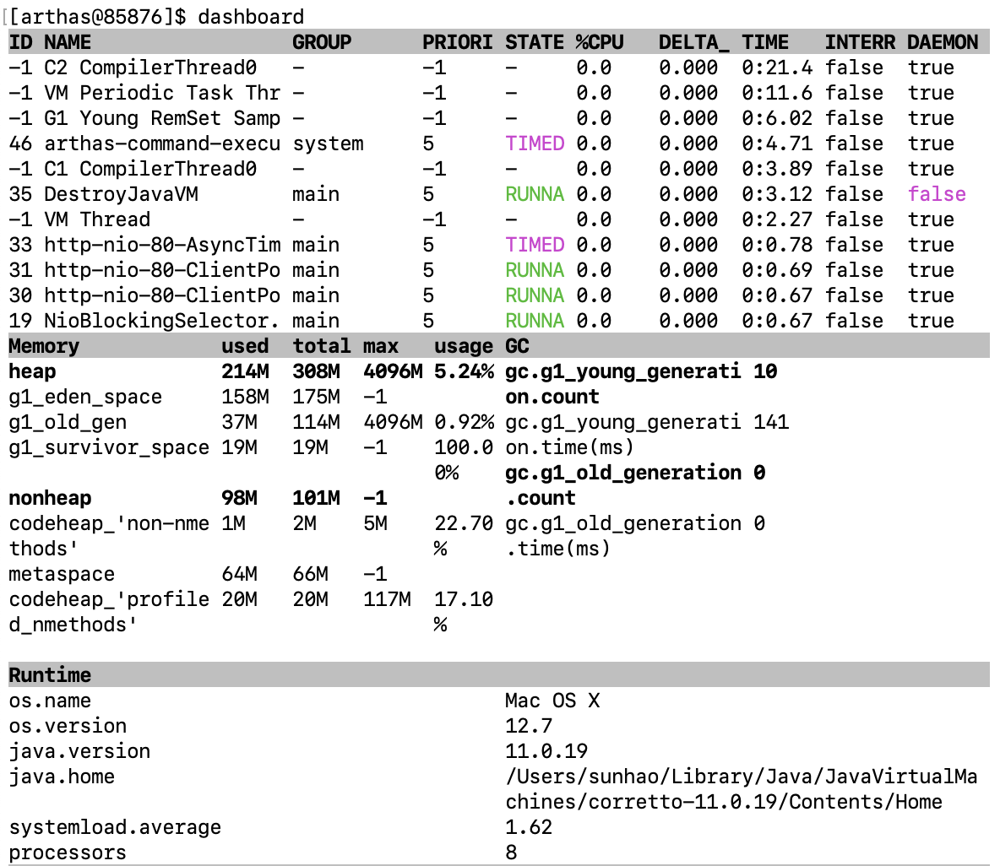

#### 数据说明

- ID: Java 级别的线程 ID，注意这个 ID 不能跟 jstack 中的 nativeID 一一对应。
- NAME: 线程名
- GROUP: 线程组名
- PRIORITY: 线程优先级, 1~10 之间的数字，越大表示优先级越高
- STATE: 线程的状态
- CPU%: 线程的 cpu 使用率。比如采样间隔 1000ms，某个线程的增量 cpu 时间为 100ms，则 cpu 使用率=100/1000=10%
- DELTA_TIME: 上次采样之后线程运行增量 CPU 时间，数据格式为`秒`
- TIME: 线程运行总 CPU 时间，数据格式为`分:秒`
- INTERRUPTED: 线程当前的中断位状态
- DAEMON: 是否是 daemon 线程

#### JVM 内部线程

Java 8 之后支持获取 JVM 内部线程 CPU 时间，这些线程只有名称和 CPU 时间，没有 ID 及状态等信息（显示 ID 为-1）。 通过内部线程可以观测到 JVM 活动，如 GC、JIT 编译等占用 CPU 情况，方便了解 JVM 整体运行状况。

- 当 JVM 堆(heap)/元数据(metaspace)空间不足或 OOM 时，可以看到 GC 线程的 CPU 占用率明显高于其他的线程。
- 当执行`trace/watch/tt/redefine`等命令后，可以看到 JIT 线程活动变得更频繁。因为 JVM 热更新 class 字节码时清除了此 class 相关的 JIT 编译结果，需要重新编译。

JVM 内部线程包括下面几种：

- JIT 编译线程: 如 `C1 CompilerThread0`, `C2 CompilerThread0`
- GC 线程: 如`GC Thread0`, `G1 Young RemSet Sampling`
- 其它内部线程: 如`VM Periodic Task Thread`, `VM Thread`, `Service Thread`


## thread

### 查看所有线程信息

```
thread
```

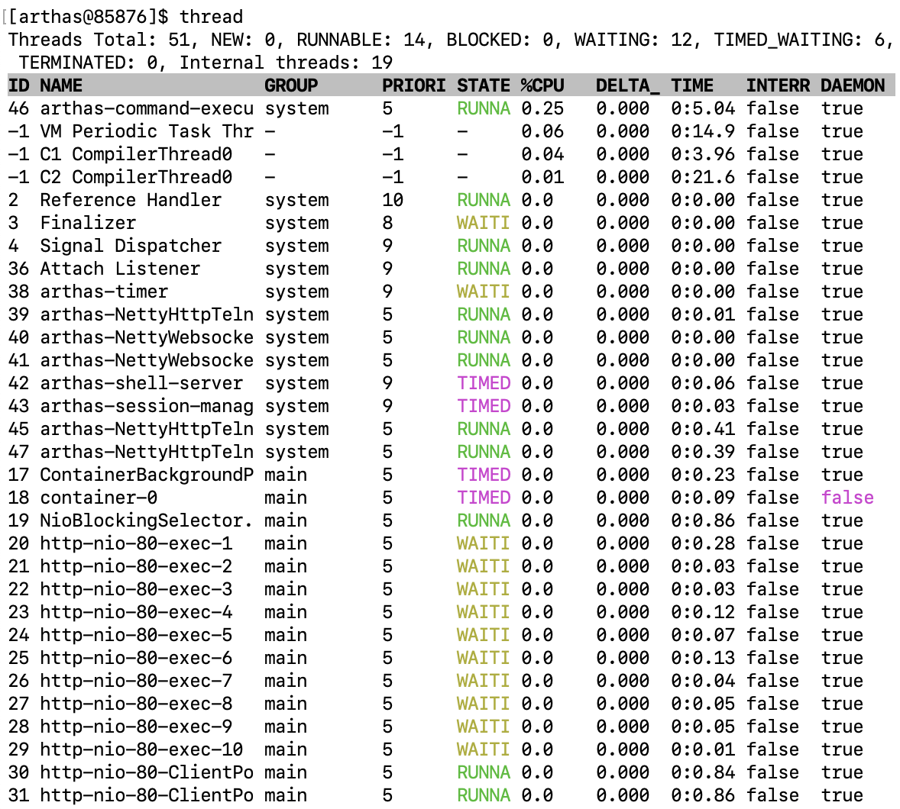

### 查看具体线程的栈

查看线程 ID 16 的栈：

```
thread 16
```

### 查看 CPU 使用率 top n 线程的栈

参数`n` 用来指定最忙的前 N 个线程并打印堆栈

```shell
thread -n 3
```

参数`i` 用来指定 cpu 占比统计的采样间隔，单位为毫秒

查看 5 秒内的 CPU 使用率 top n 线程栈

```shell
thread -n 3 -i 5000
```

### 查找线程是否有阻塞

参数`b` 用来指定找出当前阻塞其他线程的线程

```shell
thread -b
```


## vmtool

提示

@since 3.5.1

[`vmtool`在线教程](https://arthas.aliyun.com/doc/arthas-tutorials.html?language=cn&id=command-vmtool)

`vmtool` 利用`JVMTI`接口，实现查询内存对象，强制 GC 等功能。

- [JVM Tool Interface](https://docs.oracle.com/javase/8/docs/platform/jvmti/jvmti.html)

### 获取对象


```bash
$ vmtool --action getInstances --className java.lang.String --limit 10
@String[][
    @String[com/taobao/arthas/core/shell/session/Session],
    @String[com.taobao.arthas.core.shell.session.Session],
    @String[com/taobao/arthas/core/shell/session/Session],
    @String[com/taobao/arthas/core/shell/session/Session],
    @String[com/taobao/arthas/core/shell/session/Session.class],
    @String[com/taobao/arthas/core/shell/session/Session.class],
    @String[com/taobao/arthas/core/shell/session/Session.class],
    @String[com/],
    @String[java/util/concurrent/ConcurrentHashMap$ValueIterator],
    @String[java/util/concurrent/locks/LockSupport],
]
```

提示

通过 `--limit`参数，可以限制返回值数量，避免获取超大数据时对 JVM 造成压力。默认值是 10。

### 指定 classloader name


```bash
vmtool --action getInstances --classLoaderClass org.springframework.boot.loader.LaunchedURLClassLoader --className org.springframework.context.ApplicationContext
```

### 指定 classloader hash

可以通过`sc`命令查找到加载 class 的 classloader。


```bash
$ sc -d org.springframework.context.ApplicationContext
 class-info        org.springframework.boot.context.embedded.AnnotationConfigEmbeddedWebApplicationContext
 code-source       file:/private/tmp/demo-arthas-spring-boot.jar!/BOOT-INF/lib/spring-boot-1.5.13.RELEASE.jar!/
 name              org.springframework.boot.context.embedded.AnnotationConfigEmbeddedWebApplicationContext
...
 class-loader      +-org.springframework.boot.loader.LaunchedURLClassLoader@19469ea2
                     +-sun.misc.Launcher$AppClassLoader@75b84c92
                       +-sun.misc.Launcher$ExtClassLoader@4f023edb
 classLoaderHash   19469ea2
```

然后用`-c`/`--classloader` 参数指定：


```bash
vmtool --action getInstances -c 19469ea2 --className org.springframework.context.ApplicationContext
```

### 指定返回结果展开层数

提示

`getInstances` action 返回结果绑定到`instances`变量上，它是数组。

通过 `-x`/`--expand` 参数可以指定结果的展开层次，默认值是 1。


```bash
vmtool --action getInstances -c 19469ea2 --className org.springframework.context.ApplicationContext -x 2
```

### 执行表达式

提示

`getInstances` action 返回结果绑定到`instances`变量上，它是数组。可以通过`--express`参数执行指定的表达式。


```bash
vmtool --action getInstances --classLoaderClass org.springframework.boot.loader.LaunchedURLClassLoader --className org.springframework.context.ApplicationContext --express 'instances[0].getBeanDefinitionNames()'
```

### 强制 GC


```bash
vmtool --action forceGc
```

- 可以结合 [`vmoption`](https://arthas.aliyun.com/doc/vmoption.html) 命令动态打开`PrintGC`开关。

### interrupt 指定线程

thread id 通过`-t`参数指定，可以使用 `thread`命令获取。


```bash
vmtool --action interruptThread -t 1
```


## Profiler

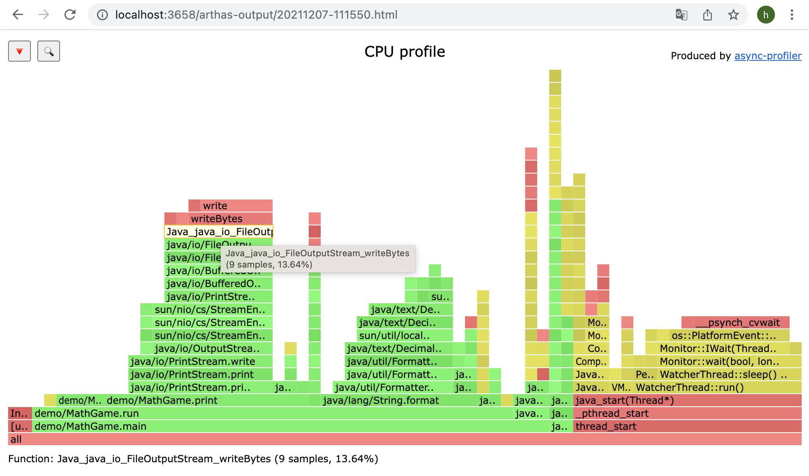


## 实战用例


### 参考代码

```java
package com.example.demo;

import org.springframework.web.bind.annotation.*;
import java.util.ArrayList;
import java.util.concurrent.TimeUnit;
import java.util.List;
import java.util.concurrent.LinkedBlockingDeque;
import java.util.concurrent.ThreadPoolExecutor;

@RestController
public class JvmThreadController {
    List<byte[]> memoryList = new ArrayList<>();

    @GetMapping("/memoryTest")
    public String memoryTest(int c) {
        byte[] b = new byte[c * 1024 * 1024];
        memoryList.add(b);
        return "success";
    }

    ThreadPoolExecutor executor = new ThreadPoolExecutor(
            10,
            15,
            2,
            TimeUnit.SECONDS,
            new LinkedBlockingDeque<>(50),
            new ThreadPoolExecutor.CallerRunsPolicy()
    );

    @GetMapping("/cpuUsageRate")
    public String cpuUsageRate() {
        executor.submit(() -> {
            int i = 0;
            while (true) {
                i = i++ * 10 + 5;
                System.out.println(i);
            }
        });
        return "success";
    }

    @GetMapping("/threadLock")
    public String threadLock() {
        Object resourceA = new Object();
        Object resourceB = new Object();
        executor.submit(() -> {
            synchronized (resourceA) {
                try {
                    TimeUnit.SECONDS.sleep(1);
                } catch (InterruptedException e) {
                    e.printStackTrace();
                }
                synchronized (resourceB) {
                }
            }
        });
        executor.submit(() -> {
            synchronized (resourceB) {
                try {
                    TimeUnit.SECONDS.sleep(1);
                } catch (InterruptedException e) {
                    e.printStackTrace();
                }
                synchronized (resourceA) {
                }
            }
        });
        return "success";
    }
}

```

包括三个部分：OOM，CPU大量使用，线程锁

### OOM

使用编译器直接打开hprof文件，能找到占用大量内存的位置。

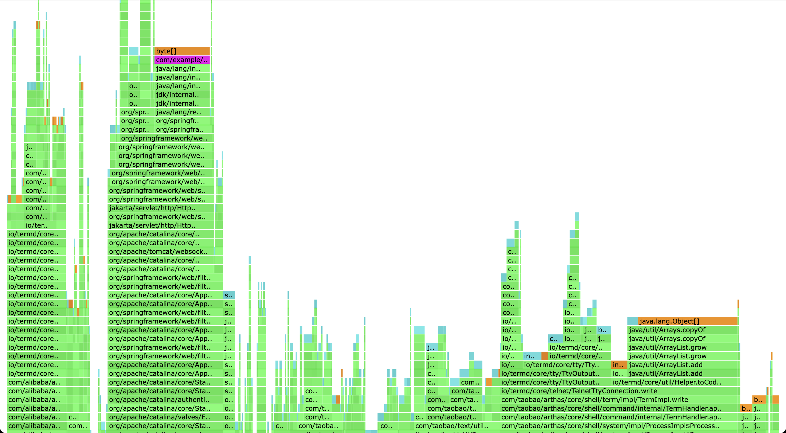

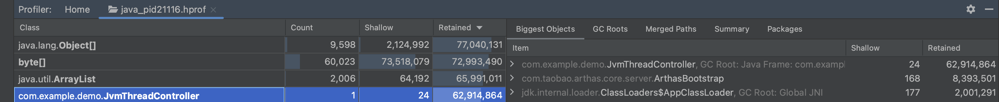

使用

### CPU

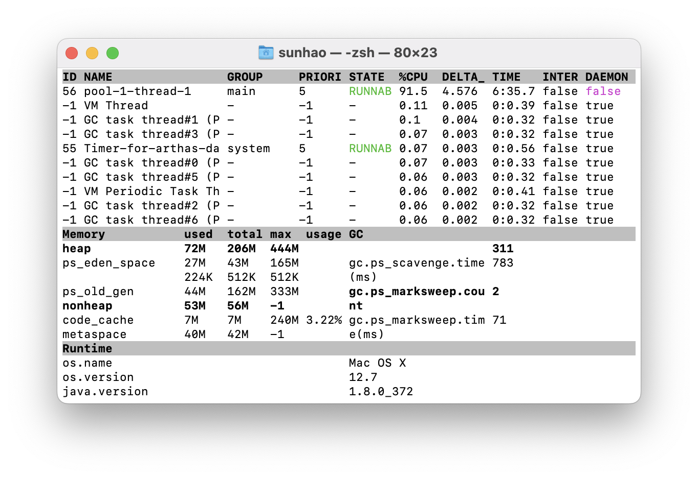

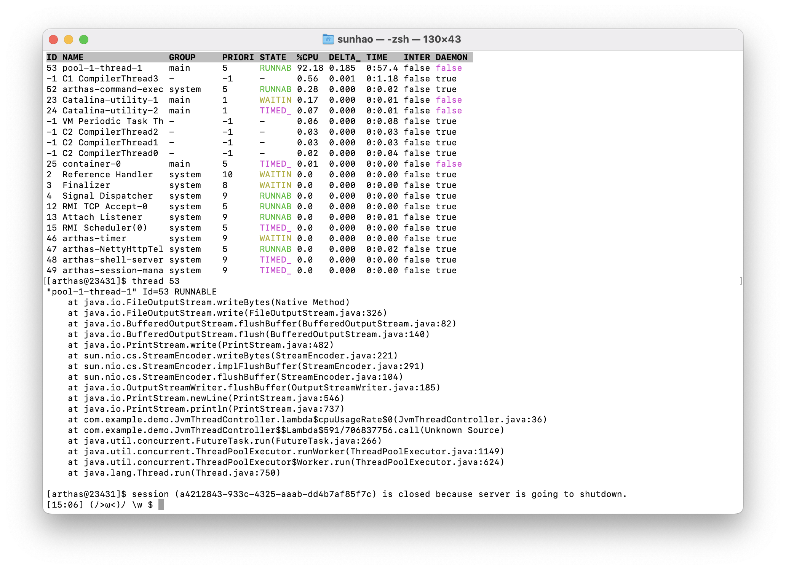

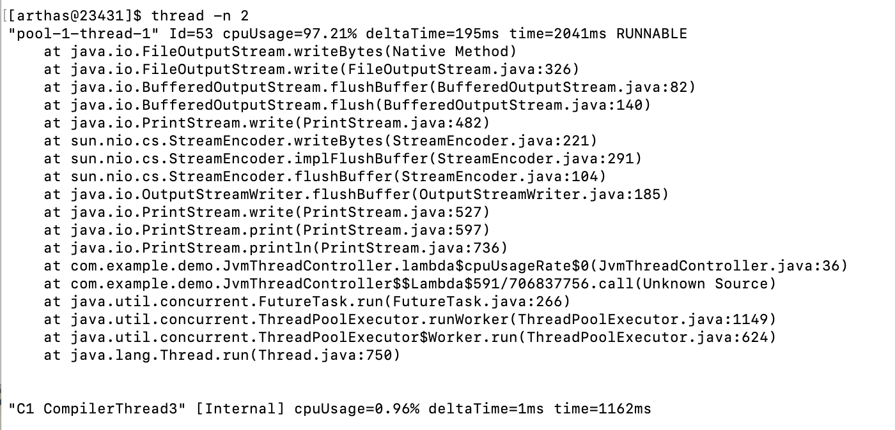


### 死锁


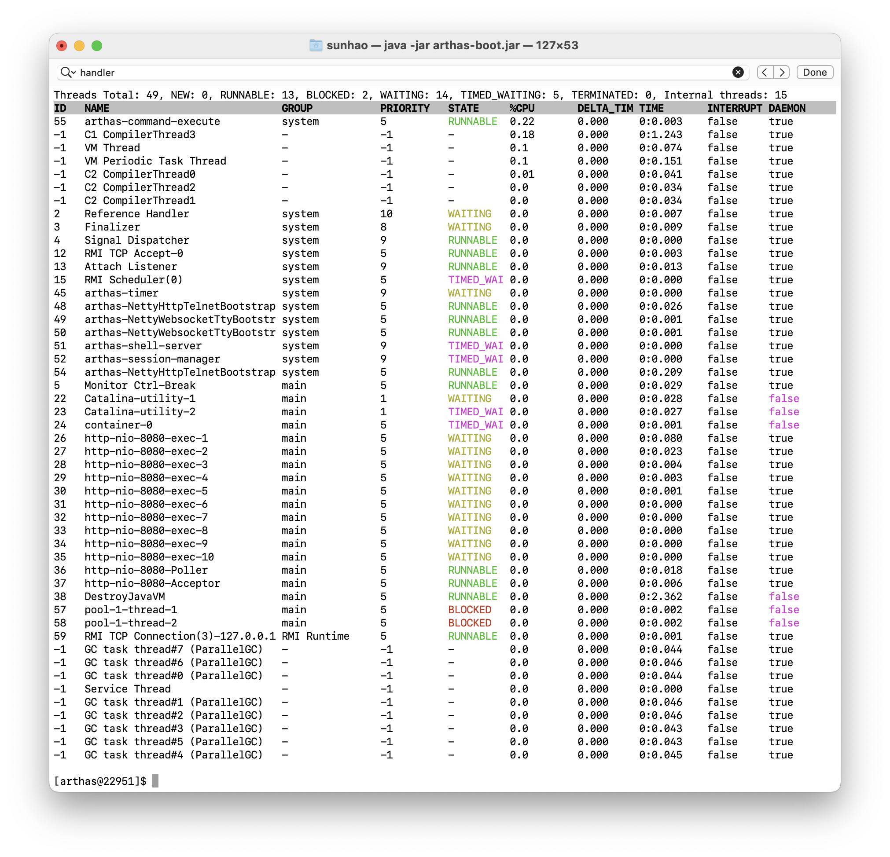

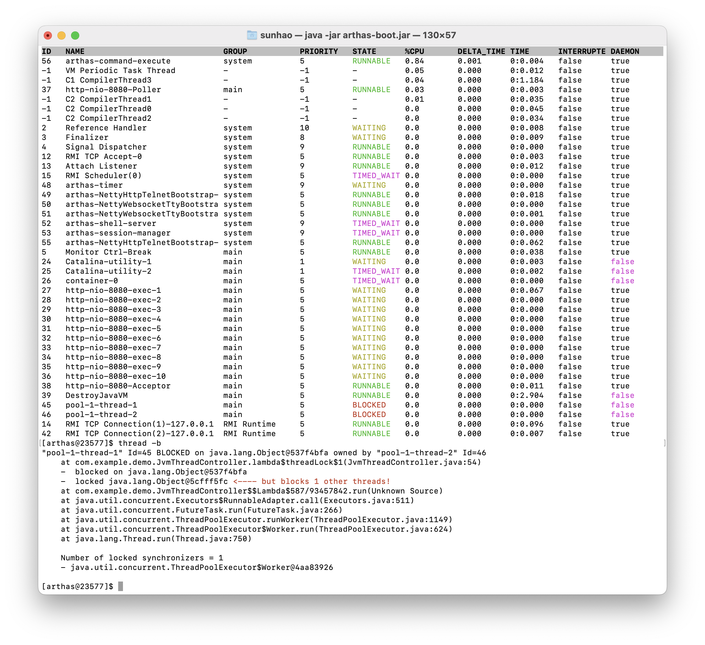
