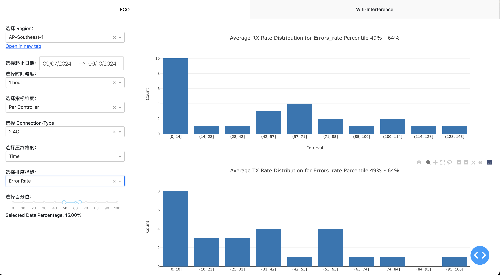
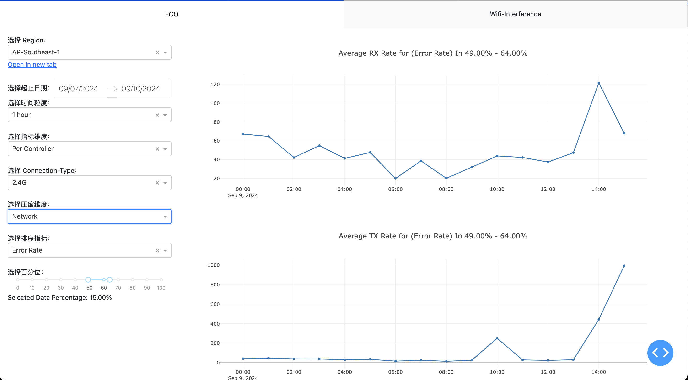

因为比较长时间没有做数据工作，因此整理了之前的工作，然后一起看一下有哪些是可以继续推进的。

# 数据平台架构

本架构为和数据部无合作时规划的批式处理方案：

更新计划：

# ECO工作内容

## Data-Collector

### 当前功能

1. 前端埋点原始数据上报到kafka，kafka数据再上报到数据平台的接口
2. 消费前端埋点kafka和qoe的kafka，将数据上报到S3
3. 使用xxljob将wifi-interference-test数据上报到S3

### 后续工作

1. 前端埋点数据上报过程中，涉及到鉴权失败的数据，该部分需要上传到S3
2. S3生命周期管理
   1. trreport开发过程中，污染了data-collector的桶的生命周期，需要清除
   2. 因qoe迁移阻塞qoe原始数据存储，该部分的生命周期目前未配置（会随qoe数据量增加引起
3. 单元测试需补充
4. 单个数据消息体大小从数kb调整到128M

## Data-EMR

当前功能

ODS-DWD-DWM-DWS-ADS

|      | 数据来源                          | 实现细节                                                     | 函数入参                                                     | 存储                                                         |        |          |         |                 |
| ---- | --------------------------------- | ------------------------------------------------------------ | ------------------------------------------------------------ | ------------------------------------------------------------ | ------ | -------- | ------- | --------------- |
|      |                                   |                                                              |                                                              | 时间分区                                                     | 压缩   | 格式     | 时间    | 路径            |
| ODS  | 使用微服务从kafka拿到的打包数据， | 打包方式为每K(1000)条打包一次，数据到达kafka后最迟M(120000)毫秒打包一次 |                                                              | 按第一条kafka消息时间                                        | gz2    | json/txt | 32Days  | /source/qoe-raw |
| DWD  | 对ODS数据解析建模，指标计算       | 涉及层级调整：将一条AP数据拉成多条单频段数据；类型转换：使用int/double代替string； |                                                              | 按每条消息kafka时间，因此同一天的ODS会有两天的DWD，数据写入使用Append。 | snappy | parquet  | 32Days  | /qoe-raw/dwd    |
| DWM  | 清洗脏数据和进行指标计算。        | 如需计算sta数目并写入每个sta行，则放在DWD进行；如需由sta的参数a1,a2计算a3，则在DWD进行 |                                                              | 不分时区                                                     | snappy | parquet  | 32Days  | /qoe-raw/dwm    |
| DWS  | 将数据聚合供ADS使用               | 使用day/hour network/device将多行数据聚合成一条，数据聚合形式使用：Avg/sum/min/variant | bucket, input_prefix, output_prefix, input_list, start_date, end_date | 不分时区                                                     | snappy | parquet  | 62Days  | /qoe-raw/dws    |
| ADS  |                                   |                                                              |                                                              | 按照用户时区                                                 | snappy | parquet  | 365Days | /qoe-raw/ads    |

设计原则：每一层只采用上一层的表

1. 使用pyspark批式计算数据，使用S3做数据存储
1. 业务上，因为涉及到qoe链路准确性不可靠而使用原始kafka数据进行处理
   1. qoe解析的数据不及预期
      1. 部分有线数据未解析
      1. 部分结果解析过度，且从这里作为业务和数据平台的分界线更合适，减少链路。

   1. qoe链路结果不准确：
      1. ap-client的原始数据和写入cassandra的数据产生环状依赖
      1. ap和client处理时间接近会导致两者耦合计算过程使用的redis写一半就被读取

### 后续工作

1. 性能问题测试验证：当前使用的文件读取包需要
2. 需完成dag脱敏工作，并在uat验证

## Data-show

- 圆角矩形：函数

- 方框：数据

- 条纹方框：前端可选框

### 原始数据选择

上述案例说明原始数据情况会生成多少后续数据。

原始数据有三张原型表按hour/day聚合的表

- 每个网络分连接方式（2.4/5/6/ethernet/all）的细节表

- 总览表

- controller-agent之间关系表

因此在选择起止时间，时间粒度，指标维度之后表应该唯一确定。

### 绘图过程

1. 使用Time压缩会绘制柱状图，使用Network压缩维度绘制折线图。
2. 选择排序指标和百分位后，会将当前数据源按照排序指标进行排序。
   1. 如果是Time压缩，会获取每个网络Error rate排名在50%-60%的情况的数据源，然后查看所有网络该指标下的分布，实际意义是用户家庭网络质量在50-60%情况下的分布。
   2. 如果是Network压缩，会获取每个时间点Error rate排名在90%-100%的情况的网络，将网络数据连成线，实际意义是当前时间最好的那批网络的质量。

### 当前功能

1. 读取 S3 数据源，生成交互式报表。
2. 使用CICD进行标准化发布流程。

### 待做项

1. 核对需求细节并发布生产

