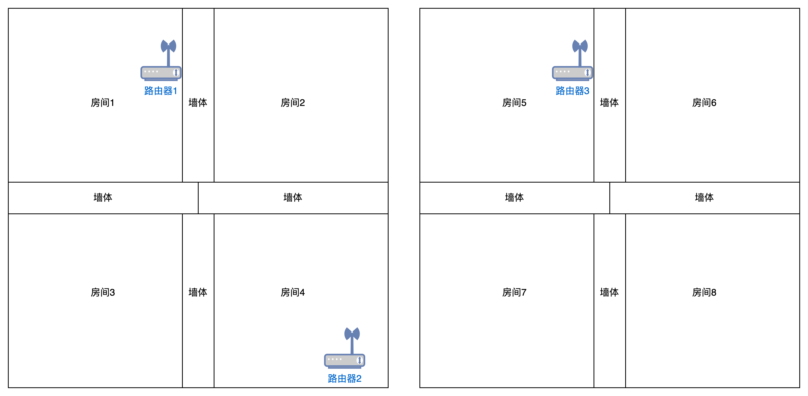

本部分通过QoE分析和链路分析为例，描述数据分析中使用ai算法的一些应用场景，并分析不同计算框架的性能。

## QoE分析

QoE分析旨在探索使用QoE数据分析用户使用场景的可能性，并在给定环境参数情况下预判设备的反应。

作为简单的demo，我们考虑用户家庭多房间的情况下，使用ap-sta的rssi，SNR和延时信息给用户所在房间分类。

### 实验场景

考虑下述两个家庭场景。

第一个场景有两个房间和一台路由器，考虑理想场景，路由器放在房间1。

第二个场景更大，有两层，每层四个房间并放置了三台路由器，

### 实验流程

1. 采用matlab模拟路由器和房间场景，构建终端在不同位置的数据集。
2. 在matlab中使用聚类算法判断对不同房间产生的信号进行区分。
3. 将第一步获得的数据集，存储为(RSSI，SNR，延迟，房间号)，接入到数据仓库使用不同计算框架并分析性能，仿真数据和真实数据相比的好处是有理论标签。

### QoE实验结果

实验结果仅供参考，本实验目的是验证数据平台搭建后QoE数据分析的可行性。

场景1：每个房间选择100个点作为训练数据，20个点作为测试数据。每个房间大小为5*5，假设房间1左下角为原点，将路由器放在房间1的(4.9,4.9)上，信噪比设为20dB，考虑墙壁衰减因子10dB，设置默认WIfi6信源信道模型。获取的RSSI分布图如下。

Test Data Classification Accuracy: 87.5%
Elapsed time: 0.058243 seconds

场景2:每个房间大小为$5*5*3$，在上述默认条件下，楼层间的衰减为20dB，测试数据判断准确率为76%，本文开始时未研究更复杂的数据收集算法去优化对称场景下的房间信号参数，本结果仅供QoE数据分析Benchmark。

### 数据分析结果

使用spark计算相同的内容

Accuracy = 0.875
Time taken: 4.233163119 seconds

使用flink计算相同的内容，发现其执行更为困难而且用时更长

Accuracy: 0.5
Time taken: 8230 milliseconds

