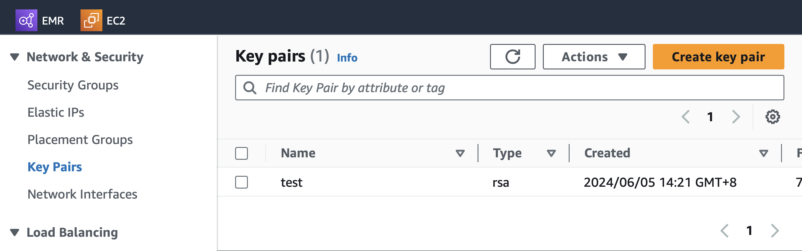
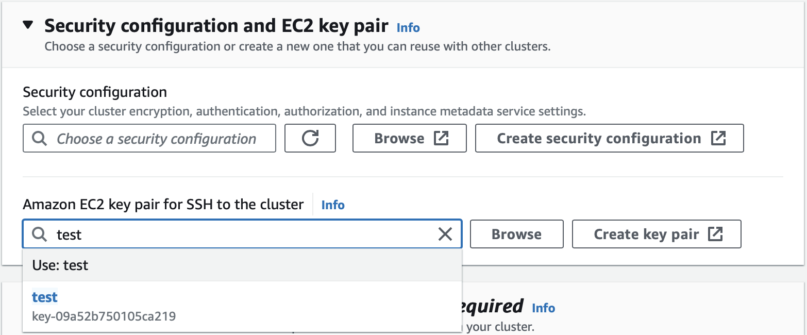
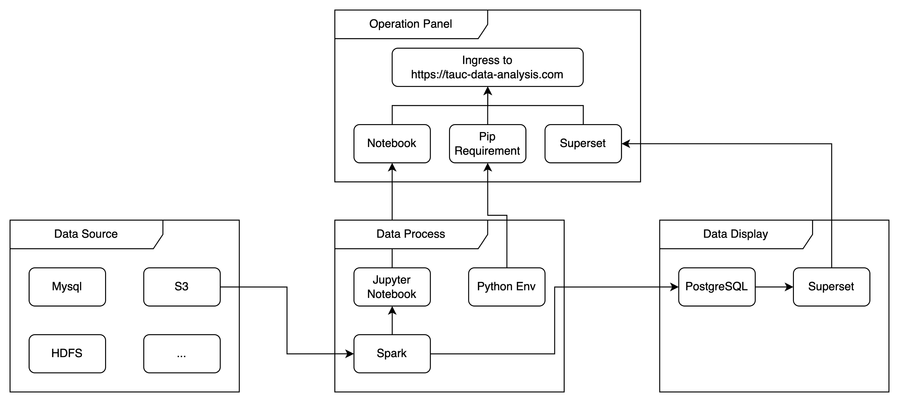
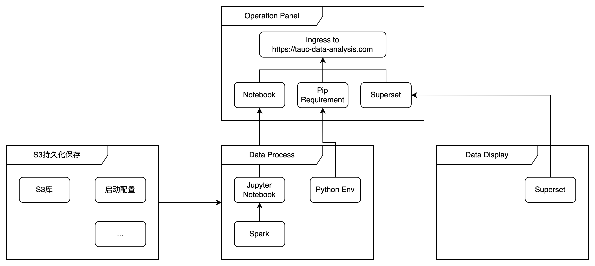
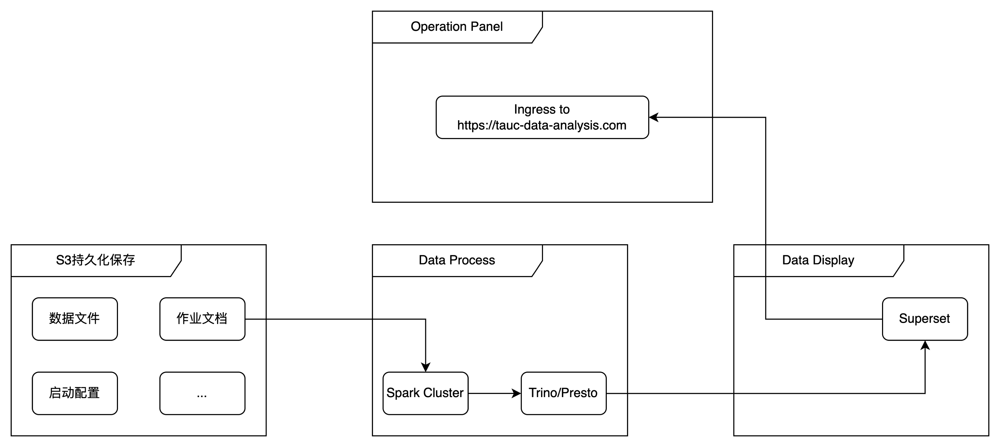

usage

aws s3 cp s3://linkanalysis/AddResponseHeaderFilter.java  /home/hadoop/


aws s3 cp s3://linkanalysis/src /home/hadoop/ --recursive


spark-submit --jars s3://path/to/presto-jdbc-driver.jar your_spark_script.py


# 使用方法：

使用spark无非就是作业提交，notebook调用；然后AWS封装了一层Add Steps

## Ssh & Notebook（公司防火墙限制）

### 通用方式



首先需要在EC2的界面创建Key Pairs，然后在EMR配置中配置这个Key Pairs



生成集群后打开shell使用ssh，即可访问EMR节点。

```shell
% 这段的意思是使用test1.pem访问这个aws集群地址，用户是hadoop，并将本地的8157端口映射到集群的8888端口

$ ssh -i /Users/sunhao/Downloads/test1.pem -L 8157:localhost:8888 hadoop@ec2-54-226-254-227.compute-1.amazonaws.com


% 这段是spark的执行操作，执行文件data2.py，输入参数为input1.txt，输出到output.csv
spark-submit --deploy-mode cluster --master yarn s3://linkanalysis/data2.py s3a://linkanalysis/input1.txt s3a://linkanalysis/ooutput/output.csv
```

进入节点之后可以安装Notebook组件，安装完通过端口映射的方式可以在本地端口访问，当然了AWS也提供了EMR Studio能够使用notebook，不过一来没有权限，二来应该要另外花钱。

### 其他方式：

**使用Apache Livy提交作业**：

- Livy是一个开源的Spark作业服务器，提供了REST接口，可以用来提交和管理Spark作业。可以在EMR集群上安装Livy，通过HTTP请求提交Spark作业。

**通过自动化工具（如Airflow或Oozie）**：

- 可以使用Airflow或Oozie等工作流调度工具，自动化提交和管理Spark作业。这些工具可以与EMR集群集成，通过API提交Spark作业。


## AWS Steps

### 使用EMR控制台提交步骤（Steps）：

- 通过AWS管理控制台，可以在EMR集群上添加步骤来运行Spark作业。可以指定脚本文件的位置（例如S3），以及相应的参数。
- 

### 使用AWS CLI提交步骤：

- 应该需要创建AK/SK，未尝试

- 使用AWS命令行界面（CLI），可以通过

  ```
  aws emr add-steps
  ```

  命令将Spark作业添加到正在运行的EMR集群。例如：

  ```bash
  aws emr add-steps --cluster-id <cluster-id> --steps Type=Spark,Name="Spark Program",ActionOnFailure=CONTINUE,Args=[--deploy-mode,cluster,--class,org.apache.spark.examples.SparkPi,s3://<bucket>/path/to/your.jar,10]
  ```

- 


组件选择：

### 框架1：Docker分布式构建



数据源有多种形式，然后使用Notebook编写代码，在Spark集群上执行，Spark访问数据源，然后集群中还需要单独的Python环境，数据通过数据库同步到Superset展示。

其中Notebook，Python环境，Superset是localhost端口，设想是ingress到web访问。

这段代码展示从S3读取文件的操作，分布式架构写入文件权限也很麻烦。

```python
# MinIO 配置
MINIO_ENDPOINT = 'http://minio:9000'
MINIO_ACCESS_KEY = 'minioadmin'
MINIO_SECRET_KEY = 'minioadmin'
BUCKET_NAME = 'mybucket'
FILE_KEY = 'path_chain_counts.txt'  # 请根据实际文件路径进行修改

# 初始化SparkSession
spark = SparkSession.builder \
    .appName("PathTransformation") \
    .config("spark.jars.packages", "org.apache.hadoop:hadoop-aws:3.2.0,com.amazonaws:aws-java-sdk-bundle:1.11.874") \
    .config("spark.hadoop.fs.s3a.impl", "org.apache.hadoop.fs.s3a.S3AFileSystem") \
    .config("spark.hadoop.fs.s3a.access.key", MINIO_ACCESS_KEY) \
    .config("spark.hadoop.fs.s3a.secret.key", MINIO_SECRET_KEY) \
    .config("spark.hadoop.fs.s3a.endpoint", MINIO_ENDPOINT) \
    .config("spark.hadoop.fs.s3a.path.style.access", "true") \
    .getOrCreate()

# 初始化 MinIO 客户端
s3_client = boto3.client('s3',
                         endpoint_url=MINIO_ENDPOINT,
                         aws_access_key_id=MINIO_ACCESS_KEY,
                         aws_secret_access_key=MINIO_SECRET_KEY)

# 从 MinIO 读取文件内容
response = s3_client.get_object(Bucket=BUCKET_NAME, Key=FILE_KEY)
file_content = response['Body'].read().decode('utf-8')
```


### 框架2: AWS Basic


AWS提供了一个良好的操作平台，耦合了中间这些组件的连接问题，读取写入文件都非常简单。

这是一个已经实现的基本通路，EMR执行脚本拿取S3的文件，然后处理成可被Superset访问的表形式存入S3，然后写入Superset。

```python
# 从S3读取文件内容
file_content = sc.textFile(input_path).collect()
file_content = "\n".join(file_content)

# 保存结果到 S3
df.select("uvi", "transformed_path").write.csv(output_path, header=True)
```


### 框架3: AWS Dev预期




### 框架4: AWS PRD预期





## 遇到的困难

### 网站配置

目的：ingress to https，能通过http端口访问aws集群的notebook接口。

方法：可以使用elb或者Route 53 Health Check

现状：无权限创建elb的target group

### 环境配置

|           | 数据来源 | 交互方式    | 访问方式            | 脱敏程度 |
| --------- | -------- | ----------- | ------------------- | -------- |
| dev       | 测试环境 | Notebook    | Notebook + Superset | 一般     |
| batch-prd | 生产环境 | Notebook    | Superset            | 严格     |
| prd       | 生产环境 | Spark-shell | Superset            | 严格     |

dev：测试数据，使用notebook交互式开发，同时将调试结果使用superset进行查看。

Dev-prd：小规模脱敏生产数据，验证代码合理性，避免处理生产数据反复打包。使用notebook调试代码但不展示运行结果，仅可通过Superset访问结果，此环境也可以研究不同程度的脱敏实现和权限控制。（需要禁用notebook展示和进行数据脱敏）

prd：生产数据，代码以jar包形式批量处理，结果导出到Superset进行分析，脱敏程度仅需达到数据部安全规则。

核心问题是从测试环境到生产环境，交互方式需要从Notebook转变为Spark-shell提交jar包的形式，访问方式由Notebook直接交互转变为Superset展示的形式，可能可以多开一个环境进行折中操作。