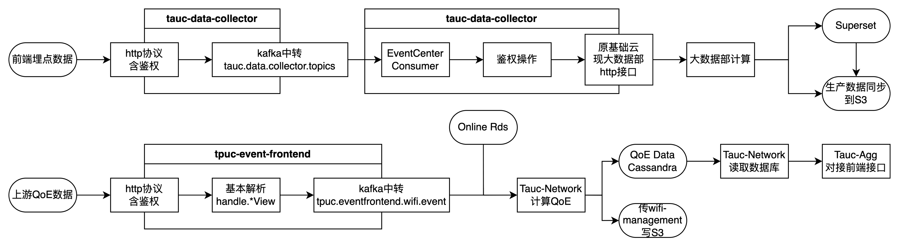
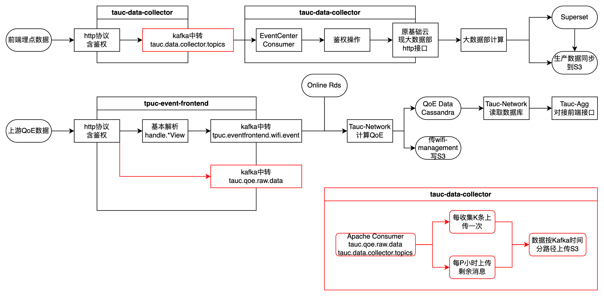
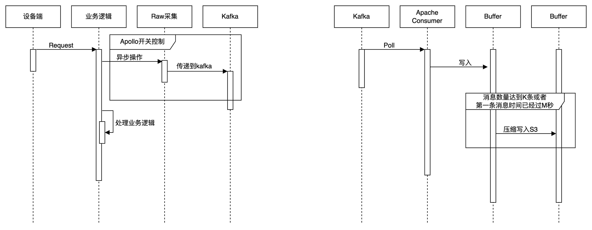

# 一、系统架构

### 原始架构

缺陷：

1. 现有大数据部计算工具时延较长。

### 数据采集评审设计

新增项：

1. tpuc-event-frontend新增数据链路，原始数据在Controller层完成鉴权后直接通过kafka进行中转
   1. tauc-data-collector鉴权	
      1. Headers里字段origin为指定值（dev/uat无此限制）
      2. 请求体字段uvi/sr/accountId非空
   2. tpuc-event-frontend鉴权
      1. 使用请求头的oui-sn-pc字段（即trId）进行鉴权
2. tauc-data-collector新增kafka消费模块，数据每拉取指定条目会上报一次S3，指定K小时后会将当前拉的数据一次上传。
   1. 目前配置的是拉取1000条上传一次，经过 60000 millis上报一条消息。

# 二、细节设计

### 生产流程：

1. 由apollo配置生产开关
   1. 注：消费部分也有开关，但是只能关不能开（可以优化）
2. 异步操作避免阻塞
3. 逻辑在业务逻辑之前，避免因业务逻辑异常遗漏消息。

### 消费流程：

1. 精细化配置Kafka consumer和S3 client

### 规划：

1. 流计算直接申请机器消费kafka即可，消息结果应该不接S3
2. 由于涉及到批量打包上传，因此无法使用Seatunnel执行这个操作（使用Seatunnel也是需要线程池，不如java有监控），但可以将批量上传的代码作为Sink插件集成到Seatunnel。
3. 后续可以配置工厂模式处理批消费，或者直接使用Seatunnel等组件方式代替现有ETL操作。

注：此处提及的使用seatunnel和沈毅规划的内容的本质区别是在他看来seatunnel只是一个新潮名词，名词背后的技术和框架一概不知，换个说法就是压根没投入。

### 对比

#### **背景**：

你正在构建一个数据处理系统，需要从 Kafka 中消费实时交易数据。数据处理的逻辑非常复杂，包括以下几个步骤：

1. **数据清洗**：需要根据多个条件对数据进行清洗，有些字段需要根据动态规则进行转换和过滤。
2. **状态跟踪和动态决策**：需要根据实时的交易数据，对用户的交易行为进行模式识别和状态跟踪，比如识别出潜在的欺诈行为。这要求在处理每一条消息时，需要访问并更新存储在外部数据库中的用户状态。
3. **多步骤数据合并**：在处理数据时，需要对来自不同主题的多种类型的数据进行合并，按时间顺序排序，并应用复杂的合并逻辑。
4. **动态配置和调优**：处理逻辑中的某些参数可能需要根据实时的业务需求进行动态调整，比如动态调整阈值，或者基于外部事件改变处理流程。
5. **性能优化**：为了确保低延迟和高吞吐量，可能需要手动管理线程池、批处理、缓存等低级别的优化手段。

在上述案例中，处理逻辑的复杂性和高度的定制化需求，使得手写 Java 代码更合适。手写代码允许你完全控制处理流程，轻松应对多步骤、多条件的数据处理需求，并且可以通过多种方式对性能进行优化，从而满足低延迟、高吞吐量的需求。

相比之下，使用像 SeaTunnel 这样的配置驱动工具，虽然能快速实现基础的数据处理任务，但在应对这种高度复杂和动态的处理需求时，可能会显得力不从心，因为配置化工具通常是为标准化的场景设计的，而手写代码提供了最高的灵活性和可控性。

# 三、资源申请

### Kafka（已申请）

uat

tauc.qoe.raw.data

pet

tauc.qoe.raw.data.pet

prd

tauc.qoe.raw.data

### S3

存储设计：

命名（三区部署）：

prd-tauc-aps1-data-analysis

prd-tauc-use1-data-analysis

prd-tauc-euw1-data-analysis

文件会存放到/source目录下

