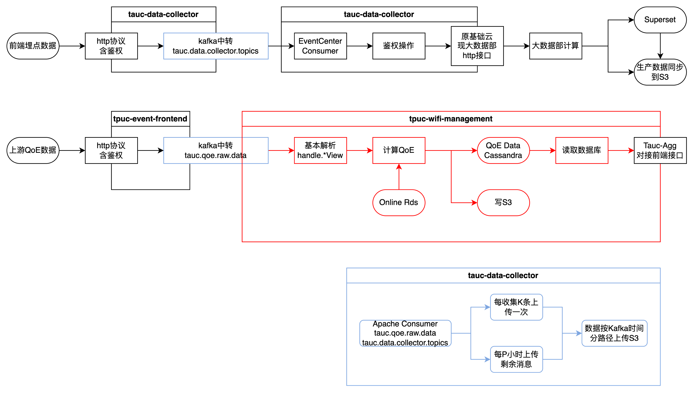
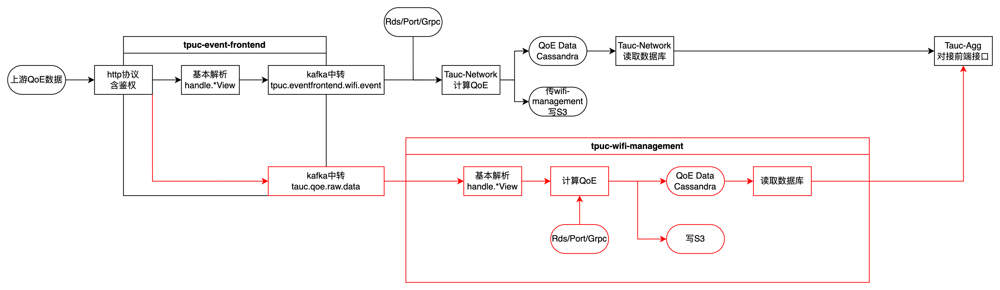
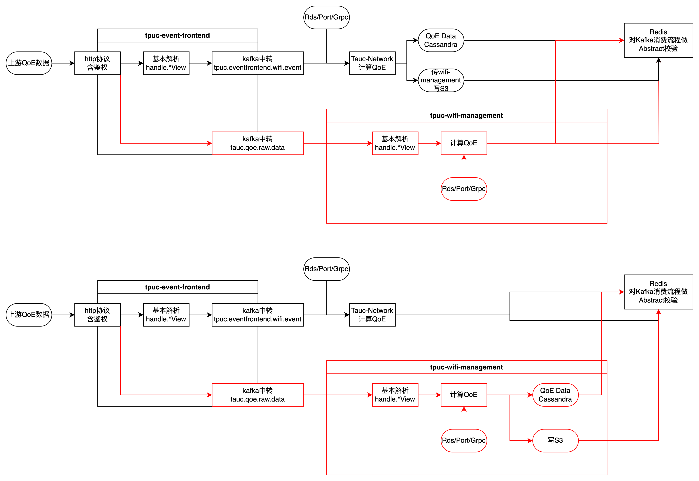
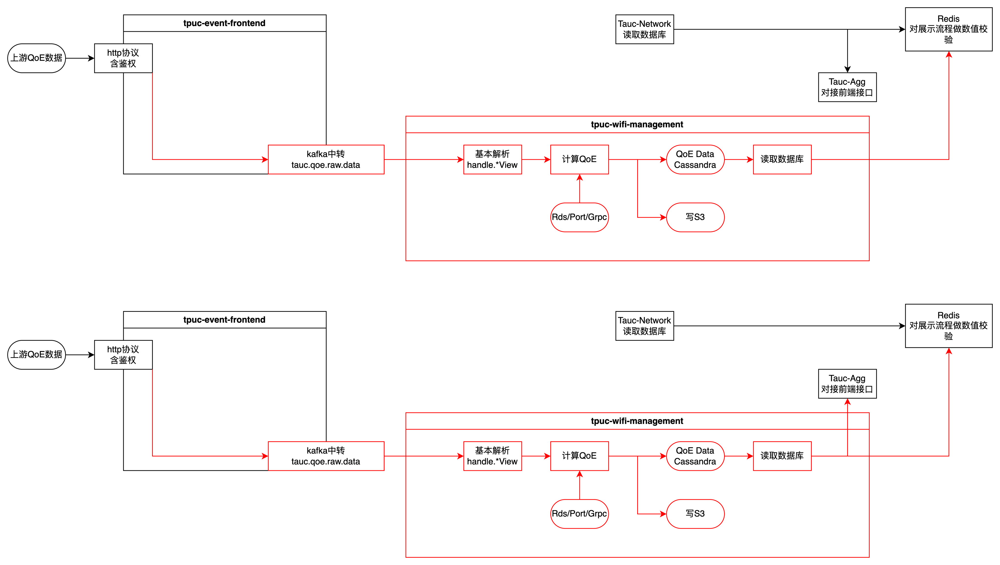

### QoE迁移

迁移项：

1. 将原有Tpuc-event-frontend的解析部分迁移到tpuc-wifi-management
2. 将原有Tauc-Network的QoE分数计算部分（包括和其他微服务间的调用）迁移到tpuc-wifi-management
3. 将原有Tauc-Network和Aggweb之间的通信部分迁移到tpuc-wifi-management（注：不包含activity/statistic等内容）

计划新增项（TBC）：

1. 迁移比对：比对同一kafka消费发送的数据是否一致。
2. 幂等性校验：校验一条消息是否被消费两次（适配未来shd-eventCenter）。
3. 消息重发：使用保存到S3的数据重新发送进行kafka消费（确保消息被传达）。

迁移细节

1. 只迁移业务链路的Service和DTO等，不迁移Deprecated以及未访问的部分。
2. 只迁移QoE分数计算过程，跟分数计算无关部分新建grpc接口实现。
   1. Feign调用其他微服务的，则直接调用接口
   2. 调用Network内部方法的，查询

1. 对于调用混乱的会有小型改动。比如和前端约定的-1填充。
2. 使用DDD架构，区分不同计算流程。

## 消费迁移

发布内容按黑线消费，红线发布，apollo关闭。

消费迁移：先上线确认结果是否正确，然后将数据落库操作改到新服务进行。

使用Aop方式，将数据结果写入到Redis校验两者是否一致，UUID：trid+timestamp（可选）+filterkey（3E版本计划使用kafka-stream）

### 数据同时写问题

数据要写入的地方

cassandra/

1. cassandra
   1. ap-sta表
2. mongodb
   1. alert
3. redis
   1. 

## 展示迁移

1. aggweb配apollo切换请求来源
2. 

1. 