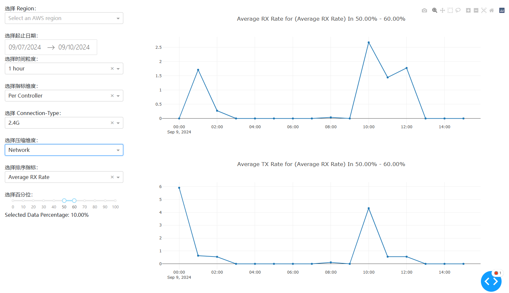
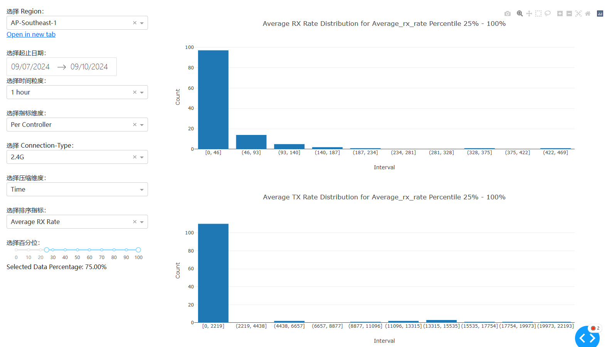
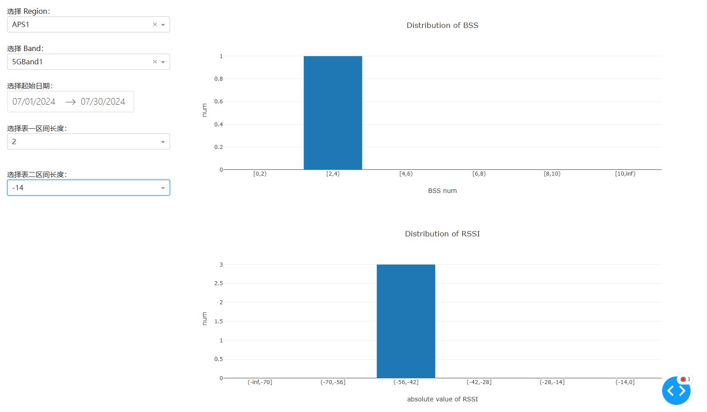

# ECO Demo

### 指标 & 维度

指标项：

| 指标维度                   | 指标明细            |        |
| -------------------------- | ------------------- | ------ |
| Per Controller             | Average Rx Rate     |        |
| Per Controller             | Average Tx Rate     |        |
| Per Controller             | Congestion Score    |        |
| Per Controller             | Wifi Coverage Score |        |
| Per Controller             | Noise               |        |
| Per Controller             | Error Rate          |        |
| Per Controller             | WAN Bandwidth       |        |
| Per Controller/Per Client  | Online Client Num   | 待实现 |
| Per Client                 | Link Rate           | 待实现 |
| Per Client                 | Signal Strength     | 待实现 |
| Between Controller & Agent | RSSI                |        |
| Between Controller & Agent | Link Rate           |        |


左侧会提供维度项：

| 维度            | 含义 & 可选项                                                | 实现起来的复杂项                                       |
| --------------- | ------------------------------------------------------------ | ------------------------------------------------------ |
| Region          | 可选use1, aps1, euw1                                         | All?                                                   |
| 起止时间        | 按天粒度选择时间                                             |                                                        |
| 时间粒度        | 考虑到Qoe数据允许15-60分钟的上报间隔，时间粒度提供'1 hour', '1 day' | '15 minutes', '7 days'可能因难以标记起始时间而难以处理 |
| 指标维度        | 指标表示的网络关系 (Per Controller, Controller-Agent之间)    | 目前需求指标不含Per Ap，Per Client的统计维度           |
| Connection-Type | 分2.4/5/6/有线/All的多种维度统计（有线和All呈现的指标内容有所不一致） |                                                        |
| 压缩维度        | 此项可选项为Network/Time                                     |                                                        |
| 排序指标        | 展示指标会按照排序指标进行排序                               |                                                        |
| 百分位          | 选择排序指标排序后的数据范围（粒度为1%）                     | 粒度仅在0%和100%处调整为0.01%                          |

### 压缩维度

Qoe数据每个网络每15-60分钟上报一次，因此对于每个具体的指标会有时间和网络两个维度的数据。对于二维图表展示，则必须要将数据压缩到单一维度。因此使用排序指标和百分位进行压缩维度的压缩。

以下述为例，在前序时间范围，时间粒度和指标为度，连接类型选择完后，会有一个包含多时间戳多网络的数据组。

按照Network压缩，选择排序指标为Average Rx Rate和百分位40-50%

对于每个时间戳上的数据，按照Average Rx Rate排序，然后找到所有网络在当前时间戳下Rx Rate处在Top40-50%的数据求平均，将指标展现为折线图。



按照Time压缩，选择排序指标为Average Rx Rate和百分位25-100%

对于每个网络的所有数据，按照Average Rx Rate排序，然后找到该网络在所有时间下Rx Rate 排在Top40-50%的数据，将这个数据集的数据求平均。压缩后的数据会有网络，指标两个维度，展现会将每个指标划分到10个定长区间。




### 选择时间范围

1. 时间颗粒度到天：目前使用UTC时间，计划使用utc/utc+8/utc-5
2. **问题1：求平均的话可能部分设备数据不齐，即假设不同时间上传的设备数不同，如何使用？**
   1. 平均值计算方式：先聚合到1H，再对1H聚合的数据求平均；or 1天的数据是对一天内所有收集的数据求平均。注：7d的数据仅支持对1d的数据再平均。
   2. 可能导致异常数据被削减或者放大。

### 百分位

1. 假设不同时间上报的设备数量不同

2. 将数据从离散点排序拉成Uniform分布，即假设10台设备，排名第一的占据区间[0,0.1]的分布。

3. 加权方式

   1. 假设某指标原始数据是：39,39,70,71,74,78,83,83,86,98

   2. | 起始百分位 | 结束百分位 | 计算方式                | 计算结果 |
      | ---------- | ---------- | ----------------------- | -------- |
      | 95%        | 99%        | d10                     | 98       |
      | 90%        | 100%       | d10                     | 98       |
      | 95%        | 95%        | d10                     | 98       |
      | 90%        | 90%        | (d9+d10)/2              | 92       |
      | 82%        | 92%        | (d9*0.8+d10\*0.2)/1     | 88.4     |
      | 85%        | 92%        | (d9\*0.5+d10\*0.2)/0.7  | 89.4     |
      | 75%        | 95%        | (d8/*0.5+d9+d10/*0.5)/2 | 88.25    |

      

   3. 取5%-15%的数据就是d1\*0.5+d2\*0.5

   4. 取2%-15%的数据就是(d1\*0.8+d2\*0.5)/1.3

因此对于1-3的最大Online数量，可以把Online数量滑到100%的值，统计结果就是Online数量最大情况下的统计结果。

# Wifi-Interference Demi-demo

维度

| 维度          | 声明                      |
| ------------- | ------------------------- |
| Region        |                           |
| Band          | 2.4G / 5G Band1/ 5G Band2 |
| 起止时间      | 天粒度的时间范围          |
| 表区间数/长度 | 提供表格的默认区间划分    |
| 区间输入框    | 允许用户手动输入区间      |

指标

|                               |      |      |
| ----------------------------- | ---- | ---- |
| Distribution of BSS Num       |      |      |
| Distribution of RSSI          |      |      |
| BSS Distribution Of Channel   |      |      |
| BSS Distribution Of Bandwidth |      |      |



计划是对于每个表格提供区间数，默认及可输入横坐标区间范围

在无输入时将Distribution按照整体区间范围进行五等分

```
[0,5][5,10)[10,15)[15,20)[20,24]
```

然后该区间范围可进行更改，用户可以手动调整想要的区间范围。