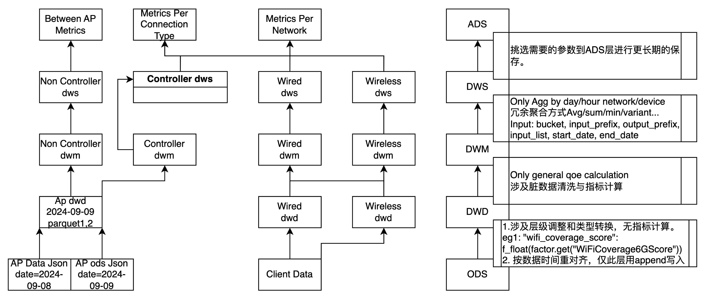
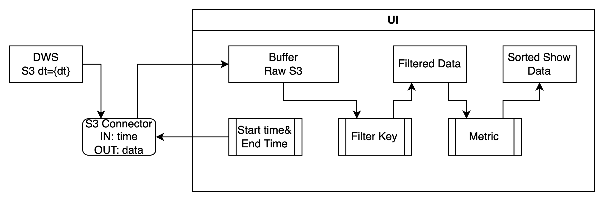
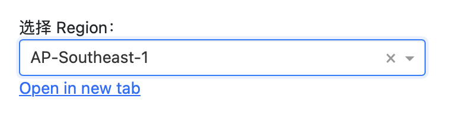

时间选项使用的是UTC时间

对于亚太区，可大致为UTC+8，对于美区大致为UTC-5。

有两个维度，Per Controller，Controller-Agent之间的数据。

指标展示：

backhaul的rssi和linkrate

有两张表，by network

ODS-DWD-DWM-DWS-ADS

|      | 数据来源                          | 实现细节                                                     | 函数入参                                                     | 存储                                                         |        |          |         |                 |
| ---- | --------------------------------- | ------------------------------------------------------------ | ------------------------------------------------------------ | ------------------------------------------------------------ | ------ | -------- | ------- | --------------- |
|      |                                   |                                                              |                                                              | 时间分区                                                     | 压缩   | 格式     | 时间    | 路径            |
| ODS  | 使用微服务从kafka拿到的打包数据， | 打包方式为每K(1000)条打包一次，数据到达kafka后最迟M(120000)毫秒打包一次 |                                                              | 按第一条kafka消息时间                                        | gz2    | json/txt | 32Days  | /source/qoe-raw |
| DWD  | 对ODS数据解析建模，指标计算       | 涉及层级调整：将一条AP数据拉成多条单频段数据；类型转换：使用int/double代替string； |                                                              | 按每条消息kafka时间，因此同一天的ODS会有两天的DWD，数据写入使用Append。 | snappy | parquet  | 32Days  | /qoe-raw/dwd    |
| DWM  | 清洗脏数据和进行指标计算。        | 如需计算sta数目并写入每个sta行，则放在DWD进行；如需由sta的参数a1,a2计算a3，则在DWD进行 |                                                              | 不分时区                                                     | snappy | parquet  | 32Days  | /qoe-raw/dwm    |
| DWS  | 将数据聚合供ADS使用               | 使用day/hour network/device将多行数据聚合成一条，数据聚合形式使用：Avg/sum/min/variant | bucket, input_prefix, output_prefix, input_list, start_date, end_date | 不分时区                                                     | snappy | parquet  | 62Days  | /qoe-raw/dws    |
| ADS  |                                   |                                                              |                                                              | 按照用户时区                                                 | snappy | parquet  | 365Days | /qoe-raw/ads    |

设计原则：每一层只采用上一层的表

ODS: json数据，

# 前端设计

圆角矩形：函数

方框：数据

条纹方框：前端可选框

### 区域选择

由于构建的是前后端一体的架构设计，三区部署，因此不同区域通过跳转链接进行关联。

### 原始数据选择

原始数据有三张原型表按hour/day聚合的表

每个网络分连接方式（2.4/5/6/ethernet/all）的细节表

总览表

controller-agent之间关系表

因此在选择起止时间，时间粒度，指标维度之后表应该唯一确定。

需要注意的是：Connection-Type在提供选择的时候因技术原因也可能访问不同数据源，因此构建变量存储其对应路径，避免重复读取相同数据源。

### 绘图过程

1. 使用Time压缩会绘制柱状图，使用Network压缩维度绘制折线图。
2. 选择排序指标和百分位后，会将当前数据源按照排序指标进行排序。
   1. 如果是Time压缩，会获取每个网络Error rate排名在50%-60%的情况的数据源，然后查看所有网络该指标下的分布，实际意义是用户家庭网络质量在50-60%情况下的分布。
   2. 如果是Network压缩，会获取每个时间点Error rate排名在90%-100%的情况的网络，将网络数据连成线，实际意义是当前时间最好的那批网络的质量。

