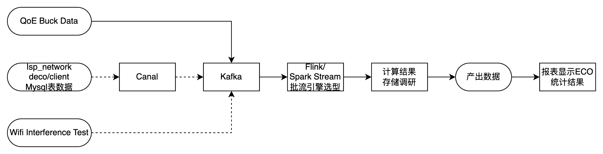

# 1. 前言

## 1.1. 项目简要说明

在此简要描述项目背景、需求。可参考立项报告或软件开发任务书，进行概括或补充。项目一般对应一个完整的系统，如IoT云。

## 1.2. 任务概述

| 模块            | 任务详情                       |
| --------------- | ------------------------------ |
| ECO-INPUT-001   | Wifi-Interference-Test结果保存 |
| ECO-INPUT-002   | Isp-Network-Deco表同步         |
| ECO-Process-001 | Kafka数据生成计算结果          |
| ECO-Process-002 | 计算框架选型                   |
| ECO-Process-003 | 持久化选型                     |
| ECO-Process-004 | 报表平台选型和搭建             |

说明本任务是项目的全部，还是项目的子模块，是新设计模块，还是对原有模块或代码的修改，等等。任务一般对应模块，如IoT云安全模块。

## 1.3. 可用资源

可选，说明不需要重新开发的可利用资源，如现成的模块、控件和软件等。

## 1.4. 术语定义

列举本文所用的专门术语的定义和英文缩写词的原文及解释。注意，术语之间如有引用关系，被引用者列在前面。

要求文中所有陌生术语在此均有描述。

## 1.5. 参考资料

参考资料指概要设计中引用的开发流程文档或规范，或者有利于加深概要设计理解的资料（读者必须能容易获得）。请在下面列出资料，这些文件资料的标题、作者、编号、版本号、发表日期和出版单位或资料的来源：

n 经批准的开发文档；

n 引用的软件开发标准和规范；

n 说明本文档中引用的其他文件和资料；

n 对于内部资料可以直接附上链接。（参考资料的外网网络链接必须有文字描述，例如“Go语言官方文档：https://www.xxxx.com/article/doc”）。

# 2. 需求分析

# 3. 原理概述

本章分析任务的重点原理，如协议、算法等等，如果采用特殊框架组件、语言等（例如Vertx、Go），给出了详细的原理介绍和采用的理由。如果需要原理概述，本章为概要设计的重点内容。不需要时删除本章。

注意，原理不是实现的结果，而是实现的依据。如果属于协议设计，要说明为什么要这样设计。移植型的任务，原理着重讲移植要注意的平台差异。修改/增加型的任务，原理着重讲修改或增加的部分。

以下小节如果内容较多，请扩展成独立的一章。

## 3.1. 协议分析（或设计）

本节分析要使用并实现的协议标准（如MQTT协议），或根据需求设计新协议（如IoT云与设备端交互协议）及设计的出发点和思路。不需要时删除本节。

### 3.1.1.  协议描述

概述协议实现的目标、原理等。

### 3.1.2.  协议数据格式

协议使用的数据格式，如网络协议的帧格式。

### 3.1.3.  协议设计

描述协议的以下方面：

n 协议收发包的方式，如使用socket还是其他接口，是否阻塞，等等。

n 协议模块与任务（或线程）的关系，如果涉及多任务，说明任务间通信的方式。

n 双方或多方进行协议通信的互交图、状态图或其他形式的描述。

## 3.2. 重要算法与数据结构

本节分析要实现的重要算法（如IoT云规则引擎算法设计）、相关数据定义以及算法依赖的数据结构。

# 4. 系统架构描述

数据流转

## 4.1. 概述

表同步

需要从isp_network_deco 同步ip和数据

使用ip直接转化到

概要地叙述模块划分的原则，如通过对需求进行分析得到几类功能，从而相应地将系统分成几个模块。

注意：这里说的模块，指的是本任务之下划分的模块。如果本任务是产品的一个模块，那么这里的模块实际上是产品模块中的子模块。

如果本任务对当前已有模块、数据库有修改，需要完整地提供当前现状地数据，包括影响的模块、接口、数据库的数据。具体指标还需要接口的使用情况，如TPS，延时情况；数据库的读写TPS，数据库数据量等数据。

系统架构设计需要考虑如下内容：

（1）高可用问题

- 高可用：系统架构是高可用的（分布式的），不存在单点故障。

（2）设备问题

- 考虑了云端和设备端配置不一致问题，比如“设备断网，用户想对设备进行配置”

（3）时区问题

- 时区：考虑了时间相关问题，比如“给美国用户推送报告，以当地时间为准，还是以UTC+0时间为准”
- 夏令时：涉及到具体的时间，已考虑到夏令时变化，且已知悉JRE内置的tzdb时区数据更新问题。

（4）异常处理

- 可自愈：如果中间出现任何异常情况，有修复机制或者自愈机制，且能够保证重要事务的数据一致性，不会出现超卖、用户支付了没有产生订单、重复订单、过期订单、并发订单等问题

（5）监控埋点

- 产品监控：描述了产品的监控方案和指标
- 程序异常监控：描述了程序本身异常监控方案和指标，尤其是线程池等异常的监控。

（6）web相关

- 会话管理：如果是web业务，存在会话机制，已经考虑到CSRF攻击，且对“会话劫持/会话固定攻击”采用了sessionFixation等方式防御。
- HTTP头部：如果是web业务，描述了对X-Frame-Options、X-Content-Type-Options、Content-Security-Policy （CSP）等安全的防御参数选择。
- CDN选择：如果是web业务，且是“用户App内或者Web端的订阅购买”的页面，必须使用CDN；更新频率太高（如1天1次）的页面不采用CDN
- CDN缓存：是否使用CDN缓存，考虑了no-cache和max-age等策略
- 域名：如果要启用新域名，已提前和产品沟通过；域名符合业务云域名规范（商用证书、自签证书、环境的前后缀等）。

（7）架构参考

- Tapo/Kasa的兼容性：考虑了架构的兼容性，对于已经存在的业务，有做相关的调研和参考。

## 4.2. 模块结构

辅于模块结构图等形式，表述模块的划分情况（根据、命名、结果）和模块之间的关系，说明模块的相互关系是本节的重点。

说明：这是设计中对复杂系统“分而治之”的过程。注意“分”的合理性，并通过对模块关系的分析，保持系统的功能完整性。

## 4.3. 模块描述和建模

逐一说明每个模块的基本情况，包括：模块自身的功能；对项目以内或以外其他模块提供的功能；模块的简要流程或算法的名称；模块的重要性；等等。

如果划分的模块有比较复杂的（如存在多个对象），则对模块进行建模：

n 首先介绍模块及其包括对象的功能和属性。

n 其次可以描述对象之间的关系，如成绩管理模块中，学生、成绩、班级等对象的关系。

n 然后可以描述模块的主要流程，如加密过程。

## 4.4. 流程设计

需要详细说明系统运行的相关流程。通常使用时序图进行说明。

绘制时注意包含所有的内部模块和外部资源，外部资源包括但不限于用户（APP或Web）、基础云，数据库，中间件等；每一步需要用序号标识，并且说明需要的参数。

# 5. 任务（或进程/线程）设计

如果本任务需要单独的任务（或进程/线程）或采用多任务（进程/线程）、线程池等，在本章描述任务或进程/线程的使用设计（包括它们与模块的关系）。即使没有增加新的任务或进程/线程，也要描述代码的运行方式。如果涉及中断处理的，同样要说明。

如果有复杂的多线程设计（比如短时周期性任务的时间轮），则描述清楚工作原理。

## 5.1. 原因

说明使用新的任务（或进程/线程）、采用多个任务（或进程/线程）或线程池的原因。

## 5.2. 任务（或进程/线程）内部流程

依次说明每个任务/进程/线程实现什么流程，如果前面已经有流程，指出对应关系即可。

## 5.3. 任务（或进程/线程）间通信

每两个需要进行信息交互的任务，都要说明通信的信息内容、交互方式。

# 6. 数据库及中间件设计

通用考虑：

- 敏感字段加密
- 跨区延迟同步影响，比如数据还没同步过来怎么办
- 是否是在原有数据库上做变动，表结构，数据格式等原有版本是否能兼容
- 是否是在原有数据库基础上修改了数据库的查询，当前数据库是否支持

Mysql：

- 读写分离：考虑了读写分离
- 数据分区隔离：考虑了数据分区隔离问题
- 表名格式正确：表名采用小写字母、数字、下划线
- 字符串显示长度：考虑了utf8mb4带来的默认255字符长度问题，varchar不能超过191
- 金额：金额字段使用decimal类型存储而不是float/double
- 时间固定名称：创建和修改的时间戳名称是ctime和mtime
- 时间类型：时间戳是timestamp / datetime类型，而不是字符串类型
- 访问频率：访问频率是否合理，是否需要加入缓存。

Redis：

- key格式：key格式正确：英文冒号分隔符，a-z、数字、小数点，长度在128字节内
- DB库号：Redis使用的db库号已确认
- 过期时间：必须设置过期时间，或给出清除策略
- 存储量合理：Redis的Set等集合类数据结构存储量是否合理，如果存储量特别大，需要考虑进行哈希拆分。

kafka：

- kafka的参数确认：最大保留时间、最大保留容量、分区数量、预估TPS等，尤其要注意考虑消息保留时间的影响，比如支付类业务未处理的订单消息。

canssandra：

- 读写参数：读写一致性等级对业务事务的影响，比如设置ONE还是LOCAL_QUORUM

## 6.1. 选型

说明数据库的选型及原因。需要结合业务实际情况如数据量、数据类型等说明为什么选择关系型（非关系型）数据库。

## 6.2. 数据库表结构设计

说明表结构，不同表之间的关联，索引设计及做出此设计的原因。

## 6.3. 历史数据归档设计

理论上所有数据都需要永久保存，但考虑到成本因素，一些历史数据可能需要转对象归档存储，如果涉及相关内容，需要详细说明归档设计方案。

# 7. 跨区同步设计

## 7.1. 数据库同步设计

说明数据库同步的方案，并详细分析每项数据是保证强一致性还是最终一致性，对于只保证最终一致性的数据，对用户体验会有怎样的影响，是否需要做到用户一致及其方法。

目前受到政策影响，默认要求必须做分区隔离，如果需要跨区同步，则说明理由，且估算跨区数据同步频率和费用

## 7.2. 业务同步设计

说明业务同步的方案，一般会使用消息通信中间件。

需要说明在数据分区隔离后业务如何跨区访问数据，比如设备数据在aps1，带着设备旅游到了euw1，如何判断并拿到aps1的数据。

# 8. 可靠性设计

## 8.1 SLO设计

设计业务SLI指标，度量业务稳定性和质量。影响用户体验的核心指标必须设计，辅助指标可根据实际情况设计。同时，《监控告警设计》中需要包含对这些指标的监控。

- 以云存储业务为例，视频上传成功率为核心指标，需要按照不同机型、用户地区、运营商、时间点等维度进行观测。

针对SLI设计对应的SLO。一般SLO有两条水位线，低水位为稳态基线，用于表征服务整体可用性、是否有线上异常及停机故障；高水位用于表征服务质量上限，需要在迭代、运维过程中持续优化提升用户体验。

## 8.2 调用链可靠性设计

微服务中涉及大量对其他服务的调用，本节需设计依赖服务故障时，如何保证自身主要功能的可用性（常见手段为服务降级），不影响SLO。当依赖模块恢复后，是否能自动恢复或者需要人工干预。

针对核心流程，常见方案为思考对其他模块依赖的必要性，精简调用链，减少不必要依赖。同时，可考虑增加旁路缓存机制，在依赖服务不可用时使用自身缓存提供降级的服务。

需特别注意不能因为服务自身可靠性设计加重对整体云服务的负担，常见问题：

- 被调用方超时未响应，调用方大量重试且未设计退避策略，加剧被调用方故障
- 服务进行熔断限流后，系统整体处理能力下降，加剧消息堆积，引起更大面积的雪崩

## 8.3 中间件可靠性设计

当中间件发生故障或因常规运维导致停机/延时上涨/数据不一致等情况（具体参见：[数据库与中间件线上运维操作与异常故障影响分析说明](https://rdconfluence.tp-link.com/pages/viewpage.action?pageId=159698065)），如何最大程度保障自身可用性，不影响SLO。应对方法可参考：[面向常见业务异常的最佳实践](https://rdconfluence.tp-link.com/pages/viewpage.action?pageId=128863670)

### 8.3.1 数据库可靠性设计

常见问题如数据库无法访问、数据读写不一致等。

### 8.3.2 消息队列可靠性设计

常见问题如无法写入、消息堆积、消费延迟高、重复消费等。

### 8.3.3 缓存可靠性设计

常见问题如缓存失效、缓存数据丢失等。

## 8.4 容量设计

### 8.4.1 容量规划

针对业务场景设计服务的容量，及对应所需算力资源，注意区分服务自身算力及中间件需增加的算力。

### 8.4.2 容量超限设计

通常情况下有状态服务和中间件无法无限量扩容，因此需针对超过容量规划的场景，设计应对措施，常见如限流（分为服务整体QPS限流和用户账号/设备维度的限流）、服务降级。

常见导致容量超限的原因有：

- 突发流量冲击，如AWS负载均衡器CLB更新、大范围停电后来电等场景下设备集中上报。
- 整点定时任务冲击，如大部分用户都集中设置“晚上24点关闭灯泡”。
- 网络黑客DDOS攻击。

# 9. 数据合规设计

如涉及个人数据（具体参见：[个人信息/数据定义](https://sohoiconfluence.rd.tp-link.net/pages/viewpage.action?pageId=184944256)），在本章描述数据合规情况。

## 9.1. 分区隔离

多区域部署项目需要进行跨区数据存储隔离。

## 9.2. 访问控制

采取相关技术措施，避免出现无授权访问、使用、操作或共享以及对个人数据的滥用。

支持账号注销功能，个人敏感信息将全部被清除。

## 9.3. 加密存储

对个人数据进行加密存储：

- 确保服务端存储加密（数据库、S3和EBS均开启服务端加密）
- 对个人敏感信息进行数据库层面的加密：确认数据库内存储的敏感信息为密文存储（具体参见：[个人信息/数据定义](https://sohoiconfluence.rd.tp-link.net/pages/viewpage.action?pageId=184944256)）
- 根据 [日志脱敏规范](https://rdconfluence.tp-link.com/pages/viewpage.action?pageId=68558027) 梳理需要在日志中进行脱敏的字段及脱敏方式。

## 9.4. 加密传输

对个人数据进行加密传输：应使用HTTPS对通信进行加密，应采用TLS（1.2及以上版本）传输协议的安全加密套件。

# 10. 接口概要设计

本章的接口指提供给其他模块调用的接口。如果需要给其他模块或对外提供接口，在本章说明，否则删除本章。

接口的设计要与使用模块的设计人进行协商。要注意完整性（能实现所有需要的功能）和易用性（不能让使用者需要经过复杂的准备或步骤才能调用）。

接口的定义需清晰明了，达到对外提供open API的水准，外部人员根据接口定义便能完全理解；不允许隐含开发过程中通过口头、邮件等方式约定的默认涵义。

## 10.1. 概述

说明接口设计思想。要说明是否达到完整性，给出充分理由。

## 10.2. 接口分类与功能

接口设计，包括接口的分类及功能说明，大致的输入和输出，等等。如果接口提供给不同模块使用，或接口分不同的功能，要进行分类并说明。

如果一些对外功能需要调用若干个接口的组合才能实现，请说明。

本章节请在YApi上编写，并附上链接：[https://yapi.rd.tp-link.net。](https://yapi.rd.tp-link.net./)

内部接口均为gRPC，如果不是，需要给出理由。

针对每一个接口会返回的所有错误码及其含义，需要详细说明。

## 10.3. 兼容性说明

云服务内部调用的接口，在设计修改时需考虑与上下游微服务的兼容性，如果不向后兼容旧版本，需要多个服务同时更新，且需要考虑更新时可能会存在新旧接口并存的情况，是否会引发问题。

面向APP或设备端的外部接口（推动消息），修改时必须做到向后兼容旧版本接口，否则会造成存量的设备、APP无法使用。

# 11. 用户支持设计

可选，需求如果包含用户支持设计需求，或者在概要设计阶段发现一些异常场景，需要赋能给技术支持，则需要在此包含这部分设计。

# 12. 用户界面概要设计

可选，如有用户界面（包括GUI和CLI），在本章描述界面设计，否则删除本章节。先说明界面的关系，再对每个主要界面进行说明。

## 12.1. 界面组织

说明界面设计的指导原则。用图表描述不同界面间的组织关系。

## 12.2. 界面设计

对主要界面进行设计。

# 13. 开发环境、测试环境及部署环境

## 13.1.  测试环境

测试所需环境。如网络拓扑、测试设备等。

## 13.2. 部署环境

针对公有云（如AWS）的部署，说明需要使用的IAAS、PAAS、SAAS服务资源。

明确部署的云服务商（内网、AWS、阿里）

需要考虑是否可以使用SPOT实例减少成本，通常无状态应用都可以。如果使用，需要考虑是否会对业务一致性带来影响（可重试、幂等），因为可能请求处理到一半就被关机了。

## 13.3. 成本预算

针对部署在公有云的服务，根据当前的业务量预估成本，列出详细的费用预算以及后续业务量增加时可能产生的费用预估，例如产品提供了预估上线用户量，或者按照10K、100K等预估不同用户量消耗的机器资源。