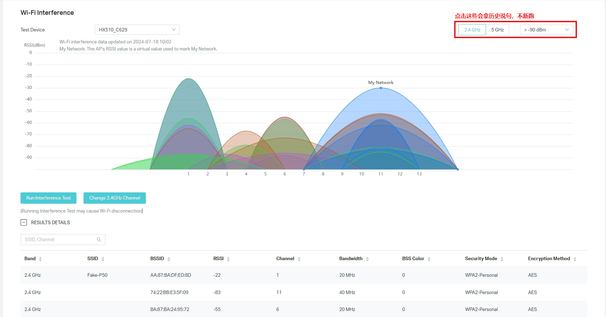
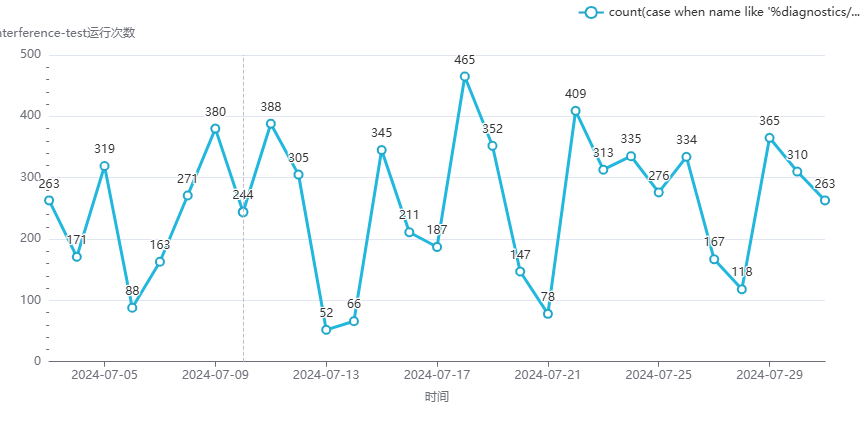
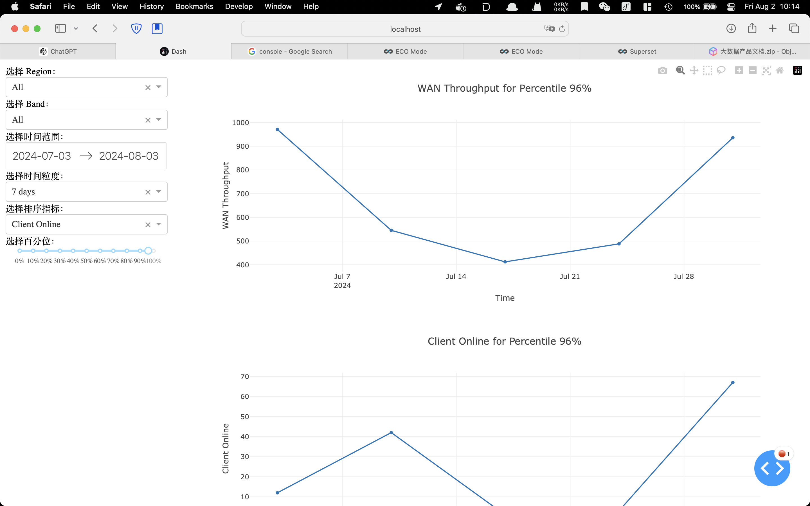

接上次会议后的开发内容做相关同步

## 输入

### QoE数据

设备上报网络质量数据（已读取）

### Tauc业务表

1. 城市信息，机型编号（推进生产数据离线脱敏）
2. 如仅需大区信息以及机型是二频还是三频设备则可以只用现有逻辑

### Wifi-Interference Test：

设备频段扫描结果（阻塞：数据暂未落库，此项数据收集需明确安全合规问题）

此外，统计了tauc生产环境，过去一个月的WiFi-Interference-Test接口的运行次数。大致结果为工作日300次，周末50次。

## 输出Demo

以下数据暂时使用Mock生成的统计数据

### 数据探索系统：提供交互式平台主观感受用户画像

示例场景：按照时间颗粒度对每个用户wan口带宽和客户端数量做平均，然后按客户端在线数量排序，展示每天客户端数量排在第96%的客户家的wan口带宽和客户端数量。

### 数据看板系统：通过拖拽的方式映射到sql生成静态报表

示例场景：指定区域某一时间所有用户的WAN_throughput平均值，然后画这个区域的wan口带宽随时间的变化关系。

