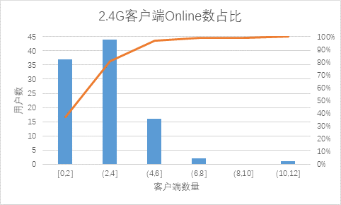
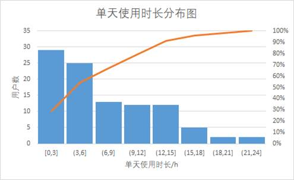
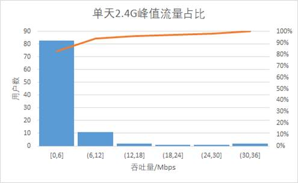
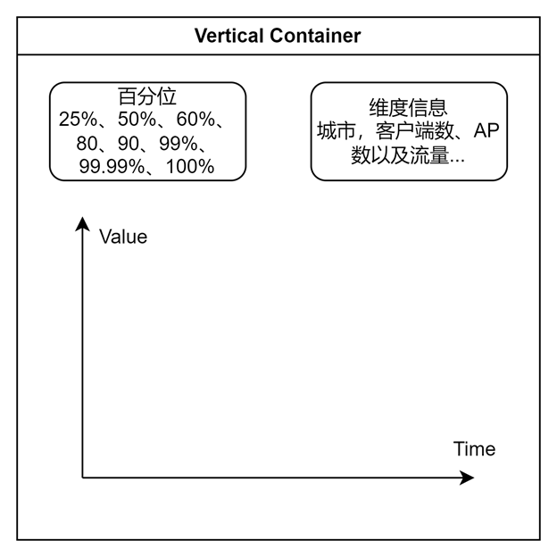

# 1. 全局说明

## 1.1. 术语定义（必须）

一些行业术语，提前解释便于达成共识；

|                        |                                |
| ---------------------- | ------------------------------ |
| ap/Access Point/接入点 | 路由器设备                     |
| sta/Station/站点       | 非路由器的终端设备，连接到ap上 |
| bss/Basic Service Set  | ap向多个sta提供服务            |
| client/客户端          | 终端设备，TAUC语境下和sta相同  |
| agent                  | ap的一种，TAUC语境下从设备     |
| controller             | ap的一种，TAUC语境下主设备     |
| 网络                   | 多个ap构成一个网络             |


## 1.2. 默认规则（必须）

1. QoE数据是设备端通过调用Tpuc-Event-Frontend的http接口上报，该微服务讲上报的数据进行解析并通过Kafka生产的形式广播。
2. 针对ap表的Device.1.Radio.1字段，可视作某台ap设备某个频段的值。
3. 针对client表的Device.2.Radio.2.BSS.2.STA.2字段，可视作STA.2设备挂在Device.2的5G频段的第二个BSS上。
4. 针对QoE上报的AP和STA数据，可以在时间误差不超过10秒的相同"ControllerID":"60:A4:B7:83:36:F1"进行绑定。


# 2. 需求背景

## 2.1. 现状（必须）

描述当前需求方的诉求及待解决的问题

## 2.2. 方案及规划（必须）

提供的解决方案概述

## 2.3. 目标（必须）

期望能取得多少指标提升

# 3. 产品描述

## 3.1. 产品结构图（必须）

产品架构

## 3.2. 功能结构图（必须）

功能模块结构

## 3.3. 核心业务流程图（可选）

整体各核心功能间的业务流程图及操作流程图

# 4. 功能需求

## 4.1. 需求说明（必须）

所属页面、模块、需求综述、备注等

本部分是总括，下面的4.2.-4.7.是每个功能点都需要展开描述

## 4.2. 前置条件（必须）

操作该功能的前提要具备什么角色、状态

## 4.3. 后置条件（可选）

执行完这个操作后，关联数据的变化、页面跳转

## 4.4. 界面交互（必须）

1. 界面展示：页面原型图；页面展示的每一个数据来源，不同状态及限制下的展示形式；点击按钮或链接的跳转要求
2. 字段规则：是否必填、字段类型及限制、提示等要素

## 4.5. 业务流程（可选）

1. 主流程：讲清楚用户和系统的交互主流程，使用活动图、ER图等手段
2. 子流程：在主流程的基础上，梳理出各种分支流程和异常流程
3. 业务规则：流程判断的依据

## 4.6. 权限控制（必须）

license还是VAS，Admin用户还是普通用户，权限组怎么设计

## 4.7. OpenAPI需求（必须）

OpenAPI是否需要同步支持

# 5. 功能Tips

## 5.1. 功能使用指引（必须）

对功能主题及使用流程的简单介绍，指引用户使用功能

# 6. 兼容需求

## 6.1. 云端版本兼容（可选）

新旧功能之间存在巨大差异时兼容方案

## 6.2. 终端型号兼容（必须）

Aginet（TR069、TR369）**、**Deco ISP固件、Deco零售固件

## 6.3. 终端版本兼容（可选）

不同设备固件版本

# 7. 业务风险

## 7.1. 项目风险（可选）

政策风险、隐私风险、工期风险等。对项目方案可能会带来的负面影响

# 8. 数据需求

## 8.1. 隐私数据要求（可选）

存在涉及隐私收集的需求（比如用户地址、手机号、邮箱数据是否要保存），确认该需求符合GDPR等隐私保护协议

## 8.2. 统计报表需求

### 8.2.1 事实表

总体需求的8条，经沟通：前六条针对的是Controller级别，第七条希望得到Agent之间的关系，第八条为网络诊断数据的挑选。

> 1，每天无线客户端Online最大数量，且此时2.4G/5G/6G频段各有多少个客户端，有线客户端数量。
> 2，客户端Online最大数量时，所有无线客户端（分频段）协商速率，有线客户端协商速率。
> 3，客户端Online最大数量时，所有客户端（分频段）信号强度以及分布情况。

前三条对于客户端Online最大数量的极值情况，可以使用

|                                          | 表来源 |                                            | 维度             |
| ---------------------------------------- | ------ | ------------------------------------------ | ---------------- |
| 无线客户端数量                           | ap     | X_TP_AssociatedDeviceNumberOfEntries       | Per Ap Per Radio |
| 无线协商速率                             | client | EstMACDataRateDownlink                     | Per Sta          |
| 无线信号强度                             | client | SignalStrength                             | Per Sta          |
| 有线客户端数量                           | 无     | 应该可以在client表分频段有线无线统计数量   |                  |
| 有线客户端上传速率(mb/s)                 | client | X_TP_Ethernet.AssociatedDevice.1.UpSpeed   | Per Sta          |
| 有线客户端下载速率(mb/s)                 | client | X_TP_Ethernet.AssociatedDevice.1.DownSpeed | Per Sta          |
| 有线客户端与设备之间的有线链路速率(mb/s) | client | X_TP_Ethernet.AssociatedDevice.1.LinkSpeed | Per Sta          |


注：根据下述规范，无线协商速率使用EstMACDataRateDownlink。

```
/**
 *  fix 修复历史bug
 *  EstMACDataRateDownlink 单位为mb/s，LastDataDownlinkRate单位为kb/s，
 *  当LastDataDownlinkRate无法获取时会使用 EstMACDataRateDownlink乘以1000转化为kb/s替代
 */
```


>4，各频段每天TRANSMITTED RATE和RECEIVED RATE的数值（15min统计一次）。
>5，各频段每天Airtime Utilization、Congestion、Rate、Noise、Packet Error Rate（15min统计一次）。
>6，每天WAN Throughput统计（15min统计一次）

选用字段均来自于ap表的controller设备数据，使用QoE数据。

| 需要字段            | 设备端上传字段                                               | 维度             |
| ------------------- | ------------------------------------------------------------ | ---------------- |
| TRANSMITTED RATE    | X_TP_AverageTxRate                                           | Per Ap Per Radio |
| RECEIVED RATE       | X_TP_AverageRxRate                                           | Per Ap Per Radio |
| Airtime Utilization | X_TP_QoE.Factor.WiFiCoverage2GScore, X_TP_QoE.Factor.WiFiCoverage5GScore, X_TP_QoE.Factor.WiFiCoverage6GScore | Per Ap           |
| Congestion Rate     | X_TP_Congestion_Rate                                         | Per Ap Per Radio |
| Noise               | Noise                                                        | Per Ap Per Radio |
| Packet Error Rate   | X_TP_ErrorsPkt, X_TP_PacketsSent, X_TP_PacketsReceived       | Per Ap Per Radio |
| WAN Throughput      | X_TP_QoE.WANBandwidth                                        | Per Ap           |

注

1. Packet Error Rate=X_TP_ErrorsPkt/(X_TP_PacketsReceived+X_TP_PacketsSent)*100%，这个公式孙浩和彭天翔均无法理解，因为按照常识分母只需要X_TP_PacketsSent即可。因此一并返回给需求方处理计算，此外给设备端提Bug。
2. 经沟通，设备端上报QoE文档需要更新，ErrorsPkt实际上是tx rx丢包数量之和，但按和计算在通信上没有任何意义，也建议修改。


> 7，单次统计Agent和Controller的RSSI及协商速率

选用字段来自ap表的agent设备数据，按照彭天翔的说法，controller没有这个字段。

|          |                                 |                  |
| -------- | ------------------------------- | ---------------- |
| RSSI     | BackhaulSta.X_TP_SignalStrength | 需将SS映射成RSSI |
| 协商速率 | BackhaulSta.X_TP_LinkRate       |                  |


>8，用户主动扫描（WiFi Interference Test）的结果，包括（干扰SSID数量、每个干扰对应的RSSI、每个干扰对应的信道及带宽）

本部分为TAUC-Network维护，对应接口为@RequestMapping("/v1/remote/networks/{masterDeviceId}/diagnostics/ap-survey")，如需提取，需要联系覃伟安排人力。

```
https://aps1-tauc-api.tplinkcloud.com/v1/remote/networks/spiAtEnxKJxf7vlcoV2RyhebXOW3oxrviodvct5nOShYhjqJrBe5yju95RWOhRPC/diagnostics/ap-survey/rssi/threshold?deviceId=spiAtEnxKJxf7vlcoV2RyhebXOW3oxrviodvct5nOShYhjqJrBe5yju95RWOhRPC&band=5GHz&rssiThreshold=-90
```

对应的函数为

com/tplink/shd/tauc/core/network/domain/manage/tr/remote/manage/apsurvey/GetRssiByThresholdService.java

注：此处嵇康的生产账号的吴明HX510有个很奇怪的Bug，沈毅的设备是不管怎么改每次扫描都是2.4和5都有，但吴明的设备你先跑一次会发现俩频段都有，再change 5Ghz的channe跑只拿到5GHz的，再change 2.4GHz的channel跑还是只拿到5GHz的。

注2：这个端口调用的两个值疑似未使用。

这个接口返回的aplist结构如下

```JSON
{
    "id": null,
    "band": "5GHz",
    "ssid": "",
    "bssid": "9A:87:BA:24:95:73",
    "channel": 108,
    "extensionChannel": "",
    "bandwidth": "160MHz",
    "bssColor": "0",
    "signalStrength": -73,
    "securityMode": "WPA2-Personal",
    "encryptionMode": "AES"
}
```

数据格式如上，需求方需要band，channel，bandwidth和signalStrength数据，可以直接将该aplist传kafka的方式同步到数据仓库。

展示结果分两部分：

第一部分包括该用户该次信道扫描的用户数据，包括但不限于用户id，国家与地区，扫描时间，使用设备等。

```
{
	
    "id": null,
    "country": US
    "timestamp": 12345678910
    ...
    "interference" ：{
    	"2.4GHz": [
    		{
    			"ssid": "",
    			"bssid": "9A:87:BA:24:95:73",
    	    	"band": "5GHz",
    			"channel": 108,
    			"bandwidth": "160MHz",
    			"signalStrength": -73,
    		}
    	]
    	...
    }
}
```


### 8.2.2 维度表

> 覆盖所有用户。如无法覆盖所有用户，也需要能覆盖到典型用户和边界用户，边界用户是指客户端数、AP数以及流量需求极小和极大的用户，保证选取的用户具有代表性（能代表所有用户）。除流量外还需要考虑地区，需要覆盖美国欧洲等发达地区，也需要覆巴西、南美等欠发达地区 


```
{
	// 维度信息
	"userId": "xxxx", // 唯一标识一个用户，打码加密, TAUC保证同一个用户加密后的userId是不变的
	"model":"EX920、HX716Pro、EX1110、EB810", // 机型，以主设备为准
	"date":"yyyy-MM-dd", // 日期
    "maxOnlineCientCnt":20, // 当天客户端Online最大数量(无线+有线）
	"maxOnlineCientCnt2G4":5,
    "maxOnlineCientCnt5G":5,
    "maxOnlineCientCnt6G":5,
    "maxOnlineCientCntWired":5,
	
	// 信息讨论
	是否需要增加networkId和设备Mac地址等加密项。
	是否需要增加比如运营商种类（即isp id）和带宽（WANBandwidth）信息，以及其他维度信息，比如可能联通和电信的200M，1000M结果和效果完全不一样。
	
    // 城市信息
    "country": US
    "city": US
    "developed": true
    // 流量与ap-sta数量
    "WANThroughput": 123
    "num_sta": 10
    "num_ap": 2
    
    "timestamp": 12345678910
    
    
    "clientDetails":[   // 当天客户端Online最大数量时的客户都明细
		{
			"clientId": "xxx",  // 唯一标识一个用户，打码加密, TAUC保证同一客户端加密后的Id是不变的
			"connectType":"2g4/5g/6g/wired" ,
			"rate": 1000, // 单位kbps
			"rssi":-75, 
		}
	]
}
```

注1：跟地区有关的信息：ip，找到主设备对应ip转化到经纬度和城市，拿到城市信息

	注2：IP获取：根据QoE上报的"ControllerID":"60:A4:B7:83:36:F1"去查询isp_network_deco表，然后找到这个网络对应的ip信息。

注3：机型信息和ip一样，都是从deco表里查。


针对需要绘制图像的需求

## 8.4. 数据统计

### 8.4.1 前序需求绘图

【客户端数量统计】【用户使用网络时长分布】【流量使用情况】



采用极值数据



模糊时间概念



采用极值概念

### 8.4.2 当前需求绘图

> 如沟通，我这边主要需要如下数据去更新当前的测试拓扑/流量模型，99.99%的用户家里5G客户端总数在30个以内，99.99%客户端信号强度再-90dB以内，借由这部分数据更新我们的UES、Penthouse等环境的客户端数量频段分布流量大小等等。
>
> 统计用户占比时可按照25%、50%、60%、80、90、99%、99.99%、100%来

数据使用方式：

1. 根据上述维度对数据表进行排序，然后获取不同百分位的用户情况。
2. 你可以去查巴西客户端数在50%百分位的时候，家庭网络流量随时间变化的情况，下图两个为可选框。



**有涉及数据报告的需求（比如周报、月报、季报、年报等），确认UTC时区、推送机制等需求**


### 8.4.3 图片绘制规划

目前使用到的数据是三维数据，per network，per timestamp以及指标维度。

对网络维度的压缩可以使用维度百分位进行，或规划是用其他方式

对timestamp压缩可以统计求和，以及最大值，最小值。

一个是简单对维度求单一值的方式：使用指标维度的max min avg的方式，如原始需求。

另一个是百分位的方式：使用指标维度排序后的百分位，比如客户端数量50%分位的值，可以压缩网络即统计所有时间上50%客户端数量，也可以压缩时间，即统计一天之中一个网络客户端数量排50%的时候的各项指标。

其实这两个方法是统一的，横坐标要么是网络要么是时间。


注：不确定是否需要提供多个维度排序功能。

# 9. 性能需求

## 9.1. 性能要求（可选）

预计需要支持多少用户/设备量，QPS等

# 10. 监控需求

## 10.1. 监控要求（可选）

需要监控哪些接口或行为，当出现预期外异常时，告警至相关人员处理

# 11. 灰度需求

## 11.1. 灰测方案（可选）

上线后分人群逐步开发功能，或者针对不同分组对照分析

# 12. 法务需求

## 12.1. 法务说明（可选）