# plume的qoe展示

非常正常，按概览，ap，sta，wan口

## 概览

概览展示qoe给分，ap和sta各一个分数，这个分数其实也没什么实际意义。

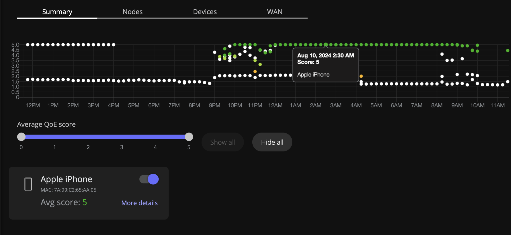

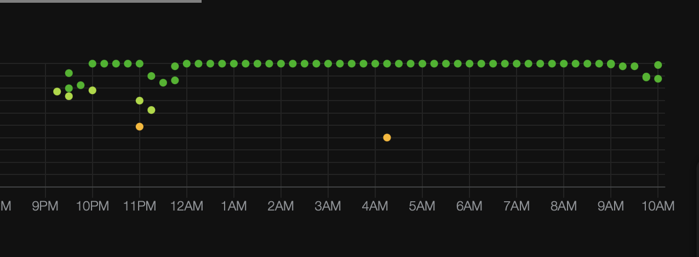

具体而言不太理解为什么iPhone手机会同一个时间出现三个点（MAC: 7A:99:C2:65:AA:05）

然后average qoe score只能筛选在线设备的avg score，离线设备即便qoe得分avg=5也不显示。

然后在线设备和离线设备没有很明显的区分。

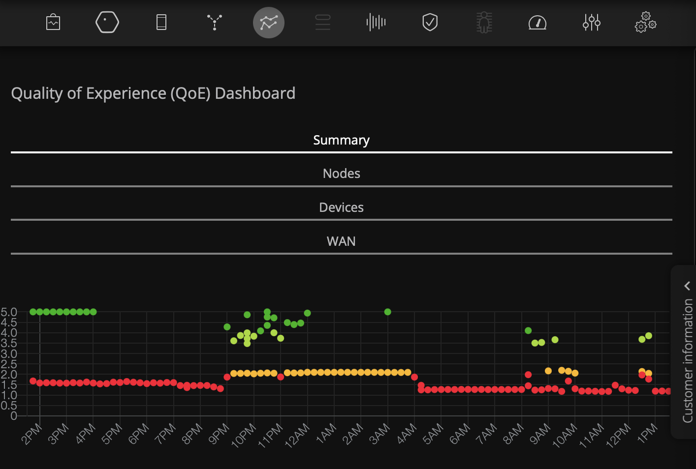

然后短屏的交互比较难看。

## Node

这个部分鸡贼的只显示controller-agent链路中agent的得分。

ap和sta的有线部分plume都没有做显示，而这些数据我们是有的。

ap显示每个路由器设备端指标信息，对应我司的ap-data

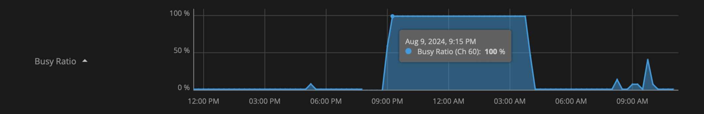

这两部分评分没有太多实际意义，对应的是休息时间，然后要说明休息时间是channel繁忙和信号差的不太合适。然后这里plume也不太能区分开radio和channel的名字。

但另外一方面，他们所有的图，一般曲线断开都是说明做了信道切换，很直接。各个浅蓝色绘图的指标上都会带上channel信息，也会显示出信道改变。但最底下predicted throughput没有显示这一特征，可能是因为开发浅蓝色的开发者离职。

并且online和channel和其他曲线没对齐，可能前端也离职了。

数据表示7:30pm和4:15am进行了两次信道切换。

airtime部分，rx为0，tx很小，这些都很奇怪？

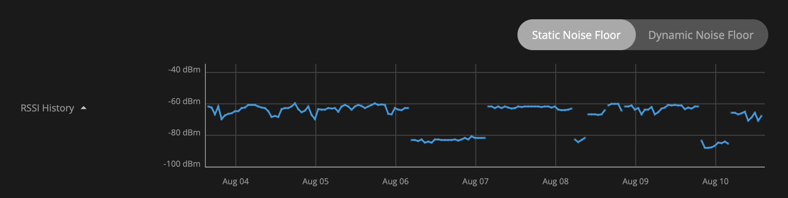

此外：plume的rssi支持使用原始ss和rssi值。static和dynamic

总结而言，就是他们每一个指标上都会带上一个其他的指标，比如online部分会带上controller设备的名字，各个浅蓝色绘图的指标上都会带上channel信息。

### Recommendation Engine

点击后会进入live mode，但是和直接enable live mode没有区别。

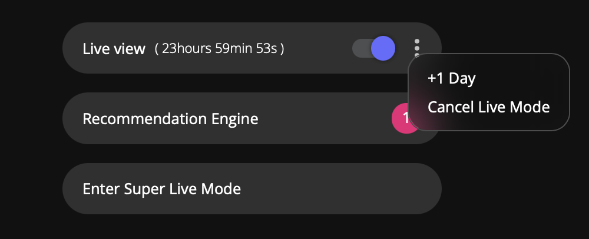

live mode对于plume而言可以直接加1天。

这个切rssi和ss的时候threshold没有改变，应该改变。

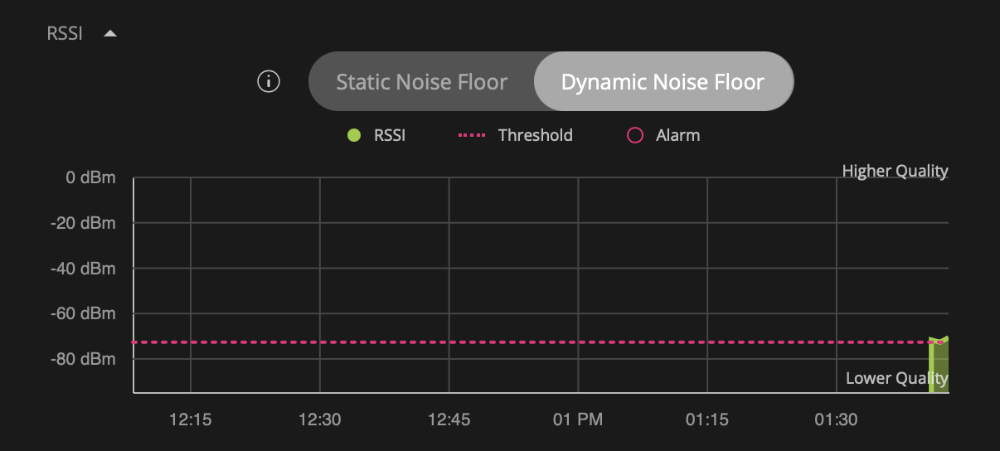

通过向上滑动图片可以实现时间轴放大，下滑图片时间轴缩小。（其实可以多图联动）

### Super Live Mode

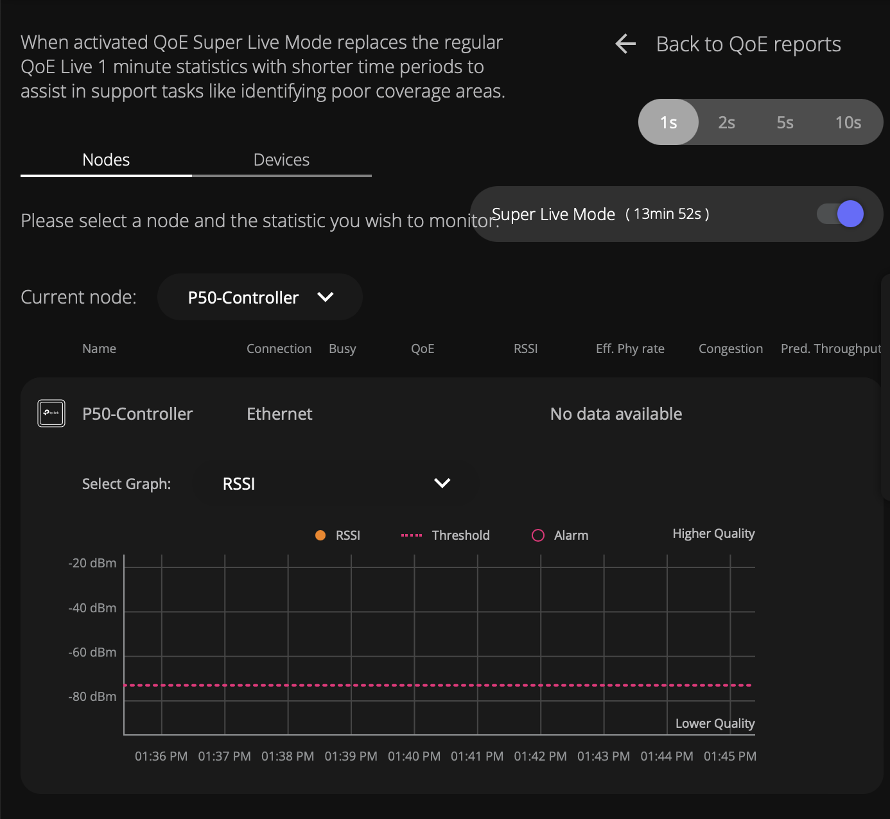

可以看到这应该是一个新功能，半屏时交互没做好

这个功能目前还比较简单，比如筛选出来的设备可能就不在线，然后一次只能看一个设备的一个指标，虽然这些数据在进入super live mode之后都开始收集了，但是只能上传一个。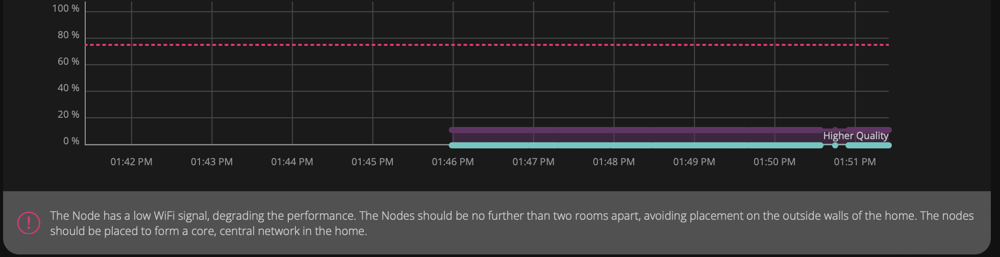

注意右侧的数据中断点，这个设备届时数据链路断链了一下。

然后这个super live mode可以实现1s 2s 5s 10s的采样。

然后livemode是一个单独的页面，跟原有数据页面无法交互，但至少退出去之后再重新进来livemode数据仍然存在。

最快1秒1条数据，但目前卡了时间bug，每次都是重新计时14分钟，然后日期可以加一天，但我印象里他们应该没有我们有钱？

## sta

显示每个终端设备端指标信息。

这个图表明

1. ap和sta使用相同的参数，但我们收集的ap和sta参数种类有明显区别。
2. ap切换了两次信道的影响，分别是1/9:00pm切到60/4:00am切到1
   1. 4:15有一次断点，sta原来是60，但是在1和124之间选择了124，但是吴工早上起来之后设备又切换到1。感觉sta不认可信道切换，但是sta真的被使用的时候不得不使用ap切的信道
   2. 可以看出周六早上吴工的sta非常纠结，在9:00-13:00期间有出门的情况下，做了5次信道扫描，甚至包括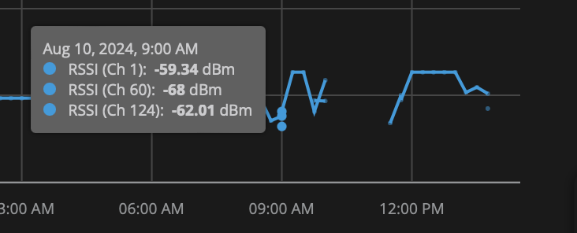
   3. 晚上11:15的时候60信道的rssi非常低，切到6信道，然后在ap数据部分出现尖刺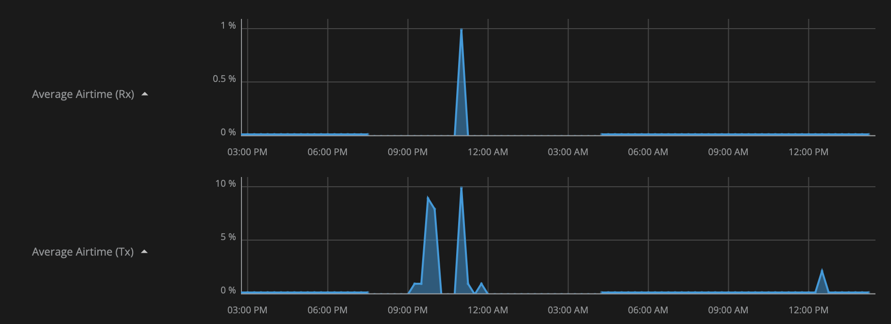

过去24小时出现了两次信道切换

这个如果针对设备端的radio的话，暂时我们应该没算？不过这个算了好像也没讲啥。

然后我其实不理解11:15的这个曲线现象。Weighted QoE Score出现了两段重叠，吴工是下楼丢垃圾了吗？

但我感觉plume通过这些不同的离线状态，可以分类出不同的使用场景：用户起床，用户出门丢垃圾，etc

数据连续性，下图是按天数据，可以看出来，如果用户长时间离开会被认为是空的，但是一两个点数据的掉线不会被认为是真掉线。

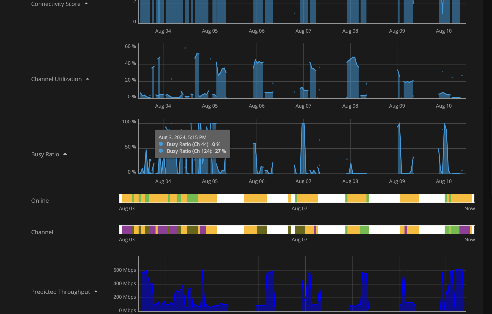

## wan口

显示tx rx方向每天的最大值，虽然我不理解为什么只能显示30天以及最近两周没有数据。

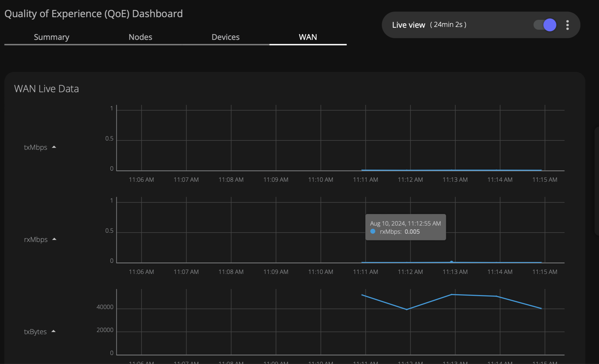

然后开通livemode之后就只显示按分钟测量的这些数值的值，按d/7d/30d就是求每个聚合数据的最大值。

# 本司网络质量相关页面

## Diagnostic模块

部分功能属于Plume的qoe功能，按数据上报也能走15分钟qoe。

目前有三组可以新要组件构建的数据

1. 测速，干扰类型的数据。
2. plume的数据。
3. diagnostic的数据。

## Network Health模块

### qoe上报数据能否将时间间隔限制到15/30/45/60这样的倍数关系？

来让数据统计是倍数关系。

然后因为这部分使用生产庄子的账号，只有下述两个模块有分数，但右侧Wi-Fi- stability是有得分的。

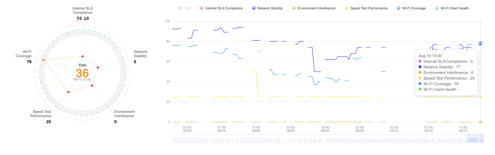

### Wi-Fi coverage

上面是有分数的为什么下面就没有分数了。

然后为什么这个前端画的如此迷惑？

### Network Stability 是否需要？

1. 我是用户的话这个网络有其他业务指标数据我就认为他在线了，不会专门有一个页面显示在线不在线
   1. 而且如果不在线但是给补数据的话不真实意义又在哪？
   2. Mesh组网我是否真的关心每一台ap的在线情况，是否可以把中间一行砍掉
   3. 信息量太低，只有在线和时间点的信息，比如Plume就能显示具体的channel信息，而且长时间断开用户自然就知道设备掉线了。
2. 而且为什么1d/3d/7d的区分是都能显示七天数据，只是通过滑块来控制时间颗粒度？

### Speed Test Perfomance

一个问题是数据太假

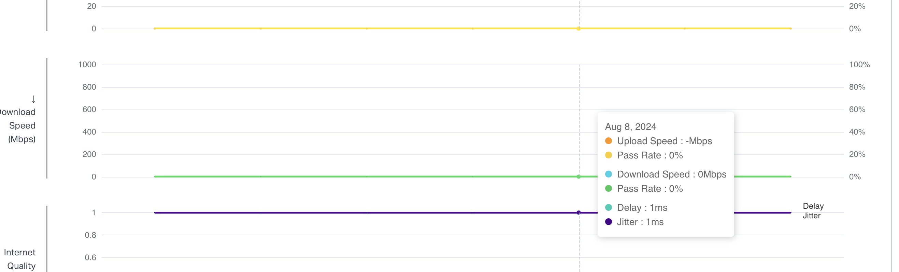

参考竞品以及通信原理，吞吐量基本可以代表速度信息，或者如何理解throughput和data consumption的关系。

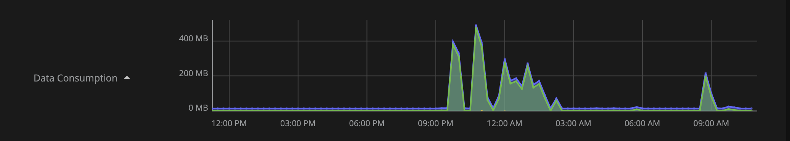

## 每个设备对应的status

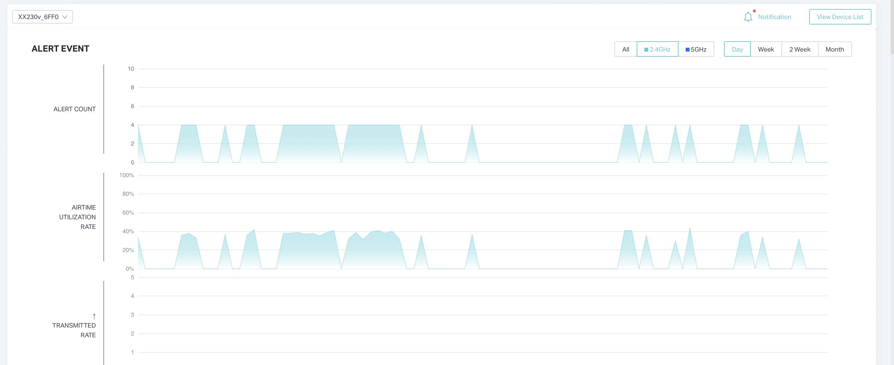

这个比较正常，但是alert event应该和底下的数据不相符。

然后这个部分的显示比plume少，也比现在上报的数据少。

然后对于sta的数据，tx/rx是画在一起的，要分开就都分开画吧。

考虑到ap需要考虑频段信息，plume没区分频段确实我们要做的好一点点？

然后切换不同时间粒度的特效可以修改一下，比较难看。

然后actual speed建议优化成根据取值情况自动调整纵坐标。

然后我还是觉得最好能像plume一样，有一个完整的页面去查看all isp，单网络，ap，sta，四个维度。

## wifi-management

这个是按ISP的统计，plume没有这个业务概念。

但这个图画的蛮离谱的，高度不齐，然后最右边那个五环的五个0我看到的时候笑了五分钟。

然后我不太懂这块的逻辑，就是点day，week，month分别数据源是什么，数据量不相同。

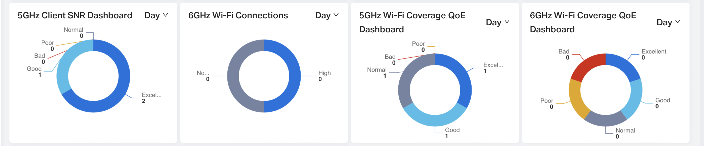

然后29条normal数据点进去是只有1条？

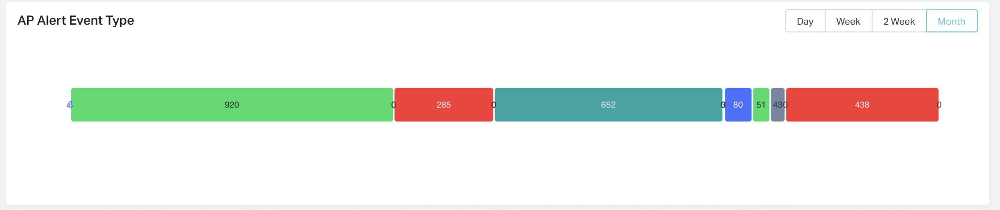

这个模块颜色是不是可以区分一下？

