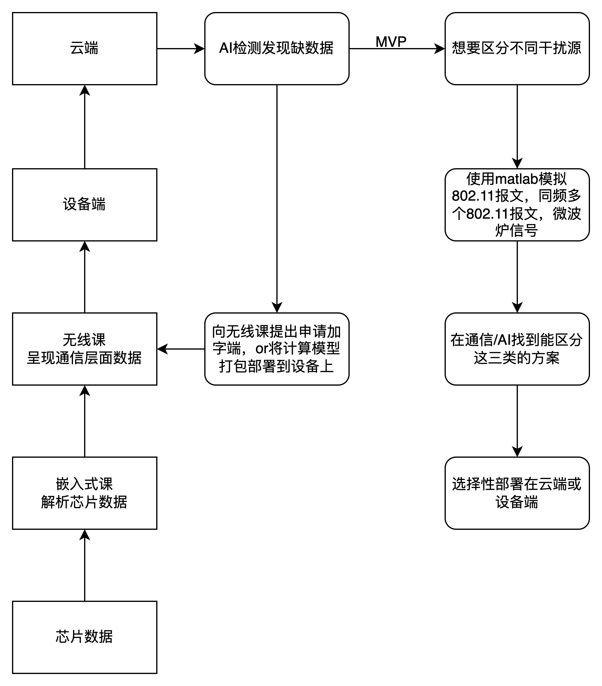

希望获取哪些信息？

1. 确认是找哪个无线课室合作？6楼的还是无线2课还是其他。
2. 希望能开放无线部门的confluence文档权限，探索他们在网络质量诊断上的工作。
3. 和相关课长沟通，确认是否有相关同事在负责网络质量诊断的前沿工作，可能会需要。

## MVP介绍

区分微波炉的电磁干扰和Wi-Fi路由器干扰。

Wifi课程结果：判断信道使用情况有多种方法

1. 物理上解析802.11报文
2. 物理上检查这一个信道上是否有能量数据
3. 虚拟上使用airtime来反映信道的使用情况

前两种是在PHY层，也就是CSMA检测数据。

多轮沟通

1. 和设备端彭天翔/刘园春沟通结果：需要有办法知道芯片上的数据。
2. 找嵌入式部门（前6楼另外半边同仁）直接要芯片数据，看了眼看不懂，感觉是需要找无线驱动。
3. 和无线2课杨二沟通结果：没使用CCA数据的原因是该结果置信度不高。

杨工提到的置信度不高考虑了下述场景

两个干扰源设备都发出了同频信号，在接受侧也无法解析其802.11的报文信息，也就是说无法区分这种情况和微波炉发送能量信号的场景。

但是换一个思路：假设干扰源足够少，那么多这一条数据就能区分开能与不能识别为802.11报文的场景

而这条数据在QoE中是不被上报的，QoE部分原理上只有airtime部分，对应的参数最多只有Wi-Fi Metrics的三个无线驱动上报的打分数值：coverage/availability/airtime utilization

因此可以推断出QoE数据对网络干扰源诊断较弱是因为缺乏足够的数据源。

和李向葵沟通结果

1. 两个干扰源设备都发出了同频信号这种情况如果SNR比较明显还是能区分。
2. 速度信息可以直接从芯片测量，或者是在无线驱动层面拿到平均速度。两者都是直接拿包去除以时间。

因此，大致有下述基本场景是可以直接通过无线驱动新增上报数据来直接获得的

1. 用户网速：AP-STA链路中，网速信息是由AP确定，网速本质上是接受信息的数量除以时间，所以可以直接让无线驱动新增网络通信包大小和完成时间来计算平均网速，并通过设备上报到QoE。
2. 干扰来源：能通过新增字端的形式区分干扰来源是来自网络设备还是微波炉，可能有两个信号源传输同频信号混叠的情况下会导致无法识别。

期待的工作方式：

1. 使用matlab对通信系统，特别是phy层建模。明确哪些二级指标是我们需要的，在仿真模型中，使用qoe和plume的一级指标，是否能使用AI或者通信的方法计算出关心的二级指标。
2. 打通数据链路：
   1. 需要设备端固件支持，能自由的拿到所需字端。
   2. 需要无线部门支持，可能有些字段未到达设备端。
   3. 远期能打通设备端和云端，能将云端计算规则下发到设备端执行。
3. 如果第一步能分析出结果，根据数据量，计算成本以及数据安全决定是将流程放在设备端边缘计算还是云端BI+AI计算。