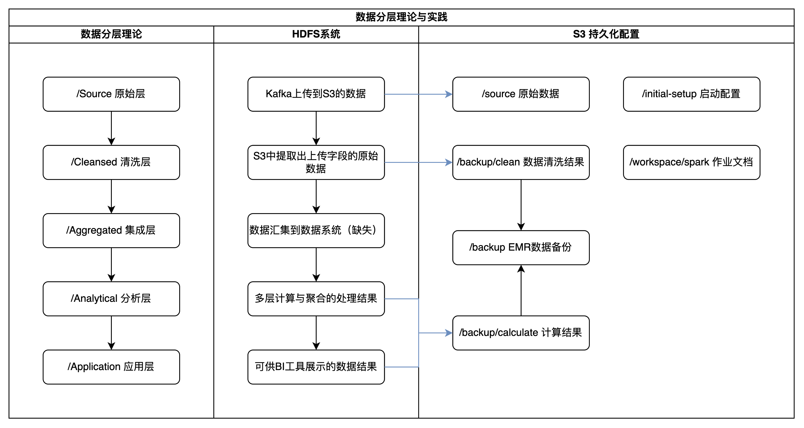

# 一、总览

## 1. 需求 & 背景

数据收集模块考虑到跨部门沟通困难问题，选择新建数据收集链路。和前端欧工禅道核对把该收集流程放在TAUC进行属于合规。

| Mission       | Description                  |
| ------------- | ---------------------------- |
| TAUC-ANAL-001 | 新增Kafka上传S3的链路        |
| TAUC-ANAL-002 | 新增前端跨域失败数据收集链路 |
| TAUC-ANAL-003 | 构建集群分析上报数据         |
| TAUC-ANAL-004 | 构建集群展示分析结果         |

## 2. 总体架构

| Component       | Description                    |
| --------------- | ------------------------------ |
| Data-Collector  | 新增Kafka上传S3的链路          |
| Data-Source     | 存储上报数据和分析结果         |
| Data-Procession | 访问上报数据进行计算并分层存储 |
| Data-Show       | 根据需求展示各层数据           |

# 二、数据收集

## 1. 实现链路

总体实现上新增一条kafka-s3的链路，具体实现上使用Apache Kafka取代EventCenter进行聚合上报。

### 时间问题？

规划上：收集测按照UTC时间来统计，对原始数据进行粗分层。关注点在于信息采集时间，这个在处理测考虑时区和时间点比较合适。

## 2. 存储资源

### Dev

- S3桶：beta-tauc-data-analysis
- 路径：/local
- 下一级格式：/uat/aps1/2024/06/18/messages-x.txt，其中x代表一批kafka消息的第一条的时间戳。
- 文件格式：每个文件每行一个Json，设计最大50行，前端每个文件尺寸约25KB，总尺寸2M以内。

注：是否需要在Kafka，微服务和S3之间找到上传尺寸的最佳平衡点？

### Prd计划名称（可优化）

|          | S3                      | Route                      |
| -------- | ----------------------- | -------------------------- |
| dev      | beta-tauc-data-analysis | /local                     |
| Prd-aps1 | aps1-tauc-data-analysis | /source/front-end-tracking |
| Prd-use1 | use1-tauc-data-analysis | /source/front-end-tracking |
| Prd-euw1 | euw1-tauc-data-analysis | /source/front-end-tracking |

# 三、数据处理

## 1. 数据层实现

### 数据分层设计

### 算法逻辑实现

## 2. 硬件层设计

### 硬件&系统架构

注：安全问题在数据展示部分一同讲解

### 数据处理部分的实现平台

在 EMR 和 EC2 上实现分布式计算的优缺点如下：

|                | EMR实现                                                      | EC2实现                                                      |
| -------------- | ------------------------------------------------------------ | ------------------------------------------------------------ |
| 灵活性         | 提供多种开源组件，无需手动配置，但组件版本和定制化较低。     | 不提供预配置组件，但组件配置流程已熟悉。                     |
| 资源管理与监控 | 内置资源管理、自动扩展、负载均衡和监控功能，简化了资源管理，使开发者无需关心资源配置和回收问题。 | 需手动配置资源管理、负载均衡和监控工具（如 Kubernetes、Mesos、Prometheus 等），需要更多的运维工作。 |
| 成本           | 按需付费，使用方便但长时间运行成本较高。                     | 通过合理配置和管理，可能更具成本效益，但需要更多的运维工作。 |
| 持久化         | 每次启动需要将数据从 S3 同步到 HDFS，增加了启动时间和复杂性。 | 内部机器的数据仍然存在，不需要额外的同步操作。               |

问题：每次启动和结束EMR均需对数据进行同步备份，虽然自动化脚本在短期内进行同步是可行的。

Ref：

1. AWS提供使用S3作为HDFS来源。

https://docs.aws.amazon.com/emr/latest/ReleaseGuide/emr-fs.html

# 四、数据展示

问题：如需持久访问BI工具，则需持久化访问文件管理系统。

## 1. 安全问题

### 网络访问通路

公司内网访问需要满足三个条件

1. AWS EC2节点所在Security Group开通到公司新加坡加速IP的入站规则。
2. 和网管沟通防火墙和白名单等，允许该部分流量访问。
3. 将公司新加坡加速IP写入平台组安全白名单。

进一步：公司内网单节点访问：同时限制账号和ip

### 网络访问配置

1. VPC/Subnet，使用默认选项
2. Security Group
   1. EC2-Superset，开放22到跳板机和上海，8088到上海
   2. EMR Master，开放8889到EC2-Superset
3. 计划Security Group
   1. EMR开放端口在内网调试，可能因非固定机器资源使用起来较为困难
      1. 22端口考虑在dev开放到上海本地，prd开放到跳板机（不确定可行性）
      2. Notebook在测试环境需要开放到上海本地访问，此外Notebook在EMR Studio（需平台组额外权限）也有配置，不确定安全问题。

|      | dev     | dev-规划     | prd     |
| ---- | ------- | ------------ | ------- |
| EMR  | 8088    | 22,8088,8888 | 22,8088 |
| EC2  | 22,8889 | 22,8889      | 22,8889 |

## 2. 权限问题

|                    | 目前-dev                                                     | 计划-dev                                | 计划-prd                              |
| ------------------ | ------------------------------------------------------------ | --------------------------------------- | ------------------------------------- |
| Admin              | 无                                                           | 需要，创建角色与分配权限                | 需要，创建角色与分配权限              |
| IAMRole            | Java Backend/SPBU Backend                                    | 区分开发，运维                          | 区分开发，运维等多类角色              |
| EMR集群作业者      | AWSGlueServiceRole, AmazonELasticMapReduceRole, CustomEMR_IAMPolicy | 使用自建EMR角色，移除AlgorithmTeam配置  | EMR完全操作权限，资源限制桶的访问范围 |
| EMR集群下EC2操作者 | EMR_EC2_Default, AmazonELasticMapReduceforEC2Role, CustomAlgorithmTeamS3FullAccess | 使用自建EMR角色，移除Algorithm Team配置 | EC2完全操作权限，资源限制桶的访问范围 |

注：EMR_Default和EMR_EC2_Default找王涵王工在默认配置上新增AWS managed的AWSGlueServiceRole。两个Custom配置为算法部门添加。

# 五、资源使用

## 实体资源价格估算

|           | 规模              | 成本       | 24H*30  | 优惠                 |
| --------- | ----------------- | ---------- | ------- | -------------------- |
| EC2实例   | 单个t2.micro      | $0.0116/h  | $8.352  | 首年免费             |
| EMR集群   | 最小2个m5.xlarge  | $0.192/h   | $276.48 | 非主节点可以五折竞价 |
| EMR管理费 | 每个机器单独收取  | $0.036/h   | $51.84  | 上个月274H/$62.472   |
| ElasticIP | 2个               | $0.005/h   | $3.6    | 首年免费2个          |
| S3        | 工作日日均Put14条 | $0.005/Put | $1.54   |                      |

**Free tier:** In your first year includes 750 hours of t2.micro (or t3.micro in the Regions in which t2.micro is unavailable) instance usage on free tier AMIs per month, 750 hours of public IPv4 address usage per month, 30 GiB of EBS storage, 2 million IOs, 1 GB of snapshots, and 100 GB of bandwidth to the internet.

## 配置项

- AWS环境：tplinknbu-dev
- S3桶：beta-tauc-data-analysis，link-analysis（废弃，待删除）

|                | EC2 Superset                         | EMR Master                                   | EMR Slave                                    |
| -------------- | ------------------------------------ | -------------------------------------------- | -------------------------------------------- |
| Elastic IP     | Tauc-superset 34.236.129.168         | tauc-analysis 54.163.187.28                  |                                              |
| VPC*           | vpc-d7d864ac(default-vpc-use1)       | vpc-d7d864ac                                 | vpc-d7d864ac                                 |
| Subnet*        | us-east-1b                           | us-east-1b                                   | us-east-1b                                   |
| Security group | tauc-data-show(sg-03416c121412c8d7e) | tauc-data-analysis-dev(sg-0eg443dda170160c0) | tauc-data-analysis-dev(sg-0eg443dda170160c0) |
| EC2 Key Pair   | link-analysis                        | link-analysis                                | link-analysis                                |
| IAM Role*      |                                      | EMR_DefaultRole, EMR_EC2_DefaultRole...      |                                              |

注：带星部分无使用其他操作权限。

# 六、Todolist

1. 评估缺乏权限的配置项（Role/VPC）
2. 系统权限管理（内网IP+账号）或其他方式
3. Notebook及22端口问题
4. 接入业务数据源
5. 数据展示部分成本管理
