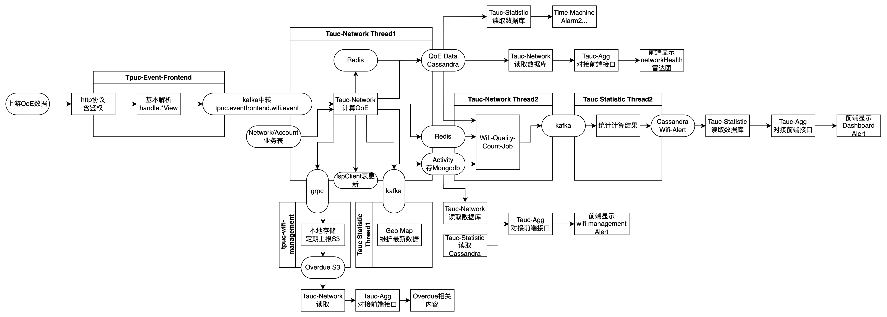
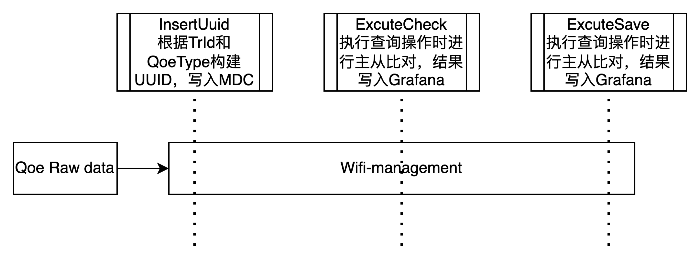
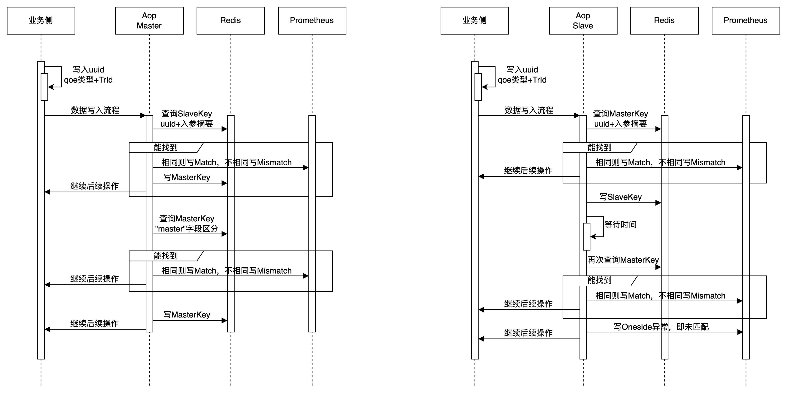

# 架构对比

本次迁移涉及架构优化如下

# 发布流程与状态

## 状态声明

eventfrontend进行流量控制，network于wifi-management各自开关确认是否要将计算数据持久化。

## 回滚状态/原始状态：

| 微服务                            | Apollo开关                 | 值                      |
| --------------------------------- | -------------------------- | ----------------------- |
| tpuc-event-frontend               | QOE_RAW_COLLECTOR_SWITCH   | false                   |
| tpuc-event-frontend               | QOE_BUSINESS_SWITCH        | true                    |
| tauc-network                      | AOP_MIGRATION_KAFKA_ROLE   | master                  |
| tauc-network                      | AOP_MIGRATION_XXL_ROLE     | master                  |
| tpuc-wifi-management              | AOP_MIGRATION_KAFKA_ROLE   | slave                   |
| tpuc-wifi-management              | AOP_MIGRATION_XXL_ROLE     | slave                   |
| tpuc-wifi-management/tauc-network | AOP_MIGRATION_KAFKA_TOPICS | tpuc.network.health.qoe |

## 迁移发布流程：

1. 各微服务发布，确保各微服务取上述值。
2. tpuc-event-frontend.QOE_RAW_COLLECTOR_SWITCH : true
3. wifi-management.AOP_MIGRATION_KAFKA_ROLE: master
4. network.AOP_MIGRATION_KAFKA_ROLE: slave
5. wifi-management.AOP_MIGRATION_XXL_ROLE: master
6. network.AOP_MIGRATION_XXL_ROLE: slave
7. tpuc-event-frontend.QOE_BUSINESS_SWITCH : false

以上操作需要在qps120的情况下中间件无影响的情况下进行pet测试，否则需要扩容。

注：上述5/6需视具体的测试情况而定，因xxljob中涉及到锁以及cache删除操作，主从结构可能不适合。

## 迁移结束状态

| 微服务               | Apollo开关               | 值     |
| -------------------- | ------------------------ | ------ |
| tpuc-event-frontend  | QOE_RAW_COLLECTOR_SWITCH | true   |
| tpuc-event-frontend  | QOE_BUSINESS_SWITCH      | false  |
| tauc-network         | AOP_MIGRATION_KAFKA_ROLE | slave  |
| tauc-network         | AOP_MIGRATION_XXL_ROLE   | slave  |
| tpuc-wifi-management | AOP_MIGRATION_KAFKA_ROLE | master |
| tpuc-wifi-management | AOP_MIGRATION_XXL_ROLE   | master |

# AOP校验

使用AOP的方式对数据进行校验

通过aop及redis尽量避免双写事件，通过下游幂等性减少双写影响。

发布流程上先将wifi-management从slave调整到master，再将network从master调整为slave

## 数据保存校验

### 1. **`master` 角色**：

1. 生成两套 `inputKey`：一套 `master` 使用，一套 `slave` 使用。
2. 检查 Redis 中是否有相同的 `slave` 输入参数：
   - 如果不同，调用 `prometheusHandler.mismatch` 方法进行预警，并继续执行原方法。
   - 如果相同，写redis了，继续执行原方法。
3. 检查 Redis 中是否有相同的 `master` 输入参数：
   - 如果不同，调用 `prometheusHandler.mismatch` 方法进行预警，并返回 `null`。
   - 如果相同，直接返回 `null`。
4. 如果 `master` 参数在 Redis 中不存在，保存 `master` 输入参数到 Redis 中，然后继续执行原方法。

### 2. **`slave` 角色**：

1. 检查 Redis 中是否有相同的 `master` 输入参数：
   - 如果不同，调用 `prometheusHandler.mismatch` 方法进行预警，并返回 `null`。
   - 如果相同，直接返回 `null`。
2. 如果 `master` 参数在 Redis 中不存在，保存 `slave` 输入参数到 Redis 中，并返回 `null`。

## 数据查询校验

根据你的描述，`ExecuteCheckAspect` 的逻辑需要针对 `master` 和 `slave` 两种角色进行不同的处理。我们将分别实现这两种角色的逻辑：

### 1. **`master` 角色的逻辑**：

1. 检查 Redis 中是否存在相同的输入参数。
   - 如果存在且不一致，则调用 `prometheusHandler.mismatch` 预警。
   - 如果不存在，则将输入参数保存到 Redis。
2. 执行原方法逻辑（`process`）。
3. 保存输入和输出参数（`in/out`）到 Redis。

### 2. **`slave` 角色的逻辑**：

1. 检查 Redis 中是否存在相同的输入参数和in/out参数。
   - 如果 `input` 和 `in/out` 都存在且 `input` 一致，则直接返回 `output`。
   - 如果 `input` 和 `in/out` 都存在但 `input` 不一致，则调用 `prometheusHandler.mismatch` 预警，并返回 `null`。
   - 如果仅存在 `input`，则检查 `input` 是否一致，若不一致调用 `prometheusHandler.mismatch` 预警，并等待固定时间看 `in/out` 是否存在，没有则 `oneside` 预警。
2. 如果 `input` 和 `in/out` 都不存在，保存 `input`，等待固定时间，再检查是否有 `output`，没有则 `oneside` 预警。

## 结果展示

使用prometheus接入grafana的形式进行结果展示，包括四个指标

Save-Match，Save-Mismatch，Save-OneSide

使用开关控制不同业务流程依次迁移
