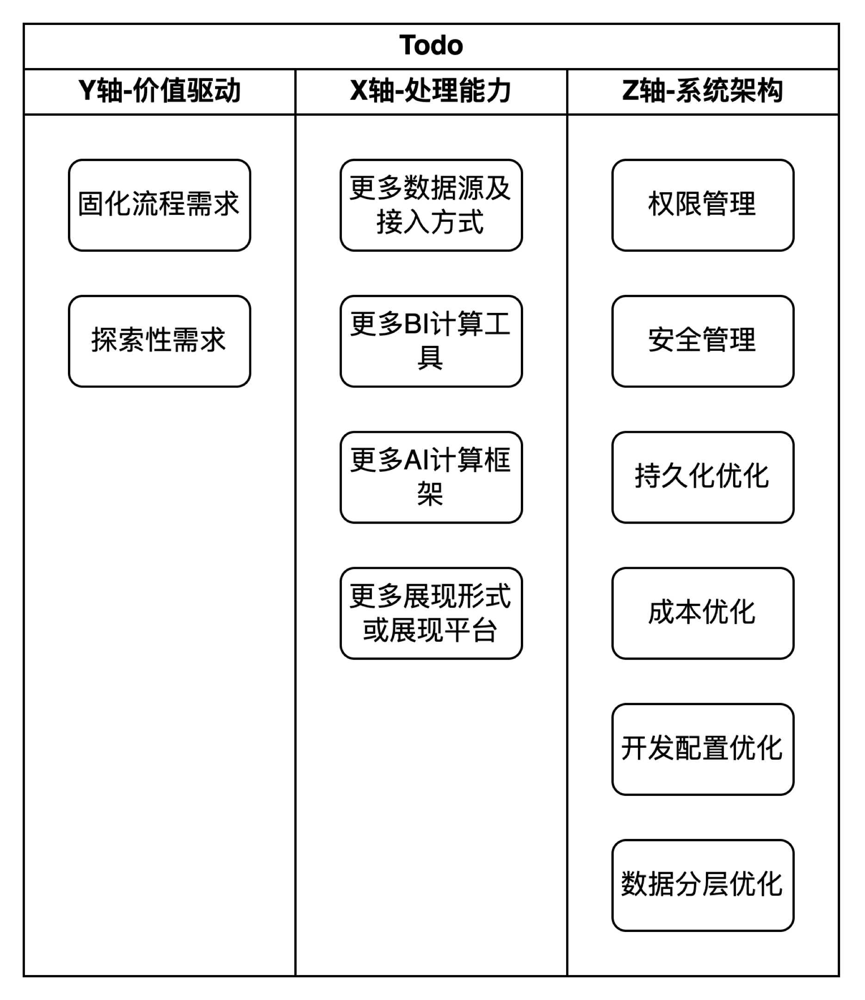

1. 工具问题：底层都是使用最基本的连接器连接驱动，是否可以先做可以使用的工具，再做一个fancy的工具。
2. 自顶向下还是自底向上问题：
   1. 自顶向下：工具导向，即拿一个没有调研背景的工具去搭起来，然后学习如何使用，然后去执行命令。
   2. 自底向上：先解决一系列问题，然后发现可能成本管理，开发效率有问题，再去调研相关工具去分析对应的问题。
3. 需求导向：
   1. 如果只是在dev跑通链路，那就是只需要一个数据源持久化到AWS，再使用计算资源生成可展示的报表。
   2. 如果需要查看QoE数据，那就是新增一条Kafka及Cassandra到S3或者其他数据平台的链路。其中如果QoE数据需要实时分析（虽然我觉得这个是告警监控部分），那我们就使用flink进行计算。
   3. 如果我们只是要公司内部使用，那暂时不用关心太多高可用问题。
4. 数据处理为中心
   1. 计算部分：使用spark和flink结局都是从一些数据中拿到一个结果，那完全可以选择合适和各自喜欢的计算方式去处理问题，甚至以后可以直接拿tensorflow等计算
   2. 存储部分：如果结果都是拿S3做持久化存储，那么过程中使用什么计算或者非持久化组件也是可商定的？
5. 相同工作问题？
   1. 在目标为数据处理本身时，使用底层框架做ETL和使用一个选型好的工具做ETL是否是相同工作。
6. AI问题
   1. 比如数据挖掘，如果我们数据到达持久化层，对于开发人员来说可以直接做BI报表，也可以拿测试数据做AI的工作。没有觉得这是很远的事情
7. 目标不统一问题：沈工的目标可能是要搭建一个完整的使用工具，我觉得有一个最终的实现结果更为重要，这一点上可能彼此都是对方工作的阻塞。

