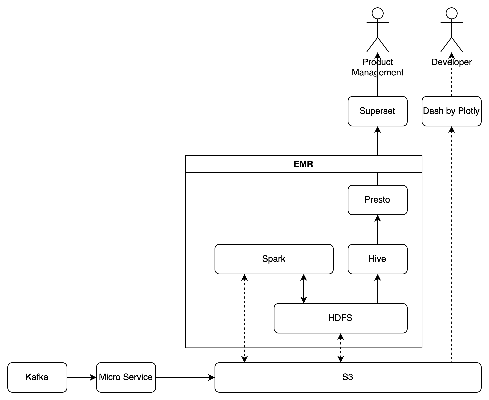
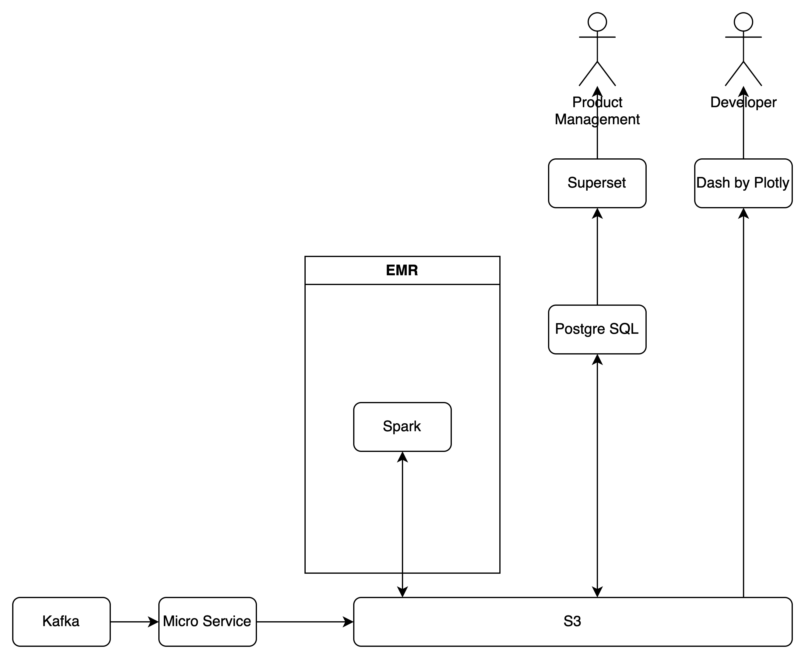
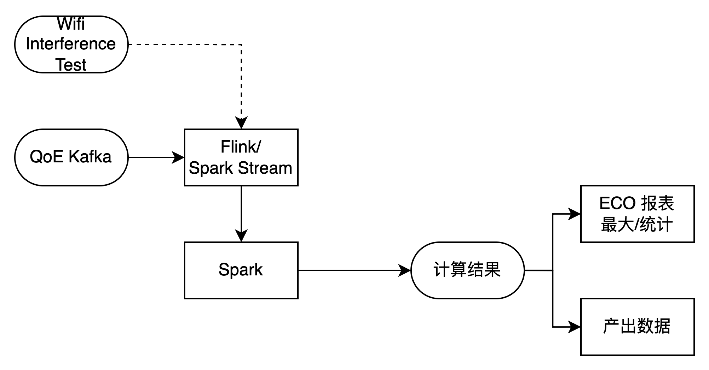
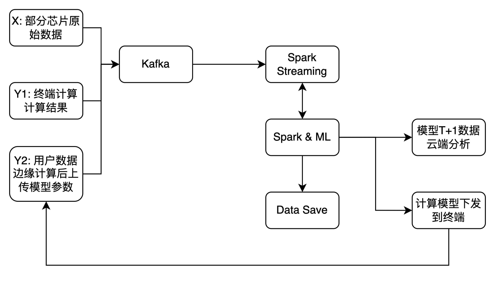

## 离线数据平台

### 当前框架介绍

当前的离线处理平台

当前流程和可见优化项

### 存储调研

1. 直接读写S3：损失读写性能
2. HDFS：需考虑同步到S3持久化方案
   1. EMRFS-使用S3作为挂载
   2. 启动结束同步到S3
   3. EBS挂载
3. 自建EC2集群：需要自行管理机器实现高可用

### 展示调研

1. 直接使用python脚本的绘图工具

## Flink/任务流

ECO的分析流程

部分数据收集链路缺失

## 机器学习计算

需求：

1. QoE数据分析及边缘计算
2. 前端埋点聚类分析