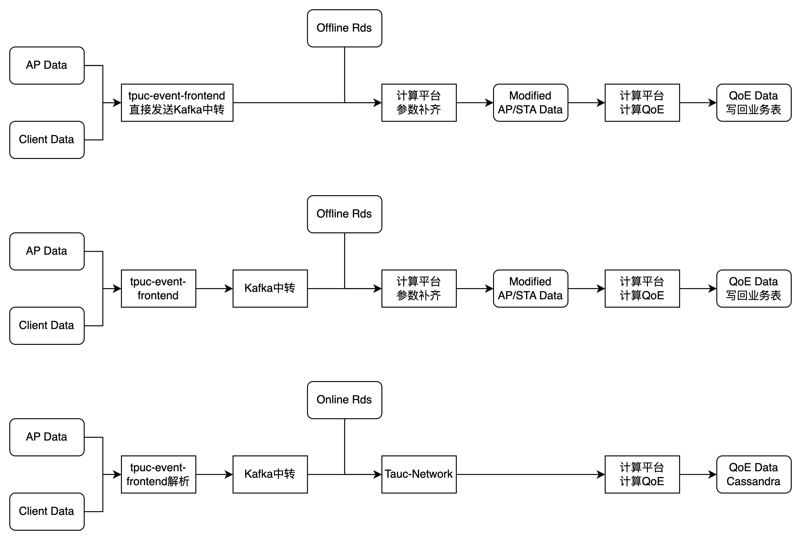
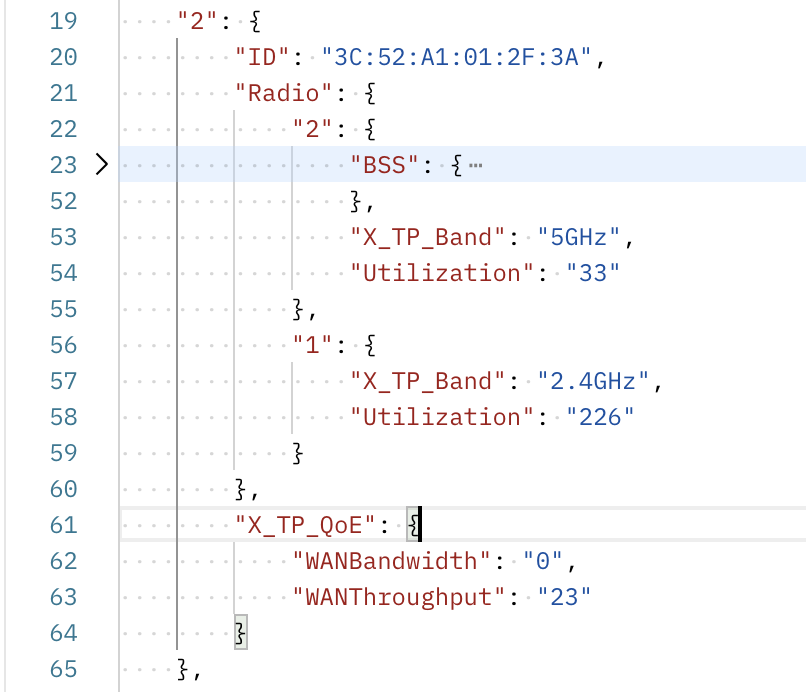

本次周会主题

1. QoE计算链路梳理
2. ECO进度与阻塞
3. ECO过程中对QoE链路的重构思路
4. 数据分层示意


## QoE链路



当前使用：第三个方法

计划优化：第一个方法

**区别**：

1. 数据处理接入环节：替代Network/替代Network+Eventfrontend

**明确**

1. 如果使用非java架构，原先通过查表或者调接口调用的Tauc-network乃至是Tauc-account的方法？
   1. 是否可以直接继续调用而非创建离线库？（因为流量不变）
   2. 是否可以直接在数据平台构建查询逻辑？比如一些调用tauc-account的表

**Feature**

1. 方法1和方法3构建了一个流处理区间 kafka-kafka

**涉及需求：**

1. 罗京武数据探索平台
2. 吴统琦：eventfrontend处理抛弃数据量


## ECO进展

1. Kafka-ETL完成
   1. 上述方法2的预处理完成，但发现字段缺失。
   2. 上述方法1的预处理完成。
2. 图表绘制-本周
   1. 本需求选型：Dash by Plotly（已选型未开发）
   2. **前端建议：构建TAUC 图表API（需确认是否需要前端接入）**
3. Wifi-Interference 模块数据收集（预计8E完成）
   1. 需彭天翔协商Tauc-Network资源分配。
4. 业务表ETL到离线库或S3操作
   1. AWS-DMS链路打通。
   2. 该部分仅需提单平台组即可实现。
      1. aws dms工具平台组保证其不会造成数据丢失，原理是需要构建一个ec2在源和目标之间复制，aws根据你指定的源和目标以及复制实例进行复制，能指定复制表和具体字段，全量和增量，然后处理的话需要找平台组，需要开相关权限。
   3. ETL同时脱敏问题：
      1. **GPT论证可行性，与王振刚沟通计划使用pet-spbu库测试DMS工具进行这个操作。**
      2. **黄杰建议：无需脱敏，脱敏操作在数据落库时进行而非到大数据平台进行？**
   4. 增量同步需求点：
      1. 如需历史变动，使用binlog
      2. 不需要，使用dataX等其他工具即可。


预估本周提供图表绘制的Demo给设备端，设备端推动Network开发完Wifi-Interference 模块数据收集的过程中完成业务表同步和推动dev/prd发布的技术选型。


## 链路重构：

现状：

1. Event-Frontend解析的设备端上报数据不全。
2. 部分字段已废弃，不符合真实值。
3. 抽象的结构不符合认知
   1. 比如解析出来的ap结果会包含空的metric和factor路径
   2. 不符合通信规律，实际可以分有线无线和频段来构建二维列表。

解决方案：

以和设备端通信文档为准，以通信模型构建新表。


AP表：


AP数据的层级结构是Per Device Per Radio的，会把AP的数据拆成这个最小单元，然后把X_TP_QoE的数据，能分频段的拆到各频段，不能的则复制到每个频段。

```
# 唯一标识指标
mainDeviceId	band	collectionTime

jitter	latency	wanBandwidth	uploadBandwidth	wanConnectivity	wanThroughput	memoryFree	memoryTotal	cpuUsage	numberOfAlerts	isController	connectivityScore	availableBandwidthScore	internetDelayScore	internetJitterScore	systemHealthScore	congestionScore	wifiCoverageScore	wifiAvailabilityScore	noise	utilization	averageRxRate	averageTxRate	bandWidth	errorsPkt	ipAddress	signalStrength	packetsSent	packetsReceived	errorsSent	errorsReceived	bytesSent	bytesReceived	congestionRate	associatedDeviceNumberOfEntries	backhaulSta_macAddress	backhaulSta_backhaulLinkType	backhaulSta_linkRate	backhaulSta_signalStrength	backhaulSta_utilization	backhaulSta_snr
```


1. AP数据分频段转化为3张表 2.4/5/6，




Client表的拆分里除了Per STA的数据，其他数据都在AP表有重复，因此按Per Sta将数据拆开

此外有线设备不参与这个Per Sta规则，另行存表

```
# 唯一标识指标
controller_id	device_id	radio_id	bss_id	sta_id	band	collection_time

last_data_downlink_rate	last_data_uplink_rate	mac_address	signal_strength	host_name	ip_address	network_ready_time	wifi_connectivity	number_of_alerts	available_wifi_service_quality_score	network_ready_time_score	signal_strength_score	wifi_connectivity_score	wifi_protocol_score	client_health_score	rx_rate	tx_rate	retrans_count	est_mac_data_rate_downlink	est_mac_data_rate_uplink	fail_num
```


有线表：

**注意：此处controller_id和collection_time不是从对应的有线数据路径拿到，而是从无线路径拿到**

```
# 无线路径
collection_time = report['CollectionTime']
controller_id = report['Device']['WiFi']['DataElements']['Network']['ControllerID']

# 有线路径
multiap_data_list = report['Device']['WiFi']['MultiAP']['APDevice']

```

```
#对应唯一的kafka消息
controller_id	collection_time	

ap_device_id	mac_address	ip_address	host_name	up_speed	down_speed	link_speed	duplex_mode	active	packets_sent	packets_received	errors_sent	errors_received	interface_type
```


## 数据分层

1. 原始数据层（Kafka发送，S3存储）
2. 解json后得到三张表，AP/无线客户端/有线客户端
   1. 存储选型待确认：定期删除机制的数据库 or/and 归档的S3/磁盘
   2. 解析选型待确认：大数据平台 or k8s部署
3. 计算结果
   1. 业务的QoE数据（写回Cassandra或更新业务数据库组件）
   2. 报表需求结果**（写到PostgresSQL）**

