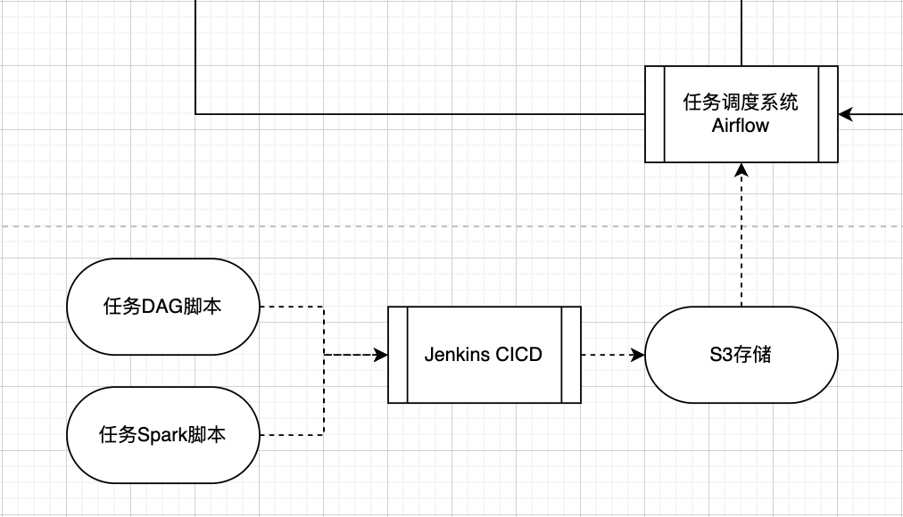

本周工作

1. 微服务链路：

   1. tpuc-event-frontend配置Apollo与线程池，并进行压测。
   2. 更新成本评估，压缩方案选型。
   3. Todo：data-collector的pet测试。

2. 数据平台部分

   1. Jenkins发布：当前平台组默认创建maven的job，需要联系海外人员Hu Nan做成Freestyle项目。
   2. 具体执行需要在localtest先发布，然后把git和script执行好后提交给Hu Nan。

   

   3. Todo：任务调度系统的选型与文件传输。

## 进展核对

### ECO开发

1. Kafka-ETL完成
2. 图表绘制-本周
   1. 本需求选型：Dash by Plotly
3. Wifi-Interference 模块数据收集
   1. 资源分配完成，待开发。

### ECO发布计划

1. 数据收集
   1. 内容：将QoE数据发送备份到S3/psql
   2. 测试人力排到1.7.2(Oct)
   3. 测试点checklist - 仅考虑Tpuc-Eventfrontend的测试点
      1. [ ] 业务问题：需确认是否影响tpuc-EventFrontend功能 - codereview
      2. [ ] 性能问题：需确认是否影响tpuc-EventFrontend性能（明确需要修改的性能配置）
      3. [ ] 性能问题：需确认增加的TPS对kafka集群的影响（非业务数据，可以考虑新建kafka集群？之前data-collector就应该建一个）
   4. **发布计划1: 计划8.14完成自测checklist，8.23推生产发布。**
      1. 涉及tauc-data-collector，tpuc-event-frontend两个微服务
   5. 数据发送和存储选型和成本控制：
      1. kafka-s3链路从微服务迁到大数据组件（非必需）
      2. 根据数据量决定使用文件系统 or 数据库
      3. S3a及自动删除机制配置
   6. **发布计划2: 10E完成组件优化后的版本**

2. 数据展示
   1. Superset部分（跟下述数据组件）
   2. Dash by Plotly部分
      1. python代码，容器化部署，可走代码审核形式发布。
      2. 预计9Eor10M推送生产，届时已收集一个月的数据具有一定显示效果。

3. 数据组件
   1. 发布内容：
      1. 确定：Spark，Superset，Postgres
      2. 待定：Airflow
   2. 发布形式：
      1. Spark和Superset使用K8s或者EC2直接部署待确认
      2. Postgres使用RDS托管

搭建微服务：

tauc-data-show

tauc-etl

tauc-airflow

tauc-psql

Todo项：

沟通：

1. 数据库搭建
2. jenkins发布纯代码文档

代码部分：

1. etl
2. dash展示
