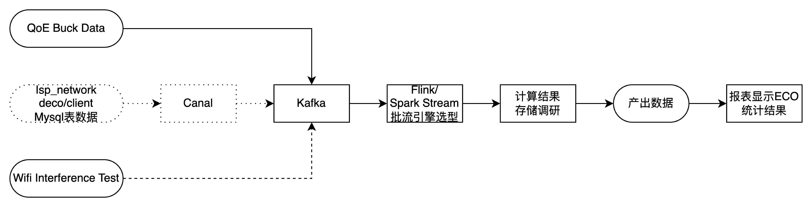
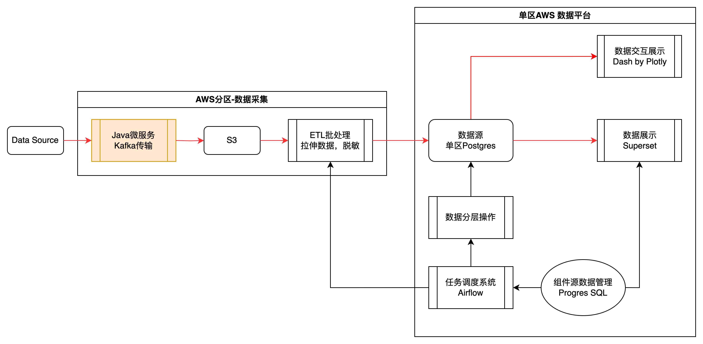
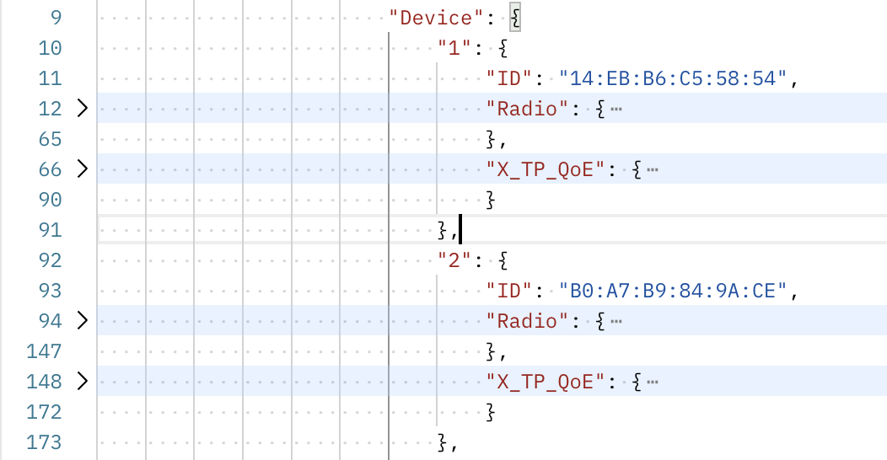

[toc]


## ECO 模式进度

### 输入

需求Version From 2024.7.19



更新：经沟通不需要读取Network表数据的IP和机型信息，目前Wifi Interference Test已知会设备端，预计联系产品解决。

### 输出

使用 Dash by Plotly 提供数据探索平台


## 架构设计

### 目前架构



1. kafka消费问题
   1. 目前使用java微服务架构进行kafka传输，计划后续使用大数据组件。
   2. 和顾绚栋沟通，当前业务场景即kafka批量消费上传S3的过程在Java写也无法使用tauc-eventCenter来做监控。

计划组建确定选型（8.12-8。16）


### 数据流转

A. 原始设备上报数据：


B. 拉成多张结构化原始数据表：

```
# 唯一标识指标
mainDeviceId	band	collectionTime

jitter	latency	wanBandwidth	uploadBandwidth	wanConnectivity	wanThroughput	memoryFree	memoryTotal	cpuUsage	numberOfAlerts	isController	connectivityScore	availableBandwidthScore	internetDelayScore	internetJitterScore	systemHealthScore	congestionScore	wifiCoverageScore	wifiAvailabilityScore	noise	utilization	averageRxRate	averageTxRate	bandWidth	errorsPkt	ipAddress	signalStrength	packetsSent	packetsReceived	errorsSent	errorsReceived	bytesSent	bytesReceived	congestionRate	associatedDeviceNumberOfEntries	backhaulSta_macAddress	backhaulSta_backhaulLinkType	backhaulSta_linkRate	backhaulSta_signalStrength	backhaulSta_utilization	backhaulSta_snr
```

**注：此处deviceId对应设备12位Mac，需要加密。**


C. 展示数据

包含计算结果

```python
columns = ["region", "utc_time", "client_online", "band", "wan_throughput", "bandwidth"]
```


## 进展核对

### ECO开发

1. Kafka-ETL完成
2. 图表绘制-本周（延期1周）
   1. 本需求选型：Dash by Plotly（禅道沟通中，如事宜过多则需本周开会）
3. Wifi-Interference 模块数据收集（预计8E完成）
   1. 需彭天翔联系FJ协商Tauc-Network资源分配。
4. 如前输入所述，ECO收集不再涉及数据库的IP和机型读取。


### ECO发布计划

1. 数据收集
   1. 内容：将QoE数据发送备份到S3/psql
   2. 测试人力排到1.7.2(Oct)
   3. 测试点checklist - 仅考虑Tpuc-Eventfrontend的测试点
      1. [ ] 业务问题：需确认是否影响tpuc-EventFrontend功能 - codereview
      2. [ ] 性能问题：需确认是否影响tpuc-EventFrontend性能（明确需要修改的性能配置）
      3. [ ] 性能问题：需确认增加的TPS对kafka集群的影响（非业务数据，可以考虑新建kafka集群？之前data-collector就应该建一个）
   4. **发布计划1: 计划8.14完成自测checklist，8.23推生产发布。**
      1. 涉及tauc-data-collector，tpuc-event-frontend两个微服务
   5. 数据发送和存储选型和成本控制：
      1. kafka-s3链路从微服务迁到大数据组件（非必需）
      2. 根据数据量决定使用文件系统 or 数据库
      3. S3a及自动删除机制配置
   6. **发布计划2: 10E完成组件优化后的版本**


2. 数据展示
   1. Superset部分（跟下述数据组件）
   2. Dash by Plotly部分
      1. python代码，容器化部署，可走代码审核形式发布。
      2. 预计9Eor10M推送生产，届时已收集一个月的数据具有一定显示效果。


3. 数据组件
   1. 发布内容：
      1. 确定：Spark，Superset，Postgres
      2. 待定：Airflow
   2. 发布形式：
      1. Spark和Superset使用K8s或者EC2直接部署待确认
      2. Postgres使用RDS托管
