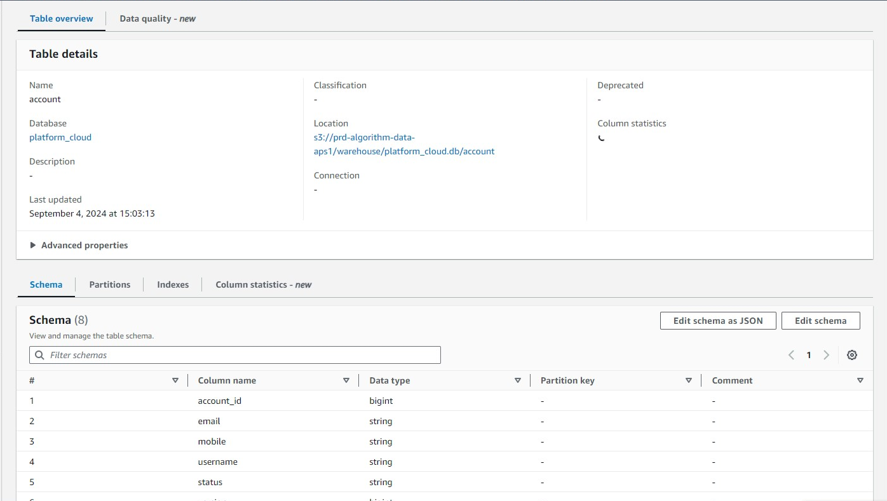
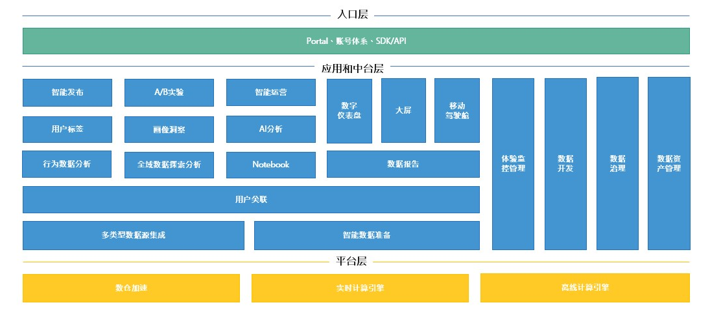
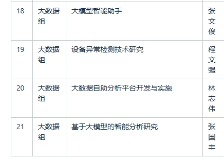

### 数据平台使用：

已知：

数据处理Airflow调度emr

数据存储：Hdfs、s3，然后下游是AWS Glue，后续如何连接到SUperset等报表平台的。

问题：

使用AWS体系下的工具的可靠性和成本问题？

AWS合规问题：比如EMR Studio难以开通白名单，无法建立jumpserver，以及emr的日志无法查看。

### 数据产品建设

邮件了解到大数据部在部署ABtest服务，

想了解

1. 产品建设构建了哪些内容?
2. 部署python django的经验进展。
3. 大数据部业务上的工作规划

### 技术专项

感觉和这边的研发重合度较高

1. 数据源以及现有算法是否可以共享
2. 大数据自助分析平台开发与实施在整体系统架构中的位置和user case

