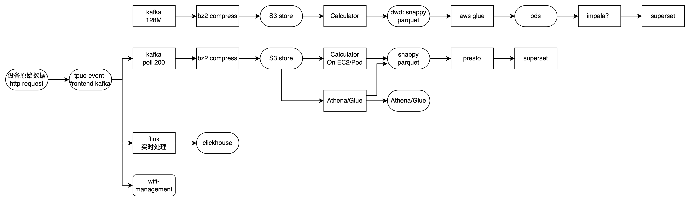

# 成本计算

FJ描述用户使用场景为5ap-20sta，这在罗京武给的文档中对应小型家庭。

进一步假设，当前2w（分区，假设数量多的那个区2w台）个网络的数据的配置如下

|            | num  | int  | str  | double | size/字节 |
| ---------- | ---- | ---- | ---- | ------ | --------- |
| controller | 1    | 28   | 10   | 6      | 360       |
| agent      | 4    | 31   | 12   | 6      | 1648      |
| wifi-sta   | 15   | 17   | 7    | 6      | 3840      |
| link-sta   | 5    | 8    | 8    | 0      | 960       |

1. **计算每条记录的大小**：基于字段类型的字节数进行计算。
   - **IntegerType**: 4 字节
   - **StringType**: 假设平均 20 字节（字符串的大小可能变化，这里做一个简单的估计）
   - **DoubleType**: 8 字节

|            | num  | per  | all bite |
| ---------- | ---- | ---- | -------- |
| controller | 1    | 360  | 360      |
| agent      | 4    | 412  | 1648     |
| wifi-sta   | 15   | 256  | 3840     |
| link-sta   | 5    | 192  | 960      |
|            |      |      | 6808     |

总大小6.65kb

每天数据量= 6.65kb\* 2w设备\* 96条每天 = 12.18GB

假设Parquet+Snappy压缩到25%，那么每天数据体积3.045GB

考虑json上报原始数据

假设：

- 字段名称的平均长度为 10 个字符。
- 整型和浮点型字段的数据长度为 5 个字符。
- 字符串字段的长度依然假设为 20 个字符。

|            | num  | per  | all bite |
| ---------- | ---- | ---- | -------- |
| controller | 1    | 942  | 942      |
| agent      | 4    | 1062 | 4248     |
| wifi-sta   | 15   | 645  | 9675     |
| link-sta   | 5    | 408  | 2040     |
|            |      |      | 16905    |

考虑json冗余25%，即原始数据20%的数据不使用，每条消息的体积约为2.64kb

那么每天数据为37.79GB，使用bz2压缩到10%-15%，取12.5%则压缩完的数据为4.724GB

ref：前端埋点链路（猜测大数据部流程）

前半部分到

### 压缩方式

结合生产数据，aps1部分的qps=100，测试环境的qoe数据比较小，897kb大概是20条复制10倍的结果。

结果比较迷惑，和理论指导不相符，预期里Snappy是最快的，可能需要将代码放在k8s上再算一下。

目前考虑选择Gzip来在java侧压缩，Snappy在S3侧压缩。

参考下述

Original file size: 897981 bytes
Gzip compression time: 11.467721 ms
Gzip decompression time: 591.551727 ms
Gzip compressed size: 38285 bytes
Gzip compression ratio: 0.04263453235647525
Bzip2 compression time: 825.663108 ms
Bzip2 decompression time: 59.614275 ms
Bzip2 compressed size: 6519 bytes
Bzip2 compression ratio: 0.007259619078800108
Snappy compression time: 1207.102307 ms
Snappy decompression time: 1.104656 ms
Snappy compressed size: 114332 bytes
Snappy compression ratio: 0.1273211794013459

Original file size: 2693943 bytes
Gzip compression time: 34.588042 ms
Gzip decompression time: 1444.852137 ms
Gzip compressed size: 112215 bytes
Gzip compression ratio: 0.04165455616544225
Bzip2 compression time: 1245.696117 ms
Bzip2 decompression time: 148.619902 ms
Bzip2 compressed size: 19444 bytes
Bzip2 compression ratio: 0.007217673128199075
Snappy compression time: 486.846961 ms
Snappy decompression time: 3.129436 ms
Snappy compressed size: 342298 bytes
Snappy compression ratio: 0.12706207963568641

Original file size: 18857601 bytes
Gzip compression time: 163.002084 ms
Gzip decompression time: 9414.823555 ms
Gzip compressed size: 777474 bytes
Gzip compression ratio: 0.0412286801486573
Bzip2 compression time: 7035.909689 ms
Bzip2 decompression time: 587.870824 ms
Bzip2 compressed size: 121445 bytes
Bzip2 compression ratio: 0.0064401086861472995
Snappy compression time: 1043.628751 ms
Snappy decompression time: 8.205137 ms
Snappy compressed size: 2390228 bytes
Snappy compression ratio: 0.1267514356677713

# 路径选择

## 一步处理or先存S3

核心点是是否有实时场景？

### 1. **一步进行处理和解析**

在这种方法中，数据在接收到之后直接进行处理和解析，而不先存储到 S3。处理完的数据可以直接写入目标存储位置（如 S3、数据仓库等）。

#### 优点：

- **实时性强**：数据解析和处理可以立即完成，适用于需要实时或准实时处理的场景。
- **节省存储**：避免了临时存储未处理数据的额外开销。

#### 缺点：

- **处理压力大**：如果数据量大且解析复杂，处理集群可能面临较大的计算压力。
- **故障恢复复杂**：如果处理过程中出现故障，可能需要重新从源头获取数据并重新处理。

### 2. **先打包到 S3 再解析**

在这种方法中，原始数据首先打包上传到 S3 进行存储，后续解析任务可以从 S3 中读取数据并进行处理。

#### 优点：

- **弹性处理**：可以灵活安排数据的解析时间，适合批处理或有处理延迟的场景。
- **数据冗余和恢复**：原始数据保存到 S3 后，可以在任何时间进行重新解析，具有较好的数据冗余和恢复能力。
- **并行处理**：可以利用 S3 的高并发读写特性，多个处理任务可以同时从 S3 读取数据并行处理。

#### 缺点：

- **存储成本**：需要额外的存储空间来存放未解析的原始数据。
- **处理延迟**：数据从原始状态到解析完成可能需要更长的时间，尤其是需要等待批量处理的时候。

### **选择建议**

- **实时或准实时处理**：如果数据需要在接收到后立即进行处理和分析，选择一步进行处理和解析的方法更为合适。

[9:43] (ﾉ>ω<)ﾉ \w $ aws s3 cp /Users/sunhao/IdeaProjects/crudapp/src/Data_Analysis/img/posts/成本计算.asserts s3://tauc-link-analysis/typora/img/posts/成本计算.md --profile default --recursive       

- **批处理和数据冗余**：如果数据可以延迟处理，或需要保存原始数据以便随时重新解析，先打包到 S3 再解析的方法更为适用。

## Spring微服务 or 一步处理