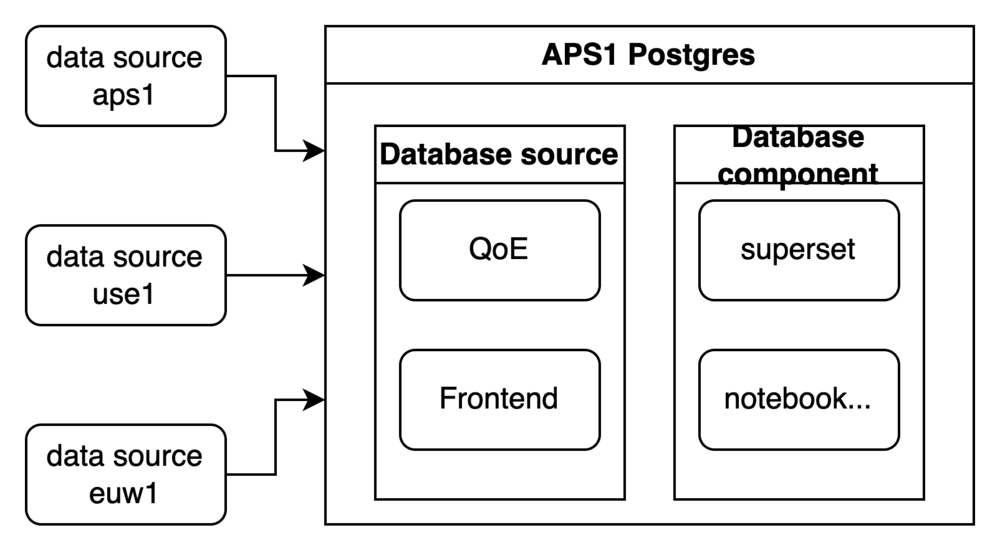

Postgres

1. 原始计算表数据
2. 计算结果表数据
3. superset的应用数据

database：业务库 source，组件配置库 component

schema：

Database source

1. qoe
2. frontend

Database component

1. superset 
2. notebook

数据分区问题：

原始数据写入到Postgres时需要脱敏。

| 目的               | schema |      |
| ------------------ | ------ | ---- |
| 原始计算表数据     |        |      |
|                    |        |      |
| superset的应用数据 |        |      |

数据管理：

1. 业务表同步离线表
   1. 跨区数据库中转保存APS1

# 成本考虑

## tplink云资源使用情况

## AWS成本调研

| **Storage Service**               | **Storage Cost ($/GB/month)** | **Retrieval Cost ($/GB)**    | **Use Case**                                            |
| --------------------------------- | ----------------------------- | ---------------------------- | ------------------------------------------------------- |
| S3 Standard                       | $0.023                        | $0.01                        | 适用于频繁访问的数据                                    |
| S3 Standard-IA                    | $0.0125                       | $0.01                        | 适用于较少访问但仍需快速检索的数据                      |
| S3 One Zone-IA                    | $0.01                         | $0.01                        | 适用于较少访问且可以容忍单可用区失效的数据              |
| S3 Glacier                        | $0.004                        | \$0.01 - $0.05               | 适用于需要数小时内检索的归档数据                        |
| S3 Glacier Deep Archive           | $0.00099                      | \$0.02 - $0.05               | 适用于需要几天时间检索的长期归档数据                    |
| EBS (Elastic Block Store)         | $0.10 (通用型SSD)             | N/A                          | 块存储，适用于EC2实例的持久存储，如数据库、文件系统等。 |
|                                   | $0.125 (高效能SSD)            | N/A                          | 高效能块存储，适用于高性能需求的工作负载。              |
|                                   | $0.025 (Cold HDD)             | N/A                          | 低成本块存储，适用于较少访问的数据。                    |
| RDS (Relational Database Service) | $0.10 (标准存储)              | N/A                          | 托管关系数据库服务，如MySQL、PostgreSQL、SQL Server等。 |
|                                   | $0.125 (预置IOPS存储)         | N/A                          | 高性能关系数据库存储，适用于高IO需求的应用。            |
| DynamoDB                          | $0.25                         | $0.00013/读写单位 (读取请求) | 托管NoSQL数据库，适用于低延迟、高吞吐量的应用。         |
|                                   | N/A                           | $0.00065/读写单位 (写入请求) | 按存储空间和请求量收费，适用于弹性扩展的NoSQL数据库。   |
| Redshift                          | $0.024                        | N/A                          | 托管数据仓库服务，适用于大规模数据分析。                |
|                                   | $0.25/小时 (dc2.large节点)    | N/A                          | 高性能数据仓库，按计算资源和存储需求收费。              |
| Glacier                           | $0.004                        | \$0.01 - $0.05               | 归档存储，适用于需要数小时内检索的归档数据。            |
| Glacier Deep Archive              | $0.00099                      | \$0.02 - $0.05               | 归档存储，适用于需要几天时间检索的长期归档数据。        |
