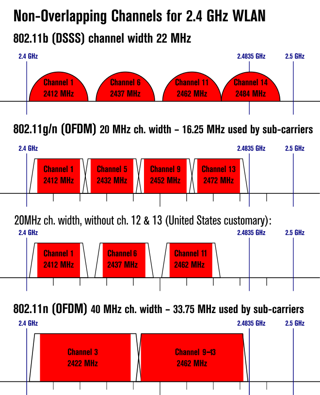

[TOC]

## 总览

本文引用自维基百科 [无线局域网信道列表](https://zh.wikipedia.org/zh-cn/无线局域网信道列表)

节选了里面关于2.4GHz和5GHz频段分配的问题，DFS（Dynamic Frequency Selection，动态频率选择）并不是5G独有的技术。DFS 是一种用于无线电通信的技术，主要应用于Wi-Fi（尤其是5GHz频段）和其他无线通信系统，以确保这些系统在不干扰雷达等其他主要用户的情况下工作。DFS信道一般需要结合当地法律法规明确不同地区对于军用信号的规范，如下述5G频道图中，台湾就没有DFS的法规，中国和美国对于DFS信道的选择也有区别。

**频段使用情况**：

- **2.4GHz频段**：这个频段相对较窄，通常用于Wi-Fi、蓝牙、微波炉等多种设备。由于这个频段的使用非常普遍且没有雷达等高优先级用户，通常不需要DFS技术来避免干扰。
- **5GHz频段**：这个频段较宽，并且被军事、气象和航空雷达等重要设备使用。因此，DFS技术在5GHz频段中是强制要求，以确保这些高优先级用户不受干扰。
- **6GHz频段**：目前，关于6G的具体技术细节和频谱分配仍在研究和制定中，因此无法确定6G是否会使用DFS技术。

**监管要求**：

- 各国的无线电频谱管理机构（如FCC在美国，ETSI在欧洲等）对5GHz频段有明确的规定，要求使用DFS技术。这些规定并不适用于2.4GHz频段，因为2.4GHz频段没有类似的重要用户需要保护。
- 各国的无线电频谱管理机构会根据6G的实际使用情况和频谱分配制定相应的规定。如果6G使用的频段与现有的高优先级用户（如军事雷达）有重叠，则可能会要求类似DFS的技术来避免干扰。

## 引言

**无线局域网频道列表**专指[IEEE 802.11](https://zh.wikipedia.org/wiki/IEEE_802.11)网络应该使用的无线[信道](https://zh.wikipedia.org/wiki/信道)。[无线局域网](https://zh.wikipedia.org/wiki/无线局域网)（WLAN）分很多种类，其中以IEEE 802.11规范为基础的[WiFi](https://zh.wikipedia.org/wiki/WiFi)认证是人们最熟悉的商业标准。802.11 工作组划分了4个独立的频段：2.4 GHz、3.6 GHz、4.9 GHz 和 5.8 GHz[1]，每个频段又划分为若干频道。每个国家自己制定了政策订出如何使用这些频段，例如最大的发射功率和配制方式等。

## 2.4 GHz (802.11[b](https://zh.wikipedia.org/wiki/802.11b)/[g](https://zh.wikipedia.org/wiki/802.11g)/[n](https://zh.wikipedia.org/wiki/802.11n)/[ax](https://zh.wikipedia.org/wiki/802.11ax))

2.4 GHz [WiFi](https://zh.wikipedia.org/wiki/WiFi) 频段示意图

2.4 GHz 频段范围内有每隔 5 MHz 分隔的频道14个（除了第14频道与第13频道相隔了 12 MHz）。[2]

40 MHz 频段可以由两个相邻 20 MHz 频段组成。取决于哪个频带是主（控制）频带，哪个频带是从（扩展）频带，路由器可能会显示成 1+5、5+1、9+13、13+9。

### 干扰问题

当两个网络试图在同一频段运行，或其频段重叠时，就会发生干扰。所用的两种调制方法具有不同的频带使用特点，因此占用不同的频宽。

- [传统802.11](https://zh.wikipedia.org/w/index.php?title=IEEE_802.11_(legacy_mode)&action=edit&redlink=1)和802.11b（以及11g的11b兼容率）使用的[DSSS](https://zh.wikipedia.org/w/index.php?title=Direct-sequence_spread_spectrum&action=edit&redlink=1)方法使用22 MHz的带宽。这是来自编码系统使用的11 MHz“chip”速率。[3]当2个或更多的 802.11b 发射器在相同的空间操作时，其信号必须被衰减到少于 -50dBr 同时/或频率至少有 22 MHz 的间距以防干扰。[4]依据这个间距，11b的频段号要隔开4个才会不冲突，这就是常见的“1/6/11"选择来历；在日本可以使用的14频段也不冲突。
- 802.11a/g/n使用的[OFDM](https://zh.wikipedia.org/wiki/OFDM)方法占用的带宽为16.25 MHz。实际标记的带宽为20 MHz：四舍五入为信道宽度的倍数，可以提供一些[保护频带](https://zh.wikipedia.org/w/index.php?title=保護頻帶&action=edit&redlink=1)，使信号在频段边缘充分衰减。[5]这个防护带主要用来防止适应老式路由器的频段占用问题，在硬件更好的新式路由器上一般不是问题。OFDM的频段只要隔开3个就能互不冲突（即上图的1/5/9/13），但由于遗留11b设备设置频段6较多，一般也会采用“1/6/11”选择。

### 频道列表

很多国家都有法律规管这些频道的使用，例如在一定频率范围内的最大功率电平等。网络运营商应咨询当地主管部门，因为这些规定可能会过时，世界上绝大多数国家都允许不需要申请许可证使用第1频道到第13频道：

| 频道 | 频率 (MHz) | 北美地区[6] | 日本[6]                                                      | 巴西 | 大部分国家 |
| ---- | ---------- | ----------- | ------------------------------------------------------------ | ---- | ---------- |
| 1    | 2412       | 是          | 是                                                           | 是   | 是         |
| 2    | 2417       | 是          | 是                                                           | 是   | 是         |
| 3    | 2422       | 是          | 是                                                           | 是   | 是         |
| 4    | 2427       | 是          | 是                                                           | 是   | 是         |
| 5    | 2432       | 是          | 是                                                           | 是   | 是         |
| 6    | 2437       | 是          | 是                                                           | 是   | 是         |
| 7    | 2442       | 是          | 是                                                           | 是   | 是         |
| 8    | 2447       | 是          | 是                                                           | 是   | 是         |
| 9    | 2452       | 是          | 是                                                           | 是   | 是         |
| 10   | 2457       | 是          | 是                                                           | 是   | 是         |
| 11   | 2462       | 是          | 是                                                           | 是   | 是         |
| 12   | 2467       | 允许但少见A | 是                                                           | 是   | 是         |
| 13   | 2472       | 允许但少见A | 是                                                           | 是   | 是         |
| 14   | 2484       | 否          | 只能使用 [802.11b](https://zh.wikipedia.org/wiki/IEEE_802.11)B | 否   | 否         |

实际上在美国是允许第12频道和第13频道在低功率的条件下使用的。FCC Part 15的2.4 GHz频段允许“低功率”[扩频](https://zh.wikipedia.org/wiki/扩频)运行，定义为50 dB信号强度完全包含在在2400 MHz到 2483.5 MHz频率范围内。[7]这个范围包括了第1到13的全部频道。[美国联邦通信委员会](https://zh.wikipedia.org/wiki/美国联邦通信委员会)（[FCC](https://zh.wikipedia.org/wiki/FCC)）的文件澄清，只有第14频道不可使用；12、13频道配合低功率发射机和低增益天线没有禁止。[8]然而，出于避免干扰相邻2483.5 MHz到2500 MHz的频段的原因，美国设备传统上不会使用这两个频段。[9][10]。在加拿大前12个频道在全功率下都可供使用，而其它的频道的发射功率则受限。

在日本，14频道只能使用[DSSS](https://zh.wikipedia.org/wiki/DSSS)和[CCK](https://zh.wikipedia.org/wiki/CCK)调制模式，不能使用[OFDM](https://zh.wikipedia.org/wiki/OFDM)模式（[802.11g](https://zh.wikipedia.org/wiki/802.11g)所使用的调制方式）(IEEE 802.11-2007 §19.4.2)。

## 5 GHz (802.11[a](https://zh.wikipedia.org/wiki/802.11a)/[h](https://zh.wikipedia.org/wiki/802.11h)/[j](https://zh.wikipedia.org/wiki/802.11j)/[n](https://zh.wikipedia.org/wiki/802.11n)/[ac](https://zh.wikipedia.org/wiki/802.11ac)/[ax](https://zh.wikipedia.org/wiki/802.11ax))[11]

| 频道          | 频率 (MHz) | 美国    | 欧洲                  | 瑞士[12][13][14]                                           | 日本              | 新加坡        | 中国大陆   | 以色列     | 韩国          | 土耳其        | 澳大利亚      | 南非          | 巴西          | 台湾          | 新西兰  |         |
| ------------- | ---------- | ------- | --------------------- | ---------------------------------------------------------- | ----------------- | ------------- | ---------- | ---------- | ------------- | ------------- | ------------- | ------------- | ------------- | ------------- | ------- | ------- |
| 40/20 MHz[15] | 40/20 MHz  | 未知    | 40/20 MHz[16]         | 10 MHz                                                     | 40/20 MHz[17]     | 40/20 MHz[18] | 20 MHz[19] | 20 MHz[20] | 40/20 MHz[21] | 40/20 MHz[22] | 40/20 MHz[23] | 40/20 MHz[24] | 40/20 MHz[25] | 40/20 MHz[26] |         |         |
| 183           | 4915       | 否      | 否                    | 否                                                         | 否                | 是            | 否         | 否         | 否            | 否            | 否            | 否            | 否            | 否            | 否      | 否      |
| 184           | 4920       | 否      | 否                    | 否                                                         | 是                | 是            | 否         | 否         | 否            | 否            | 否            | 否            | 否            | 否            | 否      | 否      |
| 185           | 4925       | 否      | 否                    | 否                                                         | 否                | 是            | 否         | 否         | 否            | 否            | 否            | 否            | 否            | 否            | 否      | 否      |
| 187           | 4935       | 否      | 否                    | 否                                                         | 否                | 是            | 否         | 否         | 否            | 否            | 否            | 否            | 否            | 否            | 否      | 否      |
| 188           | 4940       | 否      | 否                    | 否                                                         | 是                | 是            | 否         | 否         | 否            | 否            | 否            | 否            | 否            | 否            | 否      | 否      |
| 189           | 4945       | 否      | 否                    | 否                                                         | 否                | 是            | 否         | 否         | 否            | 否            | 否            | 否            | 否            | 否            | 否      | 否      |
| 192           | 4960       | 否      | 否                    | 否                                                         | 是                | 否            | 否         | 否         | 否            | 否            | 否            | 否            | 否            | 否            | 否      | 否      |
| 196           | 4980       | 否      | 否                    | 否                                                         | 是                | 否            | 否         | 否         | 否            | 否            | 否            | 否            | 否            | 否            | 否      | 否      |
| 7             | 5035       | 否      | 否                    | 否                                                         | 否                | 是            | 否         | 否         | 否            | 否            | 否            | 否            | 否            | 否            | 否      | 否      |
| 8             | 5040       | 否      | 否                    | 否                                                         | 否                | 是            | 否         | 否         | 否            | 否            | 否            | 否            | 否            | 否            | 否      | 否      |
| 9             | 5045       | 否      | 否                    | 否                                                         | 否                | 是            | 否         | 否         | 否            | 否            | 否            | 否            | 否            | 否            | 否      | 否      |
| 11            | 5055       | 否      | 否                    | 否                                                         | 否                | 是            | 否         | 否         | 否            | 否            | 否            | 否            | 否            | 否            | 否      | 否      |
| 12            | 5060       | 否      | 否                    | 否                                                         | 否                | 否            | 否         | 否         | 否            | 否            | 否            | 否            | 否            | 否            | 否      | 否      |
| 16            | 5080       | 否      | 否                    | 否                                                         | 否                | 否            | 否         | 否         | 否            | 否            | 否            | 否            | 否            | 否            | 否      | 否      |
| 34            | 5170       | 否      | 否                    | 室内                                                       | 只允许 客户端支持 | 否            | 是         | 否         | 是            | 否            | 室内          | 否            | 室内          | 室内          | 是 [27] | 室内    |
| 36            | 5180       | 是      | 是                    | 室内                                                       | 室内              | 否            | 是         | 是         | 是            | 是            | 室内          | 是            | 室内          | 室内          | 是      | 室内    |
| 38            | 5190       | 是      | 否                    | 室内                                                       | 只允许 客户端支持 | 否            | 是         | 是         | 是            | 是            | 室内          | 否            | 室内          | 室内          | 是      | 室内    |
| 40            | 5200       | 是      | 是                    | 室内                                                       | 室内              | 否            | 是         | 是         | 是            | 是            | 室内          | 是            | 室内          | 室内          | 是      | 室内    |
| 42            | 5210       | 是      | 否                    | 室内                                                       | 只允许 客户端支持 | 否            | 是         | 是         | 是            | 是            | 室内          | 否            | 室内          | 室内          | 是      | 室内    |
| 44            | 5220       | 是      | 是                    | 室内                                                       | 室内              | 否            | 是         | 是         | 是            | 是            | 室内          | 是            | 室内          | 室内          | 是      | 室内    |
| 46            | 5230       | 是      | 否                    | 室内                                                       | 只允许 客户端支持 | 否            | 是         | 是         | 是            | 是            | 室内          | 否            | 室内          | 室内          | 是      | 室内    |
| 48            | 5240       | 是      | 是                    | 室内                                                       | 室内              | 否            | 是         | 是         | 是            | 是            | 室内          | 是            | 室内          | 室内          | 是      | 室内    |
| 52            | 5260       | DFS     | 室内/DFS/TPC          | 室内/DFS/TPC (否则必须将功率限制为低于 100mW 而不是 200mW) | 室内/DFS/TPC      | 否            | 是         | DFS/TPC    | 是            | DFS           | 室内          | DFS/TPC       | 室内          | 室内          | 是 [28] | DFS/TPC |
| 56            | 5280       | DFS     | 室内/DFS/TPC          | 室内/DFS/TPC (否则必须将功率限制为低于 100mW 而不是 200mW) | 室内/DFS/TPC      | 否            | 是         | DFS/TPC    | 是            | DFS           | 室内          | DFS/TPC       | 室内          | 室内          | 是      | DFS/TPC |
| 60            | 5300       | DFS     | 室内/DFS/TPC          | 室内/DFS/TPC (否则必须将功率限制为低于 100mW 而不是 200mW) | 室内/DFS/TPC      | 否            | 是         | DFS/TPC    | 是            | DFS           | 室内          | DFS/TPC       | 室内          | 室内          | 是      | DFS/TPC |
| 64            | 5320       | DFS     | 室内/DFS/TPC          | 室内/DFS/TPC (否则必须将功率限制为低于 100mW 而不是 200mW) | 室内/DFS/TPC      | 否            | 是         | DFS/TPC    | 是            | DFS           | 室内          | DFS/TPC       | 室内          | 室内          | 是      | DFS/TPC |
| 100           | 5500       | DFS[29] | DFS/TPC               | DFS/TPC (否则必须将功率限制为低于 500mW 而不是 1W)         | DFS/TPC           | 否            | 否         | 否         | 否            | DFS           | DFS/TPC       | DFS/TPC       | 是            | DFS           | 是      | DFS/TPC |
| 104           | 5520       | DFS[29] | DFS/TPC               | DFS/TPC (否则必须将功率限制为低于 500mW 而不是 1W)         | DFS/TPC           | 否            | 否         | 否         | 否            | DFS           | DFS/TPC       | DFS/TPC       | 是            | DFS           | 是      | DFS/TPC |
| 108           | 5540       | DFS[29] | DFS/TPC               | DFS/TPC (否则必须将功率限制为低于 500mW 而不是 1W)         | DFS/TPC           | 否            | 否         | 否         | 否            | DFS           | DFS/TPC       | DFS/TPC       | 是            | DFS           | 是      | DFS/TPC |
| 112           | 5560       | DFS[29] | DFS/TPC               | DFS/TPC (否则必须将功率限制为低于 500mW 而不是 1W)         | DFS/TPC           | 否            | 否         | 否         | 否            | DFS           | DFS/TPC       | DFS/TPC       | 是            | DFS           | 是      | DFS/TPC |
| 116           | 5580       | DFS[29] | DFS/TPC               | DFS/TPC (否则必须将功率限制为低于 500mW 而不是 1W)         | DFS/TPC           | 否            | 否         | 否         | 否            | DFS           | DFS/TPC       | DFS/TPC       | 是            | DFS           | 是      | DFS/TPC |
| 120           | 5600       | 否[30]  | DFS/TPC               | DFS/TPC (否则必须将功率限制为低于 500mW 而不是 1W)         | DFS/TPC           | 否            | 否         | 否         | 否            | DFS           | DFS/TPC       | 否            | 是            | DFS           | 是      | DFS/TPC |
| 124           | 5620       | 否[30]  | DFS/TPC               | DFS/TPC (否则必须将功率限制为低于 500mW 而不是 1W)         | DFS/TPC           | 否            | 否         | 否         | 否            | DFS           | DFS/TPC       | 否            | 是            | DFS           | 是      | DFS/TPC |
| 128           | 5640       | 否[30]  | DFS/TPC               | DFS/TPC (否则必须将功率限制为低于 500mW 而不是 1W)         | DFS/TPC           | 否            | 否         | 否         | 否            | DFS           | DFS/TPC       | 否            | 是            | DFS           | 是      | DFS/TPC |
| 132           | 5660       | DFS[29] | DFS/TPC               | DFS/TPC (否则必须将功率限制为低于 500mW 而不是 1W)         | DFS/TPC           | 否            | 否         | 否         | 否            | DFS           | DFS/TPC       | DFS/TPC       | 是            | DFS           | 是      | DFS/TPC |
| 136           | 5680       | DFS[29] | DFS/TPC               | DFS/TPC (否则必须将功率限制为低于 500mW 而不是 1W)         | DFS/TPC           | 否            | 否         | 否         | 否            | DFS           | DFS/TPC       | DFS/TPC       | 是            | DFS           | 是      | DFS/TPC |
| 140           | 5700       | DFS[29] | DFS/TPC               | DFS/TPC (否则必须将功率限制为低于 500mW 而不是 1W)         | DFS/TPC           | 否            | 否         | 否         | 否            | DFS           | DFS/TPC       | DFS/TPC       | 是            | DFS           | 是      | DFS/TPC |
| 149           | 5745       | 是      | SRD 研究中(25 mW)[31] | 否                                                         | 否                | 否            | 是         | 是         | 否            | 是            | 否            | 是            | 否            | 是            | 是      | 是      |
| 153           | 5765       | 是      | SRD 研究中(25 mW)[31] | 否                                                         | 否                | 否            | 是         | 是         | 否            | 是            | 否            | 是            | 否            | 是            | 是      | 是      |
| 157           | 5785       | 是      | SRD 研究中(25 mW)[31] | 否                                                         | 否                | 否            | 是         | 是         | 否            | 是            | 否            | 是            | 否            | 是            | 是      | 是      |
| 161           | 5805       | 是      | SRD 研究中(25 mW)[31] | 否                                                         | 否                | 否            | 是         | 是         | 否            | 是            | 否            | 是            | 否            | 是            | 是      | 是      |
| 165           | 5825       | 是      | SRD 研究中(25 mW)[31] | 否                                                         | 否                | 否            | 是         | 是         | 否            | 是            | 否            | 是            | 否            | 是            | 是      | 是      |

- 在欧盟，标准 EN 301 893 规定了 5.15 GHz - 5.725 GHz 的使用。
- 在美国，2007年FCC开始要求使用 5.250 GHz - 5.350 GHz 和 5.470 GHz - 5.725 GHz 频段的设备必须采用[动态频率选择](https://zh.wikipedia.org/wiki/DFS)和[传输功率控制](https://zh.wikipedia.org/wiki/TPC)，这是为了避免干扰[气象雷达](https://zh.wikipedia.org/wiki/气象雷达)和[军事](https://zh.wikipedia.org/wiki/军事)应用[32]。在2010年，[联邦通信委员会](https://zh.wikipedia.org/wiki/聯邦通訊委員會)进一步明确在 5.470 GHz - 5.725 GHz 频段的使用方法，以避免干扰机场[多普勒天气雷达](https://zh.wikipedia.org/w/index.php?title=TDWR&action=edit&redlink=1)系统[29]，本声明取消了第120频道、第124频道和第128频道的使用授权，而只要与距离35公里之内的 TDWR 系统分隔超过 30 MHz（中心频率），那么第116频道和第132频道是可以使用的。现在在 5 GHz 频段内有至少5种雷达正在使用的相关频段。
- 在德国，5.250 GHz - 5.350 GHz 和 5.470 GHz - 5.725 GHz 需要采用[动态频率选择](https://zh.wikipedia.org/wiki/DFS)和[传输功率控制](https://zh.wikipedia.org/wiki/TPC)，5.150 GHz - 5.350 GHz 只允许在室内使用，5.470 GHz - 5.725 GHz 才被允许在室内外同时使用[33]。这是德国实现欧盟 EU-Rule 2005/513/EC 的规定[34][35]。
- 在奥地利，他们直接将 Decision 2005/513/EC 本地立法[36]。同样的限制在德国也适用，只有 5.470 GHz - 5.5725 GHz 才被允许在室内外同时使用。
- 在南非，他们简单地复制欧盟的法规[23]。
- 在日本，不允许第34频道、第38频道、第42频道和第46频道，它们先前均被用于连接 [J52](https://zh.wikipedia.org/w/index.php?title=J52&action=edit&redlink=1) 等旧的接入点，但授权已经在2012年5月到期。
- 在巴西，5.150 GHz - 5.725 GHz 频带的 TPC 的使用是可选的，DFS 则仅需要在 5.470 GHz - 5.725 GHz 频带使用[24]。
- 在澳大利亚，DFS 也需要使用 TPC，或将可允许的最大功率减少一半[22]。按照 AS/NZS 4268 B1 和 B2，5250 MHz - 5350 MHz 和 5470 MHz - 5725 MHz 的任何部分频带运作的发射机应按照 ETSI EN 301 893 第 4.4 条和 5.3.4 条以及附件D或替代的 FCC 15.407(h)(2) 实现DFS。另外在 AS/NZS 4268 B3 和 B4 中，5250 MHz - 5350 MHz 和 5470 MHz - 5725 MHz 的任何部分频带运作的发射机应按照 ETSI EN 301 893 第 4.7 条和 5.3.8 条或替代的 15.407(h)(1) 实现 TPC。
- 新西兰与澳大利亚的调制方式规定不相同[37]。

## 参考文献

1. [IEEE 802.11-2007: Wireless LAN Medium Access Control (MAC) and Physical Layer (PHY) specifications](http://standards.ieee.org/getieee802/802.11.html). [IEEE](https://zh.wikipedia.org/wiki/IEEE). 2007-03-08 [2014-10-13]. （原始内容[存档](https://web.archive.org/web/20101008114341/http://standards.ieee.org/getieee802/802.11.html)于2010-10-08）.normal
2. **[^](https://zh.wikipedia.org/zh-cn/无线局域网信道列表#cite_ref-2)** [IEEE 802.11-2012: 16.4.6 - PMD Operating Specifications, General](http://standards.ieee.org/getieee802/802.11.html). [IEEE](https://zh.wikipedia.org/wiki/IEEE). 2013-05-15 [2014-10-13]. （原始内容[存档](https://web.archive.org/web/20101008114341/http://standards.ieee.org/getieee802/802.11.html)于2010-10-08）.
3. **[^](https://zh.wikipedia.org/zh-cn/无线局域网信道列表#cite_ref-3)** [DSSS Frame Structure](https://rfmw.em.keysight.com/wireless/helpfiles/n7617/Content/Main/dsss_frame_structure.htm#Data_rate). rfmw.em.keysight.com. [2023-01-19]. （原始内容[存档](https://web.archive.org/web/20230119194647/https://rfmw.em.keysight.com/wireless/helpfiles/n7617/Content/Main/dsss_frame_structure.htm#Data_rate)于2023-01-19）. Chip Rate Mcps
4. **[^](https://zh.wikipedia.org/zh-cn/无线局域网信道列表#cite_ref-IEEE802.11-2012_4-0)** [IEEE 802.11-2012: 16.4.7.5 - Transmit spectrum mask](http://standards.ieee.org/getieee802/802.11.html). [IEEE](https://zh.wikipedia.org/wiki/IEEE). 2013-05-15 [2014-10-13]. （原始内容[存档](https://web.archive.org/web/20101008114341/http://standards.ieee.org/getieee802/802.11.html)于2010-10-08）.
5. **[^](https://zh.wikipedia.org/zh-cn/无线局域网信道列表#cite_ref-5)** [802.11 OFDM WLAN Overview](https://rfmw.em.keysight.com/wireless/helpfiles/89600b/webhelp/Subsystems/wlan-ofdm/Content/ofdm_80211-overview.htm). rfmw.em.keysight.com. [2023-01-19]. （原始内容[存档](https://web.archive.org/web/20230507154011/https://rfmw.em.keysight.com/wireless/helpfiles/89600b/webhelp/subsystems/wlan-ofdm/content/ofdm_80211-overview.htm)于2023-05-07）.
6. ^ [跳转到： **6.0**](https://zh.wikipedia.org/zh-cn/无线局域网信道列表#cite_ref-t18-9_6-0) [**6.1**](https://zh.wikipedia.org/zh-cn/无线局域网信道列表#cite_ref-t18-9_6-1) IEEE 802.11-2007 — Table 18-9
7. **[^](https://zh.wikipedia.org/zh-cn/无线局域网信道列表#cite_ref-7)** [47 CFR §15.247](http://ecfr.gpoaccess.gov/cgi/t/text/text-idx?c=ecfr;sid=9eab2402bb1cccc8f85bb3fa9e6c2daa;rgn=div5;view=text;node=47%3A1.0.1.1.16;idno=47;cc=ecfr#47:1.0.1.1.16.3.234.31). [2014-10-13]. （原始内容[存档](https://web.archive.org/web/20120925002435/http://ecfr.gpoaccess.gov/cgi/t/text/text-idx?c=ecfr#47:1.0.1.1.16.3.234.31)于2012-09-25）.
8. **[^](https://zh.wikipedia.org/zh-cn/无线局域网信道列表#cite_ref-8)** [TCB workshop on unlicensed devices](http://www.fcc.gov/oet/ea/presentations/files/oct05/Unlicensed_Devices_JD.pdf) (PDF): 58. October 2005 [2014-10-13]. （原始内容[存档](https://web.archive.org/web/20081105163502/http://www.fcc.gov/oet/ea/presentations/files/oct05/Unlicensed_Devices_JD.pdf) (PDF)于2008-11-05）.
9. **[^](https://zh.wikipedia.org/zh-cn/无线局域网信道列表#cite_ref-9)** [NTIA comments to the FCC ET Docket 03-108, footnote 88](http://www.ntia.doc.gov/ntiahome/fccfilings/2005/cogradio/ETDocket03-108_02152005.htm#_ftn88). [2014-10-13]. （原始内容[存档](https://web.archive.org/web/20110721034906/http://www.ntia.doc.gov/ntiahome/fccfilings/2005/cogradio/ETDocket03-108_02152005.htm#_ftn88)于2011-07-21）.
10. **[^](https://zh.wikipedia.org/zh-cn/无线局域网信道列表#cite_ref-10)** [存档副本](http://edocket.access.gpo.gov/cfr_2004/octqtr/pdf/47cfr15.205.pdf) (PDF). [2014-10-13]. （原始内容[存档](https://web.archive.org/web/20120225052753/http://edocket.access.gpo.gov/cfr_2004/octqtr/pdf/47cfr15.205.pdf) (PDF)于2012-02-25）.
11. **[^](https://zh.wikipedia.org/zh-cn/无线局域网信道列表#cite_ref-11)** IEEE 802.11-2007 Annex J 修订了 k, y 和 n
12. **[^](https://zh.wikipedia.org/zh-cn/无线局域网信道列表#cite_ref-12)** [OFCOM - WLAN / RLAN](https://web.archive.org/web/20160305201523/http://www.bakom.admin.ch/themen/geraete/00568/01232/index.html?lang=en). October 2014 [2014-10-13]. （[原始内容](http://www.bakom.admin.ch/themen/geraete/00568/01232/index.html?lang=en)存档于2016-03-05）.
13. **[^](https://zh.wikipedia.org/zh-cn/无线局域网信道列表#cite_ref-13)** [Technical interfaces regulations](http://www.ofcomnet.ch/cgi-bin/rir.pl?id=1010;nb=05). October 2014 [2014-10-13]. （原始内容[存档](https://web.archive.org/web/20160625071028/http://www.ofcomnet.ch/cgi-bin/rir.pl?id=1010;nb=05)于2016-06-25）.
14. **[^](https://zh.wikipedia.org/zh-cn/无线局域网信道列表#cite_ref-14)** [Technical interfaces regulations](http://www.ofcomnet.ch/cgi-bin/rir.pl?id=1010;nb=04). October 2014 [2014-10-13]. （原始内容[存档](https://web.archive.org/web/20160625071641/http://www.ofcomnet.ch/cgi-bin/rir.pl?id=1010;nb=04)于2016-06-25）.
15. **[^](https://zh.wikipedia.org/zh-cn/无线局域网信道列表#cite_ref-15)** [FCC 15.407 as of April 9, 2013 – hallikainen.com](http://www.hallikainen.org/FCC/FccRules/2013/15/407/index.php). [2014年10月13日]. （原始内容[存档](https://web.archive.org/web/20150127112307/http://www.hallikainen.org/FCC/FccRules/2013/15/407/index.php)于2015年1月27日）.
16. **[^](https://zh.wikipedia.org/zh-cn/无线局域网信道列表#cite_ref-japan_2007-01-31_16-0)** [802.11-2007 Japan MIC Released the new 5 GHz band (W56)](https://web.archive.org/web/20070710010058/http://www.adt.com.tw/english/news_files/81.pdf) (PDF). Bureau Veritas — ADT. [2008-02-23]. （[原始内容](http://www.adt.com.tw/english/news_files/81.pdf) (PDF)存档于2007-07-10）.
17. **[^](https://zh.wikipedia.org/zh-cn/无线局域网信道列表#cite_ref-17)** [IDA Singapore: Spectrum Management Handbook](https://web.archive.org/web/20141006100703/http://www.ida.gov.sg/~/media/Files/PCDG/Licensees/SpectrumMgmt/SpectrumNumMgmt/SpectrumMgmtHB.pdf) (PDF): 30. May 2011 [2014-10-13]. （[原始内容](http://www.ida.gov.sg/~/media/Files/PCDG/Licensees/SpectrumMgmt/SpectrumNumMgmt/SpectrumMgmtHB.pdf) (PDF)存档于2014-10-06）.
18. **[^](https://zh.wikipedia.org/zh-cn/无线局域网信道列表#cite_ref-18)** [China Opened More Channels in 5 GHz & Embraced 802.11ac VHT80](http://wifiamateur.blogspot.com/2013/04/china-opened-more-channels-in-5-ghz.html). April 2013 [2014-10-13]. （原始内容[存档](https://web.archive.org/web/20210722065435/https://wifiamateur.blogspot.com/2013/04/china-opened-more-channels-in-5-ghz.html)于2021-07-22）.
19. **[^](https://zh.wikipedia.org/zh-cn/无线局域网信道列表#cite_ref-israel_19-0)** Israel: [צו הטלגרף האלחוטי (אי תחולת הפקודה) (מס' 2), התשס"ו – 2005](http://www.moc.gov.il/sip_storage/FILES/3/293.pdf) (PDF). [2014-10-13]. （原始内容[存档](https://web.archive.org/web/20101231192745/http://moc.gov.il/sip_storage/FILES/3/293.pdf) (PDF)于2010-12-31） **（希伯来语）**.
20. **[^](https://zh.wikipedia.org/zh-cn/无线局域网信道列表#cite_ref-korea_20-0)** [Korea Frequency Distribution Table](http://rra.go.kr/board/law/view.jsp?lw_seq=187&lw_type=3) （[页面存档备份](https://web.archive.org/web/20130927074313/http://rra.go.kr/board/law/view.jsp?lw_seq=187&lw_type=3)，存于[互联网档案馆](https://zh.wikipedia.org/wiki/互联网档案馆)） 2008.12.31 (in Korean)
21. **[^](https://zh.wikipedia.org/zh-cn/无线局域网信道列表#cite_ref-Turkey_21-0)** [KISA MESAFE ERİŞİMLİ TELSİZ CİHAZLARI (KET) YÖNETMELİĞİ Resmi Gazete 10.03.2010](http://www.tk.gov.tr/mevzuat/yonetmelikler/dosyalar/KET_yonetmeligi.pdf) （[页面存档备份](https://web.archive.org/web/20130928013825/http://www.tk.gov.tr/mevzuat/yonetmelikler/dosyalar/KET_yonetmeligi.pdf)，存于[互联网档案馆](https://zh.wikipedia.org/wiki/互联网档案馆)） Madde 8 - Genişband veri iletim sistemleri (in Turkish)
22. ^ [跳转到： **22.0**](https://zh.wikipedia.org/zh-cn/无线局域网信道列表#cite_ref-Australia_22-0) [**22.1**](https://zh.wikipedia.org/zh-cn/无线局域网信道列表#cite_ref-Australia_22-1) [Radiocommunications Class License 2000 / See Item 44, 44A, 45B and 46](http://www.comlaw.gov.au/Details/F2013C00396). [2014-10-13]. （原始内容[存档](https://web.archive.org/web/20151027023026/https://www.comlaw.gov.au/Details/F2013C00396)于2015-10-27）.
23. ^ [跳转到： **23.0**](https://zh.wikipedia.org/zh-cn/无线局域网信道列表#cite_ref-South-Africa_23-0) [**23.1**](https://zh.wikipedia.org/zh-cn/无线局域网信道列表#cite_ref-South-Africa_23-1) [Frequency assignments for unlicensed devices / See page 14](http://www.ellipsis.co.za/wp-content/uploads/2008/07/licence_exemption_frequency_regs_2008.pdf) (PDF). [2014-10-13]. （原始内容[存档](https://web.archive.org/web/20210305132920/https://www.ellipsis.co.za/wp-content/uploads/2008/07/licence_exemption_frequency_regs_2008.pdf) (PDF)于2021-03-05）.
24. ^ [跳转到： **24.0**](https://zh.wikipedia.org/zh-cn/无线局域网信道列表#cite_ref-Brazil_24-0) [**24.1**](https://zh.wikipedia.org/zh-cn/无线局域网信道列表#cite_ref-Brazil_24-1) [Brazil: Resolução nº 506, de 01/07/2008, publicado no Diário Oficial de 07/07/2008, atualizado em 24/11/2010 (in Brazilian Portuguese)](http://www.anatel.gov.br/Portal/verificaDocumentos/documento.asp?numeroPublicacao=252315&assuntoPublicacao=null&caminhoRel=Cidadao-Biblioteca-Acervo Documental&filtro=1&documentoPath=252315.pdf) (PDF): 33. [2014-10-13]. （原始内容[存档](https://web.archive.org/web/20210308003218/https://www.anatel.gov.br/Portal/verificaDocumentos/documento.asp?numeroPublicacao=252315&assuntoPublicacao=null&caminhoRel=Cidadao-Biblioteca-Acervo Documental&filtro=1&documentoPath=252315.pdf) (PDF)于2021-03-08）.
25. **[^](https://zh.wikipedia.org/zh-cn/无线局域网信道列表#cite_ref-Taiwan_25-0)** [Table 4-16](http://www.cisco.com/en/US/docs/wireless/access_point/channels/lwapp/reference/guide/1140_chp.html#wp1272047). 5-GHz Channels and Maximum Conducted Power in the -T (Taiwan) Regulatory Domain. Cisco Systems. [28 January 2014]. （原始内容[存档](https://web.archive.org/web/20140208173936/http://www.cisco.com/en/US/docs/wireless/access_point/channels/lwapp/reference/guide/1140_chp.html#wp1272047)于2014-02-08）.
26. **[^](https://zh.wikipedia.org/zh-cn/无线局域网信道列表#cite_ref-26)** http://www.rsm.govt.nz/cms/licensees/types-of-licence/general-user-licences/short-range-devices （[页面存档备份](https://web.archive.org/web/20141007110329/http://www.rsm.govt.nz/cms/licensees/types-of-licence/general-user-licences/short-range-devices)，存于[互联网档案馆](https://zh.wikipedia.org/wiki/互联网档案馆)） RSM as of May 8, 2014
27. **[^](https://zh.wikipedia.org/zh-cn/无线局域网信道列表#cite_ref-http://www.motc.gov.tw/uploaddowndoc?file=bulletin/201505041349391.pdf&filedisplay=%E9%A0%BB%E7%8E%87%E4%BE%9B%E6%87%89%E8%A8%88%E7%95%AB.pdf&flag=doc_27-0)** [存档副本](http://www.motc.gov.tw/uploaddowndoc?file=bulletin%2F201505041349391.pdf&filedisplay=頻率供應計畫.pdf&flag=doc) (PDF). [2021-12-23]. （原始内容[存档](https://web.archive.org/web/20161228123818/http://www.motc.gov.tw/uploaddowndoc?file=bulletin%2F201505041349391.pdf&filedisplay=頻率供應計畫.pdf&flag=doc) (PDF)于2016-12-28）.
28. **[^](https://zh.wikipedia.org/zh-cn/无线局域网信道列表#cite_ref-http://www.ncc.gov.tw/chinese/files/11070/260_1807_110708_1.docx_28-0)** [存档副本](http://www.ncc.gov.tw/chinese/files/11070/260_1807_110708_1.docx). [2015-03-06]. （原始内容[存档](https://web.archive.org/web/20210519002658/https://www.ncc.gov.tw/chinese/files/11070/260_1807_110708_1.docx)于2021-05-19）.
29. ^ [跳转到： **29.0**](https://zh.wikipedia.org/zh-cn/无线局域网信道列表#cite_ref-FCC.DFS.Interim_29-0) [**29.1**](https://zh.wikipedia.org/zh-cn/无线局域网信道列表#cite_ref-FCC.DFS.Interim_29-1) [**29.2**](https://zh.wikipedia.org/zh-cn/无线局域网信道列表#cite_ref-FCC.DFS.Interim_29-2) [**29.3**](https://zh.wikipedia.org/zh-cn/无线局域网信道列表#cite_ref-FCC.DFS.Interim_29-3) [**29.4**](https://zh.wikipedia.org/zh-cn/无线局域网信道列表#cite_ref-FCC.DFS.Interim_29-4) [**29.5**](https://zh.wikipedia.org/zh-cn/无线局域网信道列表#cite_ref-FCC.DFS.Interim_29-5) [**29.6**](https://zh.wikipedia.org/zh-cn/无线局域网信道列表#cite_ref-FCC.DFS.Interim_29-6) [**29.7**](https://zh.wikipedia.org/zh-cn/无线局域网信道列表#cite_ref-FCC.DFS.Interim_29-7) [**29.8**](https://zh.wikipedia.org/zh-cn/无线局域网信道列表#cite_ref-FCC.DFS.Interim_29-8) [Publication Number: 443999 Rule Parts: 15E](https://apps.fcc.gov/oetcf/kdb/forms/FTSSearchResultPage.cfm?id=41732&switch=P). [FCC](https://zh.wikipedia.org/w/index.php?title=Federal_Communication_Commission&action=edit&redlink=1). 2014-08-14 [2014-10-13]. （原始内容[存档](https://web.archive.org/web/20141017135528/https://apps.fcc.gov/oetcf/kdb/forms/FTSSearchResultPage.cfm?id=41732&switch=P)于2014-10-17）. Devices must be professionally installed when operating in the 5470 – 5725 MHz band
30. ^ [跳转到： **30.0**](https://zh.wikipedia.org/zh-cn/无线局域网信道列表#cite_ref-TDWR_Interference_Mitigation_30-0) [**30.1**](https://zh.wikipedia.org/zh-cn/无线局域网信道列表#cite_ref-TDWR_Interference_Mitigation_30-1) [**30.2**](https://zh.wikipedia.org/zh-cn/无线局域网信道列表#cite_ref-TDWR_Interference_Mitigation_30-2) [Elimination of interference to Terminal Doppler Weather Radar (TDWR)](https://web.archive.org/web/20140903090526/http://transition.fcc.gov/eb/uniitdwr.pdf) (PDF). [2014-08-28]. （[原始内容](http://transition.fcc.gov/eb/uniitdwr.pdf) (PDF)存档于2014-09-03）.
31. ^ [跳转到： **31.0**](https://zh.wikipedia.org/zh-cn/无线局域网信道列表#cite_ref-ERC.Recommendation.70-03.Annex1_31-0) [**31.1**](https://zh.wikipedia.org/zh-cn/无线局域网信道列表#cite_ref-ERC.Recommendation.70-03.Annex1_31-1) [**31.2**](https://zh.wikipedia.org/zh-cn/无线局域网信道列表#cite_ref-ERC.Recommendation.70-03.Annex1_31-2) [**31.3**](https://zh.wikipedia.org/zh-cn/无线局域网信道列表#cite_ref-ERC.Recommendation.70-03.Annex1_31-3) [**31.4**](https://zh.wikipedia.org/zh-cn/无线局域网信道列表#cite_ref-ERC.Recommendation.70-03.Annex1_31-4) [Relating to the use of Short Range Devices (SRD)](https://web.archive.org/web/20130805013647/http://www.erodocdb.dk/Docs/doc98/official/pdf/REC7003E.PDF) (PDF). [ECC](https://zh.wikipedia.org/w/index.php?title=Electronic_Communications_Committee&action=edit&redlink=1). October 9, 2012 [2013-02-08]. （[原始内容](http://www.erodocdb.dk/docs/doc98/official/pdf/rec7003e.pdf) (PDF)存档于2013-08-05）.
32. **[^](https://zh.wikipedia.org/zh-cn/无线局域网信道列表#cite_ref-FCC2011_32-0)** [FCC 15.407 as of June 23, 2011 – hallikainen.com / See paragraph 'h'](http://louise.hallikainen.org/FCC/FccRules/2011/15/407/). [2014年10月13日]. （原始内容[存档](https://web.archive.org/web/20120323122829/http://louise.hallikainen.org/FCC/FccRules/2011/15/407/)于2012年3月23日）.
33. **[^](https://zh.wikipedia.org/zh-cn/无线局域网信道列表#cite_ref-Germany_33-0)** [Bundesnetzagentur Vfg 7/2010 / See footnote 4 and 5 (german only)](http://www.bundesnetzagentur.de/cae/servlet/contentblob/38216/publicationFile/6579/WLAN5GHzVfg7_2010_28042010pdf.pdf) (PDF). [2014-10-13]. （原始内容[存档](https://web.archive.org/web/20210703054525/https://www.bundesnetzagentur.de/cae/servlet/contentblob/38216/publicationFile/6579/WLAN5GHzVfg7_2010_28042010pdf.pdf) (PDF)于2021-07-03）.
34. **[^](https://zh.wikipedia.org/zh-cn/无线局域网信道列表#cite_ref-eur-lex1_34-0)** [2005/513/EC: Commission Decision of 11 July 2005 on the harmonised use of radio spectrum in the 5 GHz frequency band for the implementation of wireless access systems](http://eur-lex.europa.eu/LexUriServ/LexUriServ.do?uri=CELEX:32005D0513:EN:NOT). [2014-10-13]. （原始内容[存档](https://web.archive.org/web/20131129183956/http://eur-lex.europa.eu/LexUriServ/LexUriServ.do?uri=CELEX:32005D0513:EN:NOT)于2013-11-29）.
35. **[^](https://zh.wikipedia.org/zh-cn/无线局域网信道列表#cite_ref-eur-lex2_35-0)** [2007/90/EC: Commission Decision of 12 February 2007 amending Decision 2005/513/EC on the harmonised use of radio spectrum in the 5 GHz frequency band for the implementation of Wireless Access Systems](http://eur-lex.europa.eu/LexUriServ/LexUriServ.do?uri=CELEX:32007D0090:EN:NOT). [2014-10-13]. （原始内容[存档](https://web.archive.org/web/20131129215351/http://eur-lex.europa.eu/LexUriServ/LexUriServ.do?uri=CELEX:32007D0090:EN:NOT)于2013-11-29）.
36. **[^](https://zh.wikipedia.org/zh-cn/无线局域网信道列表#cite_ref-Austria_36-0)** [Information der Obersten Fernmeldebehörde - Drahtlose lokale Netzwerke (WAS, WLAN, RLAN)(german only)](https://web.archive.org/web/20120806014449/http://www.bmvit.gv.at/bmvit/telekommunikation/publikationen/infoblaetter/downloads/052010.pdf) (PDF). [2014-10-13]. （[原始内容](http://www.bmvit.gv.at/bmvit/telekommunikation/publikationen/infoblaetter/downloads/052010.pdf) (PDF)存档于2012-08-06）.
37. **[^](https://zh.wikipedia.org/zh-cn/无线局域网信道列表#cite_ref-NewZealand_37-0)** [Short range devices](http://www.rsm.govt.nz/cms/licensees/types-of-licence/general-user-licences/short-range-devices). [2014-10-13]. （原始内容[存档](https://web.archive.org/web/20141007110329/http://www.rsm.govt.nz/cms/licensees/types-of-licence/general-user-licences/short-range-devices/)于2014-10-07）.
38. **[^](https://zh.wikipedia.org/zh-cn/无线局域网信道列表#cite_ref-WAVE_38-0)** Jiang, Daniel; Delgrossi, Luca. [IEEE 802.11p: Towards an International Standard for Wireless Access in Vehicular Environments](ftp://140.118.9.75/yhl/mobile12/802.11p-intro.pdf) (PDF). IEEE. 2008 [2013-12-28].[[永久失效链接](https://zh.wikipedia.org/wiki/Wikipedia:失效链接)]