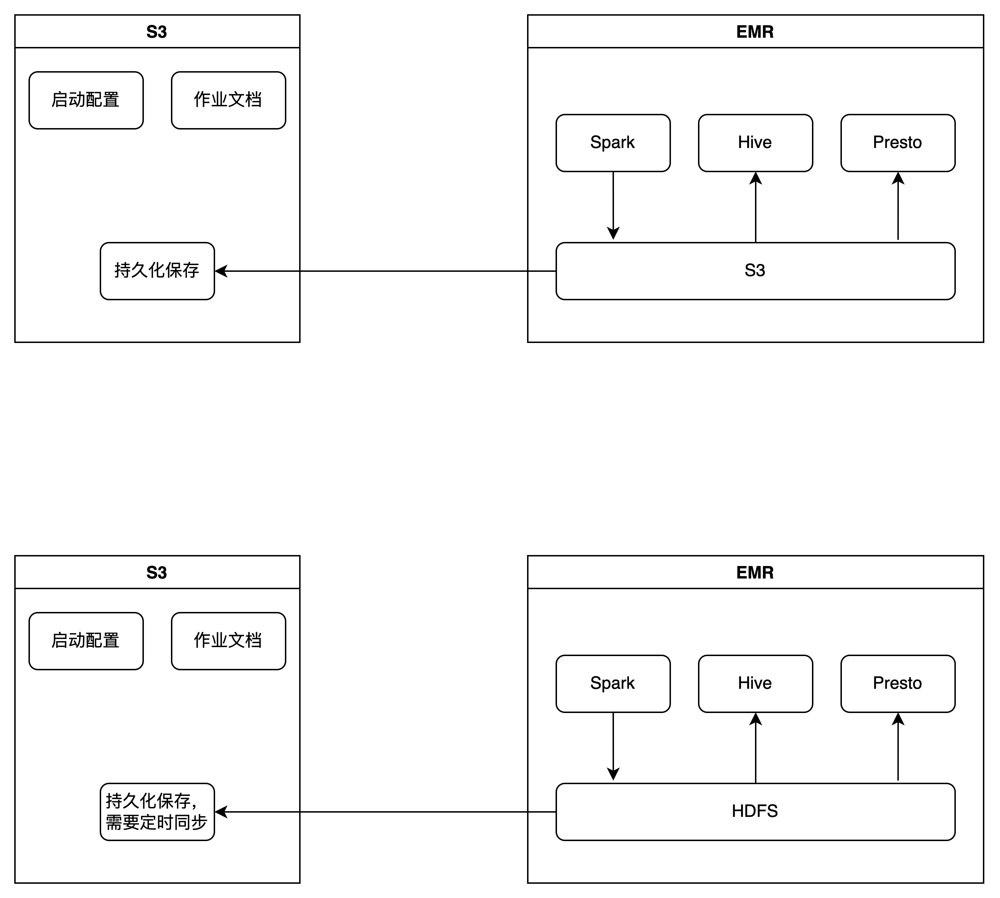

## superset

基本想法是使用EC2的instance，在上面构建Docker，然后搭建Superset节点。可参考gpt的配置文档。

选择Docker的考虑是易于部署多个不同的BI工具，

```shell
sudo systemctl start docker
docker start superset
```


[hadoop@ip-172-31-1-127 ~]$ 

spark-submit data_analysis_final.py s3://linkanalysis/input.txt s3://linkanalysis/outpu10.csv default.media default.processed


两种方案，第二种需要定期同步，性能略高，第一种需要进行配置。




[hadoop@ip-172-31-1-127 ~]$ hadoop distcp hdfs:///user/ s3://beta-tauc-data-analysis/backup/


hive hdfs同步到s3

```
# 导出每个表的CREATE TABLE语句到单独的文件
hive -e "SHOW TABLES" | while read table; do hive -e "SHOW CREATE TABLE $table;" > $table.hql; done

# 将所有的表结构导出到一个文件，并在每个语句后面加一个分号
hive -e "SHOW TABLES" | while read table; do echo "DROP TABLE IF EXISTS $table;" >> hive_export.hql; hive -e "SHOW CREATE TABLE $table;" >> hive_export.hql; echo ";" >> hive_export.hql; done

[hadoop@ip-172-31-1-127 ~]$ aws s3 cp hive_export.hql s3://beta-tauc-data-analysis/other_backup/hive_export.hql

```


