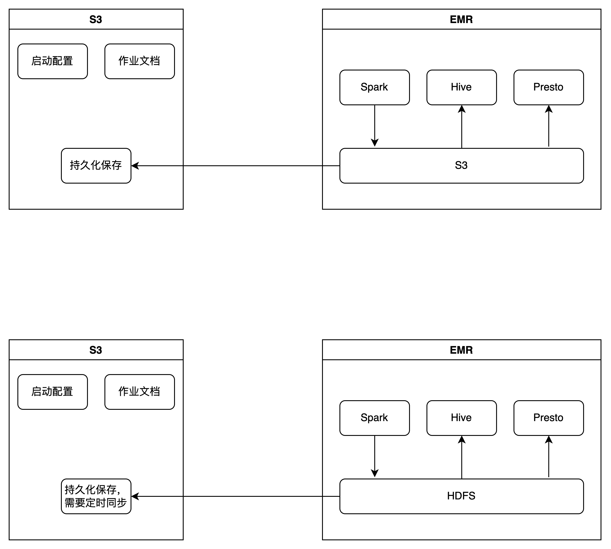

# 总体架构

```shell
tauc-data-show/
├── superset/
│   
tauc-etl/
└── postgre sql
│ 
tauc-data-security/
└── postgre sql

```

常用操作

```
ssh -i /Users/sunhao/Downloads/test-ap1.pem -L 8088:localhost:8088 ec2-user@ec2-18-136-215-233.ap-southeast-1.compute.amazonaws.com

scp -i /Users/sunhao/Downloads/test-ap1.pem -r /Users/sunhao/Documents/EC2_Props/tauc-data-analysis ec2-user@ec2-18-136-215-233.ap-southeast-1.compute.amazonaws.com:/home/ec2-user
```


# Elastic IP

如果需要将新的ec2使用旧的eip，则需要删除旧的主机密钥重新连接。

```
[11:25] (ﾉ>ω<)ﾉ \w $ ssh -i /Users/sunhao/Downloads/test-ap1.pem ec2-user@ec2-18-136-215-233.ap-southeast-1.compute.amazonaws.com
@@@@@@@@@@@@@@@@@@@@@@@@@@@@@@@@@@@@@@@@@@@@@@@@@@@@@@@@@@@
@    WARNING: REMOTE HOST IDENTIFICATION HAS CHANGED!     @
@@@@@@@@@@@@@@@@@@@@@@@@@@@@@@@@@@@@@@@@@@@@@@@@@@@@@@@@@@@
IT IS POSSIBLE THAT SOMEONE IS DOING SOMETHING NASTY!
Someone could be eavesdropping on you right now (man-in-the-middle attack)!
It is also possible that a host key has just been changed.
The fingerprint for the ED25519 key sent by the remote host is
SHA256:IMZtaRuk/OJpF0RlpsV28cbr5zDH+ZV7Z2FjhcOx4bU.
Please contact your system administrator.
Add correct host key in /Users/sunhao/.ssh/known_hosts to get rid of this message.
Offending ECDSA key in /Users/sunhao/.ssh/known_hosts:75
Host key for ec2-18-136-215-233.ap-southeast-1.compute.amazonaws.com has changed and you have requested strict checking.
Host key verification failed.
```

```
[11:26] (ﾉ>ω<)ﾉ \w $ ssh-keygen -R ec2-18-136-215-233.ap-southeast-1.compute.amazonaws.com
```


## superset

基本想法是使用EC2的instance，在上面构建Docker，然后搭建Superset节点。可参考gpt的配置文档。

选择Docker的考虑是易于部署多个不同的BI工具，

```shell
sudo systemctl start docker
docker start superset
```


[hadoop@ip-172-31-1-127 ~]$ 

spark-submit data_analysis_final.py s3://linkanalysis/input.txt s3://linkanalysis/outpu10.csv default.media default.processed


两种方案，第二种需要定期同步，性能略高，第一种需要进行配置。




[hadoop@ip-172-31-1-127 ~]$ hadoop distcp hdfs:///user/ s3://beta-tauc-data-analysis/backup/


hive hdfs同步到s3

```
# 导出每个表的CREATE TABLE语句到单独的文件
hive -e "SHOW TABLES" | while read table; do hive -e "SHOW CREATE TABLE $table;" > $table.hql; done

# 将所有的表结构导出到一个文件，并在每个语句后面加一个分号
hive -e "SHOW TABLES" | while read table; do echo "DROP TABLE IF EXISTS $table;" >> hive_export.hql; hive -e "SHOW CREATE TABLE $table;" >> hive_export.hql; echo ";" >> hive_export.hql; done

[hadoop@ip-172-31-1-127 ~]$ aws s3 cp hive_export.hql s3://beta-tauc-data-analysis/other_backup/hive_export.hql

```


