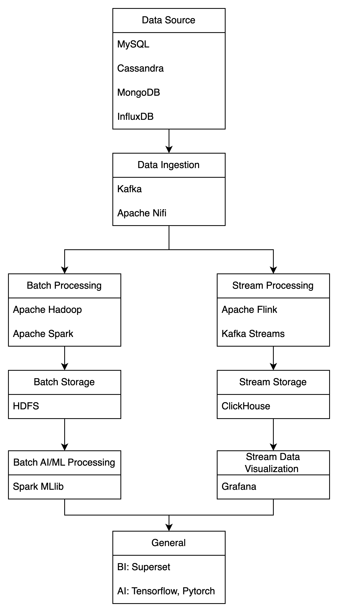

## Spark


### Spark组成


Spark sql 结构化处理数据

Spark Streaming 的本质是微批处理，它将数据流进行极小粒度的拆分，拆分为多个批处理，从而达到 接近于流处理的效果。


### WordCount

```scala
// 读取 HDFS 上的文件
val textFile = sc.textFile("hdfs://hadoop:9000/md/input/input.txt")

// 使用正则表达式拆分每一行
val counts = textFile.flatMap(line => line.split("\\s+")).map(word => (word, 1)).reduceByKey(_ + _)

// 收集结果并打印
counts.collect().foreach(println)

```


### Hadoop整合配置

Spark有内建hadoop，但本地运行效率较低


### RDD & DateFrame

RDD：函数式编程（上述WordCount），非结构化数据（流媒体，字符流）

DataFrame：结构化数据

（flink和Hive使用待完善


spark累加器/广播变量etc

## 数据分析

### 框架选择


MapReduce 的限制

- 迭代性能：
- MapReduce 框架不是为迭代计算设计的。每次迭代都需要从头开始读取数据，处理完毕后再将结果写入磁盘，这导致了大量的磁盘 I/O 操作，使得迭代计算非常低效。
- 状态管理：
- 在 MapReduce 中，维护算法状态（如每个页面的 PageRank）需要手动实现，通常通过多次读写磁盘来保持迭代间的状态。这增加了复杂性并降低了性能。

下面绘制图片描述流处理和批处理的组件选择。



### SQL计算

|        | SQL                | Hive QL                | SparkSQL                          | FlinkSQL               |
| ------ | ------------------ | ---------------------- | --------------------------------- | ---------------------- |
| 数据源 | 关系型数据库       | HDFS上的数据           | HDFS，HBase，JDBC，Cassandre，etc | Kafka，JDBC，HDFS，etc |
| 性能   | 依赖具体数据库实现 | 低，但适合大规模批处理 | 高                                | 低延迟                 |
| 批与流 | \                  | \                      | 支持，批实现流                    | 支持，流实现批         |

总结：

批处理报表：HiveQL

交互式报表：SparkSQL

实时报表：FlinkSQL


### 迭代计算

MapReduce不适合迭代计算的点在于

AI应用场景有下述需要考虑：

Spark：进行离线计算，适合大规模分布式训练和批处理。

Flink：适合实时数据处理和低延迟推理。

Spark起步较早，因此自带MLlib，并且SparkSql和Streaming功能能与其机器学习框架无缝衔接。而对于通用的深度学习框架 Tensorflow 和 Pytorch 同时支持两个平台，主要看应用场景是倾向于离线计算还是在线推理。


## 落地点

### ECO数据报表


### QoE数据分析


### 网页链路分析

前端欧工和仇工讨论过的需求，在子页面使用gpt简要分析了一下不同框架计算的情况。