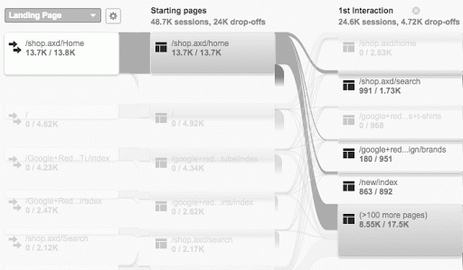
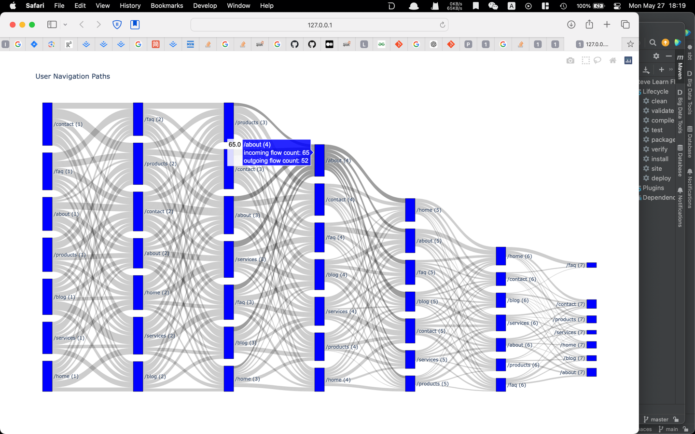
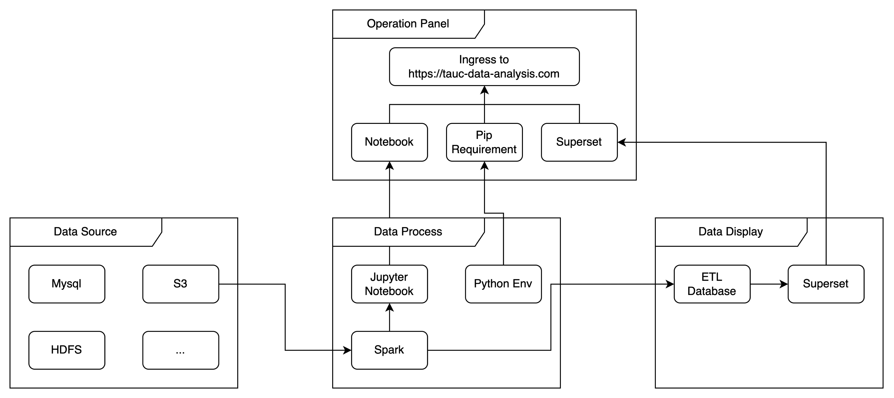

## 数据分析部分

```json
{"uvi": "user493", "el": [{"path": "/blog", "ct": "2024-05-27T11:40:36.263222"}, {"path": "/about", "ct": "2024-05-27T11:41:36.263222"}, {"path": "/services", "ct": "2024-05-27T11:44:36.263222"}, {"path": "/blog", "ct": "2024-05-27T11:52:36.263222"}, {"path": "/about", "ct": "2024-05-27T11:44:36.263222"}]}
```

我们在本地生成这种样式的数据，uvi和el中的第一个ct作为该数据的唯一标志符，然后将其访问链路进行读取，按照权重转化为下述格式。

```
path_chain,count
/contact -> /services -> /faq -> /contact,2
/contact -> /faq -> /faq,2
/contact -> /products -> /blog,2
```



我们参考Google Analysis提供的Sankey图，根据处理好的数据生成下述状态的示意图。




## 微服务部署

### 通用部署方案

在上述工作完成后，前段欧工认为问题的重心是如何从S3读取数据然后进行作业处理，最后在superset展示。



分为四个模块：数据源，数据处理，数据展示，操作面板。

数据处理底层使用Spark框架，可以单机部署也可以集群部署。Spark框架可接入多种数据源。

此外：在操作面板部分需要考虑权限控制，数据从数据源出来后到数据处理过程中需要考虑数据脱敏问题。


### TAUC链路分析部署

结合平台组陈建平的会议沟通内容，最后选型使用AWS EMR，可以理解为封装好的Spark分布式集群。

以节约成本考虑：本案例链路分析原始数据为AWS S3，EMR提交pyspark脚本从S3读取数据并做处理，将处理好的以供展示的数据重新写入S3，Superset使用etl工具连接数据源并展示报表。

此外，在dev和uat环境下，给EMR配置Notebook接口便于快速debug。


### 细节问题（TODO）

#### 1. s3的分层存储

需要了解哪些数据是用standard存放，而哪些访问的频率更低。

需要了解s3存放的数据的格式，以及原始数据是否可以直接连接到spark。


#### 2. Spark 和 S3 的连接

连接方式有多种，目前实现为Python库boto3连接。为后续性能优化考虑，使用AWS S3接口或者Spark接口，后者使用了Hadoop系统需要评估是否需要避免。


#### 3. S3 连接 Superset

目前使用的是 etl-postgre 的连接，算写中间库，需要结合成本考虑是否换掉，或者使用zero etl形式。


### 4. 大数据部资源整合问题

目前提供的思路是使用EMR账号，此外是否存在或者需要部署Python环境避免多次下载包的不轻便情况。

notebook的数据处理，分布式spark

绘制sankey图名称，

spark-数据库 连接

emr账号


## 本地配置细节

### 本地加载卷

为了防止每次重新配置都需要加载文件，可以将notebook，python环境，minio的具体文件设置在本地，然后通过配置的形式加载到docker。

### minIO

最好使用mc客户端来对文件进行存取操作，虽然连到notebook后可以通过boto3进行。

```shell
$ mc mb myminio/standard-bucket
Bucket created successfully `myminio/standard-bucket`.
$ mc cp /Users/sunhao/Desktop/pythonProject/input.txt myminio/standard-bucket/input.txt 
```


需补充Python环境和Notebook持久化部署方案
