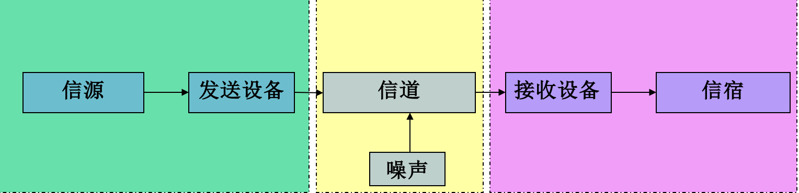
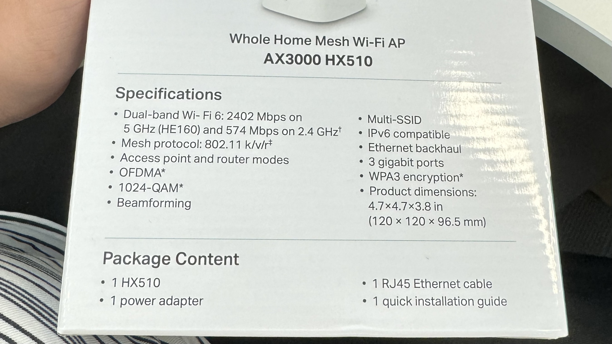
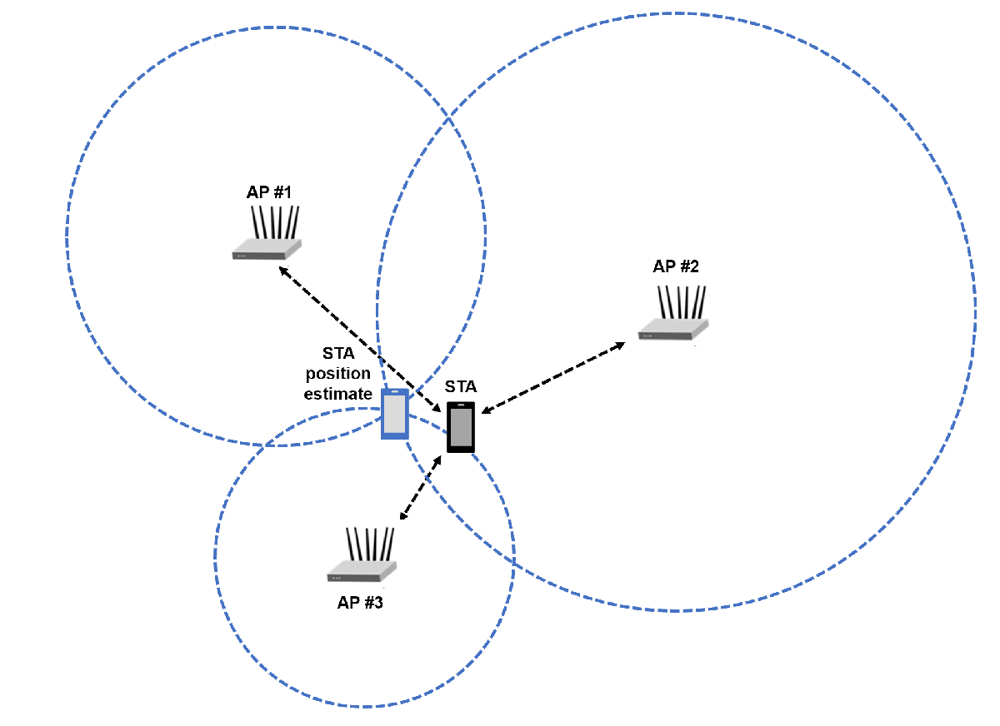

# wi-fi虚拟系统MVP

## 一、真实数据建模部分

### 1.1 获取设备信息

设备信息包括三个部分：路由设备，终端设备，服务器设备。

HX510产品设想的是家庭Mesh组网下的双AP多终端的使用场景。

#### 路由设备

HX510参数

使用Wi-Fi 6技术及OFDMA能推断其使用协议为802.11ax协议。对于Wi-Fi6E使用6GHz对Wi-Fi6进行扩频。

HE 160 使用high efficient 160MHz技术。

对于Wi-Fi 6，matlab提供MAC Frame以及Waveform两个级别的仿真工具。

#### 终端设备

同理可对终端设备建模

### 1.2 获取环境信息

https://ww2.mathworks.cn/help/wlan/ref/wlantgaxchannel-system-object.html

考虑家用场景，使用小尺度衰落模型。

matlab提供适用于802.11ax的多径衰落信道仿真模型，在TR 38.901中定义使用笛卡尔坐标系构建真实物理场景可以使用光追模型去模拟环境中的障碍物。

### 1.3 仿真意义

在仿真模型中加入干扰场景 蓝牙，5G，墙壁和地面，障碍物等信息。并设置不同的阈值定义的KPI。可以在模拟复杂网络环境中检测KPI的变化状况，以此快速校验TAUC系统QoE-KPI设置的准确性。

## 二、真实数据拟合虚拟数据

考虑到802.11系列协议的更新，本部分有两种做法，对于支持使用AI感知性能的设备，可以直接进行全屋测绘。对于不支持的，则试图将仿真数据和真实数据进行拟合。 

### 2.1 AI感知

如果使用的路由器支持802.11bf或者802.11az，即具备相应的无线感知能力，可作为传感器使用，则该设备组网的家庭系统可以对全屋进行建模，其底层实现为MIMO矩阵 计算。

使用空间的三个定位点AP预测STA所在位置，目前802.11.az提供对无线感知的支持，可以使用MIMO阵列传感器使用MUSIC算法（矩阵理论）对STA进行测距。

### 2.2 数据拟合

在不支持无线感知的系统中，可以试图使用统计数据和机器学习将收集的数据拿来拟合仿真的模型。（需要调研）

比如可以使用RSSI进行测距，该方法使用室内的小尺度衰减模型使用RSSI对距离进行估计，在华为iMaster中有相关使用，精度较差。

假设有一堵墙两边有两台无线路由设备，那么在墙的两侧的终端的信号强度在两个AP上会有明显跳变，则可以根据衰减去拟合该墙体。

## 三、达成目标

1. 使用虚拟环境对真实环境拟合，获取理论指导峰值。
2. 验证参数之间关联。
3. 实际数据的回归验证。
4. 全屋信号诊断。

Reference

针对干扰源建模

https://users.ece.utexas.edu/~bevans/projects/rfi/software/

https://ww2.mathworks.cn/help/wlan/ug/create-configure-and-simulate-an-802-11ax-mesh-network.html  