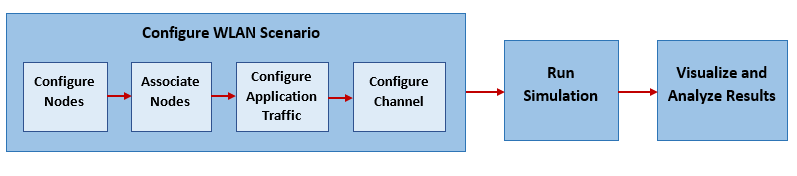
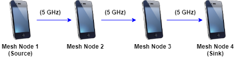
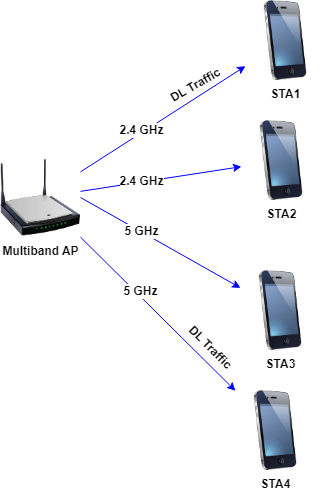
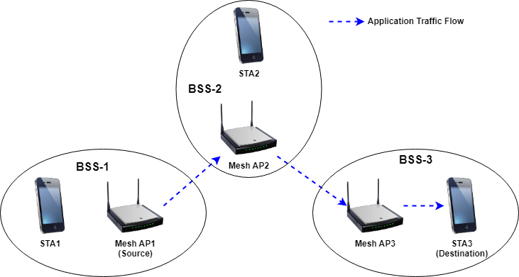
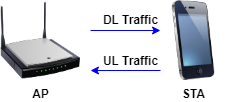

[TOC]

## Matlab Example

建模层次：

1. 使用现有工具套件：matlab提供无线网络模拟工具
2. 自行编写DLL层，PHY层与无线信道通信。


### 使用无线网络模拟工具

输入 AP 和 STA 的信息，以及 STA 如何消费数据的网络流程，即可构建简单的模型。

Matlab提供一套完整的通信系统仿真流程。

本文解读其提供的 Wi-Fi6 相关案例

## 系统级仿真案例

### [Get Started with WLAN System-Level Simulation in MATLAB](https://ww2.mathworks.cn/help/wlan/ug/getting-started-with-wlan-system-level-simulation-in-matlab.html)



本部分的参数配置需要进一步学习 。


### [Create, Configure, and Simulate an 802.11ax Mesh Network](https://ww2.mathworks.cn/help/wlan/ug/create-configure-and-simulate-an-802-11ax-mesh-network.html)

Using this example, you can:

1. Create and configure an 802.11ax mesh network consisting of four mesh nodes.
2. Generate, configure, and add on-off application traffic between the mesh nodes.
3. Add mesh paths to route application traffic from the source node to the sink node.
4. Simulate the 802.11ax mesh network and visualize the statistics.

The example simulates this mesh network scenario.



```matlab
rng(1,"combRecursive");
% 设置随机数函数


% 设置笛卡尔坐标系下的MeshMode位置
nodeNames = ["MeshNode1","MeshNode2","MeshNode3","MeshNode4"];
nodePositions = [10 0 0; 20 0 0; 30 0 0; 40 0 0];              % x-, y-, and z-coordinates, in meters


% 设置Mesh节点配置（需进一步调研与实际路由器接近
% 设置配置，加载配置。
meshNodeCfg = wlanDeviceConfig(Mode="mesh",BandAndChannel=[5 36],MCS=7,TransmitPower=15);
meshNodes = wlanNode(Name=nodeNames, Position=nodePositions, DeviceConfig=meshNodeCfg);

% 设置无线网流量
trafficSource = networkTrafficOnOff(DataRate=50000,PacketSize=1500);
addTrafficSource(meshNodes(1),trafficSource,DestinationNode=meshNodes(4));


% 设置mesh组网流量通道
addMeshPath(meshNodes(1),meshNodes(4),meshNodes(2));
addMeshPath(meshNodes(2),meshNodes(4),meshNodes(3));
addMeshPath(meshNodes(3),meshNodes(4));

% 将节点打入到networkSimulator
addNodes(networkSimulator,meshNodes);


% 运行，需指定时间
run(networkSimulator,simulationTime);

% 统计
stats = statistics(meshNodes)
```


### [Simulate a Multiband 802.11ax Network](https://ww2.mathworks.cn/help/wlan/ug/simulate-a-multiband-80211ax-network.html)

This example shows how to create, configure, and simulate an IEEE® 802.11ax™ (Wi-Fi 6) network operating in the 2.4 GHz and 5 GHz band.

Using this example, you can:

1. Create and configure an 802.11ax network consisting of a multiband access point (AP) and four stations (STAs).
2. Configure the multiband AP to operate in the 2.4 GHz and 5 GHz bands.
3. Associate the STAs with the AP and add full buffer downlink (DL) application traffic between them.
4. Simulate the multiband band 802.11ax network.

The example simulates this scenario.




```matlab
% 配置双频段Cfg
accessPointCfg1 = wlanDeviceConfig(Mode="AP",BandAndChannel=[2.4 11]);
accessPointCfg2 = wlanDeviceConfig(Mode="AP",BandAndChannel=[5 36]);
accessPoint = wlanNode(Position=[0 0 0],DeviceConfig=[accessPointCfg1,accessPointCfg2]);

% 配置STA
stationCfg1 = wlanDeviceConfig(Mode="STA",BandAndChannel=[2.4 11]);
stationCfg2 = wlanDeviceConfig(Mode="STA",BandAndChannel=[5 36]);

% sta可以以路由器组的形式存在
stations1 = wlanNode(Position=[10 0 0; 0 10 0],DeviceConfig=stationCfg1);  % STA1 and STA2 on 2.4 GHz band
stations2 = wlanNode(Position=[0 0 10; 10 10 0],DeviceConfig=stationCfg2); % STA3 and STA4 on 5 GHz band

% FullBufferTraffic，选配全量开关off(default)/on/DL/UL
associateStations(accessPoint,[stations1(1),stations2(2)],FullBufferTraffic="DL");

```


### [Simulate an 802.11ax Hybrid Mesh Network](https://ww2.mathworks.cn/help/wlan/ug/simulate-a-802-11ax-hybrid-mesh-network.html)


This example shows how to create, configure, and simulate an IEEE® 802.11ax™ (Wi-Fi 6) hybrid mesh network.

Using this example, you can:

1. Create and configure an 802.11ax hybrid mesh network consisting of three mesh access points (APs) and three stations (STAs).
2. Configure the mesh APs to operate in the 2.4 GHz and 6 GHz bands.
3. Associate the STAs with the mesh APs.
4. Generate, configure, and add on-off application traffic between an AP and a STA.
5. Add mesh paths to route the application traffic from the source to the destination.
6. Simulate the 802.11ax hybrid mesh network.

The example simulates this scenario.



```matlab
% 将不同sta和ap连接起来
associateStations(meshAPs(1),stations(1));
associateStations(meshAPs(2),stations(2));
associateStations(meshAPs(3),stations(3));

% 经过多个节点的通信
trafficSource = networkTrafficOnOff(DataRate=1e5);
addTrafficSource(meshAPs(1),trafficSource,DestinationNode=stations(3));
```


### [Simulate an 802.11ax Network with Abstracted PHY and Calculate MAC Throughput](https://ww2.mathworks.cn/help/wlan/ug/mac-and-phy-layer-abstraction-in-system-level-simulation.html)

Using this example, you can:

1. Create and configure a two-node 802.11ax network consisting of one access point (AP) and one station (STA).
2. Associate the STA with the AP and add full buffer uplink (UL) and downlink (DL) application traffic.
3. Configure the AP and STA to implement full MAC and an abstracted PHY.
4. Simulate the 802.11ax network and measure MAC throughput

The example simulates this scenario.


The `MACFrameAbstraction` and `PHYAbstractionMethod` properties of the [`wlanNode`](https://ww2.mathworks.cn/help/wlan/ref/wlannode.html) object enable you to configure MAC and PHY layer abstraction. The valid values for these properties are:

- `MACFrameAbstraction` — `true` (default) or `false`. The default value of this property enables you to use abstracted MAC. To use the full MAC, set this property to `false`.
- `PHYAbstractionMethod` — `"tgax-evaluation-methodology"`(default), `"tgax-mac-calibration"`, or `"none"`. To use the abstracted PHY, set this property to `"tgax-evaluation-methodology"` or `"tgax-mac-calibration"`. If you set this property to `"tgax-evaluation-methodology"`, the PHY estimates the performance of a link with the TGax channel model by using an effective signal-to-interference-plus-noise-ratio (SINR) mapping. If you set this property to `"tgax-mac-calibration"`, the PHY assumes a packet failure due to interference without actually calculating the link performance. To use the full PHY, set this property to `"none"`.


```matlab
% 配置MAC和PHY层信息
MACFrameAbstraction = false;
PHYAbstractionMethod = "tgax-mac-calibration";

% 注意这里可以使用MCS和功率
accessPointCfg = wlanDeviceConfig(Mode="AP",MCS=2,TransmitPower=15);    % AP device configuration
stationCfg = wlanDeviceConfig(Mode="STA",MCS=2,TransmitPower=15);       % STA device configuration

accessPointStats = wlanNode(Name="AP", ...
    Position=nodePositions(1,:), ...
    DeviceConfig=accessPointCfg, ...
    PHYAbstractionMethod=PHYAbstractionMethod, ...
    MACFrameAbstraction=MACFrameAbstraction);

station = wlanNode(Name=["STA"], ...
    Position=nodePositions(2,:), ...
    DeviceConfig=stationCfg, ...
    PHYAbstractionMethod=PHYAbstractionMethod, ...
    MACFrameAbstraction=MACFrameAbstraction);
    
% 计算吞吐量
accessPointThroughput = (accessPointStats(1).MAC.TransmittedPayloadBytes*8)/simulationTime
stationThroughput = (stationStats(1).MAC.TransmittedPayloadBytes*8)/simulationTime
```


### [Simulate an 802.11ax Network with Uplink and Downlink Application Traffic](https://ww2.mathworks.cn/help/wlan/ug/configure-uplink-and-downlink-traffic-at-802-11ax-access-point.html)

Using this example, you can:

1. Create and configure an 802.11ax network consisting of an access point (AP) and a station (STA).
2. Associate the STA with the AP.
3. Generate, configure, and add UL and DL on-off application traffic between the STA and the AP.
4. Simulate the 802.11ax network and visualize the statistics.

The example simulates this scenario.



设置双向的trafficSourceDL即可


Ref：

https://ww2.mathworks.cn/help/wlan/ref/wlannode.html

https://ww2.mathworks.cn/help/wlan/ref/wlandeviceconfig.html
