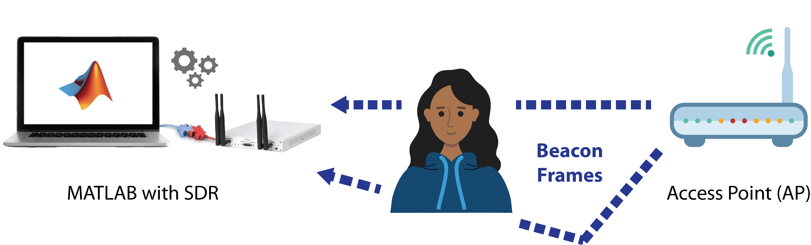
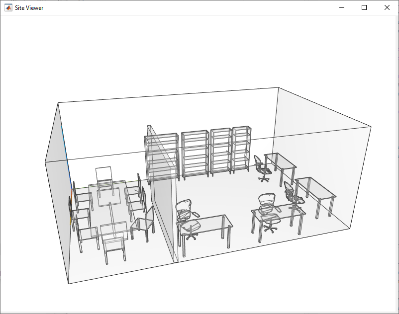
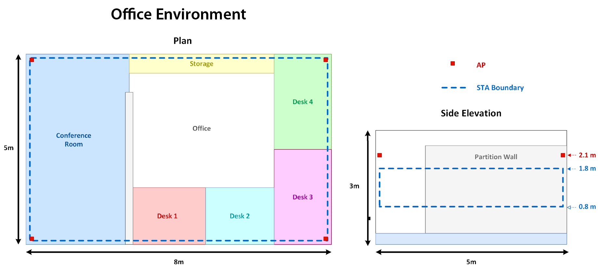

AI应用

https://ww2.mathworks.cn/help/wlan/ai-positioning-and-sensing.html

802.11部分协议支持AI，定位和感知功能，这也很容易想见，MIMO系统本身就有很强的定位能力，底层原理就是矩阵论那一套，只是之前没往这边发展，在802.11.bf和802.11.az协议中正式提出。

给予802.11.az的指纹定位

系统级仿真

https://ww2.mathworks.cn/help/comm/system-level-simulation.html