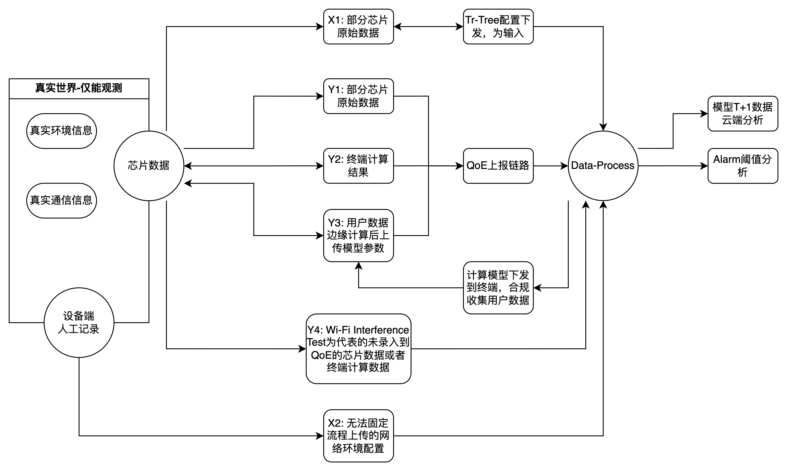
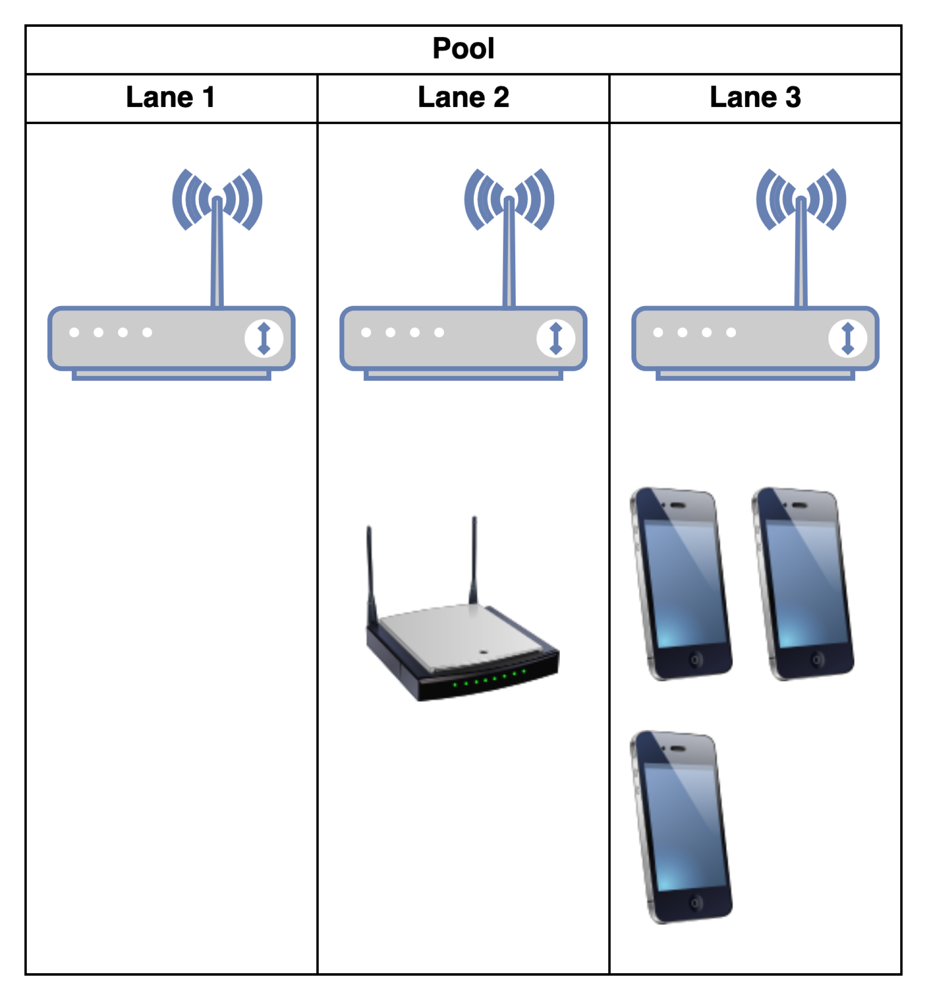

## 一、需求明确

### 核心思想：

我们能帮设备端做什么？我们能获得什么？

设备上报数据也能得到统计分析结果。

我们能有一个有标签有实际意义的测试环境。

### 设备端需求：

目标：在这些环境和场景下，测试样机的表现，要求是功能无异常，性能不弱于对比样机。

做法：设备端需要尽量拟合实际的用户环境和使用场景，所以先需要知道用户环境和使用场景是咋样的，然后构造相应的环境和使用场景。

TAUC支持：数据分析得出用户的使用场景。

### 云端需求

重心：如何根据用户环境指标去合理地触发alarm

设备端支持：需要一个参数去表征当前环境下的体验到底是怎么样的，可能需要实测或非QoE数据。

需求点1：Alarm优化

1. 给Alarm提供干净数据的测试环境
2. 产品提及使用时序分析的方式针对用户网络进行特定化判断。

需求点2：大数据平台计算结果准确性

3. 给数据分析的流程构建测试环境：当前分析出来的结果能和实际场景对应

## 二、数据管理：

| 真实环境                        | 输出数据                       | 输入数据               |
| ------------------------------- | ------------------------------ | ---------------------- |
| 设备绝对环境信息A0 （无法获取） | 芯片数据 Y1-Y4，对A经过X的观测 | X1：下发的设备配置     |
| 设备绝对通信信息A1 （无法获取） | 主管观测数据Y5                 | X2：设备端手工测量数据 |

物理模型就是这边能操控X1，X2，和环境一起作用在A0-A1，拿到Y1-Y4，分析出报表和其他Y值。

目前只规划了客观观测数据Y，主观观测数据即用户体验暂无规划

## 三、实现规划

### 1. MVP实现

那我理解就是如果只考虑一个简单的实现的话，我就可能需要给同一个ap-sta组合配置三个环境，一个旁边有别的路由器干扰，一个放了一台蓝牙设备或者烤箱，一个就正常，我想去区分这三个环境除了qoe正常上报的数据，可能就还需要能录入干扰源的一些参数和指标，以及可能的话如果这边分析不出来结果的话可以再把芯片原始数据里看能不能挑一些能有结果的。

### 2. 需求规划

1. wifi coverage是由三个sta算出来的值，是不是可以考虑等高线形式告诉客户家里哪些位置网络不好？
2. 数据增广：tr-tree下发ap功率，电动导轨改变ap-sta距离，增加训练参数。

## 四、如何使用该实验室环境？

我理解就是把实验环境设备上报数据到tauc，然后tauc通过配置下发的方式去改设备功率什么的？

### 前序条件：

设备端实验室规模，实验设置，在上海整一套是否合适。

### TAUC接入流程

1. 设备信息录入基础云
2. 挂载到tauc
   1. beta环境，测试时间保留较长的环境。
   2. staging环境，发布代码频率较低，稳定更接近生产。

3. 环境描述信息。

### 配置下发：

1. 咨询设备端下发配置的方式
2. tauc-network能改tr-tree的方式更新设备信息，批量获得不同测试环境

