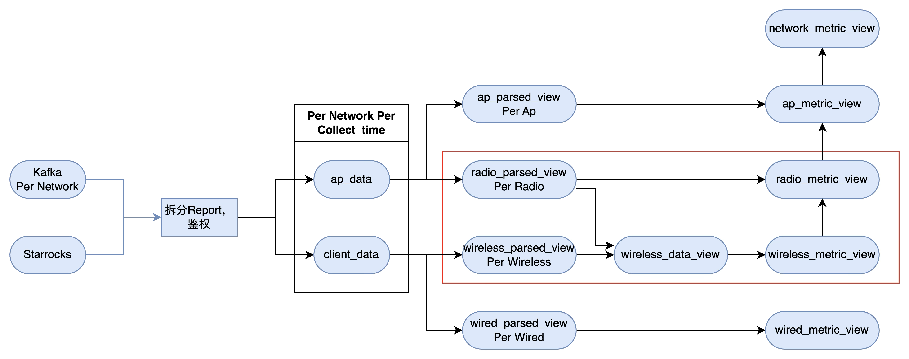

**窗口函数调研文档：基于无线指标与聚合案例**

本文档围绕一个无线网络质量（QoE）监控场景中的窗口聚合与 Join 实践，深入分析 Flink 窗口操作的类型、语义、性能特征，以及常见陷阱和优化策略。

---

## 一、案例背景

* 输入流 `wireless_metrics_view`：主键 `ap_mac`、`band`、`client_mac`、`collection_time`（事件时间），及其他wireless维度的指标。

- 输入流 `radio_metrics_view`：主键由 `(ap_mac, band, collection_time)` 组成，其他字段为radio频段维度的测量指标。
- 目标：对 `wireless_metrics_view` 按 AP（`ap_mac`）、频段（`band`）和 2 分钟滚动窗口聚合，统计每个窗口内的 `wireless_count`；原本希望用完全相同的 `collection_time` 做精确匹配，但由于业务场景下数据约 15 分钟一条，因此采用时间区间匹配（± 窗口长度或自定义宽限）来关联 `radio_metrics_view`，效果和精确匹配一致。


---

## 二、窗口聚合函数对比

| 函数             | 含义                       | 输出事件属性                    | 流类型      |
| ---------------- | -------------------------- | ------------------------------- | ----------- |
| TUMBLE\_START    | 窗口开始时间               | 无 watermark                    | UPSERT      |
| TUMBLE\_END      | 窗口结束时间               | 无 watermark                    | UPSERT      |
| TUMBLE\_ROWTIME  | 窗口结束时间，带 watermark | 保留 watermark 语义（事件时间） | APPEND-ONLY |
| TUMBLE\_PROCTIME | 基于处理时间的窗口结束时间 | 不适用于事件时间对齐            | APPEND-ONLY |

**建议**：若后续要做 Join 或持久化到文件/S3，尽量输出带 watermark 的事件时间字段（`TUMBLE_ROWTIME`），保证下游算子可以正常触发并输出 Append-only 流。


最初使用：

```sql
CREATE VIEW radio_by_wireless_view AS
SELECT
  ap_mac,
  band,
  TUMBLE_START(collection_time, INTERVAL '2' MINUTE) AS window_start,
  COUNT(*) AS wireless_count
FROM wireless_metrics_view
GROUP BY ap_mac, band, TUMBLE(collection_time, INTERVAL '2' MINUTE);
```

遇到：`TUMBLE_START` 输出列无 watermark，导致下游 Join 退化成 UPSERT 流，不可直接写入 S3。


更新后使用

```mysql
CREATE VIEW radio_by_wireless_view AS
SELECT
  ap_mac,
  band,
  -- 用 TUMBLE_ROWTIME 而不是 TUMBLE_START，保留 ROWTIME & watermark
  TUMBLE_ROWTIME(collection_time, INTERVAL '2' MINUTE) AS collection_time,
  COUNT(*)                                    AS wireless_count
FROM wireless_metrics_view
GROUP BY
  ap_mac,
  band,
  TUMBLE(collection_time, INTERVAL '2' MINUTE)
;
```


---

## 三、窗口 Join 模式

### 1. Regular Join vs Window Join

* **Regular Join**：两条 Append-Only 流在无窗口时做等值 Join，本质会根据键维护跨作业状态，可能产生 UPSERT。
* **Window Join**：基于事件时间窗口对两个流进行 Join，自动分配状态快照和水印对齐，输出 Append-Only。

### 2. 本案例的 Join 实现

```sql
CREATE VIEW radio_multi AS
SELECT a.*, r.wireless_count
FROM radio_metrics_view AS a
JOIN radio_by_wireless_view AS r
  ON a.ap_mac = r.ap_mac
 AND a.band   = r.band
 AND a.collection_time BETWEEN
       r.collection_time - INTERVAL '2' MINUTE
   AND r.collection_time + INTERVAL '2' MINUTE;
```

* 通过 `BETWEEN window_time ±2 分钟` 保留一定宽限区间，兼顾延迟和完整性。

---

## 四、其他窗口函数 & 典型模式

1. **Sliding (Hop) Window**：`HOP(table, DESCRIPTOR(ts), INTERVAL '1' MINUTE, INTERVAL '5' MINUTE)`，用于多频度统计。
2. **Session Window**：`SESSION(table,..., INTERVAL '30' SECOND)`，适合 DPI 类事件分组。
3. **Cumulate Window**：累积窗口，`CUMULATE(table, ..., INTERVAL '1' MINUTE, INTERVAL '5' MINUTE)`。
4. **TOP-N**：窗口聚合后按度量排序，常见写法：

```sql
SELECT * FROM (
  SELECT *, ROW_NUMBER() OVER (PARTITION BY window_start ORDER BY wireless_count DESC) AS rn
  FROM windowed_table
) WHERE rn <= 5;
```

---

## 五、性能与优化建议

* **优先使用 Append-Only**：保持 `APPEND` 流减少状态规模与输出去重。
* **避免过多维度**：多字段 `GROUPING SET` 时关注状态爆炸；设置合理 TTL。
* **合理 watermark 边界**：保证窗口延迟与乱序容忍度平衡。
* **侧输出异常**：对超过 watermark 最大延迟的数据使用侧输出流捕获。

---

## 六、参考文档

* Group Aggregation | Apache Flink
* Windowing TVF | Apache Flink
* Window JOIN | Apache Flink
* Window Top-N | Apache Flink

*更新日期：2025-05-09*


GroupBy方案



|                      | 指标维度                       | 备注                                   |
| -------------------- | ------------------------------ | -------------------------------------- |
| ap_data              | time.network                   | 原始数据                               |
| client_data          | time.network                   | 原始数据                               |
| ap_parsed_view       | time.network.ap                | 解析后结果                             |
| radio_parsed_view    | time.network.ap.radio          | 解析后结果                             |
| wireless_parsed_view | time.network.ap.radio.wireless | 解析后结果                             |
| wireless_data_view   | time.network.ap.radio.wireless | 将radio的noise字段引入到wireless       |
| wired_parsed_view    | time.network.ap.wired          | 解析后结果                             |
| ap_metric_view       | time.network.ap                | 同指标维度计算结果，接受低维度向上聚合 |
| radio_metric_view    | time.network.ap.radio          | 同指标维度计算结果，接受低维度向上聚合 |
| wireless_metric_view | time.network.ap.radio.wireless | 同指标维度计算结果，接受低维度向上聚合 |
| wired_metric_view    | time.network.ap.wired          | 同指标维度计算结果，接受低维度向上聚合 |


|                        |                                                              |
| ---------------------- | ------------------------------------------------------------ |
| radio_parsed_view      | Input                                                        |
| wireless_parsed_view   | Input                                                        |
| Radio_metric_view      | Output                                                       |
| wireless_metric_view   | Output                                                       |
| wireless_data_view     | wireless接受radio向下聚合的数据                              |
| radio_by_wireless_view | wireless层的计算结果按照相同time.ap.radio聚合成radio维度的视图 |


## 1.group by

### **（1）函数的轻重量级**

流式计算中有许多内存不友好操作，例如直接对两个流进行regular join，流的聚合中同样有类似的操作，此节主要列出操作的轻重量级程度，在开发中应当避免使用重量级的操作

重量级操作应当进行状态TTL设置、但是这会导致输出结果不准确

参考文档：[Group Aggregation | Apache Flink](https://nightlies.apache.org/flink/flink-docs-release-1.17/docs/dev/table/sql/queries/group-agg/)

|      | **名称** | **重量级程度**                     |
| ---- | -------- | ---------------------------------- |
| 1    | COUNT    | 轻                                 |
| 2    | MIN，MAX | 不定，对上流是UPSERT流时是重量级的 |
| 3    | DISTINCT | 重，需要维护所有不同的行           |

### **（2）GROUP SET**

flink允许对一个流同时按照多个维度进行聚合，例如一个流包含networkid字段和isp_admin_id字段，可以同时按照这两个维度进行group by、并将两个group by的结果进行union，可以用GROUPING_ID（networkid,isp_admin_id）区分具体是哪个group by的结果

这样对一个流同时按照多个粒度进行GROUP BY的操作被称为GROUP SET

文档：[Group Aggregation | Apache Flink](https://nightlies.apache.org/flink/flink-docs-release-1.17/docs/dev/table/sql/queries/group-agg/#grouping-sets)

GROUP SET的一种特殊用法是CUBE，CUBE相当于对所选字段进行排列组合并作为参数输入GROUP SET，因此CUBE是一种特殊的GROUP SET

ROLL UP也是一种特殊的GROUP SET，如ROLL UP（a,b,c,d），会依次按照abcd,abc,ab,a,null的组合进行group by操作

**GROUP SET可用于qoe指标计算，便于其按不同维度聚合**

## 2.window join 

windows join也是一种流与流的join方式，此join要求左流和右流都定义water mark作为唯一时间标识，然后将左流和右流在一个确定的时间窗口内进行join操作，即两个append only流进行join

参考文档：[Window JOIN | Apache Flink](https://nightlies.apache.org/flink/flink-docs-release-1.17/docs/dev/table/sql/queries/window-join/)

**在flink实现qoe的需求中应当和interval join没有本质性能区别**

## 3. 窗口函数的使用

### **（1）窗口类型**

见此文档：[Windowing TVF | Apache Flink](https://nightlies.apache.org/flink/flink-docs-release-1.17/docs/dev/table/sql/queries/window-tvf/)

主要有三种（session window似乎支持不是很好）

- [Tumble Windows](https://nightlies.apache.org/flink/flink-docs-release-1.17/docs/dev/table/sql/queries/window-tvf/#tumble)
- [Hop Windows](https://nightlies.apache.org/flink/flink-docs-release-1.17/docs/dev/table/sql/queries/window-tvf/#hop)
- [Cumulate Windows](https://nightlies.apache.org/flink/flink-docs-release-1.17/docs/dev/table/sql/queries/window-tvf/#cumulate)

### **（2）聚合操作**

[Window Aggregation | Apache Flink](https://nightlies.apache.org/flink/flink-docs-release-1.17/docs/dev/table/sql/queries/window-agg/#window-aggregation)

```
SELECT ...``FROM <windowed_table> -- relation applied windowing TVF``GROUP BY window_start, window_end, ..
```

便于理解，参考文档

### **（3）TOP-N**

必须在窗口聚合操作/窗口TVF后 [Window Top-N | Apache Flink](https://nightlies.apache.org/flink/flink-docs-release-1.17/docs/dev/table/sql/queries/window-topn/)

 

Window JOIN

Window Join # Batch Streaming A window join adds the dimension of time into the join criteria themselves. In doing so, the window join joins the elements of two streams that share a common key and ...