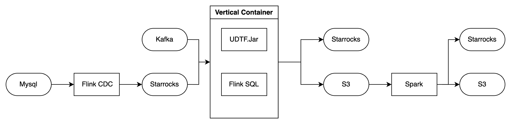

## 环境配置

### 整体组件配置

```
flink/
├── docker-compose.yml           ← 启动 Kafka + Flink + Producer
├── Dockerfile                   ← 自定义 Flink (1.14.3 + Python)
│
├── producer/                    ← Producer 服务
│   ├── Dockerfile
│   ├── requirements.txt
│   └── producer.py
│
└── qoe-flink-job/               ← PyFlink 作业代码（无需 Dockerfile）
    ├── run_job.py               ← 入口脚本
    ├── sql/
    │   ├── 01-create-qoe_raw.sql
    │   ├── 02-create-qoe_json.sql
    │   ├── 03-insert-qoe_json.sql
    │   ├── 04-create-joined_qoe.sql
    │   └── 05-insert-joined_qoe.sql
    └── udf/
        └── parse_qoe_raw.py
```


Dockerfile

```
COPY lib/ /opt/flink/lib/
```

docker-compose.yml

```yaml
  flink-jobmanager:
    image: my-flink:1.17.1
    container_name: flink-jobmanager
    hostname: flink-jobmanager
    command: jobmanager
    ports:
      - "8081:8081"
    environment:
      - JOB_MANAGER_RPC_ADDRESS=flink-jobmanager
    volumes:
      - ./qoe-flink-job:/opt/flink/jobs
      - ./flink-conf.yaml:/opt/flink/conf/flink-conf.yaml
      - ./core-site.xml:/opt/flink/conf/core-site.xml
      - ./plugins:/opt/flink/plugins
      - /Users/sunhao/IdeaProjects/SqlJob/target:/opt/flink/jars
    depends_on:
      - kafka
      - minio
```

修改了flink-conf.yaml, core-site.xml, plugins, lib 以便搭建简单的运行环境，也便于标准化部署到eks（如有必要）。


### 使用java的实现版本

执行所有sql命令

```shell
docker exec -it flink-jobmanager bash -c "./bin/sql-client.sh --jar /opt/flink/jars/SqlJob-1.0.5-SNAPSHOT.jar -f /opt/flink/jobs/sql/qoe-all.sql"
```

起停flink集群

```shell
docker-compose stop flink-jobmanager flink-taskmanager 
docker-compose up -d flink-jobmanager flink-taskmanager
```


## 代码样例

### 配置信息

基于java8及flink17构建udf

参考pom

```xml
<dependency>
    <groupId>org.apache.flink</groupId>
    <artifactId>flink-streaming-java</artifactId>
    <version>1.17.1</version>
</dependency>
<dependency>
    <groupId>org.apache.flink</groupId>
    <artifactId>flink-table-api-java-bridge</artifactId>
    <version>1.17.1</version>
</dependency>
```

### 解析代码

解析代码提供 input -> output 的映射关系

下述为代码及其对应的解析流程，从原始的Ap Json数据解析生成 Ap' Json

| Source     | Target                           |      |
| ---------- | -------------------------------- | ---- |
| Ap Raw     | Ap(Ap), ControllerId             |      |
| Client Raw | Client(Wireless), MultiAp(Wired) |      |

并构建测试方法方便对每段解析进行单元测试。

```java
package org.example;

import org.apache.flink.shaded.jackson2.com.fasterxml.jackson.databind.JsonNode;
import org.apache.flink.shaded.jackson2.com.fasterxml.jackson.databind.ObjectMapper;
import org.apache.flink.table.annotation.DataTypeHint;
import org.apache.flink.table.annotation.FunctionHint;
import org.apache.flink.table.functions.TableFunction;
import org.apache.flink.types.Row;

import java.util.ArrayList;
import java.util.List;

@FunctionHint(
        output = @DataTypeHint("ROW<ap_data STRING, client_data STRING, multiap_data STRING, controller_id STRING>")
)
public class ExtractQoeFunction extends TableFunction<Row> {

    private static final ObjectMapper objectMapper = new ObjectMapper();
    private transient java.util.function.Consumer<Row> testCollector = null;

    public void setTestCollector(java.util.function.Consumer<Row> collector) {
        this.testCollector = collector;
    }

    private void myCollect(Row row) {
        if (testCollector != null) {
            testCollector.accept(row);
        } else {
            super.collect(row);
        }
    }

    public void eval(@DataTypeHint("STRING") String apJson,
                     @DataTypeHint("STRING") String clientJson) {
        try {
            String apData = "";
            String clientData = "";
            String multiapData = "";
            String controllerId = "";

            try {
                JsonNode apRoot = objectMapper.readTree(apJson);
                JsonNode apNode = apRoot.path("WiFi").path("DataElements").path("Network");
                if (!apNode.isMissingNode() && !apNode.isNull()) {
                    apData = apNode.path("Device").toString();
                    controllerId = apNode.path("ControllerID").asText("");
                }
            } catch (Exception e) {
                System.out.println("DEBUG: Exception parsing apJson: " + e.getMessage());
            }

            try {
                JsonNode clientRoot = objectMapper.readTree(clientJson);
                JsonNode clientNode = clientRoot.path("WiFi").path("DataElements").path("Network");
                if (!clientNode.isMissingNode() && !clientNode.isNull()) {
                    clientData = clientNode.path("Device").toString();
                }

                JsonNode multiapNode = clientRoot.path("WiFi").path("MultiAP").path("APDevice");
                if (!multiapNode.isMissingNode() && !multiapNode.isNull()) {
                    multiapData = multiapNode.toString();
                }
            } catch (Exception e) {
                System.out.println("DEBUG: Exception parsing clientJson: " + e.getMessage());
            }

            myCollect(Row.of(apData, clientData, multiapData, controllerId));
        } catch (Exception ex) {
            myCollect(Row.of("ERROR:" + ex.getMessage(), "", "", ""));
        }
    }

    public List<Row> evalAndCollect(String apJson, String clientJson) {
        List<Row> results = new ArrayList<>();
        setTestCollector(results::add);
        eval(apJson, clientJson);
        setTestCollector(null);
        return results;
    }

    public static void main(String[] args) {
        String apValue = "{\"WiFi\":{\"DataElements\":{\"Network\":{\"ControllerID\":\"EA:DC:BF:FE:36:38\"," +
                "\"Device\":{\"1\":{\"ID\":\"EA:DC:BF:FE:36:38\",\"Radio\":{\"1\":{\"X_TP_Band\":\"2.4GHz\",\"Utilization\":\"89\"}}}}}}}}";
        String clientValue = "{\"WiFi\":{\"DataElements\":{\"Network\":{\"ControllerID\":\"EA:DC:BF:FE:36:38\",\"Device\":{\"1\":{\"ID\":" +
                "\"EA:DC:BF:FE:36:38\",\"Radio\":{\"1\":{\"X_TP_Band\":\"2.4GHz\",\"Utilization\":\"89\"}}}}}},\"MultiAP\":{\"APDevice\":" +
                "{\"0\":{\"MACAddress\":\"00:00:00:00:00:00\",\"Role\":\"Agent\"}}}}}";

        ExtractQoeFunction udf = new ExtractQoeFunction();
        List<Row> resultList = udf.evalAndCollect(apValue, clientValue);

        System.out.println("=== ExtractQoeFunction Test Output ===");
        for (Row row : resultList) {
            System.out.println("--------------------------------");
            System.out.println("ap_data:      " + row.getField(0));
            System.out.println("client_data:  " + row.getField(1));
            System.out.println("multiap_data: " + row.getField(2));
            System.out.println("controller_id:" + row.getField(3));
        }
    }
}
```

### Sql

需要声明操作的Source和target

```sql
CREATE VIEW parsed_qoe_view AS
SELECT
    J.collection_time,
    J.tr_id,
    T.controller_id,
    T.ap_data,
    T.client_data,
    T.multiap_data
FROM joined_result_view AS J,
     LATERAL TABLE(extract_qoe_udf(ap_value, client_value)) AS T(ap_data, client_data, multiap_data, controller_id);

```

