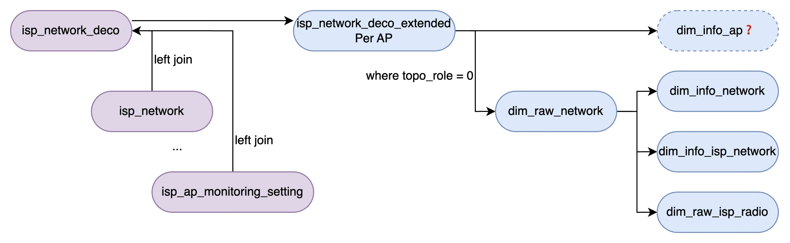

# Mysql查询设计

## 原理

## 业务设计

左侧紫色为实体表，右侧蓝色为View

查询流程：

1. 使用left join的形式将所有表拼成一张宽的物化视图
2. 在flink分配到不同维度进行对应计算

虚线dim_info_ap可考虑删除，后续讨论

## 使用规范

对当前用到的mysql表进行重新构建：

按照两个衡量标准：

1. 同一个isp的不同客户是否拥有不同的值
2. 该值的指标维度属于network/ap/radio的哪个层级
   1. 暂时不考虑network和topo的区别

按照现有的mysql情况构建下述View

| 表名                 | 主键                                 | 描述                                                      |
| -------------------- | ------------------------------------ | --------------------------------------------------------- |
| info_dim_isp_radio   | isp_admin_id, band                   | 同一个isp只有一套配置，该配置基于频段维度来提供           |
| info_dim_isp_network | isp_admin_id                         | 同一个isp只有一套配置，该配置基于网络维度来提供           |
| info_dim_ap          | isp_admin_id, controller_mac, ap_mac | 同一个isp下不同网络具有不同的信息，该信息基于ap维度提供   |
| info_dim_network     | isp_admin_id, controller_mac         | 同一个isp下不同网络具有不同的信息，该信息基于网络维度提供 |

isp_admin_id: isp的唯一标志符
controller_mac: 网络中主设备的mac地址
ap_mac: 网络中ap设备的mac地址
band: 网络中某ap的频段信息

## 实际使用

info_dim_isp_radio

| **字段名**           | **含义**                           | Source                        |
| -------------------- | ---------------------------------- | ----------------------------- |
| isp_admin_id         |                                    |                               |
| band                 |                                    | 新增字段                      |
| client_rssi          | 客户端信号强度（dBm）              | isp_client_monitoring_setting |
| backhaul_rssi        | 回程链路信号强度（dBm）            | isp_ap_monitoring_setting     |
| client_snr           | 客户端信噪比（dB）                 | isp_client_monitoring_setting |
| packet_error_rate    | 丢包率（%）                        | isp_ap_monitoring_setting     |
| wifi_channel_usage   | 频道占用率（%）                    | isp_ap_monitoring_setting     |
| wifi_clients         | 该频段下关联客户端数量             | isp_ap_monitoring_setting     |
| wifi_coverage        | 覆盖评分或范围                     | isp_ap_monitoring_setting     |
| downstream_bandwidth | 下行带宽（Mbps），6g 频段常为 NULL | isp_ap_monitoring_setting     |
| upstream_bandwidth   | 上行带宽（Mbps）                   | isp_ap_monitoring_setting     |

info_dim_ap

| **字段名**     | **含义**                            | Source                                   |
| -------------- | ----------------------------------- | ---------------------------------------- |
| isp_admin_id   |                                     |                                          |
| controller_mac |                                     |                                          |
| ap_mac         | 该网络下所有设备的mac               | isp_network_deco, find mac by network_id |
| topo_role      | 拓扑角色（如主/辅 AP、Mesh 节点等） | isp_network_deco, find by network_id     |
| device_model   | 设备型号                            | isp_network_deco, find by network_id     |

1. 当前业务上需要把qoe的所有ap和network的所有ap进行对比标记，计划砍掉这个
2. 当前业务只使用主设备的 device_model 进行 QCA判定，这个可以改到info_dim_network表

info_dim_network

| **字段名**               | **含义**                      |                                                              |
| ------------------------ | ----------------------------- | ------------------------------------------------------------ |
| isp_admin_id             |                               |                                                              |
| controller_mac           |                               |                                                              |
| network_size             | 网络规模（AP 数量或覆盖面积） | isp_network_deco, 查询到该network_id下所有设备数据后计算行数 |
| subscribe_upload         | 订阅上行带宽（Mbps）          |                                                              |
| subscribe_download       | 订阅下行带宽（Mbps）          |                                                              |
| band_steering_enable     | 是否启用频段引导（布尔）      |                                                              |
| client_roaming_component | 客户端漫游策略组件设置        |                                                              |
| qoe_enable               | 是否启用 QoE 监测             |                                                              |
| qoe_ttl                  | QoE 数据存活时间（秒）        |                                                              |

info_dim_isp_network

| **字段名**                      | **含义**           | Source |
| ------------------------------- | ------------------ | ------ |
| isp_admin_id                    |                    |        |
| country                         | 国家代码           |        |
| time_zone_id                    | 时区标识           |        |
| payment_method                  | 计费方式           |        |
| account_id                      | 运营商账户 ID      |        |
| overdue_key                     | 欠费/逾期标识      |        |
| vas_subtype                     | 增值服务子类型     |        |
| monitor_enable                  | 是否启用监控       |        |
| collect_data_interval           | 数据采集间隔       |        |
| network_stability_score_weight  | 网络稳定性评分权重 |        |
| congestion_score_weight         | 拥塞评分权重       |        |
| speed_test_score_weight         | 速率测试评分权重   |        |
| wifi_coverage_score_weight      | 覆盖度评分权重     |        |
| wifi_client_health_score_weight | 客户端健康评分权重 |        |
| wifi_roaming_score_weight       | 漫游评分权重       |        |
| wifi_consistency_score_weight   | 一致性评分权重     |        |
| controller_qoe                  | 控制器侧 QoE 配置  |        |
| satellite_qoe                   | 卫星节点 QoE 配置  |        |
| available_bandwidth_score       | 可用带宽评分参数   |        |