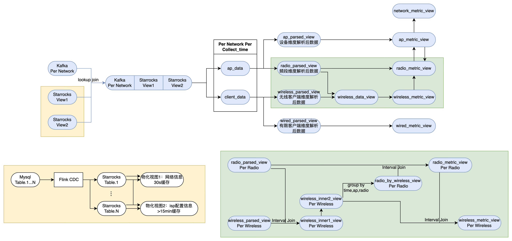

# 计算架构



黄色部分为starrocks计算逻辑，绿色部分为flink计算逻辑

## Starrocks

该部分分为两个流程

1. Flink CDC读取mysql机器上的binlog，获取数据变更，发送到SR
   1. Flink CDC的新版本（对应Flink1.19.0）支持只读取关注内容的变更信息，优化下游内存使用
2. Starrocks执行原有数据库查询逻辑，物化视图的结果保留为两个缓存时长不同的表
   1. 以deco和network为代表的频繁变化表构建30s缓存
   2. 以isp各类阈值config为代表的非频繁配置信息构建15分钟缓存

## Flink

横向：单条数据进行sql+udf计算。

| table/View名         | 尺寸  | 结构                             |
| -------------------- | ----- | -------------------------------- |
| client_data          | [3*N] | (kafka_raw, sr_view1, sr_view2)  |
| wireless_parsed_view | [M*N] | (mertic1, metric2, ... ,metricM) |
| wireless_inner_view  | [K*N] | (mertic1, metric2, ... ,metricK) |

wireless_inner_view = F.*client_data 类比于矩阵的左乘。


纵向：多个不同维度数据进行关联聚合计算。

主要算子

1. interval join，关联两张表。
   1. 如果两张表维度相同，则直接关联
   2. 如果两张表维度不同，则高维度的数据会映射到低维度同级下述的每个子节点。比如ap.radio，ap.radio.client，则radio层的数据会映射到每个client上
2. group by，将低维度的数据聚合到高维度

目前构建了三层interval join

| 层级       | 示例目的                                          | 算子                        |
| ---------- | ------------------------------------------------- | --------------------------- |
| 数据交换层 | radio维度的数据向下提供给wireless                 | 跨维度interval join         |
| 数据上行层 | wireless维度的数据聚合到radio参与计算             | groupby+同维度interval join |
| 数据下行层 | ap的结果数据下放到radio计算（alert_common_count） | 跨维度interval join         |

为简化描述，当前绘图时绿框所画的radio_metric_view到wireless_metric_view，在业务里实际上是ap_metric_view到radio_metric_view。


优化点：在忽略横向算子的情况下，可以把数据下行层前置到数据交换层（类U-net）

# Mysql查询设计

## 使用规范

1. 设计上将多表聚合计算放置到SR进行，因此SR给Flink提供的是高度可用的结果值。
2. 不同缓存的数据放不同表


| 表名             | 主键                     | 描述                  |
| ---------------- | ------------------------ | --------------------- |
| info_dim_isp     | isp_admin_id             | 同一个isp只有一套配置 |
| info_dim_network | isp_admin_id, network_id | 同一个network一套配置 |


info_dim_network

会将isp_network_deco的主设备信息和isp_network进行join，因此会过滤掉网络中所有设备都为inactive的情况。

| **字段名**         | **类型**     | **可否为空** | **默认值** | **注释**                       |
| ------------------ | ------------ | ------------ | ---------- | ------------------------------ |
| network_id         | VARCHAR(64)  | NO           | —          | 网络 ID，主键，唯一标识        |
| isp_admin_id       | VARCHAR(64)  | NO           | —          | ISP 管理员 ID                  |
| controller_mac     | VARCHAR(64)  | NO           | —          | 控制器的 MAC 地址              |
| controller_sn      | VARCHAR(64)  | NO           | —          | 控制器的序列号                 |
| device_model       | VARCHAR(128) | NO           | —          | 设备型号                       |
| is_qca             | INT          | NO           | —          | 是否 QCA 硬件（1 是，0 否）    |
| network_size       | INT          | NO           | —          | 网络规模                       |
| subscribe_upload   | INT          | NO           | —          | 订阅的上传带宽（Mbps）         |
| subscribe_download | INT          | NO           | —          | 订阅的下载带宽（Mbps）         |
| overdue_ttl        | BIGINT       | NO           | —          | 过期 TTL，单位秒               |
| qoe_ttl            | BIGINT       | NO           | —          | QoE TTL，单位秒                |
| qoe_enable         | INT          | NO           | —          | QoE 功能使能（1 启用，0 禁用） |

## 旧版设计

对当前用到的mysql表进行重新构建：

按照两个衡量标准：

1. 同一个isp的不同客户是否拥有不同的值
2. 该值的指标维度属于network/ap/radio的哪个层级
   1. 暂时不考虑network和topo的区别

按照现有的mysql情况构建下述View

| 表名                 | 主键                                 | 描述                                                      |
| -------------------- | ------------------------------------ | --------------------------------------------------------- |
| info_dim_isp_radio   | isp_admin_id, band                   | 同一个isp只有一套配置，该配置基于频段维度来提供           |
| info_dim_isp_network | isp_admin_id                         | 同一个isp只有一套配置，该配置基于网络维度来提供           |
| info_dim_ap          | isp_admin_id, controller_mac, ap_mac | 同一个isp下不同网络具有不同的信息，该信息基于ap维度提供   |
| info_dim_network     | isp_admin_id, controller_mac         | 同一个isp下不同网络具有不同的信息，该信息基于网络维度提供 |

isp_admin_id: isp的唯一标志符
controller_mac: 网络中主设备的mac地址
ap_mac: 网络中ap设备的mac地址
band: 网络中某ap的频段信息


info_dim_isp_radio

| **字段名**           | **含义**                           | Source                        |
| -------------------- | ---------------------------------- | ----------------------------- |
| isp_admin_id         |                                    |                               |
| band                 |                                    | 新增字段                      |
| client_rssi          | 客户端信号强度（dBm）              | isp_client_monitoring_setting |
| backhaul_rssi        | 回程链路信号强度（dBm）            | isp_ap_monitoring_setting     |
| client_snr           | 客户端信噪比（dB）                 | isp_client_monitoring_setting |
| packet_error_rate    | 丢包率（%）                        | isp_ap_monitoring_setting     |
| wifi_channel_usage   | 频道占用率（%）                    | isp_ap_monitoring_setting     |
| wifi_clients         | 该频段下关联客户端数量             | isp_ap_monitoring_setting     |
| wifi_coverage        | 覆盖评分或范围                     | isp_ap_monitoring_setting     |
| downstream_bandwidth | 下行带宽（Mbps），6g 频段常为 NULL | isp_ap_monitoring_setting     |
| upstream_bandwidth   | 上行带宽（Mbps）                   | isp_ap_monitoring_setting     |


info_dim_ap


| **字段名**     | **含义**                            | Source                                   |
| -------------- | ----------------------------------- | ---------------------------------------- |
| isp_admin_id   |                                     |                                          |
| controller_mac |                                     |                                          |
| ap_mac         | 该网络下所有设备的mac               | isp_network_deco, find mac by network_id |
| topo_role      | 拓扑角色（如主/辅 AP、Mesh 节点等） | isp_network_deco, find by network_id     |
| device_model   | 设备型号                            | isp_network_deco, find by network_id     |

1. 当前业务上需要把qoe的所有ap和network的所有ap进行对比标记，计划砍掉这个
2. 当前业务只使用主设备的 device_model 进行 QCA判定，这个可以改到info_dim_network表


info_dim_network

| **字段名**               | **含义**                      |                                                              |
| ------------------------ | ----------------------------- | ------------------------------------------------------------ |
| isp_admin_id             |                               |                                                              |
| controller_mac           |                               |                                                              |
| network_size             | 网络规模（AP 数量或覆盖面积） | isp_network_deco, 查询到该network_id下所有设备数据后计算行数 |
| subscribe_upload         | 订阅上行带宽（Mbps）          |                                                              |
| subscribe_download       | 订阅下行带宽（Mbps）          |                                                              |
| band_steering_enable     | 是否启用频段引导（布尔）      |                                                              |
| client_roaming_component | 客户端漫游策略组件设置        |                                                              |
| qoe_enable               | 是否启用 QoE 监测             |                                                              |
| qoe_ttl                  | QoE 数据存活时间（秒）        |                                                              |


info_dim_isp_network

| **字段名**                      | **含义**           | Source |
| ------------------------------- | ------------------ | ------ |
| isp_admin_id                    |                    |        |
| country                         | 国家代码           |        |
| time_zone_id                    | 时区标识           |        |
| payment_method                  | 计费方式           |        |
| account_id                      | 运营商账户 ID      |        |
| overdue_key                     | 欠费/逾期标识      |        |
| vas_subtype                     | 增值服务子类型     |        |
| monitor_enable                  | 是否启用监控       |        |
| collect_data_interval           | 数据采集间隔       |        |
| network_stability_score_weight  | 网络稳定性评分权重 |        |
| congestion_score_weight         | 拥塞评分权重       |        |
| speed_test_score_weight         | 速率测试评分权重   |        |
| wifi_coverage_score_weight      | 覆盖度评分权重     |        |
| wifi_client_health_score_weight | 客户端健康评分权重 |        |
| wifi_roaming_score_weight       | 漫游评分权重       |        |
| wifi_consistency_score_weight   | 一致性评分权重     |        |
| controller_qoe                  | 控制器侧 QoE 配置  |        |
| satellite_qoe                   | 卫星节点 QoE 配置  |        |
| available_bandwidth_score       | 可用带宽评分参数   |        |


# Kafka处理设计

下述表格提供信息一览：

1. 字段名
2. 数据类型
3. 原始数据来源及路径
4. 判空方式
5. 计算方式

## Wired Metrics

| **字段**         | **数据类型** | **数据来源及路径**                                           | **计算方式**                                                 | **层级** |
| ---------------- | ------------ | ------------------------------------------------------------ | ------------------------------------------------------------ | -------- |
| collection_time  | TIMESTAMP(3) | parsed_client_inner_view.collection_time                     | —                                                            | dwd      |
| controller_id    | STRING       | parsed_client_inner_view.controller_id                       | —                                                            | dwd      |
| ap_mac           | STRING       | X_TP_Ethernet.AssociatedDevice.{}.APDeviceID                 | —                                                            | dwd      |
| client_mac       | STRING       | X_TP_Ethernet.AssociatedDevice.{}.MACAddress                 | —                                                            | dwd      |
| ip_address       | STRING       | X_TP_Ethernet.AssociatedDevice.{}.IPAddress                  | —                                                            | dwd      |
| host_name        | STRING       | X_TP_Ethernet.AssociatedDevice.{}.X_TP_HostName              | —                                                            | dwd      |
| up_speed         | INT          | X_TP_Ethernet.AssociatedDevice.{}.UpSpeed                    | —                                                            | dwd      |
| down_speed       | INT          | X_TP_Ethernet.AssociatedDevice.{}.DownSpeed                  | —                                                            | dwd      |
| link_speed       | INT          | X_TP_Ethernet.AssociatedDevice.{}.LinkSpeed                  | —                                                            | dwd      |
| duplex_mode      | STRING       | X_TP_Ethernet.AssociatedDevice.{}.DuplexMode                 | —                                                            | dwd      |
| active           | INT          | X_TP_Ethernet.AssociatedDevice.{}.Active                     | —                                                            | dwd      |
| packets_sent     | INT          | X_TP_Ethernet.AssociatedDevice.{}.PacketsSent                | —                                                            | dwd      |
| packets_received | INT          | X_TP_Ethernet.AssociatedDevice.{}.{PacketReceived / PacketsReceived} | 如果没有PacketReceived则使用PacketsReceived                  | dwd      |
| errors_sent      | INT          | X_TP_Ethernet.AssociatedDevice.{}.ErrorsSent                 | —                                                            | dwd      |
| errors_received  | INT          | X_TP_Ethernet.AssociatedDevice.{}.ErrorsReceived             | —                                                            | dwd      |
| interface_type   | STRING       | X_TP_Ethernet.AssociatedDevice.{}.InterfaceType              | —                                                            | dwd      |
| per_tx           | DOUBLE       | —                                                            | divide(errors_sent, packets_sent)                            | dwm      |
| per_rx           | DOUBLE       | —                                                            | divide(errors_received, packets_received)                    | dwm      |
| per_total        | DOUBLE       | —                                                            | divide(errors_sent + errors_received, packets_sent + packets_received) | dwm      |


## Wireless

### Wireless Metrics

| **字段**                             | **类型**  | **数据来源及路径**                                           | **计算逻辑**                                                 | **条件 / 备注**                                              |
| ------------------------------------ | --------- | ------------------------------------------------------------ | ------------------------------------------------------------ | ------------------------------------------------------------ |
| collection_time                      | TIMESTAMP | parsed_client_inner_view.collection_time                     | —                                                            | —                                                            |
| controller_id                        | STRING    | parsed_client_inner_view.controller_id                       | —                                                            | —                                                            |
| ap_mac                               | STRING    | {}.Radio.{}.BSS.{}.STA.{}.ID                                 | —                                                            | —                                                            |
| radio_id                             | STRING    | {}.Radio.{}                                                  | —                                                            | —                                                            |
| interface_type                       | STRING    |                                                              | 固定赋值 "Wi-Fi"                                             | —                                                            |
| bss_id                               | STRING    | {}.Radio.{}.BSS.{}                                           | —                                                            | —                                                            |
| sta_id                               | STRING    | {}.Radio.{}.BSS.{}.STA.{}                                    | —                                                            | —                                                            |
| band                                 | STRING    | {}.Radio.{}.X_TP_Band                                        | —                                                            | —                                                            |
| wan_bandwidth                        | INT       | {}.X_TP_QoE.WANBandwidth                                     | —                                                            | —                                                            |
| wan_throughput                       | INT       | {}.X_TP_QoE.WANThroughput                                    | —                                                            | —                                                            |
| sta_count                            | INT       |                                                              | 统计 {}.Radio.{}.BSS 下所有 STA 节点数                       | 聚合所有 BSS→STA 的条目数                                    |
| last_data_downlink_rate              | INT       | {}.Radio.{}.BSS.{}.STA.{}.LastDataDownlinkRate               | —                                                            | —                                                            |
| last_data_uplink_rate                | INT       | {}.Radio.{}.BSS.{}.STA.{}.LastDataUplinkRate                 | —                                                            | —                                                            |
| mac_address                          | STRING    | {}.Radio.{}.BSS.{}.STA.{}.MACAddress                         | —                                                            | —                                                            |
| signal_strength                      | INT       | {}.Radio.{}.BSS.{}.STA.{}.SignalStrength                     | —                                                            | —                                                            |
| host_name                            | STRING    | {}.Radio.{}.BSS.{}.STA.{}.X_TP_HostName                      | —                                                            | —                                                            |
| ip_address                           | STRING    | {}.Radio.{}.BSS.{}.STA.{}.X_TP_IPAddress                     | —                                                            | —                                                            |
| network_ready_time                   | INT       | {}.Radio.{}.BSS.{}.STA.{}.X_TP_QoE.NetworkReadyTime          | —                                                            | —                                                            |
| wifi_connectivity                    | INT       | {}.Radio.{}.BSS.{}.STA.{}.X_TP_QoE.WiFiConnectivity          | —                                                            | —                                                            |
| number_of_alerts                     | INT       | {}.Radio.{}.BSS.{}.STA.{}.Factor.NumberOfAlerts              | —                                                            | —                                                            |
| available_wifi_service_quality_score | DOUBLE    | {}.Radio.{}.BSS.{}.STA.{}.Factor.AvailableWiFiServiceQualityScore | —                                                            | —                                                            |
| network_ready_time_score             | DOUBLE    | {}.Radio.{}.BSS.{}.STA.{}.Factor.NetworkReadyTimeScore       | —                                                            | —                                                            |
| signal_strength_score                | DOUBLE    | {}.Radio.{}.BSS.{}.STA.{}.Factor.SignalStrengthScore         | —                                                            | —                                                            |
| wifi_connectivity_score              | DOUBLE    | {}.Radio.{}.BSS.{}.STA.{}.Factor.WiFiConnectivityScore       | —                                                            | —                                                            |
| wifi_protocol_score                  | DOUBLE    | {}.Radio.{}.BSS.{}.STA.{}.Factor.WiFiProtocolScore           | —                                                            | —                                                            |
| client_health_score                  | DOUBLE    | {}.Radio.{}.BSS.{}.STA.{}.Factor.ClientHealthScore           | —                                                            | —                                                            |
| rx_rate                              | INT       | {}.Radio.{}.BSS.{}.STA.{}.X_TP_RxRate                        | —                                                            | —                                                            |
| tx_rate                              | INT       | {}.Radio.{}.BSS.{}.STA.{}.X_TP_TxRate                        | —                                                            | —                                                            |
| retrans_count                        | INT       | {}.Radio.{}.BSS.{}.STA.{}.RetransCount                       | —                                                            | —                                                            |
| est_mac_data_rate_downlink           | INT       | {}.Radio.{}.BSS.{}.STA.{}.EstMACDataRateDownlink             | —                                                            | —                                                            |
| est_mac_data_rate_uplink             | INT       | {}.Radio.{}.BSS.{}.STA.{}.EstMACDataRateUplink               | —                                                            | —                                                            |
| fail_num                             | INT       | {}.Radio.{}.BSS.{}.STA.{}.X_TP_FailNum                       | —                                                            | —                                                            |
| active                               | INT       | {}.Radio.{}.BSS.{}.STA.{}.Active                             | —                                                            | —                                                            |
| max_link_rate                        | INT       | {}.Radio.{}.BSS.{}.STA.{}.X_TP_MaxLinkRate                   | —                                                            | —                                                            |
| tx_retry_rate                        | DOUBLE    | {}.Radio.{}.BSS.{}.STA.{}.X_TP_RetryRate_TX                  | —                                                            | —                                                            |
| rx_retry_rate                        | DOUBLE    | {}.Radio.{}.BSS.{}.STA.{}.X_TP_RetryRate_RX                  | —                                                            | —                                                            |
| noise                                | INT       | radio_parsed_view.noise → wireless_data_view.noise           | -                                                            | 来自 radio_parsed_view 的 noise 字段                         |
| band_code                            | INT       | wireless_inner_view.band                                     | CASE band WHEN '2.4GHz' THEN 0 WHEN '5GHz' THEN 1 WHEN '6GHz' THEN 2 ELSE NULL END | 将字符串 band 映射成枚举码                                   |
| interface_code                       | INT       | wireless_inner_view.interface_type                           | CASE interface_type WHEN 'Ethernet' THEN 0 WHEN 'Wi-Fi' THEN 1 WHEN 'Other' THEN 2 ELSE NULL END | 将接口类型映射成枚举码                                       |
| rssi                                 | DOUBLE    | wireless_inner_view.signal_strength                          | (CAST(signal_strength AS DOUBLE) / 2) - 110                  |                                                              |
| link_tx_rate                         | INT       | wireless_inner_view                                          | CASE WHEN (last_data_uplink_rate IS NOT NULL AND last_data_uplink_rate <> 0) \n   OR (last_data_downlink_rate IS NOT NULL AND last_data_downlink_rate <> 0) \n  THEN last_data_uplink_rate \n ELSE est_mac_data_rate_uplink * 1000 END | 判断 uplink/downlink 是否有值，否则使用估算值乘 1000         |
| link_rx_rate                         | INT       | wireless_inner_view                                          | CASE WHEN (last_data_downlink_rate IS NOT NULL AND last_data_downlink_rate <> 0) \n   OR (last_data_uplink_rate IS NOT NULL AND last_data_uplink_rate <> 0) \n  THEN last_data_downlink_rate \n ELSE est_mac_data_rate_downlink * 1000 END | 判断 downlink/uplink 是否有值，否则使用估算值乘 1000         |
| avl_bandwidth                        | INT       | wireless_inner_view                                          | CAST(ROUND(\n CASE\n  WHEN wan_bandwidth = 0 THEN last_data_downlink_rate * 0.6 - tx_rate\n  WHEN tx_rate IS NULL THEN wan_bandwidth - wan_throughput\n  ELSE LEAST(wan_bandwidth, last_data_downlink_rate * 0.6) - tx_rate\n END\n) AS INT) | 三分支：1）wan_bandwidth=0 时按 downlink*0.6–tx，2）tx_rate NULL 时按 wan–throughput，3）否则取二者中小值再减 tx |
| snr                                  | DOUBLE    | wireless_metrics_view                                        | CASE WHEN rssi IS NULL OR noise IS NULL THEN NULL ELSE rssi - noise END | 仅在 rssi 和 noise 均非 NULL 时计算                          |
| client_coverage_qoe_score            | DOUBLE    | wireless_metrics_view                                        | 多分支 CASE（共12 条分支），如：WHEN rssi >= -40 THEN 5.0WHEN rssi >= -50 AND rssi < -40 THEN 4.5…ELSE 0.0 | 依据 rssi 和 tx_retry_rate 的范围打分                        |

```sql
CREATE VIEW wireless_metrics_view AS
SELECT
  *,
  CASE
    WHEN rssi IS NULL OR noise IS NULL THEN NULL
    ELSE rssi - noise
  END                                      AS snr,
  CASE
    WHEN rssi IS NULL OR tx_retry_rate IS NULL THEN 5.0
    WHEN rssi >= -40 THEN 5.0
    WHEN rssi >= -50 AND rssi < -40 THEN 4.5
    WHEN rssi >= -60 AND rssi < -50 THEN 4.0
    WHEN rssi >= -65 AND rssi < -60 THEN 3.5
    WHEN rssi >= -70 AND rssi < -65 THEN 3.2
    WHEN rssi >= -75 AND rssi < -70 THEN 3.0
    WHEN rssi >= -80 AND rssi < -75 THEN 2.5
    WHEN rssi >= -85 AND rssi < -80 THEN 1.5
    WHEN rssi >= -90 AND rssi < -85 THEN 1.0
    WHEN rssi < -90 AND tx_retry_rate <= 50 THEN 0.5
    ELSE 0.0
  END                                      AS client_coverage_qoe_score
FROM wireless_inner_view;
```

需要注意，对于中间计算结果rssi，使用新一层的view可以简化计算描述。


### Radio By Wireless

| **字段**            | **类型**     | **数据来源及路径**                                           | **计算逻辑**                                                 | **条件 / 备注**                                    |
| ------------------- | ------------ | ------------------------------------------------------------ | ------------------------------------------------------------ | -------------------------------------------------- |
| ap_mac              | STRING       | parse_wireless_data_tf 展平字段 ap_mac → wireless_parsed_view.ap_mac → wireless_metrics_view.ap_mac → radio_by_wireless_base.ap_mac | —                                                            | 源自 JSON 路径 {}.Radio.{}.BSS.{}.STA.{}.ID        |
| band                | STRING       | 同上展平字段 band → … → radio_by_wireless_base.band          | —                                                            | 源自 JSON {}.Radio.{}.X_TP_Band                    |
| collection_time     | TIMESTAMP(3) | 在 radio_by_wireless_base 中由 TUMBLE_ROWTIME(collection_time, INTERVAL '2' MINUTE) 生成 | —                                                            | 保留 ROWTIME & watermark                           |
| wireless_count      | BIGINT       | radio_by_wireless_base.wireless_count                        | COUNT(*)                                                     | 按 ap_mac、band、2 分钟 tumbling 窗口 分组         |
| avg_rssi            | DOUBLE       | radio_by_wireless_base.avg_rssi                              | AVG(CASE WHEN tx_retry_rate > 50 THEN -100 ELSE rssi END)    | 对 tx_retry_rate > 50 的记录用 -100                |
| wifi_coverage_score | DOUBLE       | radio_by_wireless_view.wifi_coverage_score                   | sql<br>CASE<br> WHEN wireless_count = 0 THEN -1.0<br> WHEN avg_rssi > -30 THEN 5.0<br> WHEN avg_rssi > -50 THEN 4.0 + (avg_rssi + 50)/20<br> WHEN avg_rssi > -60 THEN 3.0 + (avg_rssi + 60)/10<br> WHEN avg_rssi > -70 THEN 2.0 + (avg_rssi + 70)/10<br> WHEN avg_rssi > -90 THEN 1.0 + (avg_rssi + 90)/20<br> ELSE 0.0<br>END | QoE 分数映射，根据 avg_rssi 和 wireless_count 设定 |


## Radio

### Radio Metrics

| **字段**                 | **类型**      | **数据来源及路径**                                 | **计算逻辑**                                                 | **条件 / 备注**                      |
| ------------------------ | ------------- | -------------------------------------------------- | ------------------------------------------------------------ | ------------------------------------ |
| collection_time          | TIMESTAMP(3)  | parsed_ap_inner_view.collection_time               | —                                                            | —                                    |
| controller_id            | STRING        | parsed_ap_inner_view.controller_id                 | —                                                            | —                                    |
| ap_mac                   | STRING        | {}.ID                                              | —                                                            | {} 表示任意设备索引                  |
| band                     | STRING        | {}.Radio.X_TP_Band                                 | —                                                            | —                                    |
| noise                    | INT           | {}.Radio.Noise                                     | —                                                            | —                                    |
| utilization              | INT           | {}.Radio.Utilization                               | —                                                            | —                                    |
| transmit                 | INT           | {}.Radio.Transmit                                  | —                                                            | —                                    |
| receive_self             | INT           | {}.Radio.ReceiveSelf                               | —                                                            | —                                    |
| receive_other            | INT           | {}.Radio.ReceiveOther                              | —                                                            | —                                    |
| congestion_rate          | INT           | {}.Radio.X_TP_Congestion_Rate                      | —                                                            | —                                    |
| client_count             | INT           | {}.Radio.X_TP_AssociatedDeviceNumberOfEntries      | —                                                            | —                                    |
| average_rx_rate          | INT           | {}.Radio.X_TP_AverageRxRate                        | —                                                            | —                                    |
| average_tx_rate          | INT           | {}.Radio.X_TP_AverageTxRate                        | —                                                            | —                                    |
| bandwidth                | STRING        | {}.Radio.X_TP_Bandwidth                            | —                                                            | —                                    |
| bytes_sent_bigint        | BIGINT        | {}.Radio.X_TP_BytesSent                            | —                                                            | —                                    |
| errors_pkt               | INT           | {}.Radio.X_TP_ErrorsPkt                            | —                                                            | —                                    |
| ip_address               | STRING        | {}.Radio.X_TP_IPAddress                            | —                                                            | —                                    |
| packets_received         | BIGINT        | {}.Radio.X_TP_PacketsReceived                      | —                                                            | —                                    |
| packets_sent             | BIGINT        | {}.Radio.X_TP_PacketsSent                          | —                                                            | —                                    |
| errors_sent              | INT           | {}.Radio.ErrorsSent                                | —                                                            | —                                    |
| errors_received          | INT           | {}.Radio.ErrorsReceived                            | —                                                            | —                                    |
| bytes_received_bigint    | BIGINT        | {}.Radio.BytesReceived                             | —                                                            | —                                    |
| backhaul_mac_address     | STRING        | {}.Radio.BackhaulSta.MACAddress                    | —                                                            | —                                    |
| backhaul_link_type       | STRING        | {}.Radio.BackhaulSta.X_TP_BackhaulLinkType         | —                                                            | —                                    |
| backhaul_link_rate       | INT           | {}.Radio.BackhaulSta.X_TP_LinkRate                 | —                                                            | —                                    |
| backhaul_signal_strength | INT           | {}.Radio.BackhaulSta.X_TP_SignalStrength           | —                                                            | —                                    |
| backhaul_snr             | DOUBLE        | {}.Radio.BackhaulSta.X_TP_SNR                      | —                                                            | —                                    |
| backhaul_utilization     | INT           | {}.Radio.BackhaulSta.X_TP_Utilization              | —                                                            | —                                    |
| wifi_coverage_score      | DOUBLE        | {}.X_TP_QoE.Factor.WiFiCoverage{2G/5G/6G}Score     | IF(band='2.4GHz',WiFiCoverage2GScore,IF(band='5GHz',WiFiCoverage5GScore,WiFiCoverage6GScore)) | 按 band 分支取对应 Coverage 分数     |
| wifi_availability_score  | DOUBLE        | {}.X_TP_QoE.Factor.WiFiAvailability{2G/5G/6G}Score | IF(band='2.4GHz',WiFiAvailability2GScore,IF(band='5GHz',WiFiAvailability5GScore,WiFiAvailability6GScore)) | 按 band 分支取对应 Availability 分数 |
| rssi                     | DECIMAL(18,6) | radio_inner_view                                   | ROUND(backhaul_signal_strength/2.0 - 110,10)                 | —                                    |
| snr                      | DECIMAL(19,6) | radio_metrics_view                                 | rssi - noise                                                 | —                                    |
| aur                      | DECIMAL(16,4) | radio_metrics_view                                 | ROUND(utilization/256.0,4)                                   | —                                    |
| noise_score              | DECIMAL(18,6) | radio_metrics_view                                 | ROUND(noise/2.0 - 110,10)                                    | —                                    |
| packet_error_rate        | DOUBLE        | radio_metrics_view                                 | CASE WHEN packets_received IS NULL OR packets_sent IS NULL OR (packets_received+packets_sent)=0 THEN NULL ELSE errors_pkt/(packets_received+packets_sent) END | —                                    |
| backhaul_aur             | DECIMAL(16,4) | radio_metrics_view                                 | ROUND(backhaul_utilization/256.0,4)                          | —                                    |
| backhaul_qoe_score       | DECIMAL(2,1)  | radio_metrics_view                                 | CASE WHEN rssi > -40 THEN 5.0 WHEN rssi > -50 THEN 4.5 WHEN rssi > -60 THEN 4.0 … ELSE 0.5 END | 多分支按 rssi 区间映射               |
| upstream_speed           | INT           | radio_metrics_view                                 | average_tx_rate                                              | —                                    |
| downstream_speed         | INT           | radio_metrics_view                                 | average_rx_rate                                              | —                                    |
| wireless_count           | BIGINT        | radio_by_wireless_view                             | COUNT(*) OVER 2 分钟 tumbling 窗口                           | 按 ap_mac、band、2 分钟窗口聚合      |
| avg_rssi                 | DOUBLE        | radio_by_wireless_view                             | AVG(CASE WHEN tx_rate>50 THEN -100 ELSE rssi END)            | tx_rate > 50 时用 -100               |
| avg_wifi_coverage_score  | DOUBLE        | radio_by_wireless_view                             | 同 wifi_coverage_score（在 radio_by_wireless_view 中做 AVG） | —                                    |


### Ap By Radio

| **字段**                | **类型**     | **计算逻辑**                                         | **条件 / 备注**               |
| ----------------------- | ------------ | ---------------------------------------------------- | ----------------------------- |
| ap_mac                  | STRING       | —                                                    | 分组键                        |
| band                    | STRING       | —                                                    | 分组键                        |
| window_time             | TIMESTAMP(3) | TUMBLE_ROWTIME(collection_time, INTERVAL '2' MINUTE) | 2 分钟 tumbling 窗口起始时间  |
| avg_noise               | DOUBLE       | AVG(noise)                                           | noise 平均值                  |
| avg_utilization         | DOUBLE       | AVG(utilization)                                     | utilization 平均值            |
| sum_transmit            | BIGINT       | SUM(transmit)                                        | 发射总量                      |
| sum_receive_self        | BIGINT       | SUM(receive_self)                                    | 自接收总量                    |
| sum_receive_other       | BIGINT       | SUM(receive_other)                                   | 他人接收总量                  |
| max_congestion_rate     | INT          | MAX(congestion_rate)                                 | 峰值拥塞率                    |
| sum_client_count        | INT          | SUM(client_count)                                    | 总关联客户端数                |
| avg_rx_rate             | DOUBLE       | AVG(average_rx_rate)                                 | 平均下行速率                  |
| avg_tx_rate             | DOUBLE       | AVG(average_tx_rate)                                 | 平均上行速率                  |
| max_bytes_sent          | BIGINT       | MAX(bytes_sent_bigint)                               | 最大发送字节                  |
| sum_packets_received    | BIGINT       | SUM(packets_received)                                | 总接收数据包数                |
| sum_packets_sent        | BIGINT       | SUM(packets_sent)                                    | 总发送数据包数                |
| sum_errors_pkt          | INT          | SUM(errors_pkt)                                      | 总错误包数                    |
| any_ip                  | STRING       | MAX(ip_address)                                      | 任意 IP（用于示例，可取任一） |
| avg_wifi_coverage_score | DOUBLE       | AVG(wifi_coverage_score)                             | 平均 Wi-Fi 覆盖 QoE 得分      |
| avg_rssi                | DOUBLE       | AVG(avg_rssi)                                        | 平均 RSSI                     |


## Ap Metrics

| **字段**                  | **类型** | **计算逻辑**                                            | **备注**              |
| ------------------------- | -------- | ------------------------------------------------------- | --------------------- |
| ap_mac                    | STRING   | 从 ParseApDataFunction 输出字段 ap_mac                  | AP 标识               |
| jitter                    | INT      | JsonUtils.intOrNull(qoe, "Jitter")                      | QOE 指标              |
| latency                   | INT      | JsonUtils.intOrNull(qoe, "Latency")                     | QOE 指标              |
| wan_bandwidth             | INT      | JsonUtils.intOrNull(qoe, "WANBandwidth")                | QOE 指标              |
| upload_bandwidth          | INT      | JsonUtils.intOrNull(qoe, "UploadBandwidth")             | QOE 指标              |
| wan_connectivity          | INT      | JsonUtils.intOrNull(qoe, "WANConnectivity")             | QOE 指标              |
| wan_throughput            | INT      | JsonUtils.intOrNull(qoe, "WANThroughput")               | QOE 指标              |
| memory_free               | INT      | JsonUtils.intOrNull(qoe, "MemoryFree")                  | QOE 指标              |
| memory_total              | INT      | JsonUtils.intOrNull(qoe, "MemoryTotal")                 | QOE 指标              |
| cpu_usage                 | INT      | JsonUtils.intOrNull(qoe, "CPUUsage")                    | QOE 指标              |
| number_of_alerts          | INT      | JsonUtils.intOrNull(fact, "NumberOfAlerts")             | QOE Factor            |
| is_controller             | INT      | JsonUtils.intOrNull(fact, "IsController")               | QOE Factor            |
| connectivity_score        | DOUBLE   | JsonUtils.doubleOrNull(fact, "ConnectivityScore")       | QOE Factor            |
| available_bandwidth_score | DOUBLE   | JsonUtils.doubleOrNull(fact, "AvailableBandwidthScore") | QOE Factor            |
| internet_delay_score      | DOUBLE   | JsonUtils.doubleOrNull(fact, "InternetDelayScore")      | QOE Factor            |
| internet_jitter_score     | DOUBLE   | JsonUtils.doubleOrNull(fact, "InternetJitterScore")     | QOE Factor            |
| system_health_score       | DOUBLE   | JsonUtils.doubleOrNull(fact, "SystemHealthScore")       | QOE Factor            |
| congestion_score          | DOUBLE   | JsonUtils.doubleOrNull(fact, "CongestionScore")         | QOE Factor            |
| avg_noise                 | DOUBLE   | AVG(noise) OVER 2 分钟 tumbling 窗口                    | 来自 ap_by_radio 聚合 |
| avg_utilization           | DOUBLE   | AVG(utilization) OVER 2 分钟 tumbling 窗口              | 来自 ap_by_radio 聚合 |
| sum_transmit              | BIGINT   | SUM(transmit) OVER 2 分钟 tumbling 窗口                 | 来自 ap_by_radio 聚合 |
| sum_receive_self          | BIGINT   | SUM(receive_self) OVER 2 分钟 tumbling 窗口             | 来自 ap_by_radio 聚合 |
| sum_receive_other         | BIGINT   | SUM(receive_other) OVER 2 分钟 tumbling 窗口            | 来自 ap_by_radio 聚合 |
| max_congestion_rate       | INT      | MAX(congestion_rate) OVER 2 分钟 tumbling 窗口          | 来自 ap_by_radio 聚合 |
| sum_client_count          | INT      | SUM(client_count) OVER 2 分钟 tumbling 窗口             | 来自 ap_by_radio 聚合 |
| avg_rx_rate               | DOUBLE   | AVG(average_rx_rate) OVER 2 分钟 tumbling 窗口          | 来自 ap_by_radio 聚合 |
| avg_tx_rate               | DOUBLE   | AVG(average_tx_rate) OVER 2 分钟 tumbling 窗口          | 来自 ap_by_radio 聚合 |
| max_bytes_sent            | BIGINT   | MAX(bytes_sent_bigint) OVER 2 分钟 tumbling 窗口        | 来自 ap_by_radio 聚合 |
| sum_packets_received      | BIGINT   | SUM(packets_received) OVER 2 分钟 tumbling 窗口         | 来自 ap_by_radio 聚合 |
| sum_packets_sent          | BIGINT   | SUM(packets_sent) OVER 2 分钟 tumbling 窗口             | 来自 ap_by_radio 聚合 |
| sum_errors_pkt            | INT      | SUM(errors_pkt) OVER 2 分钟 tumbling 窗口               | 来自 ap_by_radio 聚合 |
| any_ip                    | STRING   | MAX(ip_address) OVER 2 分钟 tumbling 窗口               | 来自 ap_by_radio 聚合 |
| avg_wifi_coverage_score   | DOUBLE   | AVG(wifi_coverage_score) OVER 2 分钟 tumbling 窗口      | 来自 ap_by_radio 聚合 |
| avg_rssi                  | DOUBLE   | AVG(avg_rssi) OVER 2 分钟 tumbling 窗口                 | 来自 ap_by_radio 聚合 |
| device_model              | STRING   | —                                                       | 设备型号              |
| is_qca                    | INT      | —                                                       | 是否 QCA 设备（1 是） |
| network_size              | INT      | —                                                       | 网络容量              |
| subscribe_upload          | INT      | —                                                       | 订阅上行带宽 (Mbps)   |
| subscribe_download        | INT      | —                                                       | 订阅下行带宽 (Mbps)   |
| overdue_ttl               | INT      | —                                                       | 授权过期 TTL（秒）    |
| qoe_ttl                   | INT      | —                                                       | QoE 授权 TTL（秒）    |
|                           |          |                                                         |                       |
|                           |          |                                                         |                       |
|                           |          |                                                         |                       |
|                           |          |                                                         |                       |

## Network Metrics