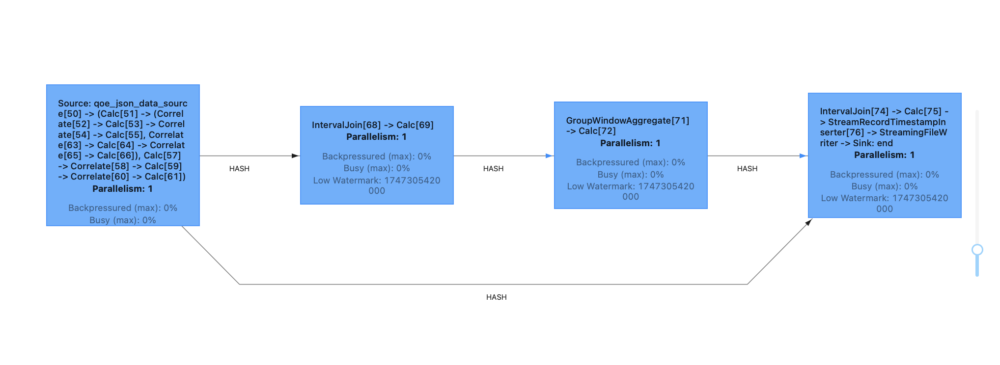
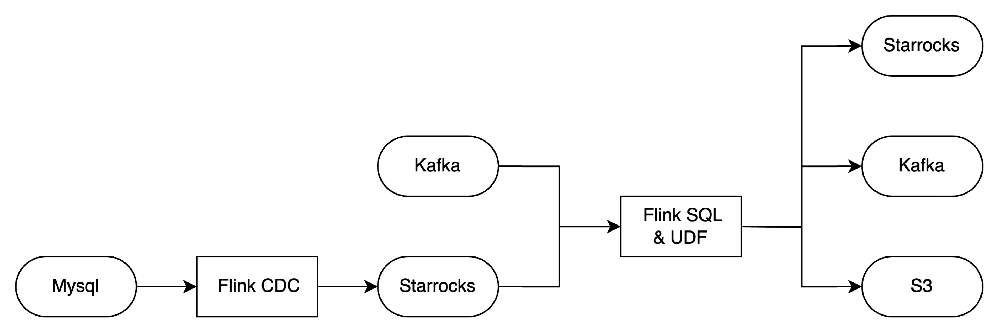
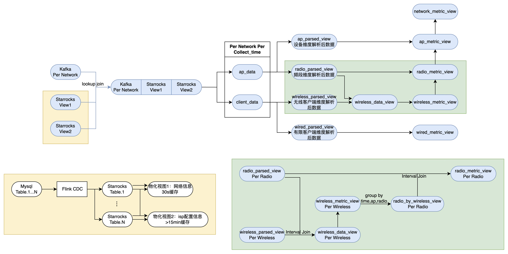

# 一、测试排期

大体来说期望将性能测试拆为两期

|                | 测试内容                                                     | 自测耗时 | 测试耗时 |
| -------------- | ------------------------------------------------------------ | -------- | -------- |
| TAUC-FLINK-001 | 本阶段主要在观测指标完善的单节点环境下的对链路性能进行测试。 |          |          |
| TAUC-FLINK-002 | flink多节点集群测试，可靠性测试                              |          |          |

 

# 二、测试准备

## 2.1 前置工作

单节点

- uat环境搭建
- 代码开发
- 测试数据生成
- 监控完善

多节点

- 独立的集群或容器化部署（Kubernetes/裸机/EMR）
- 固定硬件规格（节点数量、规格）

## 2.2 测试观测点

关注点总览

- 吞吐量（throughput）：
  - RPS：每秒处理了多少条记录（events/sec）
  - MB/s：每秒处理了多少数据量，反映消息大小对吞吐的影响。
- 端到端延迟（latency）：P95、P99 延迟
- 反压% time backpressured
- 资源利用率：CPU、内存、网络、磁盘

关注点层级：

1. Single Operator：Flink 中的每一个逻辑转换（Calc，Correlate，Window 聚合、Interval Join）都可以看作一个“算子”。

2. Pipeline Segment（类似mapreduce）
	- 在有 Operator Chaining 情况下，Flink 会把一段连续无需 Shuffle 的算子链（即它们之间的数据交换都是“forward”或在同一个线程内的直接函数调用）合并到一个 Task 里，这一段就叫一个 Pipeline Segment。
	- 当遇到需要跨 Slot 或跨 TaskManager 的网络 Shuffle（如 HASH 分区、Rebalance、Broadcast），Flink 会自动拆出新的 Chain，从而形成下一个 Segment。
	- Web UI 表现：每个大蓝框就是一个完整的 Pipeline Segment。框里列出了这个段里所有被 fuse 的算子（如多个 Calc、多个 Correlate）。
	- 观察意义：代表了一组算子的端到端执行，在这个范围内不会经过网络序列化，关注它可以告诉你“这一整段打通后”的综合性能开销（CPU、链内延迟、Task 资源占用）。

比较mapreduce

- MapReduce
  - Map：对原始数据做无状态的逐条转换／过滤
  - Shuffle：根据 key 把 Map 的输出分散到各个 Reduce
  - Reduce：对同一个 key 的所有值做聚合／Join
- Flink 流式
  - 一个 Pipeline Segment（无 Shuffle）就像一段“Map”逻辑——一串可链的无状态或局部有状态算子（Calc、UDF、Filter…）
  - KeyBy/GroupBy/Join 本质上触发一次网络 shuffle，就像 MapReduce 里的 Shuffle，把不同 TaskManager 之间按 key 重分区
  - 新的 Pipeline Segment（Shuffle 之后）就像 Reduce——对同一 key 的数据做 Window 聚合、Join、State 访问

测试关注点：

1. 稳定性与可用性：故障恢复时间、Checkpoint 时长

| 分析层级          | 关注维度   | Web UI 指标                                           | Grafana / Prometheus 指标                                |
| --------------------- | -------------- | --------------------------------------------------------- | ------------------------------------------------------------ |
| 一、微观算子      | 吞吐量         | Vertex → I/O Metrics → #Records In/Out Per Second         | taskmanager_job_task_numRecordsInPerSecond{operator="Calc[51]"} / ...OutPerSecond |
| 一、微观算子      | 延迟           | Backpressure → Latency 子标签 → 单算子 P95/P99            | pipeline_latency{operator="Calc[51]", percentile="P95"}      |
| 一、微观算子      | 反压 / 繁忙    | Backpressure → 该 Vertex 的 Backpressured (%) & Busy (%)  | taskmanager_job_task_backPressuredTimeMsPerSecond / taskmanager_job_task_busyTimeMsPerSecond |
| 一、微观算子      | 状态访问       | State 字段（State Size）                                  | RocksDB：state_backend_rocksdb_db_read_latency / _write_latency |
| 二、Pipeline 段   | 链内延迟       | Backpressure → Latency Metrics → 链段内各算子到下游的延迟 | pipeline_latency{step="segment-<chainId>"}                   |
| 二、Pipeline 段   | 网络 / Shuffle | Edge → Shuffle 类型（HASH/REBALANCE）                     | taskmanager_network_buffers_available_ratio / network_data_transferred_bytes |
| 二、Pipeline 段   | 并行度         | Vertex → Parallelism                                      | jobmanager_job_task_numRunningTasks / flink_jobmanager_slots_total |
| 二、Pipeline 段   | 反压传播       | Backpressure → 观察反压在该链段中的传递                   | taskmanager_job_task_backPressuredTimeMsPerSecond{chainId="<id>"} |
| 三、整作业（Job） | 总体吞吐       | Overview → Current Throughput                             | jobmanager_job_numRecordsInPerSecond / jobmanager_job_numRecordsOutPerSecond |
| 三、整作业（Job） | 端到端延迟     | Metrics → Latency Metrics（Source→Sink P95/P99）          | pipeline_latency{operator="Source->Sink", percentile="P95"}  |
| 三、整作业（Job） | Checkpoint     | Checkpoints → Duration / Success Rate                     | jobmanager_job_checkpoint_duration / jobmanager_job_checkpoint_success_count |
| 三、整作业（Job） | 全链反压       | Backpressure → Overall Backpressured (%)                  | jobmanager_job_task_backPressuredTimeMsPerSecond             |
| 四、集群 & TM     | TM 资源        | Overview → TaskManagers → CPU / Memory Usage              | taskmanager_Status_JVM_CPU_Load / taskmanager_Status_JVM_Memory_Heap_Used |
| 四、集群 & TM     | GC & JVM       | TaskManagers → Logs 中的 GC 输出                          | jvm_gc_collection_seconds_count / jvm_gc_collection_seconds_sum |
| 四、集群 & TM     | 网络 I/O       | ——（Web UI 无直接可视化）                                 | taskmanager_network_data_transferred_bytes / network_buffers_available_ratio |
| 四、集群 & TM     | Slot 利用      | Overview → Slot Utilization                               | flink_jobmanager_slots_total / flink_jobmanager_slots_available |

# 三、性能测试

## 3.1 测试环节定义

1. MySQL→Flink CDC→SR

- 场景：全链路验证 CDC Connector、Stream Load、Flink Checkpoint 与 Exactly-Once。

- Web UI：重点看 CDC Source、SR Sink 算子的反压与吞吐，以及 Checkpoint 时长。
- Grafana：监控 CDC 拉取速率、Stream-Load 吞吐/延迟，以及 Checkpoint 成功率。

   

2. StarRocks 写入/读取

- 写入：独立跑 Stream-Load Connector，测它在固定 QPS 下的极限。

- 读取：独立跑 Lookup 或批表扫描 Connector，测拉取延迟与吞吐。
- Grafana：分别采集 sr_streamload_rows_per_second、jdbc_read_latency_ms 等。

3. Flink Source/Sink

- Source：DataGen Connector 可调 rows-per-second，测其从头到 Print 的最大吞吐。
- Sink：各种 Connector（Kafka/S3/SR）分别在同样流量、并行度、状态后端下测写入性能。

4. Flink 算子

- 算子链：Map→Window→Join… 每次只跑一个作业，用 .disableOperatorChaining() 或断链干净地测算子性能。

- Web UI：启用 Pipeline-Latency 后，在 Latencies 页看各算子 P95/P99 延迟。
- Grafana：通过 pipeline_latency、busyTime、backPressuredTime 指标，量化单算子执行开销。

   

## 3.2 测试业务定义

1. 原业务下的kafka->cassandra链路

2. 原业务的alarm2链路

## 3.3 参数配置分析

1. Checkpoint 配置
   checkpoint interval、超时（timeout）、并发数量
   state backend（RocksDB vs Memory）
2. 并行度与 Slot 配置
   Job 全局并行度 vs 算子并行度
   Slot 分配策略
3. 网络缓冲与反压
   堆外内存（network.buffer.memory）
   backpressure 监控
4. 瓶颈定位
   TaskManager CPU 使用率→CPU-bound
   GC 时间占比→调大内存或切换 RocksDB
   网络反压→调大 network buffer

# 四、可靠性测试 & 自动化

## 4.1 压力与伸缩测试

1. 吞吐量压测
不断增加输入速率，直至达到系统瓶颈
观测吞吐 vs 延迟的非线性变化点
2. 资源伸缩测试
水平扩容：增加 TaskManager 节点/Slot 数
垂直扩容：调整 TaskManager 内存/CPU
记录伸缩前后性能提升比
3. 长跑稳定性测试
持续运行数小时或数天
周期性触发 Checkpoint，监测状态递增与故障恢复

## 4.2 容错与恢复测试

1. 模拟故障
杀掉 TaskManager 或 JobManager 进程
人为延迟网络或制造 I/O 错误
2. 验证恢复能力
Checkpoint 恢复时间
状态一致性（Exactly-once vs At-least-once）
恢复后吞吐与延迟是否回到预期水平
能不能接上之前的消费

## 4.3 回归测试与自动化

1. 集成到 CI/CD
自动化脚本：数据准备 → 提交 Job → 收集指标 → 生成报告
2. 定期验证
每次版本发布或关键配置改动后，执行一轮基线+压力测试
3. 持续监控
在生产环境开启 Prometheus 监控告警（延迟、backpressure、Checkpoint 失败）