# Frontline页面

## Pods & Nodes & Device

### Pods & Nodes

Plume对于Controller设备没有Qoe的定义，或者换句话说，就是下面这些指标的定义在Plume里属于基础网络信息范畴。

### Device

device界面和Pods Nodes界面相似

此处的Qoe History

Per Client(理论上应该是Per Radio Per Client，如果有多Radio连接的话)，这些其实都是Qoe数据，因此不单独罗列。

## Qoe

按概览，ap，sta，wan口

### 概览

概览展示qoe给分，ap和sta各一个分数，这个分数其实也没什么实际意义。

维度解析：ap，sta有总分分值。维度是基于频段的（具体而言下图iPhone手机会同一个时间出现三个点，可以解释为三个频段都使用某一信道进行打分，最终选择分数最高信道所对应的频段。）

​	抽象到模型的话，其实只需要考虑每个连接方式一个打分（有线，无线，MLO）

挖掘：同一时间多个值说明要进行信道选择了，什么情况下会进行信道选择呢？用户离开网络并返回（可以做用户行为分析），网络的定期切换最优信道

可优化点：average qoe score只能筛选在线设备的avg score，离线设备即便qoe得分avg=5也不显示。在线设备和离线设备没有很明显的区分。

### Node

这个部分对应我司的AP-data部分，但只显示controller-agent链路中agent的得分。（我们还有controller的数据和有线agent数据）

该表指标细粒度都是Per Ap Per Radio，Plume的呈现为在信道切换时会展示每个信道的值，否则一般而言只呈现工作信道的值。

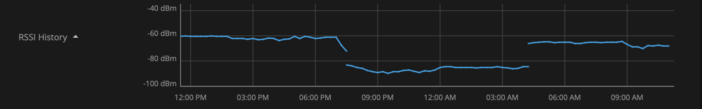

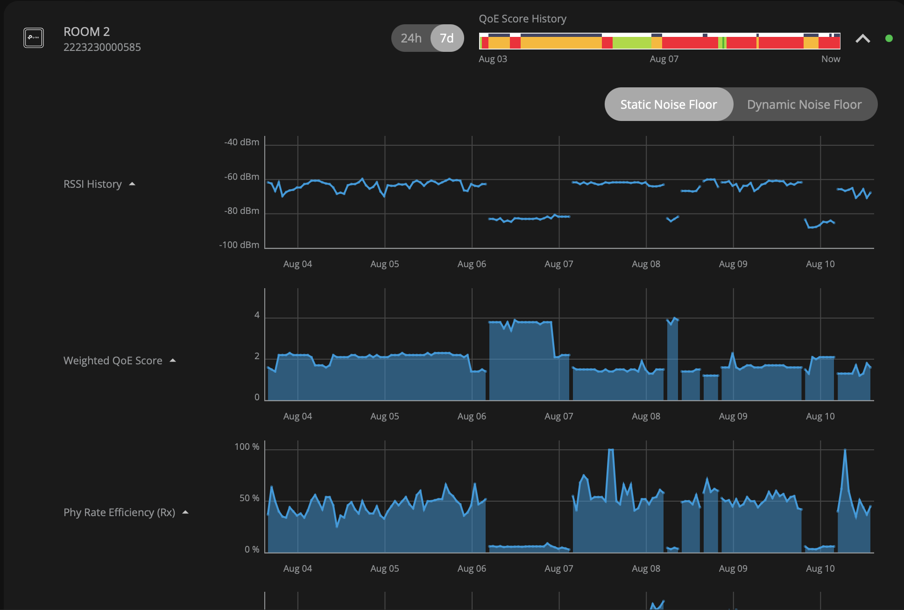

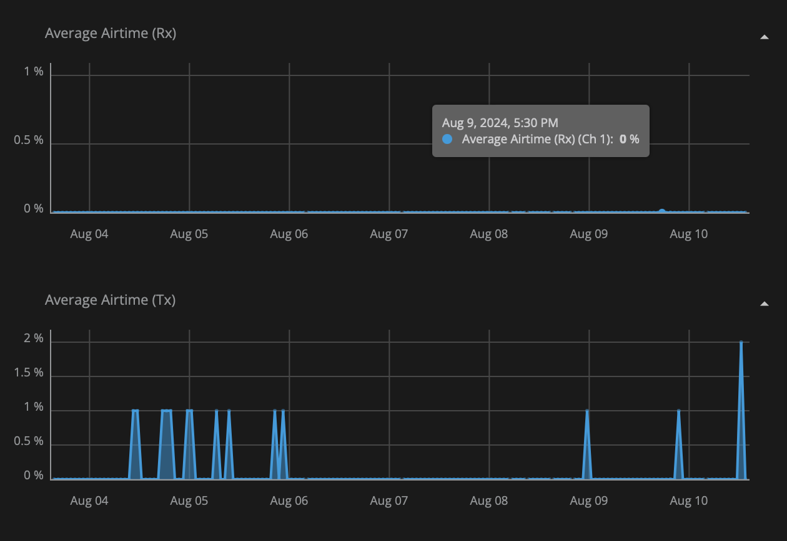

airtime部分，rx为0，tx很小，这些都很奇怪？

此外：plume的rssi支持使用原始ss和rssi值。static和dynamic

总结而言，就是他们每一个指标上都会带上一个其他的指标，比如online部分会带上controller设备的名字，各个浅蓝色绘图的指标上都会带上channel信息。

### Live Mode

支持分钟级和秒级 Live Mode，Per Ap 和Per Sta都使用相同的字段组

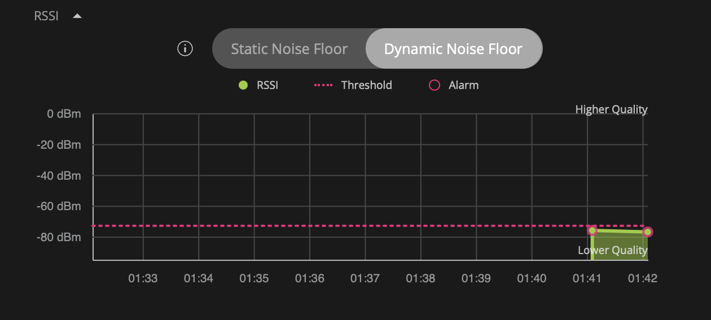

### Device

Per Client

显示每个终端设备端指标信息。

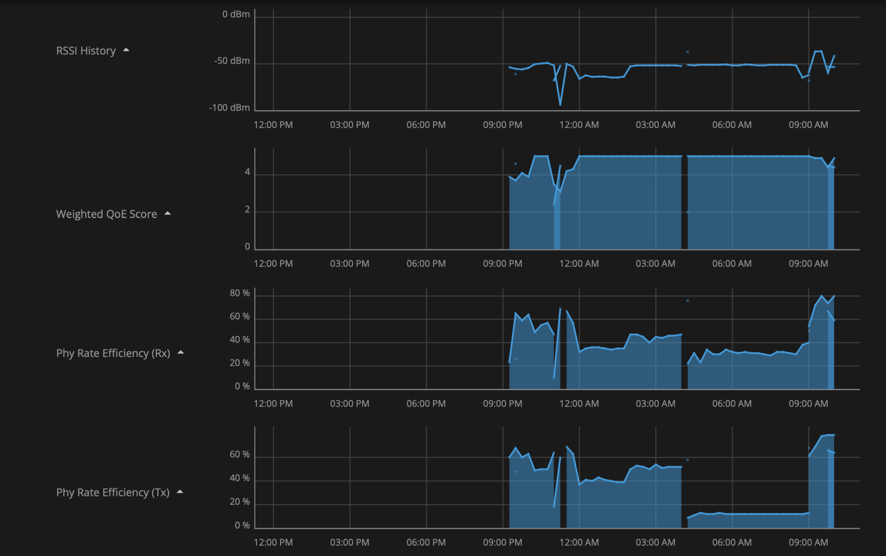

这个图表明

1. ap和sta使用相同的参数，但我们收集的ap和sta参数种类有明显区别。
2. ap切换了两次信道的影响，分别是1/9:00pm切到60/4:00am切到1
   1. 4:15有一次断点，sta原来是60，但是在1和124之间选择了124，但是吴工早上起来之后设备又切换到1。感觉sta不认可信道切换，但是sta真的被使用的时候不得不使用ap切的信道
   2. 可以看出周六早上吴工的sta非常纠结，在9:00-13:00期间有出门的情况下，做了5次信道扫描，甚至包括
   3. 晚上11:15的时候60信道的rssi非常低，切到6信道，然后在ap数据部分出现尖刺

过去24小时出现了两次信道切换

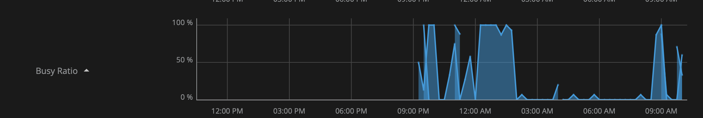

这个如果针对设备端的radio的话，暂时我们应该没算？不过这个算了好像也没讲啥。

然后我其实不理解11:15的这个曲线现象。Weighted QoE Score出现了两段重叠，吴工是下楼丢垃圾了吗？

但我感觉plume通过这些不同的离线状态，可以分类出不同的使用场景：用户起床，用户出门丢垃圾，etc

数据连续性，下图是按天数据，可以看出来，如果用户长时间离开会被认为是空的，但是一两个点数据的掉线不会被认为是真掉线。

### WAN口

粒度 Per Network

显示tx rx方向的最大值，以及总量的

数据粒度：每15分钟，每小时，每天，每分钟（Live Mode）

Health Check部分有Wan的另一项指标。

然后开通livemode之后就只显示按分钟测量的这些数值的值，按d/7d/30d就是求每个聚合数据的最大值。

## 其他界面

### TimeLine

记录了网络下channel改变的历史记录

包括设备，行为，触发原因等信息

### SpeedTest

包含Controller的测速信息

### Profile

根据上传，下载速度排序的设备

Client设备类型

Wan Usage

## 表总结

### 实时状态表

Per Ap Per Radio 实时状态

（类比到Network的话算在Network表里，表征该设备当前时段的基本网络信息）

| 名称     | Eg       | 解释                   | Opensync来源 | Controller |
| -------- | -------- | ---------------------- | ------------ | ---------- |
| 天线组   | 2x2      | 分别表示 Tx Rx天线数量 |              | 有         |
| Wifi协议 | 802.11ax | wifi协议标准为802.11ax |              | 有         |
| 信道     | Ch 11    | 使用的信道             |              | 有         |
| 信道带宽 | Width 20 | 信道带宽               |              | 有         |

Per Ap 实时状态

| 名称             | Eg   | 解释                               | Opensync来源 | Controller |
| ---------------- | ---- | ---------------------------------- | ------------ | ---------- |
| Device Type      |      |                                    |              | 有         |
| Firmware Version |      |                                    |              | 有         |
| Mac              |      |                                    |              | 有         |
| IP               |      |                                    |              | 有         |
| IPv6             |      |                                    |              | 有         |
| Public IP        |      |                                    |              | 有         |
| Connected Device |      | 子表，含RSSI，频段，打分           |              | 有         |
| Connection       |      | 和Controller的连接状态打分，RSSI， |              | 无         |
| Interference     |      | 疑似backhaul                       |              | 无         |
| Health Rating    |      | 疑似backhaul                       |              | 无         |

### 事实表（History）

Per Network/Wan

|                     |                                                              |
| ------------------- | ------------------------------------------------------------ |
| txMbps              |                                                              |
| rxMbps              |                                                              |
| txMaxMbps           |                                                              |
| rxMaxMbps           |                                                              |
| Wan Saturation Up   | 当前txMaxMbps/rxMaxMbps，相对于最近的ISP速度测试结果的比值。 |
| Wan Saturation Down |                                                              |

Per Ap

|                 |              |
| --------------- | ------------ |
| CPU utilization |              |
| Memory Usage    |              |
| Uptime          | 持续在线时间 |

Per Ap Per Radio

|                    |                                                              | Opensync | 推测实现 |
| ------------------ | ------------------------------------------------------------ | -------- | -------- |
| Radio Temperature  | **Wi-Fi 设备的射频模块（无线电）的温度**，单位是 **摄氏度（°C）**。 | 原始字段 |          |
| Channel Congestion | 包含75% Interference 和75% Total                             | ？       |          |

Per Non-Controller Ap Per Radio

（部分数据在Tauc这边是Controller设备也有的）

|                            | 定义                                                         | 应用                                               | 推测实现 | tauc支持                                  | 备注 |
| -------------------------- | ------------------------------------------------------------ | -------------------------------------------------- | -------- | ----------------------------------------- | ---- |
| Phy Rate Efficiency(RX,TX) | PHY（物理层）速率效率指的是 **实际传输速率** 与 **理论最高 PHY 速率** 的比值。 |                                                    |          |                                           |      |
| 加权Qoe分数                |                                                              |                                                    |          |                                           |      |
| RSSI History               |                                                              |                                                    |          | Plume支持原始SS和RSSI计算，Tauc只展示RSSI |      |
| Packet Retry Rate(RX,TX)   | 数据包重传率（Packet Retry Rate）衡量了无线链路的质量，表示**总数据包中发生重传的数据包的比例**。 |                                                    |          |                                           |      |
| Average Airtime(TX,RX)     | Airtime 表示数据在无线信道上的 **占用时间**，用于衡量 AP 或 STA 发送和接收数据所花费的时间。 | **高 Airtime 占用** 可能意味着信道拥塞或低效传输。 |          |                                           |      |
| Channel Utilization        | 信道利用率（Channel Utilization）表示信道上的总占用情况，包括**Wi-Fi 设备和非 Wi-Fi 设备的干扰**。 |                                                    |          |                                           |      |
| Busy Ratio                 |                                                              |                                                    |          |                                           |      |
| Predicted Throughput       |                                                              |                                                    |          |                                           |      |
| Online                     |                                                              |                                                    |          |                                           |      |
| Channel                    |                                                              |                                                    |          |                                           |      |
| Bandwidth Usage            |                                                              |                                                    | ？       |                                           |      |

Per Client

|                            | 定义                                                         | 应用                                               | 推测实现 | tauc支持                                  | 备注               |
| -------------------------- | ------------------------------------------------------------ | -------------------------------------------------- | -------- | ----------------------------------------- | ------------------ |
| Data Consumption           | 分上传，下载，总量                                           |                                                    |          |                                           | 和Node相比新增字段 |
| Connectivity Score         |                                                              |                                                    |          |                                           | 和Node相比新增字段 |
| RSSI History               |                                                              |                                                    |          | Plume支持原始SS和RSSI计算，Tauc只展示RSSI |                    |
| 加权Qoe分数                |                                                              |                                                    |          |                                           |                    |
| Phy Rate Efficiency(RX,TX) | PHY（物理层）速率效率指的是 **实际传输速率** 与 **理论最高 PHY 速率** 的比值。 |                                                    |          |                                           |                    |
| Packet Retry Rate(RX,TX)   | 数据包重传率（Packet Retry Rate）衡量了无线链路的质量，表示**总数据包中发生重传的数据包的比例**。 |                                                    |          |                                           |                    |
| Average Airtime(TX,RX)     | Airtime 表示数据在无线信道上的 **占用时间**，用于衡量 AP 或 STA 发送和接收数据所花费的时间。 | **高 Airtime 占用** 可能意味着信道拥塞或低效传输。 |          |                                           |                    |
| Channel Utilization        | 信道利用率（Channel Utilization）表示信道上的总占用情况，包括**Wi-Fi 设备和非 Wi-Fi 设备的干扰**。 |                                                    |          |                                           |                    |
| Busy Ratio                 |                                                              |                                                    |          |                                           |                    |
| Predicted Throughput       |                                                              |                                                    |          |                                           |                    |
| Online                     |                                                              |                                                    |          |                                           |                    |
| Channel                    |                                                              |                                                    |          |                                           |                    |

### Live Mode

对于Ap 和 client 都是使用下述字段

|                      | 和非Live Mode事实表相比的变化        |
| -------------------- | ------------------------------------ |
| Congestion           | ？（单值，非历史数据）               |
| Qoe Score            | Need Based Score & Usage Based Score |
| RSSI                 |                                      |
| Utilization          |                                      |
| Interference         |                                      |
| Phy Rate             |                                      |
| Packet Retry         |                                      |
| Potential Throughput | 有潜在的throughput和当前usage        |

# Panorama

## Adapter

可选维度

|                             |                                                              |      |      |
| --------------------------- | ------------------------------------------------------------ | ---- | ---- |
| Data Range                  |                                                              |      |      |
| **Tenant（租户）**          | 个人用户、企业用户、酒店/公寓、公共 Wi-Fi、运营商网络        |      |      |
| **Tenant Type（租户类型）** | 订阅级别（免费、标准、企业）、ISP 类型（家庭 ISP、企业 ISP） |      |      |
| **Home Type（家庭类型）**   | 独立住宅、公寓、联排别墅、高层建筑                           |      |      |
| **Node Model（节点型号）**  | 路由器型号、Mesh Wi-Fi 设备、IoT 网关、AP 规格（Wi-Fi 6/7）  |      |      |
| Steering Type               |                                                              |      |      |
| Kick Type                   | 可能是指 **Wi-Fi 设备在进行 Steering（引导）时，如何”踢掉”当前的设备连接** |      |      |
| Starting Interference %     | 起始干扰率                                                   |      |      |
| Band                        |                                                              |      |      |
| Trigger Type                |                                                              |      |      |

|                                   | 可选维度                                                     | 可选事实                                                     | 备注                          |            |
| --------------------------------- | ------------------------------------------------------------ | ------------------------------------------------------------ | ----------------------------- | ---------- |
| Band Steering Statistics          | Data Range, Tenant, Tenant Type, Home Type, Node Model       | 成功率，尝试次数                                             | Pre-Association band steering | 频段切换   |
| Client Steering Statistic         | Data Range, Tenant, Tenant Type, Home Type, Node Model, Steering Type, Kick Type | Steering Type, 成功率                                        |                               | 信道切换   |
| Steer Enforcement                 | Data Range, Tenant, Tenant Type, Home Type, Node Model       | 连接到2.4/5，对于MLO设备。连接到5G在设备所有时间中的占比     |                               |            |
| Optimizer Operation               | Data Range, Tenant, Tenant Type, Home Type, Node Model       | 成功率，优化类型，优化触发类型，引起信道改变的优化占比       |                               |            |
| Channel Change Operation          | Data Range, Tenant, Tenant Type, Home Type, Node Model       | 客户平均干扰，出现干扰的家庭，干扰优化算法效率，信道改变触发类型 |                               | （没看懂） |
| Channel Distribution              | Data Range, Tenant, Tenant Type, Home Type, Node Model, Band | 设备连接/Ap-backhaul信道分布占比/频段占比                    |                               |            |
| Interference Algorithm Efficiency | Data Range, Tenant, Tenant Type, Home Type, Node Model, Trigger Type, Starting Interference % | 优化后变好，变化的情况                                       |                               |            |

| Steering 选项             | **作用**                                 | **适用场景**                   |      |
| ------------------------- | ---------------------------------------- | ------------------------------ | ---- |
| **Cloud Downsteer**       | 让设备从 5GHz 降级到 2.4GHz              | 远距离设备、信号弱的情况       |      |
| **Cloud 2.4 to 2.4**      | 让设备在 2.4GHz AP 之间切换              | 低速 IoT 设备、需要更稳定信号  |      |
| **Cloud**                 | 云端控制的默认 Steering 机制             | Wi-Fi 设备动态优化             |      |
| **Cloud 5 to 5**          | 让设备在 5GHz AP 之间切换，不降到 2.4GHz | 高吞吐量设备，减少信道干扰     |      |
| **Cloud Upsteer**         | 让设备从 2.4GHz 迁移到 5GHz              | 近距离设备、需要更快网速       |      |
| **OpenSync Upsteer**      | OpenSync 本地控制的 Upsteer              | Mesh Wi-Fi 本地优化            |      |
| **OpenSync Sticky Steer** | 防止设备频繁切换 AP                      | IoT 设备、智能摄像头、打印机等 |      |
| **Cloud Speculation**     | 云端预测设备行为，优化 Steering          | AI 驱动的 Wi-Fi 调优           |      |

|                       |                |
| --------------------- | -------------- |
| **channel gain**      | 信道增益       |
| **fast interference** | 快速干扰检测   |
| **forced idle**       | 强制空闲       |
| **interrupted**       | 中断           |
| **link discovery**    | 链路发现       |
| **manual**            | 手动触发       |
| **radar detected**    | 侦测到雷达信号 |
| **retry**             | 重试           |
| **scheduled**         | 预定任务       |
| **topology deviated** | 拓扑偏离       |

## 其他 Dashboards

下述为Guard/Shield Dashboards，感觉目前TAUC尚未涉及该对标业务

此外还有Customer，客户端，Performance，Nodes Points 更像是Network和Account对应业务表

|                              | 可选维度                                                     | 可选事实                                                     | 案例选择                           |      |
| ---------------------------- | ------------------------------------------------------------ | ------------------------------------------------------------ | ---------------------------------- | ---- |
| Network Threats              | Tenant, Tenant Type, Deployment, Data Range, Device, Event Source, Category Name, Provider Orig, Statistics Select | Risk 类型及地图（                                            | Statistics Select选择的是Count     |      |
| Security Threats Leaderboard | Tenant, Tenant Type, Deployment, Time, Device, Event Source, Column Selector, Provider, Threat Type |                                                              | Column Selector选择的是Event Count |      |
| Device Threats Anal          | Tenant, Tenant Type, Deployment, Time, Device, Event Source, Column Selector, Provider, Threat Type | 有threat的设备分类，品牌分类，DNS count by Device/Threat Type | Column Selector选择的是Event Count |      |
| AI Security Enablement       | Tenant, Tenant Type, Deployment, Trend Of                    | 某个地方通过AI来进行网络保护的类型分类                       | Trend Of选择Location               |      |
| Protection Value             | Tenant, Tenant Type, Deployment, Time, Device, Event Source, Column Selector, Policy, Event Source |                                                              |                                    |      |
| Whitelist Anal               | Tenant, Tenant Type, Deployment, Time, Policy, Provider, Event Type |                                                              |                                    |      |
| ...                          |                                                              |                                                              |                                    |      |
|                              |                                                              |                                                              |                                    |      |
|                              |                                                              |                                                              |                                    |      |
|                              |                                                              |                                                              |                                    |      |

# 本司网络质量相关页面

## Diagnostic模块

部分功能属于Plume的qoe功能，按数据上报也能走15分钟qoe。

目前有三组可以新要组件构建的数据

1. 测速，干扰类型的数据。
2. plume的数据。
3. diagnostic的数据。

## Network Health模块

### qoe上报数据能否将时间间隔限制到15/30/45/60这样的倍数关系？

来让数据统计是倍数关系。

然后因为这部分使用生产庄子的账号，只有下述两个模块有分数，但右侧Wi-Fi- stability是有得分的。

### Wi-Fi coverage

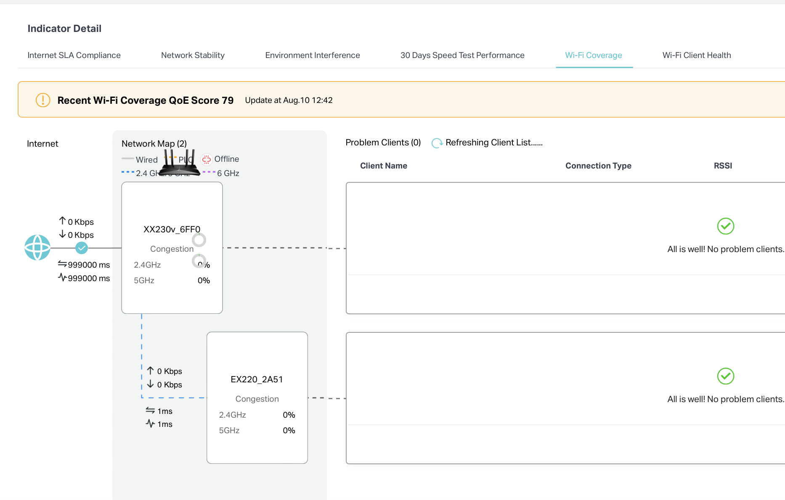

上面是有分数的为什么下面就没有分数了。

然后为什么这个前端画的如此迷惑？

### Network Stability 是否需要？

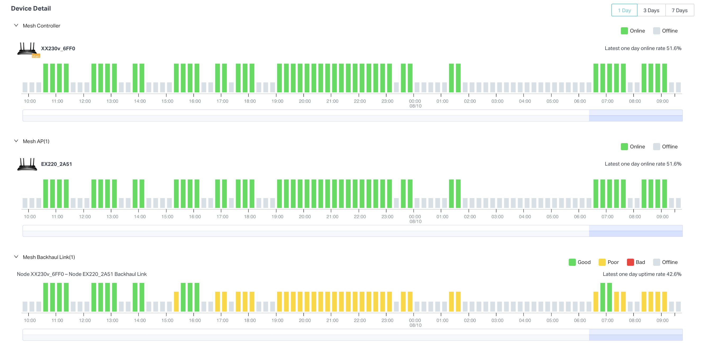

1. 我是用户的话这个网络有其他业务指标数据我就认为他在线了，不会专门有一个页面显示在线不在线
   1. 而且如果不在线但是给补数据的话不真实意义又在哪？
   2. Mesh组网我是否真的关心每一台ap的在线情况，是否可以把中间一行砍掉
   3. 信息量太低，只有在线和时间点的信息，比如Plume就能显示具体的channel信息，而且长时间断开用户自然就知道设备掉线了。
2. 而且为什么1d/3d/7d的区分是都能显示七天数据，只是通过滑块来控制时间颗粒度？

### Speed Test Perfomance

一个问题是数据太假

参考竞品以及通信原理，吞吐量基本可以代表速度信息，或者如何理解throughput和data consumption的关系。

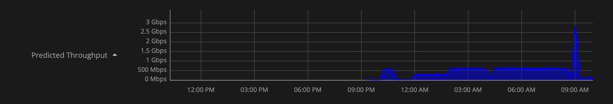

## 每个设备对应的status

这个比较正常，但是alert event应该和底下的数据不相符。

然后这个部分的显示比plume少，也比现在上报的数据少。

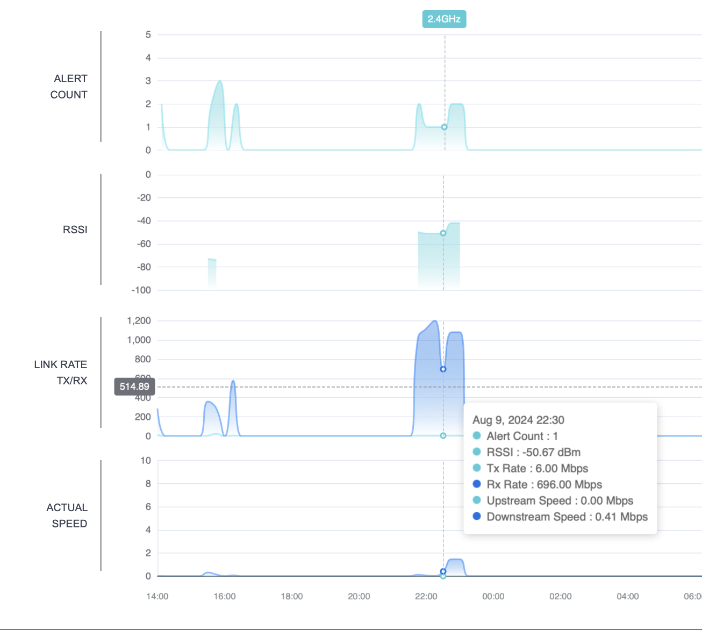

然后对于sta的数据，tx/rx是画在一起的，要分开就都分开画吧。

考虑到ap需要考虑频段信息，plume没区分频段确实我们要做的好一点点？

然后切换不同时间粒度的特效可以修改一下，比较难看。

然后actual speed建议优化成根据取值情况自动调整纵坐标。

然后我还是觉得最好能像plume一样，有一个完整的页面去查看all isp，单网络，ap，sta，四个维度。

## wifi-management

这个是按ISP的统计，plume没有这个业务概念。

但这个图画的蛮离谱的，高度不齐，然后最右边那个五环的五个0我看到的时候笑了五分钟。

然后我不太懂这块的逻辑，就是点day，week，month分别数据源是什么，数据量不相同。

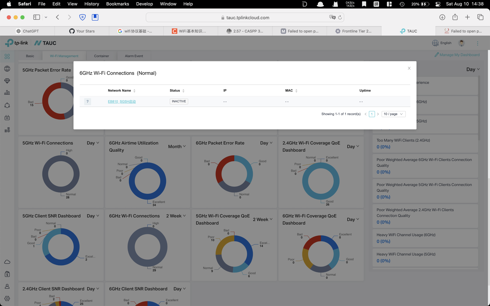

然后29条normal数据点进去是只有1条？

这个模块颜色是不是可以区分一下？

