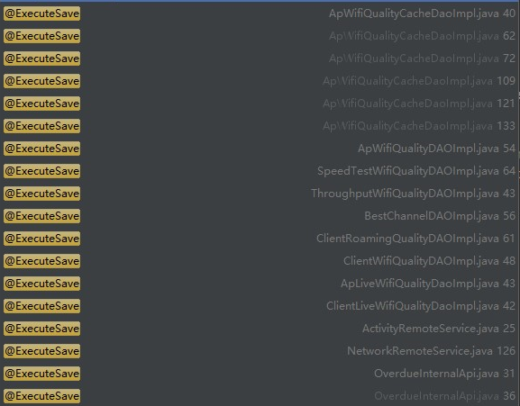

在上述文件构建18个ExecuteSave的校验点，包括写redis 6，写cassandra 8，更新activity 1，更新Network 1，写S3 2的ClientPO，这些为四个handle的全部下游。

会涉及到One-side的部分

ThroughputWifiQualityDAOImpl

SpeedTestWifiQualityDAOImpl

ApWifiQualityDAOImpl

ApWifiQualityCacheDaoImpl

ApWifiQualityCacheDaoImpl

apt-get update && apt-get install -y redis-tools

redis-cli -h dev-redis-all-common-aps1.base-service.svc.cluster.local -p 6379

git@gitlab.crd.tp-link.com:TAUC/tauc-network-service.git