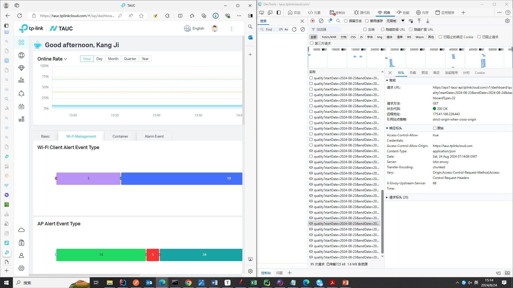
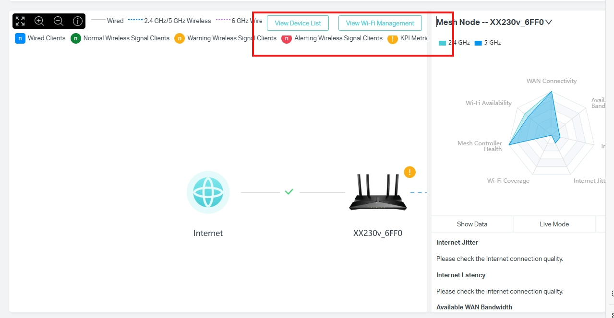

## 前端位置

### AP-Sta详情页

查看client详情
（建议改名叫sta，ap-sta比较规范，建议所有涉及到这些的都维护一套命名系统）
POST https://aps1-tauc-api.tplinkcloud.com/v1/statistic/wifi-qualitys/client

查看ap详情
POST https://aps1-tauc-api.tplinkcloud.com/v1/statistic/wifi-qualitys/ap

### Network Health

进去会调用下述七个接口

https://aps1-tauc-api.tplinkcloud.com/v1/qoe/networkHealthCheck/ap?startTime=1721891409607&endTime=1724483409607&typeList=0,9,3,4,5,6,7,8&mac=30DE4BCB7AA6

https://aps1-tauc-api.tplinkcloud.com/v1/qoe/networkHealthCheck/currentScore?mac=30DE4BCB7AA6

https://aps1-tauc-api.tplinkcloud.com/v1/network-health/remote/networks/1sNtllWybXqUAMMIyosyRvtv5Xd9k9KC97ByuT1bB6TsCUL97mQD9CdyKJibFJcE/clients/tr/v2

https://aps1-tauc-api.tplinkcloud.com/v1/network-health/remote/networks/1sNtllWybXqUAMMIyosyRvtv5Xd9k9KC97ByuT1bB6TsCUL97mQD9CdyKJibFJcE/devices/tr?topoId=8015775069194

https://aps1-tauc-api.tplinkcloud.com/v1/qoe/show/status?networkId=8015775003778

https://aps1-tauc-api.tplinkcloud.com/v1/qoe/internetConsistencePerformance?mac=30DE4BCB7AA6

https://aps1-tauc-api.tplinkcloud.com/v1/network-health/remote/networks/1sNtllWybXqUAMMIyosyRvtv5Xd9k9KC97ByuT1bB6TsCUL97mQD9CdyKJibFJcE/backhauls/tr

大致确认需要迁移
/v1/qoe
/v1/network-health

### Dashboard页面

https://aps1-tauc-api.tplinkcloud.com/v1/dashboard/list

https://aps1-tauc-api.tplinkcloud.com/v1/dashboard/alerting?startDate=2024-08-23&endDate=2024-08-24

https://aps1-tauc-api.tplinkcloud.com/v1/dashboard/quality?startDate=2024-08-23&endDate=2024-08-24&dashboardType=22

这个优化成list吧，调一排接口好蠢...

### 雷达图

https://aps1-tauc-api.tplinkcloud.com/v1/networks/1Kfj4Zel4GadA5_niYm449t-HN1C6T9tHp_z6BpJAIGdccscNWeLNDUTKDXySg9w/radar/ap/latest

选中某一个设备时会出现图标覆盖的现象。