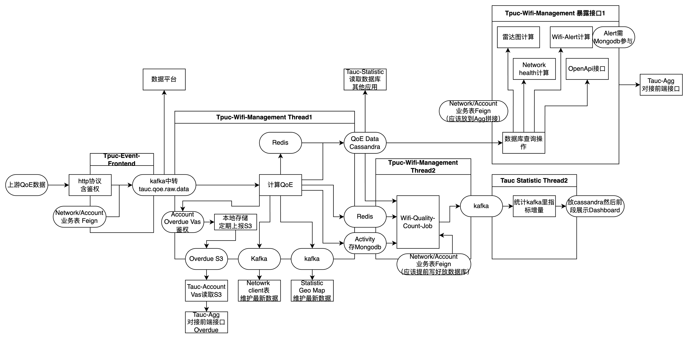
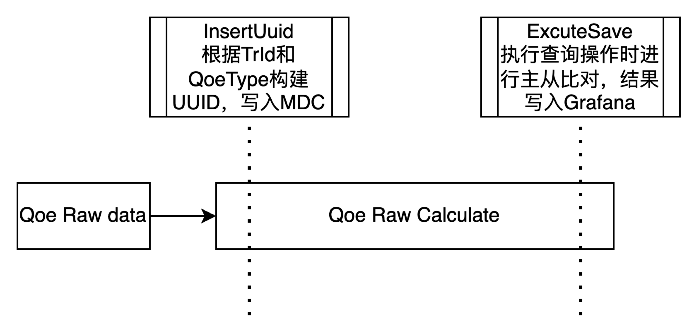
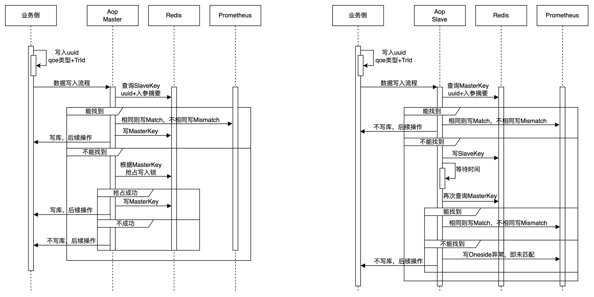
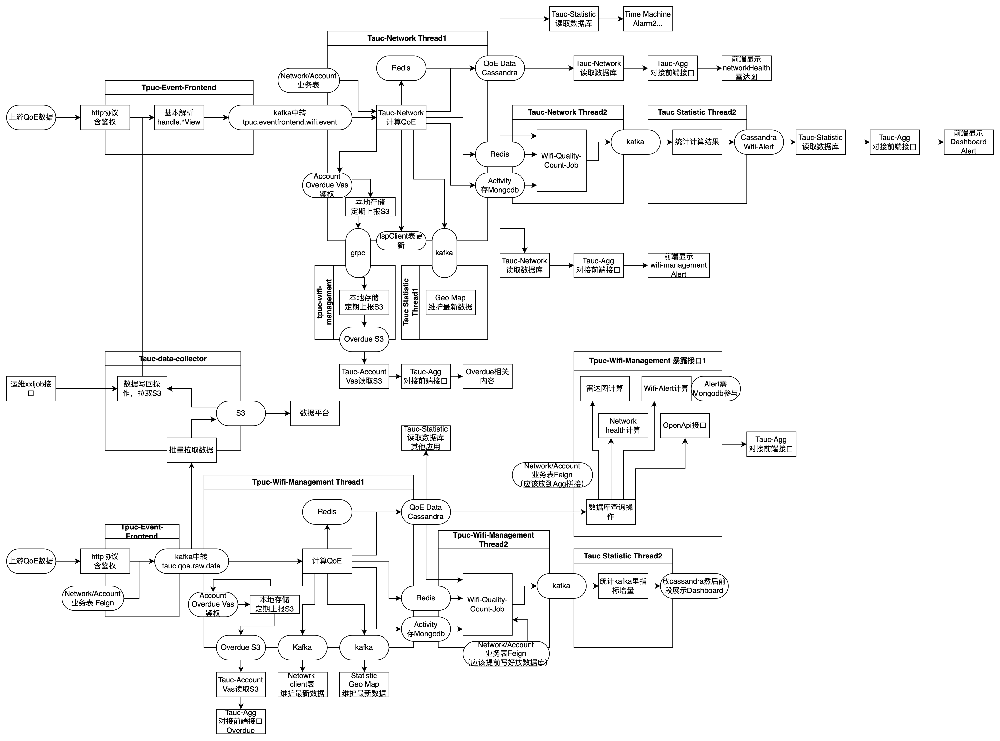

# 架构对比

本次迁移涉及架构优化如下

新版结束之后，Network将不再调用

# AOP校验

使用AOP的方式对数据进行校验

通过aop及redis尽量避免双写事件，通过下游幂等性减少双写影响。

发布流程上先将wifi-management从slave调整到master，再将network从master调整为slave

## 数据回放

考虑到SRE需要数据写回到原始链路

数据回滚有两个做法

1. 将所有落库的数据落到新表（能保证数据的严格准确性）
2. 将Qoe原始数据持久化到S3，并通过运维接口形式让原network链路执行（当查询第三方接口返回值不相同时数据无法严格准确

和SRE-李祥沟通，结合成本考虑使用方案2。

## 数据保存校验

过程中涉及1master1slave的情况和2master的情况。

### 1. **`master` 角色**：

1. 生成两套 `inputKey`：一套 `master` 使用，一套 `slave` 使用。
2. 检查 Redis 中是否有相同的 `slave` 输入参数：
   - 如果不同，调用 `prometheusHandler.mismatch` 方法进行预警，然后写库，执行原方法。
   - 如果相同，写redis，然后写库，执行原方法。
   - 如果找不到，通过setnx的方式写master key到redis。
      - 如果两边都是master的情况，则可以保证单次写入，同时有一个master链路的写入不会受到阻塞。

### 2. **`slave` 角色**：

1. 检查 Redis 中是否有相同的 `master` 输入参数：
   - 如果不同，调用 `prometheusHandler.mismatch` 方法进行预警，然后不写库，执行原方法。
   - 如果相同，然后不写库，执行原方法。
2. 如果 `master` 参数在 Redis 中不存在，保存 `slave` 输入参数到 Redis 中，等待一段时间后继续执行步骤1，如果仍找不到，则报 `prometheusHandler.oneside` 。

## 结果展示

使用prometheus接入grafana的形式进行结果展示，包括四个指标

Save-Match，Save-Mismatch，Save-OneSide

使用开关控制不同业务流程依次迁移
